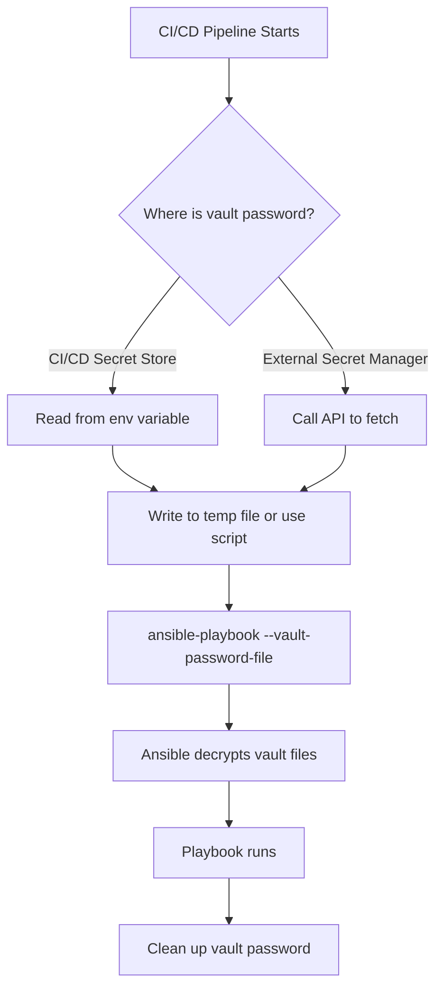

# How to Store Ansible Vault Passwords in CI/CD Secrets

Author: [nawazdhandala](https://www.github.com/nawazdhandala)

Tags: Ansible, Ansible Vault, CI/CD, Security, DevOps

Description: Learn secure methods for storing and accessing Ansible Vault passwords in CI/CD pipelines across GitHub Actions, GitLab CI, Jenkins, and more.

---

Ansible Vault encrypts sensitive data like passwords, API keys, and certificates inside your repository. But the vault password itself needs to live somewhere that your CI/CD pipeline can access it without human interaction. You obviously cannot commit the vault password to the repo (that defeats the purpose of encryption). So the question becomes: where do you put it?

This post covers the secure patterns for managing Ansible Vault passwords across different CI/CD platforms, along with the anti-patterns to avoid.

## The Problem

When you run a playbook locally, you can type the vault password or point to a file on your machine. In CI/CD, there is nobody to type a password. The pipeline needs automated access to the vault password while keeping it secure.

```bash
# This works locally but not in CI/CD
ansible-playbook site.yml --ask-vault-pass

# This is what CI/CD needs
ansible-playbook site.yml --vault-password-file /path/to/vault_pass.txt
```

## GitHub Actions

Store the vault password as a GitHub repository secret and write it to a file during the workflow.

```yaml
# .github/workflows/deploy.yml
name: Deploy with Ansible Vault

on:
  push:
    branches: [main]

jobs:
  deploy:
    runs-on: ubuntu-latest
    steps:
      - uses: actions/checkout@v4

      - name: Set up Python and Ansible
        run: pip install ansible==8.7.0

      # Write the vault password to a temporary file
      - name: Create vault password file
        run: echo "${{ secrets.ANSIBLE_VAULT_PASSWORD }}" > /tmp/vault_pass.txt

      - name: Set up SSH
        run: |
          mkdir -p ~/.ssh
          echo "${{ secrets.SSH_PRIVATE_KEY }}" > ~/.ssh/id_rsa
          chmod 600 ~/.ssh/id_rsa

      - name: Run Ansible playbook
        run: |
          ansible-playbook \
            -i inventory/production.ini \
            --vault-password-file /tmp/vault_pass.txt \
            playbooks/site.yml
        env:
          ANSIBLE_HOST_KEY_CHECKING: "false"

      # Always clean up the vault password file
      - name: Clean up secrets
        if: always()
        run: rm -f /tmp/vault_pass.txt ~/.ssh/id_rsa
```

## GitLab CI/CD

Store the vault password as a CI/CD variable (masked and protected).

```yaml
# .gitlab-ci.yml
deploy:
  stage: deploy
  image: python:3.11-slim
  script:
    - pip install ansible==8.7.0
    # Write vault password from CI variable (set in GitLab UI)
    - echo "$ANSIBLE_VAULT_PASSWORD" > /tmp/vault_pass.txt
    - >
      ansible-playbook
      -i inventory/production.ini
      --vault-password-file /tmp/vault_pass.txt
      playbooks/site.yml
  after_script:
    # after_script runs even if the main script fails
    - rm -f /tmp/vault_pass.txt
  variables:
    ANSIBLE_HOST_KEY_CHECKING: "false"
```

When setting the variable in GitLab:
- Check "Mask variable" to prevent it from appearing in logs
- Check "Protect variable" to only expose it on protected branches

## Jenkins

Use Jenkins credentials store for the vault password.

```groovy
// Jenkinsfile
pipeline {
    agent any

    stages {
        stage('Deploy') {
            steps {
                withCredentials([
                    string(credentialsId: 'ansible-vault-pass', variable: 'VAULT_PASS'),
                    sshUserPrivateKey(credentialsId: 'ansible-ssh-key',
                                     keyFileVariable: 'SSH_KEY')
                ]) {
                    sh '''
                        # Write vault password to temp file
                        echo "$VAULT_PASS" > /tmp/vault_pass.txt

                        ansible-playbook \
                            -i inventory/production.ini \
                            --vault-password-file /tmp/vault_pass.txt \
                            --private-key "$SSH_KEY" \
                            playbooks/site.yml

                        # Clean up
                        rm -f /tmp/vault_pass.txt
                    '''
                }
            }
        }
    }

    post {
        always {
            sh 'rm -f /tmp/vault_pass.txt'
        }
    }
}
```

## Using a Script Instead of a File

Instead of writing the vault password to a file, you can use a script that outputs it. This avoids having the password on disk.

```bash
#!/bin/bash
# vault_password_script.sh
# This script reads the vault password from an environment variable
echo "$ANSIBLE_VAULT_PASSWORD"
```

Reference it in your playbook command.

```yaml
# In CI/CD, set ANSIBLE_VAULT_PASSWORD as an environment variable
- name: Run playbook with vault password script
  run: |
    chmod +x scripts/vault_password_script.sh
    ansible-playbook \
      -i inventory/production.ini \
      --vault-password-file scripts/vault_password_script.sh \
      playbooks/site.yml
  env:
    ANSIBLE_VAULT_PASSWORD: ${{ secrets.ANSIBLE_VAULT_PASSWORD }}
```

## Using the ANSIBLE_VAULT_PASSWORD Environment Variable

Ansible does not natively read the vault password from an environment variable, but you can make it work with the `ANSIBLE_VAULT_PASSWORD_FILE` environment variable pointing to a script.

```yaml
# ansible.cfg
[defaults]
vault_password_file = scripts/vault_pass.sh
```

```bash
#!/bin/bash
# scripts/vault_pass.sh
# Reads vault password from environment variable
echo "$ANSIBLE_VAULT_PASSWORD"
```

Now the vault password is sourced from the environment variable automatically.

```yaml
# CI/CD step - no need to specify --vault-password-file
- name: Run playbook
  run: ansible-playbook -i inventory/production.ini playbooks/site.yml
  env:
    ANSIBLE_VAULT_PASSWORD: ${{ secrets.ANSIBLE_VAULT_PASSWORD }}
```

## Multiple Vault Passwords

If you use different vault passwords for different environments, Ansible supports vault IDs.

```bash
# Encrypt files with vault IDs
ansible-vault encrypt --vault-id staging@prompt group_vars/staging/vault.yml
ansible-vault encrypt --vault-id production@prompt group_vars/production/vault.yml
```

In CI/CD, provide multiple vault password files.

```yaml
# GitHub Actions example with multiple vault passwords
- name: Set up vault passwords
  run: |
    echo "${{ secrets.VAULT_PASS_STAGING }}" > /tmp/vault_staging.txt
    echo "${{ secrets.VAULT_PASS_PRODUCTION }}" > /tmp/vault_production.txt

- name: Run playbook with multiple vaults
  run: |
    ansible-playbook \
      -i inventory/production.ini \
      --vault-id staging@/tmp/vault_staging.txt \
      --vault-id production@/tmp/vault_production.txt \
      playbooks/site.yml
```

## Using External Secret Managers

For higher security, pull the vault password from an external secret manager at runtime.

```bash
#!/bin/bash
# vault_pass_from_aws.sh - Fetch vault password from AWS Secrets Manager
aws secretsmanager get-secret-value \
  --secret-id ansible-vault-password \
  --query SecretString \
  --output text
```

```bash
#!/bin/bash
# vault_pass_from_hashicorp.sh - Fetch vault password from HashiCorp Vault
vault kv get -field=password secret/ansible/vault
```

```yaml
# Use the script as the vault password source
- name: Run playbook with external secret manager
  run: |
    chmod +x scripts/vault_pass_from_aws.sh
    ansible-playbook \
      -i inventory/production.ini \
      --vault-password-file scripts/vault_pass_from_aws.sh \
      playbooks/site.yml
  env:
    AWS_ACCESS_KEY_ID: ${{ secrets.AWS_ACCESS_KEY_ID }}
    AWS_SECRET_ACCESS_KEY: ${{ secrets.AWS_SECRET_ACCESS_KEY }}
```

## Vault Password Flow



## Anti-Patterns to Avoid

Here are things you should never do with vault passwords:

1. Never commit the vault password to the repository. Not even in a `.env` file or a config file that you think is gitignored.
2. Never echo the vault password in CI/CD logs. Make sure your CI/CD variable is marked as "secret" or "masked".
3. Never leave the vault password file on disk after the pipeline finishes. Always clean up.
4. Never use the same vault password for all environments. Separate passwords for staging and production limit the blast radius.
5. Never hardcode the vault password in your Jenkinsfile, Dockerfile, or pipeline YAML.

## Tips for Vault Password Security

1. Rotate your vault password periodically. Re-encrypt all vault files when you rotate the password.
2. Use vault IDs to separate passwords by environment. This way, a compromised staging password does not expose production secrets.
3. Consider using external secret managers (AWS Secrets Manager, HashiCorp Vault) instead of CI/CD platform secrets for an extra layer of security.
4. The vault password script approach is slightly more secure than the file approach because the password never touches disk.
5. Restrict access to CI/CD secret variables. Not everyone on the team needs the ability to read or modify vault passwords.
6. Audit who has access to your CI/CD secrets regularly. Most platforms provide access logs.

Getting vault password management right is one of those unglamorous but critical tasks. A leaked vault password means all your encrypted secrets are exposed. Take the time to set it up properly from the start.
