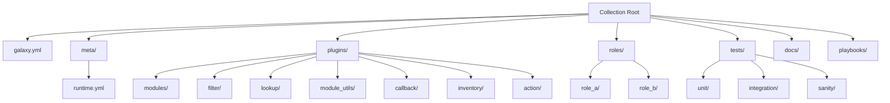

# How to Structure an Ansible Collection Directory

Author: [nawazdhandala](https://www.github.com/nawazdhandala)

Tags: Ansible, Collections, Project Structure, DevOps

Description: Complete reference for the Ansible collection directory layout with explanations of every directory and file that makes up a well-organized collection.

---

Getting the directory structure right is one of the most important steps when building an Ansible collection. Ansible expects files in specific locations, and putting a module in the wrong directory means it simply will not load. This post serves as a complete reference for the collection directory layout, explaining what goes where and why.

## The Full Directory Tree

Here is the complete directory structure that an Ansible collection can contain:

```
<namespace>/<collection_name>/
  galaxy.yml                   # Required: Collection metadata
  README.md                    # Recommended: Top-level docs
  LICENSE                      # Recommended: License file
  CHANGELOG.rst                # Recommended: Version history
  meta/
    runtime.yml                # Runtime routing and requirements
    execution-environment.yml  # Execution environment metadata
  docs/                        # Additional documentation
    docsite/                   # Documentation site files
  plugins/                     # All plugins go here
    modules/                   # Module plugins
    action/                    # Action plugins
    become/                    # Become plugins
    cache/                     # Cache plugins
    callback/                  # Callback plugins
    cliconf/                   # CLI configuration plugins
    connection/                # Connection plugins
    filter/                    # Filter plugins
    httpapi/                   # HTTP API plugins
    inventory/                 # Inventory plugins
    lookup/                    # Lookup plugins
    netconf/                   # Netconf plugins
    shell/                     # Shell plugins
    strategy/                  # Strategy plugins
    terminal/                  # Terminal plugins
    test/                      # Test plugins (Jinja2 tests)
    vars/                      # Vars plugins
    module_utils/              # Shared Python code for modules
    plugin_utils/              # Shared Python code for plugins
  roles/                       # Ansible roles
    role_name/
      tasks/
      defaults/
      handlers/
      vars/
      templates/
      files/
      meta/
  playbooks/                   # Playbooks included in collection
  tests/                       # Tests
    unit/
    integration/
    sanity/
  changelogs/
    config.yaml
    changelog.yaml
    fragments/
```

That is a lot of directories. Most collections only use a handful of them. Let me break down each section.

## The galaxy.yml File

This is the only strictly required file. It defines who owns the collection, what version it is, and what it depends on:

```yaml
# galaxy.yml - The collection's identity card
---
namespace: acme_corp
name: network_tools
version: 2.3.1
readme: README.md
authors:
  - Network Team <network@acme.com>
description: Network automation tools for Acme Corp infrastructure
license:
  - Apache-2.0
tags:
  - networking
  - monitoring
  - firewall
dependencies:
  ansible.netcommon: ">=5.0.0"
  ansible.utils: ">=3.0.0"
repository: https://github.com/acme-corp/ansible-network-tools
build_ignore:
  - .git
  - .github
  - .gitignore
  - tests/output
  - "*.tar.gz"
  - .venv
```

The `build_ignore` list is often overlooked. Without it, your built tarball might include test outputs, virtual environments, and other files that bloat the package and potentially leak sensitive data.

## The plugins Directory

This is where the bulk of your code lives. Each plugin type has its own subdirectory, and Ansible uses the directory name to determine the plugin type.

### plugins/modules/

Modules are the workhorses of Ansible. Each `.py` file in this directory becomes a module:

```python
# plugins/modules/firewall_rule.py
# Module for managing firewall rules on Acme network devices

from __future__ import absolute_import, division, print_function
__metaclass__ = type

DOCUMENTATION = r"""
---
module: firewall_rule
short_description: Manage firewall rules on Acme devices
version_added: "1.0.0"
description:
  - Add, modify, or remove firewall rules on Acme network devices.
options:
  name:
    description: Name of the firewall rule.
    required: true
    type: str
  action:
    description: What to do with matching traffic.
    choices: ['allow', 'deny', 'reject']
    required: true
    type: str
  source:
    description: Source IP or CIDR range.
    required: true
    type: str
  destination:
    description: Destination IP or CIDR range.
    required: true
    type: str
  port:
    description: Destination port number.
    required: false
    type: int
author:
  - Network Team (@acme-network)
"""

EXAMPLES = r"""
- name: Allow SSH from management network
  acme_corp.network_tools.firewall_rule:
    name: allow-ssh-mgmt
    action: allow
    source: 10.0.100.0/24
    destination: 0.0.0.0/0
    port: 22
"""

RETURN = r"""
rule_id:
  description: The ID assigned to the firewall rule.
  type: str
  returned: success
"""

from ansible.module_utils.basic import AnsibleModule


def main():
    module = AnsibleModule(
        argument_spec=dict(
            name=dict(type="str", required=True),
            action=dict(type="str", required=True, choices=["allow", "deny", "reject"]),
            source=dict(type="str", required=True),
            destination=dict(type="str", required=True),
            port=dict(type="int", required=False),
        ),
        supports_check_mode=True,
    )

    # Module implementation here
    module.exit_json(changed=True, rule_id="rule-001")


if __name__ == "__main__":
    main()
```

You can also organize modules into subdirectories for grouping:

```
plugins/modules/
  firewall_rule.py              # acme_corp.network_tools.firewall_rule
  vlan/
    vlan_config.py              # acme_corp.network_tools.vlan_config
    vlan_interface.py           # acme_corp.network_tools.vlan_interface
```

Note that subdirectories under `modules/` are for organization only. The module name does not include the subdirectory path. Both `firewall_rule` and `vlan_config` are referenced directly by their filename.

### plugins/module_utils/

Shared Python code that your modules import goes here:

```python
# plugins/module_utils/device_connection.py
# Shared connection logic for Acme network device modules

from __future__ import absolute_import, division, print_function
__metaclass__ = type


class AcmeDeviceConnection:
    """Handle connections to Acme network devices."""

    def __init__(self, host, username, password, port=443):
        self.host = host
        self.username = username
        self.password = password
        self.port = port
        self.session = None

    def connect(self):
        # Connection logic
        pass

    def execute_command(self, command):
        # Send command to device
        pass

    def close(self):
        if self.session:
            self.session.close()
```

Modules import this shared code using the collection's namespace:

```python
# In plugins/modules/firewall_rule.py
from ansible_collections.acme_corp.network_tools.plugins.module_utils.device_connection import AcmeDeviceConnection
```

### plugins/filter/

Filter plugins transform data in Jinja2 expressions:

```python
# plugins/filter/network_filters.py
# Custom filter plugins for network address manipulation

from __future__ import absolute_import, division, print_function
__metaclass__ = type

import ipaddress


def cidr_to_netmask(cidr):
    """Convert CIDR notation to netmask. Example: 24 -> 255.255.255.0"""
    network = ipaddress.IPv4Network(f"0.0.0.0/{cidr}", strict=False)
    return str(network.netmask)


def ip_in_network(ip, network):
    """Check if an IP address belongs to a network."""
    return ipaddress.ip_address(ip) in ipaddress.ip_network(network, strict=False)


class FilterModule(object):
    def filters(self):
        return {
            "cidr_to_netmask": cidr_to_netmask,
            "ip_in_network": ip_in_network,
        }
```

### plugins/lookup/

Lookup plugins retrieve data from external sources:

```python
# plugins/lookup/vault_secret.py
# Lookup plugin to retrieve secrets from Acme Vault

from __future__ import absolute_import, division, print_function
__metaclass__ = type

DOCUMENTATION = r"""
---
name: vault_secret
short_description: Retrieve secrets from Acme Vault
description:
  - Looks up a secret from the internal Acme Vault service.
options:
  _terms:
    description: The secret path to look up.
    required: true
"""

from ansible.plugins.lookup import LookupBase
from ansible.errors import AnsibleError


class LookupModule(LookupBase):
    def run(self, terms, variables=None, **kwargs):
        results = []
        for term in terms:
            # Fetch secret from vault
            # This is a simplified example
            results.append(f"secret-value-for-{term}")
        return results
```

## The roles Directory

Roles inside a collection follow the exact same structure as standalone roles:

```
roles/
  baseline/
    tasks/
      main.yml              # Entry point
      packages.yml           # Package installation tasks
      services.yml           # Service configuration tasks
    defaults/
      main.yml              # Default variables
    vars/
      main.yml              # Fixed variables
    handlers/
      main.yml              # Handlers
    templates/
      ntp.conf.j2           # Template files
      sshd_config.j2
    files/
      banner.txt            # Static files
    meta/
      main.yml              # Role metadata and dependencies
    README.md               # Role-specific documentation
```

Users reference the role as `acme_corp.network_tools.baseline`:

```yaml
# Using a collection role in a playbook
---
- name: Apply baseline configuration
  hosts: all
  roles:
    - role: acme_corp.network_tools.baseline
      vars:
        baseline_ntp_servers:
          - ntp1.internal.com
          - ntp2.internal.com
```

## The meta Directory

### meta/runtime.yml

This file controls runtime behavior like module redirects and minimum Ansible version:

```yaml
# meta/runtime.yml - Runtime configuration
---
requires_ansible: ">=2.15.0"
plugin_routing:
  modules:
    # Redirect old module name to new one
    fw_rule:
      redirect: acme_corp.network_tools.firewall_rule
      deprecation:
        removal_version: "3.0.0"
        warning_text: Use acme_corp.network_tools.firewall_rule instead.
  lookup:
    old_vault:
      tombstone:
        removal_version: "2.0.0"
        warning_text: This lookup has been removed. Use vault_secret instead.
```

The routing section supports three actions:
- **redirect**: Points to a new module/plugin name
- **deprecation**: Shows a warning but still works
- **tombstone**: The plugin is gone and will error with a message

## The tests Directory

Testing is organized by type:

```
tests/
  unit/                        # Unit tests for Python code
    plugins/
      modules/
        test_firewall_rule.py
      filter/
        test_network_filters.py
  integration/                 # Integration tests using ansible-test
    targets/
      firewall_rule/
        tasks/
          main.yml
  sanity/                      # Sanity tests (format, imports, etc.)
    ignore-2.16.txt           # Known sanity test exceptions
```

## Visual Overview of the Structure



## Naming Conventions

Follow these naming rules to avoid problems:

- **Namespace**: lowercase, underscores allowed, no hyphens (e.g., `acme_corp`)
- **Collection name**: lowercase, underscores allowed, no hyphens (e.g., `network_tools`)
- **Module filenames**: lowercase with underscores, must be valid Python identifiers
- **Role directories**: lowercase with underscores
- **Plugin files**: lowercase with underscores, matching the class or function they provide

The namespace and collection name cannot start with a number or contain hyphens. This trips people up because Python package names often use hyphens, but Ansible collection names must be valid Python identifiers.

## Conclusion

The directory structure of an Ansible collection is prescriptive but logical. Every plugin type has its designated directory under `plugins/`, roles follow standard Ansible conventions under `roles/`, and metadata lives in `galaxy.yml` and `meta/runtime.yml`. Start with the minimum you need, and add directories as your collection grows. The `ansible-galaxy collection init` command gives you a clean starting point, and you can fill in the directories that match the content you are building.
