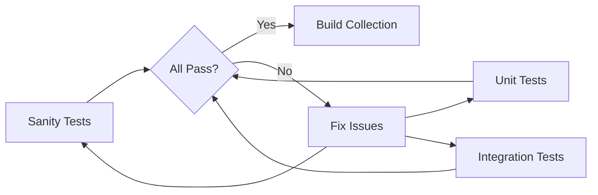

# How to Test Ansible Collections with ansible-test

Author: [nawazdhandala](https://www.github.com/nawazdhandala)

Tags: Ansible, Testing, ansible-test, CI/CD, DevOps

Description: Complete guide to testing Ansible collections using ansible-test with sanity, unit, and integration tests including Docker-based test environments.

---

Testing is where many collection authors cut corners, and it shows when users run into bugs that a basic test suite would have caught. The `ansible-test` tool ships with `ansible-core` and provides three types of tests specifically designed for collection content: sanity tests, unit tests, and integration tests.

This post walks through setting up and running all three test types for your Ansible collection.

## Prerequisites

Make sure you have `ansible-core` installed, which includes `ansible-test`:

```bash
# Install ansible-core (includes ansible-test)
pip install ansible-core

# Verify ansible-test is available
ansible-test --version
```

Your collection must be in the correct directory structure for ansible-test to work. It expects to find itself inside an `ansible_collections/<namespace>/<collection>/` path:

```bash
# The collection needs to be at this path for ansible-test
ansible_collections/my_namespace/my_collection/

# If developing locally, create the path structure
mkdir -p ~/ansible_collections/my_namespace
ln -s /path/to/your/collection ~/ansible_collections/my_namespace/my_collection
cd ~/ansible_collections/my_namespace/my_collection
```

Alternatively, set the `ANSIBLE_COLLECTIONS_PATH` to the parent of `ansible_collections/`.

## Sanity Tests

Sanity tests check your code for common problems without executing it. They validate documentation, imports, coding standards, and metadata.

Run all sanity tests:

```bash
# Run sanity tests for all files in the collection
ansible-test sanity --docker

# Run sanity tests for a specific file
ansible-test sanity plugins/modules/my_module.py --docker

# Run a specific sanity test
ansible-test sanity --test pep8 --docker
ansible-test sanity --test import --docker
ansible-test sanity --test validate-modules --docker
```

The `--docker` flag runs tests inside a container, which ensures a clean environment. If you prefer not to use Docker:

```bash
# Run sanity tests locally
ansible-test sanity --local
```

Here are the sanity tests that catch the most issues:

| Test | What It Checks |
|------|---------------|
| validate-modules | Module documentation format, argument spec correctness |
| import | Python imports work correctly |
| pep8 | Python code style (PEP 8 compliance) |
| pylint | Python static analysis |
| yamllint | YAML file formatting |
| no-unwanted-files | No unexpected file types in the collection |
| compile | Python code compiles without syntax errors |

### Handling Sanity Test Exceptions

Sometimes a sanity test flags something you cannot or should not fix. Create an ignore file for the specific Ansible version:

```
# tests/sanity/ignore-2.16.txt
# Format: path test-name message
plugins/modules/legacy_module.py pep8 E501  # Long lines in documentation strings
plugins/module_utils/vendor_lib.py pylint  # Vendored third-party code
```

The ignore file name must match the ansible-core version you are testing against (e.g., `ignore-2.16.txt` for ansible-core 2.16.x).

## Unit Tests

Unit tests validate your Python code logic without connecting to any external systems. They are fast and should cover your module's core functionality.

### Test File Structure

Unit tests go in the `tests/unit/` directory, mirroring the plugin structure:

```
tests/
  unit/
    plugins/
      modules/
        test_my_module.py
      filter/
        test_my_filters.py
      module_utils/
        test_shared_helpers.py
```

### Writing a Unit Test

Here is a unit test for a module that validates IP addresses:

```python
# tests/unit/plugins/modules/test_check_port.py
# Unit tests for the check_port module

from __future__ import absolute_import, division, print_function
__metaclass__ = type

import pytest
from unittest.mock import patch, MagicMock

from ansible_collections.my_namespace.my_collection.plugins.modules import check_port


class TestCheckPort:
    """Tests for the check_port module."""

    def setup_method(self):
        """Set up test fixtures."""
        self.mock_module = MagicMock()
        self.mock_module.params = {
            "host": "localhost",
            "port": 22,
            "timeout": 5,
        }
        self.mock_module.check_mode = False

    @patch("socket.socket")
    def test_port_open(self, mock_socket_class):
        """Test that an open port returns is_open=True."""
        mock_socket = MagicMock()
        mock_socket.connect_ex.return_value = 0
        mock_socket_class.return_value = mock_socket

        # We need to patch AnsibleModule to avoid system exit
        with patch.object(check_port, "AnsibleModule", return_value=self.mock_module):
            with patch.object(self.mock_module, "exit_json") as mock_exit:
                check_port.main()
                mock_exit.assert_called_once()
                call_args = mock_exit.call_args
                assert call_args[1]["is_open"] is True
                assert call_args[1]["changed"] is False

    @patch("socket.socket")
    def test_port_closed(self, mock_socket_class):
        """Test that a closed port returns is_open=False."""
        mock_socket = MagicMock()
        mock_socket.connect_ex.return_value = 1
        mock_socket_class.return_value = mock_socket

        with patch.object(check_port, "AnsibleModule", return_value=self.mock_module):
            with patch.object(self.mock_module, "exit_json") as mock_exit:
                check_port.main()
                mock_exit.assert_called_once()
                call_args = mock_exit.call_args
                assert call_args[1]["is_open"] is False

    @patch("socket.socket")
    def test_socket_error(self, mock_socket_class):
        """Test that a socket error returns is_open=False."""
        mock_socket = MagicMock()
        mock_socket.connect_ex.side_effect = OSError("Connection refused")
        mock_socket_class.return_value = mock_socket

        with patch.object(check_port, "AnsibleModule", return_value=self.mock_module):
            with patch.object(self.mock_module, "exit_json") as mock_exit:
                check_port.main()
                call_args = mock_exit.call_args
                assert call_args[1]["is_open"] is False
```

Run unit tests:

```bash
# Run all unit tests
ansible-test units --docker

# Run tests for a specific module
ansible-test units tests/unit/plugins/modules/test_check_port.py --docker

# Run with verbose output
ansible-test units -v --docker

# Run with specific Python version
ansible-test units --docker --python 3.11
```

### Testing Filter Plugins

Filter plugin tests are simpler since filters are pure functions:

```python
# tests/unit/plugins/filter/test_data_filters.py
# Unit tests for custom filter plugins

from __future__ import absolute_import, division, print_function
__metaclass__ = type

from ansible_collections.my_namespace.my_collection.plugins.filter.data_filters import (
    mask_sensitive,
    to_tag_dict,
    slugify,
)


class TestMaskSensitive:
    def test_basic_masking(self):
        assert mask_sensitive("mysecretpassword", 4) == "************word"

    def test_short_string(self):
        assert mask_sensitive("ab", 4) == "**"

    def test_custom_mask_char(self):
        assert mask_sensitive("secret", 3, "X") == "XXXret"


class TestToTagDict:
    def test_basic_conversion(self):
        tags = ["env=prod", "team=platform"]
        result = to_tag_dict(tags)
        assert result == {"env": "prod", "team": "platform"}

    def test_value_with_equals(self):
        tags = ["config=key=value"]
        result = to_tag_dict(tags)
        assert result == {"config": "key=value"}

    def test_empty_list(self):
        assert to_tag_dict([]) == {}


class TestSlugify:
    def test_basic_slug(self):
        assert slugify("Hello World") == "hello-world"

    def test_special_characters(self):
        assert slugify("My App! v2.0") == "my-app-v20"

    def test_multiple_spaces(self):
        assert slugify("too   many   spaces") == "too-many-spaces"
```

## Integration Tests

Integration tests run actual Ansible tasks and verify the results. They are slower but test the full execution path.

### Integration Test Structure

```
tests/
  integration/
    targets/
      check_port/                  # Test target matching module name
        tasks/
          main.yml                 # Test tasks
        defaults/
          main.yml                 # Test variables
      nginx_proxy/                 # Test target for a role
        tasks/
          main.yml
```

### Writing an Integration Test

```yaml
# tests/integration/targets/check_port/tasks/main.yml
# Integration tests for the check_port module
---
- name: Test checking an open port (SSH on localhost)
  my_namespace.my_collection.check_port:
    host: localhost
    port: 22
    timeout: 5
  register: open_port_result
  ignore_errors: true

- name: Verify open port result structure
  ansible.builtin.assert:
    that:
      - open_port_result.is_open is defined
      - open_port_result.elapsed is defined
      - open_port_result.changed == false

- name: Test checking a closed port
  my_namespace.my_collection.check_port:
    host: localhost
    port: 19999
    timeout: 2
  register: closed_port_result

- name: Verify closed port result
  ansible.builtin.assert:
    that:
      - closed_port_result.is_open == false
      - closed_port_result.changed == false

- name: Test check mode
  my_namespace.my_collection.check_port:
    host: localhost
    port: 22
  check_mode: true
  register: check_mode_result

- name: Verify check mode works
  ansible.builtin.assert:
    that:
      - check_mode_result is not changed
```

Run integration tests:

```bash
# Run all integration tests in Docker
ansible-test integration --docker

# Run a specific test target
ansible-test integration check_port --docker

# Run with a specific Docker image
ansible-test integration check_port --docker default

# Run with verbose output
ansible-test integration check_port --docker -vvv
```

### Using Docker for Integration Tests

The `--docker` flag is the recommended way to run integration tests. ansible-test manages the container lifecycle automatically:

```bash
# Use a specific container image
ansible-test integration --docker ubuntu2204

# Available built-in images include:
# default, ubuntu2004, ubuntu2204, centos7, fedora38, etc.
```

If your tests need specific services (like a database), create an `aliases` file:

```
# tests/integration/targets/database_module/aliases
# Mark as requiring specific setup
needs/target/setup_postgresql
destructive
```

## Test Configuration

Create a `tests/integration/integration_config.yml` for shared test settings:

```yaml
# tests/integration/integration_config.yml
# Shared configuration for integration tests
---
test_api_url: http://localhost:8080
test_timeout: 30
```

Access these values in your test tasks:

```yaml
# In test tasks
- name: Use config value
  my_namespace.my_collection.my_module:
    api_url: "{{ test_api_url }}"
    timeout: "{{ test_timeout }}"
```

## CI/CD Pipeline Integration

Here is a GitHub Actions workflow that runs all three test types:

```yaml
# .github/workflows/tests.yml
---
name: Collection Tests
on:
  push:
    branches: [main]
  pull_request:
    branches: [main]

jobs:
  sanity:
    runs-on: ubuntu-latest
    strategy:
      matrix:
        python: ["3.10", "3.11", "3.12"]
    steps:
      - uses: actions/checkout@v4
        with:
          path: ansible_collections/my_namespace/my_collection

      - uses: actions/setup-python@v5
        with:
          python-version: ${{ matrix.python }}

      - name: Install ansible-core
        run: pip install ansible-core

      - name: Run sanity tests
        working-directory: ansible_collections/my_namespace/my_collection
        run: ansible-test sanity --local --python ${{ matrix.python }}

  units:
    runs-on: ubuntu-latest
    steps:
      - uses: actions/checkout@v4
        with:
          path: ansible_collections/my_namespace/my_collection

      - uses: actions/setup-python@v5
        with:
          python-version: "3.11"

      - name: Install dependencies
        run: pip install ansible-core pytest

      - name: Run unit tests
        working-directory: ansible_collections/my_namespace/my_collection
        run: ansible-test units --local --python 3.11

  integration:
    runs-on: ubuntu-latest
    steps:
      - uses: actions/checkout@v4
        with:
          path: ansible_collections/my_namespace/my_collection

      - uses: actions/setup-python@v5
        with:
          python-version: "3.11"

      - name: Install ansible-core
        run: pip install ansible-core

      - name: Run integration tests
        working-directory: ansible_collections/my_namespace/my_collection
        run: ansible-test integration --docker
```

## Test Workflow Summary



## Conclusion

Testing Ansible collections with `ansible-test` gives you confidence that your modules, plugins, and roles work correctly across different environments and Python versions. Start with sanity tests since they require zero setup, add unit tests for your Python logic, and build integration tests for end-to-end validation. Running tests in Docker containers ensures reproducible results regardless of what is installed on the developer's machine. Make testing part of your CI pipeline and you will catch issues before your users do.
