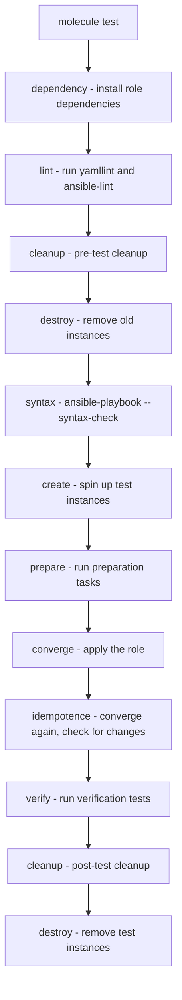

# How to Test Ansible Roles in Isolation

Author: [nawazdhandala](https://www.github.com/nawazdhandala)

Tags: Ansible, Roles, Testing, Molecule

Description: Learn how to test Ansible roles in isolation using Molecule, Docker, and testinfra to catch bugs before they reach production.

---

Testing Ansible roles in isolation means running them against a fresh system to verify they work correctly without depending on any other role, specific inventory, or pre-existing state. This is how you build confidence that a role is portable, idempotent, and actually does what it claims. The primary tool for this is Molecule, and this post walks through setting it up, writing tests, and integrating everything into CI.

## Why Test in Isolation?

When you only test roles as part of a larger playbook against existing infrastructure, you miss several categories of bugs:

- The role depends on state left by a previous role
- The role is not idempotent (running it twice produces changes)
- The role fails on a fresh system
- The role does not clean up after itself properly
- Platform-specific code paths are broken

Isolated testing catches all of these.

## Setting Up Molecule

Molecule is the standard testing framework for Ansible roles. Install it with the Docker driver:

```bash
# Install Molecule with Docker support
pip install molecule molecule-plugins[docker]
```

## Initializing Molecule in a Role

Navigate to your role and initialize Molecule:

```bash
# Initialize Molecule in an existing role
cd roles/nginx
molecule init scenario --driver-name docker
```

This creates:

```
roles/nginx/
  molecule/
    default/
      converge.yml
      molecule.yml
      verify.yml
  tasks/
    main.yml
  ...
```

## Configuring molecule.yml

The `molecule.yml` file defines the test infrastructure:

```yaml
# roles/nginx/molecule/default/molecule.yml
# Test infrastructure configuration
---
dependency:
  name: galaxy

driver:
  name: docker

platforms:
  # Test against multiple operating systems
  - name: ubuntu-22
    image: ubuntu:22.04
    pre_build_image: true
    command: /lib/systemd/systemd
    privileged: true
    volumes:
      - /sys/fs/cgroup:/sys/fs/cgroup:rw
    cgroupns_mode: host

  - name: rocky-9
    image: rockylinux:9
    pre_build_image: true
    command: /lib/systemd/systemd
    privileged: true
    volumes:
      - /sys/fs/cgroup:/sys/fs/cgroup:rw
    cgroupns_mode: host

provisioner:
  name: ansible
  inventory:
    host_vars:
      ubuntu-22:
        ansible_python_interpreter: /usr/bin/python3
      rocky-9:
        ansible_python_interpreter: /usr/bin/python3

verifier:
  name: ansible
```

## The Converge Playbook

The `converge.yml` file is the playbook that applies your role to the test instances:

```yaml
# roles/nginx/molecule/default/converge.yml
# Apply the role to test instances
---
- name: Converge
  hosts: all
  become: true

  pre_tasks:
    - name: Update apt cache (Debian)
      ansible.builtin.apt:
        update_cache: yes
        cache_valid_time: 600
      when: ansible_os_family == "Debian"

  roles:
    - role: nginx
      vars:
        nginx_port: 8080
        nginx_server_name: test.local
```

## Writing Verification Tests

The `verify.yml` file runs after the role is applied and checks that everything is correct:

```yaml
# roles/nginx/molecule/default/verify.yml
# Verify the role did what it should
---
- name: Verify
  hosts: all
  become: true
  gather_facts: true

  tasks:
    - name: Check that Nginx is installed
      ansible.builtin.package:
        name: nginx
        state: present
      check_mode: true
      register: nginx_installed

    - name: Assert Nginx is installed
      ansible.builtin.assert:
        that:
          - nginx_installed is not changed
        fail_msg: "Nginx is not installed"

    - name: Check that Nginx service is running
      ansible.builtin.service:
        name: nginx
        state: started
      check_mode: true
      register: nginx_service

    - name: Assert Nginx is running
      ansible.builtin.assert:
        that:
          - nginx_service is not changed
        fail_msg: "Nginx service is not running"

    - name: Check that Nginx is listening on the configured port
      ansible.builtin.wait_for:
        port: 8080
        timeout: 5

    - name: Check that the configuration file exists
      ansible.builtin.stat:
        path: /etc/nginx/nginx.conf
      register: nginx_conf

    - name: Assert configuration file exists
      ansible.builtin.assert:
        that:
          - nginx_conf.stat.exists
          - nginx_conf.stat.mode == '0644'

    - name: Check configuration file content
      ansible.builtin.command: grep "listen 8080" /etc/nginx/nginx.conf
      register: port_check
      changed_when: false

    - name: Assert port is configured correctly
      ansible.builtin.assert:
        that:
          - port_check.rc == 0
        fail_msg: "Port 8080 not found in nginx.conf"
```

## Running Tests

Molecule provides several commands for different stages of testing:

```bash
# Run the full test sequence (create, converge, verify, destroy)
molecule test

# Just create the test instances
molecule create

# Apply the role (converge)
molecule converge

# Run verification tests
molecule verify

# Log into a test instance for debugging
molecule login --host ubuntu-22

# Run the role again to check idempotency
molecule converge

# Destroy test instances
molecule destroy
```

## The Full Test Sequence

When you run `molecule test`, it executes these steps in order:



## Testing Idempotency

Molecule's idempotence check runs the converge playbook twice. If the second run reports any changes, the test fails. This catches common issues like:

- Tasks that always report "changed"
- Templates that unnecessarily re-render
- File permissions that get reset
- Service restarts on every run

If a task legitimately needs to run every time, mark it with `changed_when: false`:

```yaml
# This task always runs but should not count as a change
- name: Check application health
  ansible.builtin.uri:
    url: http://localhost:8080/health
  register: health_check
  changed_when: false
```

## Using testinfra for Python-Based Tests

For more complex verification, use testinfra (a Python testing framework):

```yaml
# molecule/default/molecule.yml
verifier:
  name: testinfra
```

```python
# roles/nginx/molecule/default/tests/test_default.py
# Python-based verification tests using testinfra

def test_nginx_is_installed(host):
    """Verify Nginx package is installed."""
    nginx = host.package("nginx")
    assert nginx.is_installed

def test_nginx_is_running(host):
    """Verify Nginx service is running and enabled."""
    nginx = host.service("nginx")
    assert nginx.is_running
    assert nginx.is_enabled

def test_nginx_listening(host):
    """Verify Nginx is listening on the configured port."""
    socket = host.socket("tcp://0.0.0.0:8080")
    assert socket.is_listening

def test_nginx_config_exists(host):
    """Verify Nginx configuration file exists with correct permissions."""
    config = host.file("/etc/nginx/nginx.conf")
    assert config.exists
    assert config.user == "root"
    assert config.group == "root"
    assert config.mode == 0o644

def test_nginx_config_content(host):
    """Verify the configuration contains expected settings."""
    config = host.file("/etc/nginx/nginx.conf")
    assert config.contains("listen 8080")
    assert config.contains("server_name test.local")
```

## Multiple Test Scenarios

Create different scenarios for different configurations:

```bash
# Create an additional scenario
molecule init scenario --scenario-name tls --driver-name docker
```

```
roles/nginx/molecule/
  default/
    molecule.yml
    converge.yml
    verify.yml
  tls/
    molecule.yml
    converge.yml
    verify.yml
```

```yaml
# roles/nginx/molecule/tls/converge.yml
# Test the role with TLS enabled
---
- name: Converge TLS scenario
  hosts: all
  become: true
  roles:
    - role: nginx
      vars:
        nginx_port: 443
        nginx_enable_tls: true
        nginx_tls_cert: /etc/ssl/certs/test.crt
        nginx_tls_key: /etc/ssl/private/test.key
```

Run a specific scenario:

```bash
# Run only the TLS scenario
molecule test --scenario-name tls

# Run all scenarios
molecule test --all
```

## Testing Role Dependencies

If your role has dependencies, create a `requirements.yml` in the Molecule scenario:

```yaml
# roles/webapp/molecule/default/requirements.yml
---
roles:
  - name: nginx
    src: git@github.com:myorg/ansible-role-nginx.git
    version: v1.0.0
```

Molecule installs these before running the converge playbook.

## CI/CD Integration

### GitHub Actions

```yaml
# .github/workflows/test.yml
name: Test Ansible Role

on:
  push:
    branches: [main]
  pull_request:
    branches: [main]

jobs:
  molecule:
    runs-on: ubuntu-latest
    strategy:
      matrix:
        scenario:
          - default
          - tls
    steps:
      - uses: actions/checkout@v4

      - name: Set up Python
        uses: actions/setup-python@v5
        with:
          python-version: '3.11'

      - name: Install dependencies
        run: |
          pip install ansible molecule molecule-plugins[docker]

      - name: Run Molecule tests
        run: molecule test --scenario-name ${{ matrix.scenario }}
```

## Debugging Failed Tests

When tests fail, use these commands to investigate:

```bash
# Keep instances running after a failure
molecule test --destroy=never

# Log into the instance to debug
molecule login --host ubuntu-22

# Inside the instance, check logs, files, services
systemctl status nginx
cat /etc/nginx/nginx.conf
journalctl -u nginx

# When done debugging, clean up
molecule destroy
```

## Wrapping Up

Testing Ansible roles in isolation with Molecule gives you confidence that your roles work on fresh systems, are idempotent, and behave correctly across platforms. The setup takes about 15 minutes per role, and the payoff is immediate: you catch bugs before they reach any environment, you verify idempotency automatically, and you can test against multiple operating systems in parallel. If you are building roles that other teams depend on, isolated testing is not optional. It is the difference between a role that "probably works" and one that you can rely on.
