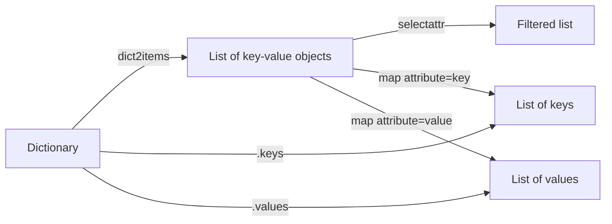

# How to Transform Dictionaries into Lists in Ansible

Author: [nawazdhandala](https://www.github.com/nawazdhandala)

Tags: Ansible, Data Transformation, Jinja2, Filters

Description: Learn how to convert dictionaries into lists in Ansible using dict2items, Jinja2 loops, and custom filters for flexible playbook data handling.

---

Converting dictionaries into lists is one of those tasks that pops up all the time in Ansible playbooks. Maybe you have a dictionary of users and their attributes, but you need to loop over them as a list. Or you pulled configuration data that is structured as a dictionary, but a module expects list input. Whatever the case, Ansible gives you a handful of reliable tools to handle this.

## The dict2items Filter

The simplest and most commonly used method is the `dict2items` filter. It takes a dictionary and returns a list of dictionaries, each with a `key` and `value` field.

```yaml
# playbook-dict2items.yml
# Converts a dictionary of firewall rules into a list for iteration
- name: Transform dictionary to list with dict2items
  hosts: localhost
  gather_facts: false
  vars:
    firewall_rules:
      ssh: 22
      http: 80
      https: 443
      dns: 53

  tasks:
    - name: Convert rules dict to list
      ansible.builtin.set_fact:
        rules_list: "{{ firewall_rules | dict2items }}"

    - name: Display the resulting list
      ansible.builtin.debug:
        var: rules_list
```

The output looks like this:

```json
[
    {"key": "ssh", "value": 22},
    {"key": "http", "value": 80},
    {"key": "https", "value": 443},
    {"key": "dns", "value": 53}
]
```

## Custom Key and Value Names

You can customize the field names in the output using `key_name` and `value_name` parameters. This is handy when you need the output to match a specific schema.

```yaml
# playbook-custom-names.yml
# Uses custom field names for the converted list items
- name: Transform with custom field names
  hosts: localhost
  gather_facts: false
  vars:
    database_ports:
      postgresql: 5432
      mysql: 3306
      mongodb: 27017
      redis: 6379

  tasks:
    - name: Convert with custom key/value names
      ansible.builtin.set_fact:
        db_list: "{{ database_ports | dict2items(key_name='service', value_name='port') }}"

    - name: Show result
      ansible.builtin.debug:
        var: db_list
```

This produces:

```json
[
    {"service": "postgresql", "port": 5432},
    {"service": "mysql", "port": 3306},
    {"service": "mongodb", "port": 27017},
    {"service": "redis", "port": 6379}
]
```

## Looping Over Dictionaries

One of the primary reasons you would convert a dictionary to a list is so you can loop over it. Here is a practical example:

```yaml
# playbook-loop-dict.yml
# Opens firewall ports by converting a rules dictionary to a list and looping
- name: Use dict2items to loop over dictionary
  hosts: webservers
  become: true
  vars:
    firewall_rules:
      ssh: 22
      http: 80
      https: 443

  tasks:
    - name: Open firewall ports
      ansible.posix.firewalld:
        port: "{{ item.value }}/tcp"
        permanent: true
        state: enabled
      loop: "{{ firewall_rules | dict2items }}"
      loop_control:
        label: "{{ item.key }} (port {{ item.value }})"
```

## Extracting Just Keys or Values

Sometimes you do not need the full key-value pairs. You just want the keys or the values as a flat list.

```yaml
# playbook-keys-values.yml
# Extracts separate lists of just keys and just values from a dictionary
- name: Extract keys and values separately
  hosts: localhost
  gather_facts: false
  vars:
    services:
      nginx: running
      postgresql: running
      memcached: stopped
      redis: running

  tasks:
    - name: Get list of service names (keys)
      ansible.builtin.debug:
        msg: "{{ services.keys() | list }}"

    - name: Get list of service states (values)
      ansible.builtin.debug:
        msg: "{{ services.values() | list }}"
```

Output for keys: `["nginx", "postgresql", "memcached", "redis"]`

Output for values: `["running", "running", "stopped", "running"]`

## Nested Dictionary to Flat List

When dealing with nested dictionaries, you might need to flatten the structure into a single list. Here is how to handle that:

```yaml
# playbook-nested.yml
# Flattens a nested dictionary (environments with multiple servers) into a single list
- name: Flatten nested dictionary to list
  hosts: localhost
  gather_facts: false
  vars:
    environments:
      production:
        web_server: 10.0.1.10
        db_server: 10.0.1.20
      staging:
        web_server: 10.0.2.10
        db_server: 10.0.2.20

  tasks:
    - name: Build flat list from nested dict
      ansible.builtin.set_fact:
        all_servers: >-
          
          
          
          
          
          
          {{ result }}

    - name: Display flattened list
      ansible.builtin.debug:
        var: all_servers
```

## Filtering During Transformation

You can combine `dict2items` with the `selectattr` filter to convert and filter in one chain:

```yaml
# playbook-filter-transform.yml
# Converts dictionary to list and filters to only include running services
- name: Filter dictionary during transformation
  hosts: localhost
  gather_facts: false
  vars:
    all_services:
      nginx: running
      postgresql: running
      memcached: stopped
      redis: running
      mysql: stopped

  tasks:
    - name: Get only running services as a list
      ansible.builtin.set_fact:
        running_services: >-
          {{ all_services | dict2items |
             selectattr('value', 'equalto', 'running') | list }}

    - name: Display running services
      ansible.builtin.debug:
        var: running_services

    - name: Get just the names of running services
      ansible.builtin.set_fact:
        running_names: >-
          {{ all_services | dict2items |
             selectattr('value', 'equalto', 'running') |
             map(attribute='key') | list }}

    - name: Display running service names
      ansible.builtin.debug:
        var: running_names
```

## Transformation Pipeline

Here is how the different approaches relate to each other:



## Real-World Example: Generating Host Entries

Here is a practical playbook that transforms a dictionary of hosts into /etc/hosts entries:

```yaml
# playbook-hosts-file.yml
# Converts a hostname dictionary into /etc/hosts entries
- name: Manage /etc/hosts from dictionary data
  hosts: localhost
  gather_facts: false
  vars:
    internal_hosts:
      app-server-01: 192.168.1.10
      db-server-01: 192.168.1.20
      cache-server-01: 192.168.1.30
      monitoring-01: 192.168.1.40

  tasks:
    - name: Convert hosts dict to list for templating
      ansible.builtin.set_fact:
        hosts_entries: "{{ internal_hosts | dict2items(key_name='hostname', value_name='ip') }}"

    - name: Generate hosts file content
      ansible.builtin.copy:
        content: |
          # Managed by Ansible
          127.0.0.1 localhost
          
          {{ entry.ip }} {{ entry.hostname }}
          
        dest: /tmp/hosts_managed

    - name: Verify the generated file
      ansible.builtin.debug:
        msg: "Generated {{ hosts_entries | length }} host entries"
```

## Converting to a Sorted List

Dictionaries in Python (and therefore in Ansible) do not guarantee ordering in older versions. If you need a sorted list, chain `dict2items` with `sort`:

```yaml
# playbook-sorted.yml
# Converts a dictionary to a sorted list, ordered by key name
- name: Create sorted list from dictionary
  hosts: localhost
  gather_facts: false
  vars:
    user_ids:
      charlie: 1003
      alice: 1001
      bob: 1002

  tasks:
    - name: Sort by key name
      ansible.builtin.debug:
        msg: "{{ user_ids | dict2items | sort(attribute='key') }}"

    - name: Sort by value (user ID)
      ansible.builtin.debug:
        msg: "{{ user_ids | dict2items | sort(attribute='value') }}"
```

## Summary

The `dict2items` filter is the workhorse for dictionary-to-list conversions. Use it with custom `key_name` and `value_name` when the defaults do not fit your data model. For simple key or value extraction, the `.keys()` and `.values()` methods are the fastest path. And when you need to filter, sort, or further transform the results, chain `dict2items` with `selectattr`, `sort`, or `map` filters for a clean, readable pipeline.
