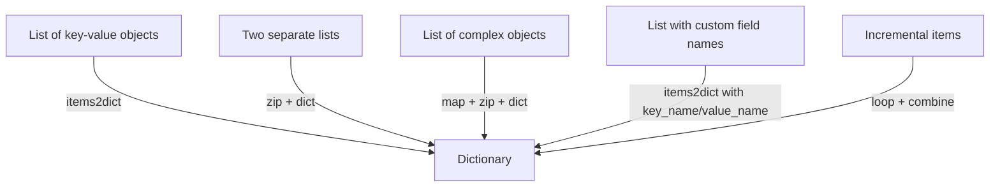

# How to Transform Lists into Dictionaries in Ansible

Author: [nawazdhandala](https://www.github.com/nawazdhandala)

Tags: Ansible, Data Transformation, Jinja2, Automation

Description: Learn how to convert lists into dictionaries in Ansible using built-in filters like items2dict, zip, and custom Jinja2 expressions for flexible data manipulation.

---

If you have ever worked with Ansible for any length of time, you have probably run into a situation where your data is in a list format but the module or role you need to use expects a dictionary. This is one of those bread-and-butter data transformation tasks that comes up constantly in real-world playbooks. In this post, I will walk through several approaches for converting lists to dictionaries in Ansible.

## Why Would You Need This?

Consider a typical scenario: you pull a list of key-value pairs from an API, a CSV file, or a dynamic inventory script. The data comes back as a list of objects, but you need it as a flat dictionary to feed into a template or a module parameter. Ansible provides several filters and techniques to handle this conversion cleanly.

## Using the items2dict Filter

The most straightforward way to transform a list of key-value pair objects into a dictionary is the `items2dict` filter. This filter expects a list of dictionaries, each containing a key field and a value field.

Here is a basic example that converts a list of server settings into a dictionary:

```yaml
# playbook-items2dict.yml
# Demonstrates converting a list of key-value objects into a flat dictionary
- name: Transform list to dictionary using items2dict
  hosts: localhost
  gather_facts: false
  vars:
    server_settings_list:
      - key: max_connections
        value: 100
      - key: timeout
        value: 30
      - key: log_level
        value: info
      - key: worker_processes
        value: 4

  tasks:
    - name: Convert list to dictionary
      ansible.builtin.set_fact:
        server_settings: "{{ server_settings_list | items2dict }}"

    - name: Display the resulting dictionary
      ansible.builtin.debug:
        var: server_settings
```

Running this playbook produces the following output:

```json
{
    "max_connections": 100,
    "timeout": 30,
    "log_level": "info",
    "worker_processes": 4
}
```

## Custom Key and Value Names

Sometimes your list does not use `key` and `value` as field names. The `items2dict` filter accepts `key_name` and `value_name` parameters to handle this.

Here is an example where the fields are named differently:

```yaml
# playbook-custom-keys.yml
# Handles lists where key/value fields have custom names
- name: Transform list with custom field names
  hosts: localhost
  gather_facts: false
  vars:
    packages_list:
      - name: nginx
        version: "1.24.0"
      - name: postgresql
        version: "15.4"
      - name: redis
        version: "7.2.1"

  tasks:
    - name: Convert to dictionary using custom key/value names
      ansible.builtin.set_fact:
        package_versions: "{{ packages_list | items2dict(key_name='name', value_name='version') }}"

    - name: Show package version dictionary
      ansible.builtin.debug:
        var: package_versions
```

This produces:

```json
{
    "nginx": "1.24.0",
    "postgresql": "15.4",
    "redis": "7.2.1"
}
```

## Using zip and dict2items (Combining Two Lists)

If you have two separate lists, one for keys and one for values, you can combine them using the `zip` filter and then convert the result with the `dict` constructor.

```yaml
# playbook-zip-method.yml
# Combines two parallel lists (keys and values) into a dictionary
- name: Create dictionary from two lists using zip
  hosts: localhost
  gather_facts: false
  vars:
    environment_names:
      - development
      - staging
      - production
    environment_ports:
      - 3000
      - 4000
      - 8080

  tasks:
    - name: Zip lists and create dictionary
      ansible.builtin.set_fact:
        env_ports: "{{ dict(environment_names | zip(environment_ports)) }}"

    - name: Display result
      ansible.builtin.debug:
        var: env_ports
```

Output:

```json
{
    "development": 3000,
    "staging": 4000,
    "production": 8080
}
```

## Using Jinja2 Expressions for Complex Transformations

For more complex cases, you can write inline Jinja2 expressions. This is useful when you need to derive the key or value from a more complicated data structure.

```yaml
# playbook-jinja2-transform.yml
# Uses Jinja2 to build a dictionary from a list of server objects
- name: Build dictionary with Jinja2 expression
  hosts: localhost
  gather_facts: false
  vars:
    servers:
      - hostname: web-01
        ip: 10.0.1.10
        role: webserver
      - hostname: db-01
        ip: 10.0.1.20
        role: database
      - hostname: cache-01
        ip: 10.0.1.30
        role: cache

  tasks:
    - name: Create hostname-to-IP mapping
      ansible.builtin.set_fact:
        host_ip_map: >-
          {{ dict(servers | map(attribute='hostname') | list |
             zip(servers | map(attribute='ip') | list)) }}

    - name: Show hostname to IP mapping
      ansible.builtin.debug:
        var: host_ip_map

    - name: Create role-to-hostname mapping
      ansible.builtin.set_fact:
        role_host_map: >-
          {{ dict(servers | map(attribute='role') | list |
             zip(servers | map(attribute='hostname') | list)) }}

    - name: Show role to hostname mapping
      ansible.builtin.debug:
        var: role_host_map
```

## Handling Duplicate Keys

One thing to watch out for is duplicate keys. When you transform a list into a dictionary, if multiple items share the same key, the last one wins. This is standard Python dictionary behavior.

```yaml
# playbook-duplicate-keys.yml
# Shows what happens when duplicate keys appear during transformation
- name: Demonstrate duplicate key behavior
  hosts: localhost
  gather_facts: false
  vars:
    config_entries:
      - key: log_level
        value: debug
      - key: timeout
        value: 30
      - key: log_level
        value: warning

  tasks:
    - name: Convert with duplicate keys
      ansible.builtin.set_fact:
        config: "{{ config_entries | items2dict }}"

    - name: Show result - last value for log_level wins
      ansible.builtin.debug:
        var: config
```

The result will have `log_level: warning` because it was the last entry with that key.

## Using a Loop to Build a Dictionary

Sometimes you need to build a dictionary incrementally. You can use `combine` inside a loop to achieve this.

```yaml
# playbook-loop-build.yml
# Builds a dictionary one entry at a time using combine in a loop
- name: Build dictionary with a loop
  hosts: localhost
  gather_facts: false
  vars:
    users:
      - username: alice
        uid: 1001
      - username: bob
        uid: 1002
      - username: carol
        uid: 1003

  tasks:
    - name: Build user-to-UID dictionary incrementally
      ansible.builtin.set_fact:
        user_uid_map: "{{ user_uid_map | default({}) | combine({item.username: item.uid}) }}"
      loop: "{{ users }}"

    - name: Display the built dictionary
      ansible.builtin.debug:
        var: user_uid_map
```

## Data Flow Overview

Here is a visual overview of the different transformation paths:



## Practical Example: Generating Configuration Files

Here is a real-world example that pulls data from a list and generates a configuration file:

```yaml
# playbook-practical.yml
# Transforms service configuration from list format to dictionary, then writes a config file
- name: Generate config from list data
  hosts: localhost
  gather_facts: false
  vars:
    service_params:
      - param: listen_address
        setting: "0.0.0.0"
      - param: listen_port
        setting: "8443"
      - param: ssl_enabled
        setting: "true"
      - param: max_workers
        setting: "16"
      - param: log_format
        setting: "json"

  tasks:
    - name: Transform list to dictionary
      ansible.builtin.set_fact:
        service_config: "{{ service_params | items2dict(key_name='param', value_name='setting') }}"

    - name: Write config file from dictionary
      ansible.builtin.copy:
        content: |
          
          {{ key }} = {{ value }}
          
        dest: /tmp/service.conf
```

## Key Takeaways

The `items2dict` filter is your go-to for simple list-to-dictionary conversions. When your field names differ from the defaults, pass `key_name` and `value_name`. For combining two parallel lists, `zip` paired with `dict()` does the job efficiently. And when your transformation logic is more involved, inline Jinja2 expressions or loop-based approaches with `combine` give you full flexibility.

Pick the approach that best fits your data shape, and keep in mind the duplicate key behavior so you do not lose data unexpectedly.
