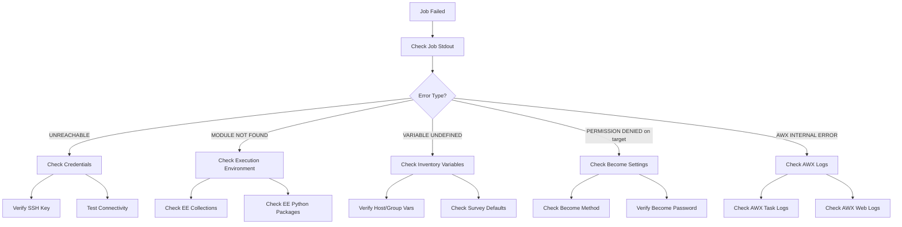

# How to Troubleshoot AWX Job Failures

Author: [nawazdhandala](https://www.github.com/nawazdhandala)

Tags: Ansible, AWX, Troubleshooting, Debugging, DevOps

Description: Diagnose and fix common AWX job failures with systematic debugging techniques covering permissions, connectivity, and playbook errors.

---

AWX job failures fall into a few predictable categories: the playbook itself has a bug, credentials are wrong, the target host is unreachable, or AWX has an infrastructure problem. Knowing where to look first saves hours of guessing. This post walks through a systematic approach to diagnosing failed jobs, from the most common issues to the more obscure ones.

## Start with the Job Output

The first thing to check is always the job stdout. Every failed job in AWX has detailed output showing exactly which task failed and why.

```bash
# Get the stdout of a failed job
curl -s -H "Authorization: Bearer ${AWX_TOKEN}" \
  "https://awx.example.com/api/v2/jobs/42/stdout/?format=txt"
```

Look for the FAILED or UNREACHABLE lines. Ansible gives you the error message right there. In many cases, the fix is obvious from the error.

```bash
# Get just the failed events from a job
curl -s -H "Authorization: Bearer ${AWX_TOKEN}" \
  "https://awx.example.com/api/v2/jobs/42/job_events/?event__in=runner_on_failed,runner_on_unreachable" \
  | python3 -c "
import sys, json
data = json.load(sys.stdin)
for event in data['results']:
    host = event.get('host_name', 'unknown')
    task = event.get('task', 'unknown')
    msg = event.get('event_data', {}).get('res', {}).get('msg', 'no message')
    print(f'Host: {host}')
    print(f'Task: {task}')
    print(f'Error: {msg}')
    print()
"
```

## Common Failure Categories

### 1. Permission Denied / Authentication Failed

**Symptoms**: `UNREACHABLE! => {"msg": "Failed to connect to the host via ssh: Permission denied"}`

**Causes and fixes**:
- Wrong SSH key - Check that the Machine credential on the job template has the correct private key.
- Wrong SSH user - The `ansible_user` is incorrect. Check the credential or inventory host variables.
- Host key changed - The target host was rebuilt and has a new SSH host key. Update `known_hosts` or set `host_key_checking = False` in the execution environment.

```bash
# Check which credential is attached to the job template
curl -s -H "Authorization: Bearer ${AWX_TOKEN}" \
  "https://awx.example.com/api/v2/job_templates/10/credentials/" \
  | python3 -c "
import sys, json
data = json.load(sys.stdin)
for cred in data['results']:
    print(f'{cred[\"name\"]} (type: {cred[\"credential_type_summary\"][\"name\"] if \"credential_type_summary\" in cred else \"unknown\"})')
"
```

### 2. Module Not Found

**Symptoms**: `ERROR! couldn't resolve module/action 'amazon.aws.ec2_instance'`

**Cause**: The Ansible collection containing the module is not installed in the execution environment.

**Fix**: Build a custom execution environment that includes the required collection.

```yaml
# requirements.yml for the execution environment
---
collections:
  - name: amazon.aws
  - name: community.general
  - name: ansible.posix
```

### 3. Python Module Import Error

**Symptoms**: `ModuleNotFoundError: No module named 'boto3'`

**Cause**: The Python library required by the Ansible module is not in the execution environment.

**Fix**: Add the Python package to the EE requirements.

```text
# requirements.txt for the execution environment
boto3
botocore
requests
```

### 4. Timeout Errors

**Symptoms**: `FAILED! => {"msg": "Timeout (12s) waiting for privilege escalation prompt"}`

**Causes and fixes**:
- Slow sudo - The target host's sudo is slow, often due to DNS resolution of the hostname. Add the hostname to `/etc/hosts` on the target.
- Network latency - Increase the `timeout` setting in the job template or ansible.cfg.

```yaml
# In your playbook, increase the connection timeout
- name: Tasks for slow hosts
  hosts: all
  gather_facts: false
  vars:
    ansible_timeout: 60
    ansible_command_timeout: 120
```

### 5. Variable Undefined Errors

**Symptoms**: `FAILED! => {"msg": "The task includes an option with an undefined variable"}`

**Cause**: A variable referenced in the playbook is not defined anywhere, or has a typo.

```bash
# Check what variables are available to the job
# Look at the inventory host variables
curl -s -H "Authorization: Bearer ${AWX_TOKEN}" \
  "https://awx.example.com/api/v2/hosts/?name=problematic-host" \
  | python3 -c "
import sys, json
data = json.load(sys.stdin)
for host in data['results']:
    print(f'Host: {host[\"name\"]}')
    print(f'Variables: {host[\"variables\"]}')
"
```

## Debugging Flow



## AWX Infrastructure Issues

Sometimes the problem is not with the playbook but with AWX itself.

### Job Stuck in Pending

```bash
# Check if there are capacity issues
curl -s -H "Authorization: Bearer ${AWX_TOKEN}" \
  https://awx.example.com/api/v2/instances/ \
  | python3 -c "
import sys, json
data = json.load(sys.stdin)
for inst in data['results']:
    print(f'{inst[\"hostname\"]}: capacity={inst[\"capacity\"]}, consumed={inst[\"consumed_capacity\"]}, errors={inst[\"errors\"]}')
"

# Check instance group capacity
curl -s -H "Authorization: Bearer ${AWX_TOKEN}" \
  https://awx.example.com/api/v2/instance_groups/ \
  | python3 -c "
import sys, json
data = json.load(sys.stdin)
for group in data['results']:
    print(f'{group[\"name\"]}: jobs_running={group[\"jobs_running\"]}, capacity={group[\"capacity\"]}')
"
```

### Project Update Failed

If a job fails because the project update (Git clone/pull) failed, check the project sync status.

```bash
# Check the project update status
curl -s -H "Authorization: Bearer ${AWX_TOKEN}" \
  "https://awx.example.com/api/v2/projects/3/project_updates/?order_by=-id&page_size=1" \
  | python3 -c "
import sys, json
data = json.load(sys.stdin)
if data['results']:
    update = data['results'][0]
    print(f'Status: {update[\"status\"]}')
    print(f'SCM URL: {update.get(\"scm_url\", \"\")}')
    # Get the stdout for details
    print(f'Check output at: /api/v2/project_updates/{update[\"id\"]}/stdout/')
"
```

### Database Connection Issues

If AWX cannot reach its database, jobs will fail with internal errors.

```bash
# Check AWX pod health
kubectl get pods -n awx
kubectl describe pod awx-task-xxx -n awx

# Check database connectivity from the AWX task pod
kubectl exec deployment/awx-task -n awx -- \
  python3 -c "import django; django.setup(); from django.db import connection; connection.ensure_connection(); print('DB OK')"
```

## Increasing Verbosity

AWX job templates have a verbosity setting (0-5). Higher verbosity shows more detail in the output.

```bash
# Increase verbosity on a job template for debugging
curl -s -X PATCH \
  -H "Authorization: Bearer ${AWX_TOKEN}" \
  -H "Content-Type: application/json" \
  https://awx.example.com/api/v2/job_templates/10/ \
  -d '{"verbosity": 3}'
```

Verbosity levels:
- 0 - Normal (default)
- 1 - Verbose (-v)
- 2 - More Verbose (-vv)
- 3 - Debug (-vvv)
- 4 - Connection Debug (-vvvv)
- 5 - WinRM Debug (-vvvvv)

Set it to 3 or 4 when troubleshooting, then set it back to 0 once the issue is resolved. High verbosity generates a lot of output and slows down job execution.

## Rerunning Failed Hosts

AWX can rerun a job only on hosts that failed in the previous run. This saves time when debugging because you do not wait for the successful hosts to run again.

```bash
# Relaunch a job only on failed hosts
curl -s -X POST \
  -H "Authorization: Bearer ${AWX_TOKEN}" \
  -H "Content-Type: application/json" \
  "https://awx.example.com/api/v2/jobs/42/relaunch/" \
  -d '{"hosts": "failed"}'
```

## Checking AWX Container Logs

When the job output does not explain the failure (for example, the job shows "error" status with no output), check the AWX system logs.

```bash
# Check AWX task container logs for errors around the time of the failure
kubectl logs deployment/awx-task -n awx --since=1h | grep -i error

# Check AWX web container logs
kubectl logs deployment/awx-web -n awx --since=1h | grep -i error

# Check for OOM kills (out of memory)
kubectl describe pod awx-task-xxx -n awx | grep -A5 "Last State"
```

## Quick Diagnostic Checklist

When a job fails, run through this checklist in order:

1. Read the job stdout for the specific error message
2. Check if the error is on a specific host (playbook bug) or all hosts (credential/connectivity)
3. Verify the credential is correct and the SSH key works
4. Verify the execution environment has the required collections and Python packages
5. Check that the inventory source is synced and the target hosts exist
6. Increase verbosity and rerun if the error is unclear
7. Check AWX system logs if the failure looks like an infrastructure issue

## Wrapping Up

Most AWX job failures are caused by a handful of issues: wrong credentials, missing dependencies in the execution environment, unreachable hosts, or undefined variables. Following a systematic debugging approach starting from the job output, through credential verification and EE inspection, saves significant time compared to random guessing. Increase verbosity when needed, use the relaunch-on-failed-hosts feature to iterate quickly, and check AWX's own logs when the playbook output does not explain the problem.
