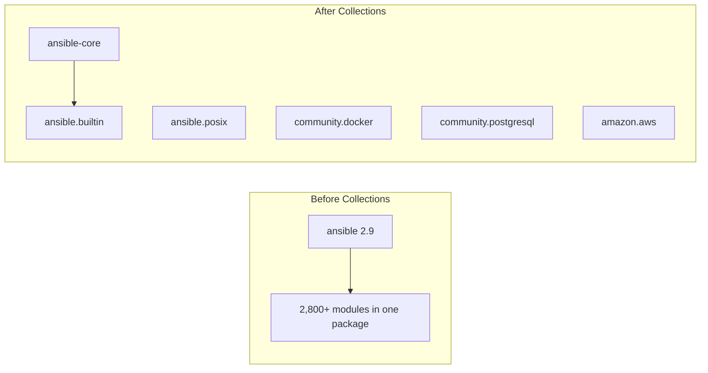

# How to Understand Ansible FQCN (Fully Qualified Collection Names)

Author: [nawazdhandala](https://www.github.com/nawazdhandala)

Tags: Ansible, FQCN, Collections, DevOps, Configuration Management

Description: A practical guide to understanding Ansible Fully Qualified Collection Names, how they work, why they matter, and how to migrate your playbooks.

---

If you have been working with Ansible for a while, you have probably noticed that module names changed. What used to be `copy` is now `ansible.builtin.copy`. What used to be `docker_container` is now `community.docker.docker_container`. This naming convention is called FQCN, or Fully Qualified Collection Name, and it became the standard way to reference Ansible content starting with Ansible 2.10.

This post breaks down what FQCNs are, how to read them, and how to update your existing playbooks to use them properly.

## The Anatomy of an FQCN

Every FQCN follows a three-part structure:

```
<namespace>.<collection_name>.<content_name>
```

Let me break that down with a real example:

```
community.postgresql.postgresql_db
    |          |            |
    |          |            +-- Module/plugin name
    |          +-- Collection name
    +-- Namespace
```

The **namespace** identifies who maintains the collection. `ansible` is the namespace for Red Hat maintained collections. `community` is for community-maintained ones. Organizations can also have their own namespaces on Galaxy.

The **collection name** groups related content together. For example, `postgresql` bundles all PostgreSQL-related modules and plugins.

The **content name** is the specific module, plugin, role, or playbook you are calling.

## Why FQCNs Exist

Before Ansible 2.10, every module shipped as part of a single massive package. The `ansible` pip package included thousands of modules for cloud providers, databases, networking equipment, containers, and more. This created several problems:

- Release cycles were slow because everything had to ship together
- Module maintainers had to coordinate with the core release schedule
- Name collisions became a real risk as the module count grew
- Users installed hundreds of modules they never used

Collections solved these problems by splitting content into independently versioned packages. But once modules live in separate packages, you need a way to tell Ansible which package a module comes from. That is what FQCNs do.



## The ansible.builtin Namespace

The `ansible.builtin` collection ships with `ansible-core` and includes the most commonly used modules. You do not need to install it separately.

Here are some modules you probably use all the time, shown with their FQCNs:

| Short Name | FQCN |
|-----------|------|
| copy | ansible.builtin.copy |
| template | ansible.builtin.template |
| file | ansible.builtin.file |
| yum | ansible.builtin.yum |
| apt | ansible.builtin.apt |
| service | ansible.builtin.service |
| command | ansible.builtin.command |
| shell | ansible.builtin.shell |
| debug | ansible.builtin.debug |
| set_fact | ansible.builtin.set_fact |

This also applies to plugins, not just modules. For example, the `file` lookup plugin is `ansible.builtin.file`, and the `items` lookup is `ansible.builtin.items`.

## How Ansible Resolves Short Names

When you write `copy` instead of `ansible.builtin.copy` in a task, Ansible still needs to figure out which module to run. It does this through a resolution process:

1. If a `collections` keyword is defined on the play, Ansible searches those collections in order
2. If no match is found (or no `collections` keyword exists), Ansible falls back to `ansible.builtin`
3. If the module still is not found, Ansible raises an error

This fallback behavior is why your old playbooks still work. But relying on implicit resolution is fragile. If you install a collection that happens to have a module with the same short name, you might get unexpected behavior.

Here is a concrete example of the problem:

```yaml
# This playbook has an ambiguity problem
---
- name: Deploy application
  hosts: servers
  collections:
    - community.general
    - ansible.builtin
  tasks:
    # Which "ping" module runs here?
    # community.general has a ping module for network devices
    # ansible.builtin has the standard ping module
    - name: Check connectivity
      ping:
```

With FQCNs, there is zero ambiguity:

```yaml
# This playbook is explicit and unambiguous
---
- name: Deploy application
  hosts: servers
  tasks:
    - name: Check connectivity
      ansible.builtin.ping:
```

## Migrating Existing Playbooks to FQCNs

If you have a large codebase of playbooks using short module names, you will want to migrate incrementally. The `ansible-lint` tool is your best friend here.

First, install ansible-lint and run it against your playbooks:

```bash
# Install ansible-lint
pip install ansible-lint

# Run it against your playbook directory
ansible-lint playbooks/
```

The `fqcn` rule will flag every task that uses a short module name and tell you the correct FQCN to use. The output looks something like this:

```
playbooks/webserver.yml:12: fqcn[action-core]: Use FQCN for builtin module actions (yum).
Use `ansible.builtin.yum` or `ansible.legacy.yum` instead.
```

For bulk updates, you can use a script to do find-and-replace. But be careful with modules that have the same short name in different collections. Always review changes before committing.

Here is a before-and-after comparison of a typical playbook migration:

```yaml
# BEFORE: Using short names (legacy style)
---
- name: Configure web server
  hosts: webservers
  become: true
  tasks:
    - name: Install packages
      yum:
        name:
          - httpd
          - mod_ssl
        state: present

    - name: Copy configuration
      template:
        src: httpd.conf.j2
        dest: /etc/httpd/conf/httpd.conf
      notify: restart httpd

    - name: Set SELinux boolean
      seboolean:
        name: httpd_can_network_connect
        state: true
        persistent: true

    - name: Start httpd
      service:
        name: httpd
        state: started
        enabled: true

  handlers:
    - name: restart httpd
      service:
        name: httpd
        state: restarted
```

```yaml
# AFTER: Using FQCNs (modern style)
---
- name: Configure web server
  hosts: webservers
  become: true
  tasks:
    - name: Install packages
      ansible.builtin.yum:
        name:
          - httpd
          - mod_ssl
        state: present

    - name: Copy configuration
      ansible.builtin.template:
        src: httpd.conf.j2
        dest: /etc/httpd/conf/httpd.conf
      notify: restart httpd

    - name: Set SELinux boolean
      ansible.posix.seboolean:
        name: httpd_can_network_connect
        state: true
        persistent: true

    - name: Start httpd
      ansible.builtin.service:
        name: httpd
        state: started
        enabled: true

  handlers:
    - name: restart httpd
      ansible.builtin.service:
        name: httpd
        state: restarted
```

Notice that `seboolean` moved from being a built-in module to `ansible.posix.seboolean`. This is one of those cases where migration is not just a namespace prefix change. You also need to make sure the `ansible.posix` collection is installed.

## FQCNs in Roles

FQCNs apply inside roles too. When writing roles that will be shared or used across projects, always use FQCNs in your task files.

```yaml
# roles/webserver/tasks/main.yml - Role tasks using FQCNs
---
- name: Install web server packages
  ansible.builtin.package:
    name: "{{ webserver_packages }}"
    state: present

- name: Deploy site configuration
  ansible.builtin.template:
    src: site.conf.j2
    dest: "{{ webserver_config_dir }}/site.conf"
    owner: root
    group: root
    mode: "0644"
  notify: reload webserver

- name: Ensure web server is running
  ansible.builtin.service:
    name: "{{ webserver_service }}"
    state: started
    enabled: true
```

## FQCNs for Plugins

FQCNs are not just for modules. They apply to all plugin types: filters, lookups, callbacks, connection plugins, inventory plugins, and more.

```yaml
# Examples of FQCNs for various plugin types
---
- name: FQCN examples for plugins
  hosts: localhost
  tasks:
    - name: Use a lookup plugin with FQCN
      ansible.builtin.debug:
        msg: "{{ lookup('ansible.builtin.file', '/etc/hostname') }}"

    - name: Use a filter with FQCN
      ansible.builtin.debug:
        msg: "{{ my_list | community.general.json_query('[?name==`prod`]') }}"

    - name: Use the pipe lookup
      ansible.builtin.debug:
        msg: "{{ lookup('ansible.builtin.pipe', 'date +%Y-%m-%d') }}"
```

## Quick Reference: Common Collections and Their Namespaces

Here is a cheat sheet of the most commonly used collections:

| Collection | Content Examples |
|-----------|-----------------|
| ansible.builtin | copy, template, file, yum, apt, service, debug |
| ansible.posix | seboolean, firewalld, mount, at, acl |
| ansible.windows | win_copy, win_service, win_feature |
| ansible.netcommon | cli_command, netconf_config, network_cli |
| community.general | timezone, modprobe, ufw, nmcli |
| community.docker | docker_container, docker_image, docker_network |
| community.postgresql | postgresql_db, postgresql_user, postgresql_query |
| amazon.aws | ec2_instance, s3_bucket, iam_role |

## Conclusion

FQCNs are not just a naming convention. They are the foundation of Ansible's modular architecture. Using them makes your playbooks explicit, portable, and future-proof. Start by running `ansible-lint` on your existing code, fix the FQCN warnings, and make it a habit to always use full names in new playbooks. Your future self (and your team) will thank you when there is never a question about which module a task is calling.
