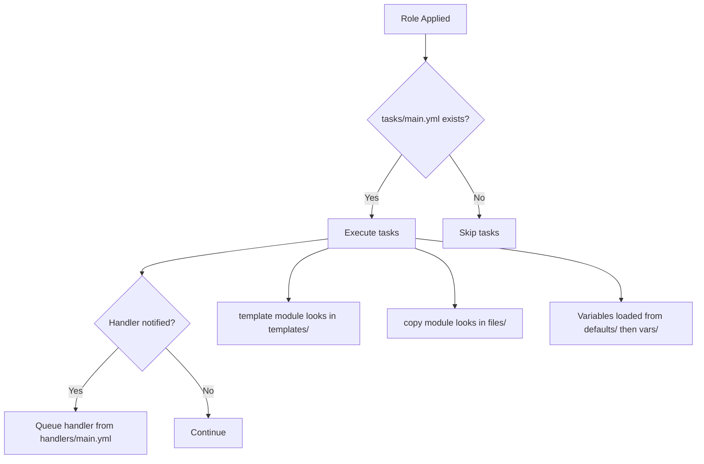

# How to Understand Ansible Role Directory Structure

Author: [nawazdhandala](https://www.github.com/nawazdhandala)

Tags: Ansible, Roles, Directory Structure, Configuration Management

Description: A detailed walkthrough of every directory and file in an Ansible role, explaining what each piece does and when to use it.

---

Ansible roles have a very specific directory layout, and every directory in that layout serves a distinct purpose. If you have ever looked at a role and wondered why there are separate `vars` and `defaults` directories, or what the `library` folder is for, this post will clear all of that up. I will go through every directory one by one and explain exactly when and how Ansible uses it.

## The Complete Directory Layout

When you look at a fully populated Ansible role, the structure looks like this:

```
roles/
  myrole/
    tasks/
      main.yml
    handlers/
      main.yml
    templates/
    files/
    vars/
      main.yml
    defaults/
      main.yml
    meta/
      main.yml
    library/
    module_utils/
    lookup_plugins/
    filter_plugins/
    tests/
      inventory
      test.yml
```

Not every role needs all of these directories. Most roles only use a subset. But understanding the full picture helps you make good decisions about where to put things.

## tasks/ - The Core Logic

This is the only directory that is truly required. When Ansible applies a role, it looks for `tasks/main.yml` and executes the tasks listed there.

```yaml
# roles/myrole/tasks/main.yml
# Entry point - Ansible starts here when the role is invoked
---
- name: Install required packages
  ansible.builtin.apt:
    name: "{{ myrole_packages }}"
    state: present

- name: Include OS-specific tasks
  ansible.builtin.include_tasks: "{{ ansible_os_family | lower }}.yml"
```

You can split tasks across multiple YAML files and pull them in with `include_tasks` or `import_tasks`. The `main.yml` file acts as the router.

```yaml
# roles/myrole/tasks/debian.yml
# Tasks specific to Debian/Ubuntu systems
---
- name: Add custom APT repository
  ansible.builtin.apt_repository:
    repo: "deb https://packages.example.com/apt stable main"
    state: present
```

## handlers/ - Event-Driven Actions

Handlers are tasks that only run when notified. They execute once at the end of the play, regardless of how many tasks notified them.

```yaml
# roles/myrole/handlers/main.yml
# These run only when a task uses "notify" and actually makes a change
---
- name: Restart application
  ansible.builtin.systemd:
    name: myapp
    state: restarted
    daemon_reload: yes

- name: Reload configuration
  ansible.builtin.systemd:
    name: myapp
    state: reloaded
```

The key insight with handlers is that they deduplicate. If five tasks all notify "Restart application", the handler runs exactly once.

## defaults/ - Low-Priority Variables

This directory contains variables with the lowest precedence in Ansible's variable hierarchy. They are meant to provide sensible defaults that users of the role can easily override from their inventory, playbook, or command line.

```yaml
# roles/myrole/defaults/main.yml
# These values are easily overridden - use for configurable options
---
myrole_version: "3.2.1"
myrole_port: 8080
myrole_log_level: info
myrole_max_connections: 100
myrole_install_dir: /opt/myapp
```

## vars/ - High-Priority Variables

Unlike `defaults`, the `vars` directory holds variables with much higher precedence. These are hard to override and should be used for internal constants or platform-specific values that should not change.

```yaml
# roles/myrole/vars/main.yml
# Internal constants - not meant to be overridden by role consumers
---
myrole_config_path: /etc/myapp/config.yml
myrole_service_name: myapp
myrole_supported_versions:
  - "3.0"
  - "3.1"
  - "3.2"
```

You can also have OS-specific variable files:

```yaml
# roles/myrole/vars/Debian.yml
---
myrole_packages:
  - libssl-dev
  - libyaml-dev

# roles/myrole/vars/RedHat.yml
---
myrole_packages:
  - openssl-devel
  - libyaml-devel
```

Then load them dynamically:

```yaml
# In tasks/main.yml - load the right variable file for the target OS
- name: Load OS-specific variables
  ansible.builtin.include_vars: "{{ ansible_os_family }}.yml"
```

## templates/ - Jinja2 Files

This directory holds Jinja2 template files (conventionally with a `.j2` extension). When you use the `template` module in a task, Ansible looks here automatically.

```jinja2
{# roles/myrole/templates/config.yml.j2 #}
{# Rendered at deploy time with role variables #}
server:
  port: {{ myrole_port }}
  log_level: {{ myrole_log_level }}
  max_connections: {{ myrole_max_connections }}

  tls:
    cert_file: {{ myrole_tls_cert }}
    key_file: {{ myrole_tls_key }}

```

## files/ - Static Files

Static files that do not need variable substitution go here. The `copy` and `script` modules look in this directory by default when used within a role.

```yaml
# Reference files without a full path - Ansible checks roles/myrole/files/
- name: Copy startup script
  ansible.builtin.copy:
    src: start.sh
    dest: /opt/myapp/start.sh
    mode: '0755'
```

## meta/ - Role Metadata

This file declares the role's metadata for Ansible Galaxy and, more importantly, its dependencies on other roles.

```yaml
# roles/myrole/meta/main.yml
# Metadata and dependency declarations
---
galaxy_info:
  author: nawazdhandala
  description: Deploys and configures MyApp
  license: MIT
  min_ansible_version: "2.14"
  galaxy_tags:
    - deployment
    - application

dependencies:
  - role: common
  - role: firewall
    vars:
      firewall_allowed_ports:
        - "{{ myrole_port }}"
```

When Ansible processes this role, it first processes the roles listed in `dependencies` before running any tasks from the current role.

## library/ - Custom Modules

If your role ships a custom module, place the Python file here. Ansible adds this directory to the module search path when the role is active.

```python
# roles/myrole/library/myapp_config.py
# Custom module available only when this role is used
from ansible.module_utils.basic import AnsibleModule

def main():
    module = AnsibleModule(
        argument_spec=dict(
            setting=dict(type='str', required=True),
            value=dict(type='str', required=True),
        )
    )
    # Module logic here
    module.exit_json(changed=True, msg="Configuration updated")

if __name__ == '__main__':
    main()
```

## module_utils/ - Shared Module Code

If you have helper code shared across multiple custom modules, put it here. Files in this directory can be imported by modules in the `library/` directory.

## filter_plugins/ and lookup_plugins/

These directories let you ship custom Jinja2 filters or lookup plugins with your role.

```python
# roles/myrole/filter_plugins/myfilters.py
# Custom Jinja2 filter available within this role
def reverse_domain(value):
    return '.'.join(reversed(value.split('.')))

class FilterModule(object):
    def filters(self):
        return {'reverse_domain': reverse_domain}
```

## tests/ - Role Tests

A conventional place for test playbooks and inventories:

```yaml
# roles/myrole/tests/test.yml
# Quick smoke test for the role
---
- hosts: localhost
  roles:
    - myrole
```

```ini
# roles/myrole/tests/inventory
[all]
localhost ansible_connection=local
```

## How Ansible Resolves Role Paths

Ansible searches for roles in this order:

1. A `roles/` directory relative to the playbook file
2. Directories listed in the `roles_path` configuration
3. The current working directory

You can also specify absolute or relative paths directly in your playbook:

```yaml
roles:
  - role: /absolute/path/to/myrole
  - role: ../shared-roles/myrole
```

## Visualizing the Lookup Order



## Quick Reference Table

| Directory | Priority | Auto-loaded | Purpose |
|-----------|----------|-------------|---------|
| tasks/ | N/A | Yes (main.yml) | Core role logic |
| handlers/ | N/A | Yes (main.yml) | Event-driven actions |
| defaults/ | Low (2) | Yes (main.yml) | Overridable defaults |
| vars/ | High (18) | Yes (main.yml) | Internal constants |
| templates/ | N/A | Search path | Jinja2 templates |
| files/ | N/A | Search path | Static files |
| meta/ | N/A | Yes (main.yml) | Dependencies, metadata |
| library/ | N/A | Search path | Custom modules |

## Wrapping Up

The Ansible role directory structure is not arbitrary. Each directory has a well-defined purpose and a specific way that Ansible interacts with it. Understanding this layout lets you organize your automation code effectively, keep your roles clean, and avoid common pitfalls like putting overridable variables in `vars/` instead of `defaults/`. Once you memorize the layout, you will find that structuring your automation becomes almost second nature.
