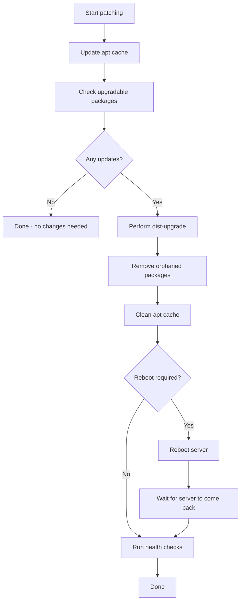

# How to Update All Packages with the Ansible apt Module

Author: [nawazdhandala](https://www.github.com/nawazdhandala)

Tags: Ansible, apt, Ubuntu, System Updates

Description: How to update and upgrade all packages on Debian and Ubuntu servers using the Ansible apt module safely and effectively.

---

Keeping packages up to date is one of the most basic security practices, but doing it safely across a fleet of servers takes some thought. You do not want to blindly upgrade everything on every server at once and hope for the best. The Ansible `apt` module gives you the control you need to update packages in a structured, predictable way. This post walks through the different upgrade strategies and how to implement them.

## Updating the Package Cache

Before doing any upgrades, you need to refresh the package index. This is equivalent to running `apt-get update`:

```yaml
# Refresh the apt package cache
- name: Update apt cache
  ansible.builtin.apt:
    update_cache: yes
```

You should almost always pair this with `cache_valid_time` to avoid unnecessary mirror hits:

```yaml
# Only update cache if it is older than 1 hour
- name: Update apt cache if stale
  ansible.builtin.apt:
    update_cache: yes
    cache_valid_time: 3600
```

## Upgrading All Packages

The `upgrade` parameter controls how aggressively apt upgrades. There are four options:

### upgrade: dist

This is equivalent to `apt-get dist-upgrade`. It handles dependency changes intelligently, installing new dependencies and removing obsolete ones as needed:

```yaml
# Full distribution upgrade (handles dependency changes)
- name: Upgrade all packages (dist-upgrade)
  ansible.builtin.apt:
    upgrade: dist
    update_cache: yes
    cache_valid_time: 3600
```

This is the most common option for routine updates. It is what you would use for monthly patching or security update windows.

### upgrade: yes (safe upgrade)

This is equivalent to `apt-get upgrade`. It only upgrades packages where the new version does not require installing or removing other packages:

```yaml
# Safe upgrade (never adds or removes packages)
- name: Upgrade all packages (safe)
  ansible.builtin.apt:
    upgrade: yes
    update_cache: yes
    cache_valid_time: 3600
```

Use this when you want the most conservative upgrade behavior. If a package update would require a new dependency, it gets held back.

### upgrade: full

This is equivalent to `apt-get full-upgrade` (same as `dist-upgrade` in practice):

```yaml
# Full upgrade (same behavior as dist)
- name: Full upgrade
  ansible.builtin.apt:
    upgrade: full
    update_cache: yes
```

### upgrade: safe

This is an alias for `upgrade: yes`. Same safe behavior:

```yaml
# Safe upgrade (alias)
- name: Safe upgrade
  ansible.builtin.apt:
    upgrade: safe
    update_cache: yes
```

## A Production-Ready Patch Playbook

Here is a complete playbook that patches servers in a controlled manner with pre-checks and post-checks:

```yaml
# Production patching playbook with safety checks
- name: Patch Ubuntu servers
  hosts: all
  become: yes
  serial: "25%"
  max_fail_percentage: 10
  tasks:
    - name: Check for available updates
      ansible.builtin.apt:
        update_cache: yes
      register: cache_update

    - name: Get list of upgradable packages
      ansible.builtin.command:
        cmd: apt list --upgradable
      register: upgradable
      changed_when: false

    - name: Display upgradable packages
      ansible.builtin.debug:
        msg: "{{ upgradable.stdout_lines }}"

    - name: Perform dist-upgrade
      ansible.builtin.apt:
        upgrade: dist
        update_cache: no
      register: upgrade_result

    - name: Display upgrade results
      ansible.builtin.debug:
        msg: "Packages changed: {{ upgrade_result.stdout_lines | default([]) | length }} lines of output"

    - name: Remove orphaned dependencies
      ansible.builtin.apt:
        autoremove: yes
        purge: yes

    - name: Clean apt cache
      ansible.builtin.apt:
        autoclean: yes

    - name: Check if reboot is required
      ansible.builtin.stat:
        path: /var/run/reboot-required
      register: reboot_required

    - name: Reboot if required
      ansible.builtin.reboot:
        reboot_timeout: 300
        msg: "Rebooting for kernel update"
      when: reboot_required.stat.exists

    - name: Wait for server to come back
      ansible.builtin.wait_for_connection:
        delay: 10
        timeout: 300
      when: reboot_required.stat.exists
```

Key features of this playbook:

- `serial: "25%"` processes servers in batches of 25%, so you never update the entire fleet at once
- `max_fail_percentage: 10` stops the playbook if more than 10% of hosts fail
- The reboot check looks at `/var/run/reboot-required`, which Ubuntu creates when a kernel update needs a reboot
- The `wait_for_connection` task ensures the host is back up before moving to the next batch

## Upgrading Only Security Packages

You might want to apply security updates more frequently than full upgrades. Ubuntu makes this possible through `unattended-upgrades`, but you can also handle it with Ansible:

```yaml
# Install only security updates
- name: Upgrade security packages only
  ansible.builtin.command:
    cmd: apt-get -s dist-upgrade
  register: apt_simulate
  changed_when: false

- name: Apply security updates
  ansible.builtin.apt:
    upgrade: dist
    update_cache: yes
    default_release: "{{ ansible_distribution_release }}-security"
  when: "'-security' in apt_simulate.stdout"
```

A cleaner approach uses `unattended-upgrades`:

```yaml
# Configure automatic security updates
- name: Install unattended-upgrades
  ansible.builtin.apt:
    name: unattended-upgrades
    state: present

- name: Configure unattended-upgrades for security only
  ansible.builtin.copy:
    content: |
      Unattended-Upgrade::Allowed-Origins {
          "${distro_id}:${distro_codename}-security";
      };
      Unattended-Upgrade::AutoFixInterruptedDpkg "true";
      Unattended-Upgrade::Remove-Unused-Dependencies "true";
      Unattended-Upgrade::Automatic-Reboot "false";
    dest: /etc/apt/apt.conf.d/50unattended-upgrades
    mode: '0644'
```

## Excluding Packages from Upgrades

Sometimes you need to hold certain packages at their current version while upgrading everything else:

```yaml
# Hold a package to prevent upgrades
- name: Hold PostgreSQL at current version
  ansible.builtin.dpkg_selections:
    name: postgresql-15
    selection: hold

# Now run the upgrade - PostgreSQL will be skipped
- name: Upgrade all other packages
  ansible.builtin.apt:
    upgrade: dist
    update_cache: yes

# Unhold when you are ready to upgrade PostgreSQL
- name: Unhold PostgreSQL
  ansible.builtin.dpkg_selections:
    name: postgresql-15
    selection: install
```

## Upgrade Workflow



## Handling the Dpkg Lock

On busy servers or cloud instances that run automatic updates, you might hit the dpkg lock. Here is how to handle it:

```yaml
# Wait for any existing apt processes to finish
- name: Wait for dpkg lock to be released
  ansible.builtin.shell: |
    while fuser /var/lib/dpkg/lock-frontend >/dev/null 2>&1; do
      sleep 5
    done
  changed_when: false
  timeout: 300

- name: Perform system upgrade
  ansible.builtin.apt:
    upgrade: dist
    update_cache: yes
    cache_valid_time: 3600
```

## Reporting What Changed

For audit and compliance purposes, you might want to log what packages were updated:

```yaml
# Capture before and after package states
- name: Get package list before upgrade
  ansible.builtin.command: dpkg-query -W -f='${Package} ${Version}\n'
  register: packages_before
  changed_when: false

- name: Perform upgrade
  ansible.builtin.apt:
    upgrade: dist
    update_cache: yes

- name: Get package list after upgrade
  ansible.builtin.command: dpkg-query -W -f='${Package} ${Version}\n'
  register: packages_after
  changed_when: false

- name: Save upgrade diff to log file
  ansible.builtin.copy:
    content: |
      Upgrade performed on {{ ansible_date_time.iso8601 }}
      Host: {{ inventory_hostname }}

      Before:
      {{ packages_before.stdout }}

      After:
      {{ packages_after.stdout }}
    dest: "/var/log/ansible-upgrade-{{ ansible_date_time.date }}.log"
    mode: '0644'
```

The bottom line: always update the cache first, use `dist` for routine patching, batch your servers with `serial`, check for required reboots, and hold any packages that you are not ready to upgrade. A methodical approach to patching saves you from the 3 AM incident call.
