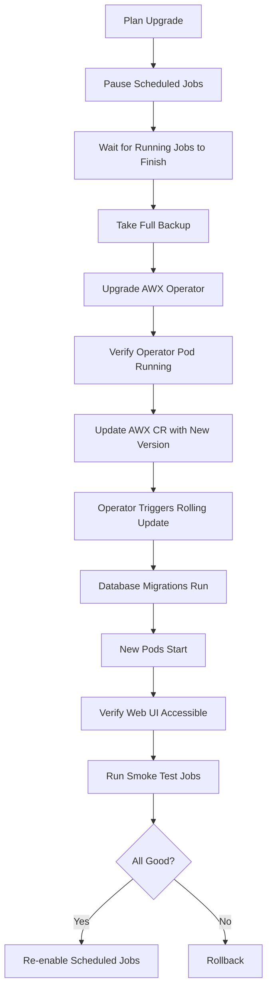

# How to Upgrade AWX to a New Version

Author: [nawazdhandala](https://www.github.com/nawazdhandala)

Tags: Ansible, AWX, Upgrade, Kubernetes, Maintenance

Description: Step-by-step guide to upgrading AWX to a new version using the AWX Operator, including pre-upgrade checks and rollback strategies.

---

AWX releases new versions frequently, and staying current matters for security patches, bug fixes, and new features. The upgrade process depends on how you deployed AWX. If you are using the AWX Operator on Kubernetes (the officially supported method), upgrades are relatively smooth. This post walks through the full upgrade lifecycle from planning to verification.

## Understanding AWX Versioning

AWX has two version numbers you need to track:

1. **AWX Operator version** - The Kubernetes operator that manages AWX deployments. This is what you upgrade first.
2. **AWX application version** - The actual AWX web and task containers. The operator controls which application version gets deployed.

These versions are not always in lockstep. A new operator version might support multiple AWX application versions. Always check the compatibility matrix in the AWX Operator release notes.

## Pre-Upgrade Checklist

Before upgrading, run through this checklist.

```bash
# 1. Check current versions
kubectl get deployment awx-operator-controller-manager -n awx \
  -o jsonpath='{.spec.template.spec.containers[0].image}'

kubectl get deployment awx-web -n awx \
  -o jsonpath='{.spec.template.spec.containers[0].image}'

# 2. Check for running jobs (do NOT upgrade while jobs are running)
curl -s -H "Authorization: Bearer ${AWX_TOKEN}" \
  "https://awx.example.com/api/v2/jobs/?status=running" \
  | python3 -c "
import sys, json
data = json.load(sys.stdin)
print(f'Running jobs: {data[\"count\"]}')
for job in data['results']:
    print(f'  Job {job[\"id\"]}: {job[\"name\"]} (started: {job[\"started\"]})')
"

# 3. Check cluster health
kubectl get pods -n awx
kubectl get pvc -n awx
```

## Take a Backup Before Upgrading

Never upgrade without a backup. Use the AWX Operator backup CRD.

```yaml
# pre-upgrade-backup.yml
---
apiVersion: awx.ansible.com/v1beta1
kind: AWXBackup
metadata:
  name: pre-upgrade-backup-20260221
  namespace: awx
spec:
  deployment_name: awx
  backup_pvc: awx-backup-pvc
  backup_pvc_namespace: awx
```

```bash
# Create the backup and wait for it to complete
kubectl apply -f pre-upgrade-backup.yml
kubectl wait --for=condition=complete \
  awxbackup/pre-upgrade-backup-20260221 -n awx --timeout=600s

# Also backup secrets manually
kubectl get secret awx-secret-key -n awx -o yaml > awx-secret-key-pre-upgrade.yml
```

## Upgrading the AWX Operator

The AWX Operator is typically installed via Kustomize or Helm. Here is the Kustomize approach.

```yaml
# kustomization.yml for the AWX Operator
---
apiVersion: kustomize.config.k8s.io/v1beta1
kind: Kustomization
namespace: awx

resources:
  - github.com/ansible/awx-operator/config/default?ref=2.12.0

images:
  - name: quay.io/ansible/awx-operator
    newTag: 2.12.0
```

```bash
# Apply the updated operator
kubectl apply -k .

# Watch the operator pod restart with the new version
kubectl get pods -n awx -w | grep operator
```

For Helm installations:

```bash
# Update the Helm repo
helm repo update

# Check available versions
helm search repo awx-operator --versions

# Upgrade the operator
helm upgrade awx-operator awx-operator/awx-operator \
  --namespace awx \
  --version 2.12.0
```

## Upgrading the AWX Application

After the operator is upgraded, update the AWX custom resource to specify the new application version.

```yaml
# awx-instance.yml
---
apiVersion: awx.ansible.com/v1beta1
kind: AWX
metadata:
  name: awx
  namespace: awx
spec:
  image: quay.io/ansible/awx
  image_version: 24.2.0
  image_pull_policy: IfNotPresent
  postgres_configuration_secret: awx-postgres-configuration
  admin_user: admin
  admin_password_secret: awx-admin-password
```

```bash
# Apply the updated AWX custom resource
kubectl apply -f awx-instance.yml

# Watch the pods rolling update
kubectl get pods -n awx -w
```

The operator detects the version change and performs a rolling update of the web and task pods. Database migrations run automatically during startup.

## Monitoring the Upgrade

```bash
# Watch the upgrade progress
kubectl get pods -n awx

# Check the operator logs for migration progress
kubectl logs deployment/awx-operator-controller-manager -n awx -f

# Check the web pod logs for startup and migration messages
kubectl logs deployment/awx-web -n awx -f
```

## Upgrade Flow



## Verifying the Upgrade

After the new pods are running, verify everything works.

```bash
# Check the version in the API
curl -s -H "Authorization: Bearer ${AWX_TOKEN}" \
  https://awx.example.com/api/v2/ping/ \
  | python3 -m json.tool

# Verify the UI is accessible
curl -s -o /dev/null -w "%{http_code}" \
  https://awx.example.com/

# Launch a test job
curl -s -X POST \
  -H "Authorization: Bearer ${AWX_TOKEN}" \
  -H "Content-Type: application/json" \
  https://awx.example.com/api/v2/job_templates/1/launch/

# Check that scheduled jobs are still configured
curl -s -H "Authorization: Bearer ${AWX_TOKEN}" \
  "https://awx.example.com/api/v2/schedules/?enabled=true" \
  | python3 -c "
import sys, json
data = json.load(sys.stdin)
print(f'Active schedules: {data[\"count\"]}')
"
```

## Rollback Procedure

If the upgrade fails, you can roll back to the previous version.

```bash
# Option 1: Revert the AWX CR to the previous version
kubectl edit awx awx -n awx
# Change image_version back to the previous value

# Option 2: Restore from backup
kubectl apply -f - <<EOF
apiVersion: awx.ansible.com/v1beta1
kind: AWXRestore
metadata:
  name: rollback-20260221
  namespace: awx
spec:
  deployment_name: awx
  backup_name: pre-upgrade-backup-20260221
EOF
```

Rolling back the application version works if the new version only added database columns (additive changes). If the migration dropped or renamed columns, a simple version rollback will not fix the schema. In that case, you need a full database restore from backup.

## Handling Major Version Jumps

Jumping multiple major versions at once is risky. AWX migrations are designed to be sequential. If you are on version 21 and want to get to version 24, the safest path is:

1. Upgrade 21 to 22, verify, backup
2. Upgrade 22 to 23, verify, backup
3. Upgrade 23 to 24, verify, backup

This is tedious but prevents migration failures that can be difficult to debug.

```bash
# Check the migration status after each upgrade
kubectl exec -it deployment/awx-web -n awx -- \
  awx-manage showmigrations | grep "\[ \]"
```

If any migrations show `[ ]` (not applied), something went wrong during the upgrade.

## Upgrading Execution Environments

A new AWX version might require updated execution environments. Check the release notes for any changes to the default EE requirements.

```bash
# Check which EE is configured as default
curl -s -H "Authorization: Bearer ${AWX_TOKEN}" \
  "https://awx.example.com/api/v2/execution_environments/?name=Default" \
  | python3 -c "
import sys, json
data = json.load(sys.stdin)
for ee in data['results']:
    print(f'{ee[\"name\"]}: {ee[\"image\"]}')
"

# Update the default EE image if needed
curl -s -X PATCH \
  -H "Authorization: Bearer ${AWX_TOKEN}" \
  -H "Content-Type: application/json" \
  https://awx.example.com/api/v2/execution_environments/1/ \
  -d '{"image": "quay.io/ansible/awx-ee:24.2.0"}'
```

## Maintenance Windows

Plan upgrades during low-traffic periods. Disable all schedules before upgrading so that a scheduled job does not launch during the migration window.

```bash
# Disable all schedules before upgrade
curl -s -H "Authorization: Bearer ${AWX_TOKEN}" \
  "https://awx.example.com/api/v2/schedules/?enabled=true" \
  | python3 -c "
import sys, json, requests
data = json.load(sys.stdin)
for sched in data['results']:
    print(f'Disabling schedule: {sched[\"name\"]} (ID: {sched[\"id\"]})')
"

# Re-enable after upgrade is verified
# (manually or with a script that re-enables each schedule by ID)
```

## Wrapping Up

AWX upgrades are manageable if you follow the process: backup first, upgrade the operator, then upgrade the application, and verify before re-enabling production schedules. The AWX Operator handles most of the heavy lifting, including database migrations and rolling updates. The key is patience: do not skip versions, do not upgrade during active jobs, and always have a tested rollback plan ready.
