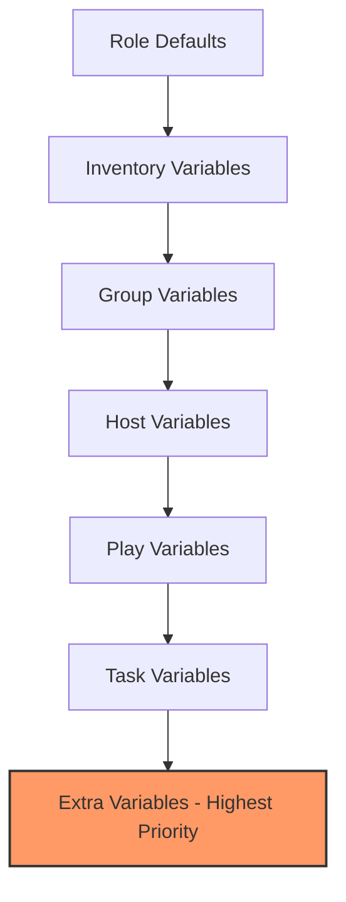

# How to Use Ansible Ad Hoc Commands with Extra Variables

Author: [nawazdhandala](https://www.github.com/nawazdhandala)

Tags: Ansible, Ad Hoc Commands, Variables, Automation

Description: Learn how to pass extra variables to Ansible ad hoc commands using the -e flag for dynamic and flexible command execution.

---

Ansible ad hoc commands are great for quick tasks, but they become much more powerful when you can inject variables at runtime. The `--extra-vars` (or `-e`) flag lets you pass variables directly from the command line, making your ad hoc commands dynamic and reusable. This is the same mechanism used with playbooks, and it works identically for ad hoc commands.

## Basic Extra Variables Syntax

The `-e` or `--extra-vars` flag accepts variables in several formats. The simplest is key=value pairs:

```bash
# Pass a single variable
ansible all -m debug -a "msg={{ greeting }}" -e "greeting=hello"

# Pass multiple variables
ansible all -m debug -a "msg={{ name }} works on {{ team }}" -e "name=Alice team=SRE"
```

## Variable Formats

Ansible accepts extra variables in multiple formats, and each has its use case.

### Key-Value Pairs

The simplest format, good for a few string variables:

```bash
# Simple key=value format
ansible webservers -m template -a "src=/tmp/config.j2 dest=/etc/app/config.conf" \
  -e "app_port=8080 app_env=production"
```

### JSON String

When you need more complex data types like lists, booleans, or nested structures:

```bash
# JSON format for complex variables
ansible all -m debug -a "msg={{ packages }}" \
  -e '{"packages": ["nginx", "redis", "postgresql"], "restart": true}'
```

Note the use of single quotes around the JSON to prevent the shell from interpreting the curly braces.

### JSON File

For lots of variables, put them in a file and reference it with the `@` prefix:

```bash
# Create a variables file
cat > /tmp/deploy_vars.json << 'EOF'
{
    "app_version": "2.4.1",
    "deploy_env": "staging",
    "db_host": "db01.internal",
    "db_port": 5432,
    "features": ["auth", "logging", "metrics"],
    "debug_mode": false
}
EOF

# Reference the file with @
ansible webservers -m debug -a "msg='Deploying {{ app_version }} to {{ deploy_env }}'" \
  -e "@/tmp/deploy_vars.json"
```

### YAML File

YAML files work too, which is often more readable:

```yaml
# /tmp/deploy_vars.yml
app_version: "2.4.1"
deploy_env: staging
db_host: db01.internal
db_port: 5432
features:
  - auth
  - logging
  - metrics
debug_mode: false
```

```bash
# Use the YAML file
ansible webservers -m debug -a "msg='Version: {{ app_version }}'" \
  -e "@/tmp/deploy_vars.yml"
```

## Practical Use Cases

### Dynamic Package Installation

Install different packages based on what you pass at runtime:

```bash
# Install a package specified at runtime
ansible webservers -m apt -a "name={{ package }} state=present" \
  -e "package=nginx" --become

# Install a specific version
ansible dbservers -m yum -a "name={{ package }}-{{ version }} state=present" \
  -e "package=postgresql version=14.2" --become
```

### Managing Services Dynamically

Control any service without hardcoding the name:

```bash
# Start a service specified at runtime
ansible webservers -m service -a "name={{ svc }} state={{ desired_state }}" \
  -e "svc=nginx desired_state=restarted" --become

# Stop a service on specific hosts
ansible dbservers -m service -a "name={{ svc }} state=stopped" \
  -e "svc=postgresql" --become
```

### Creating Users on the Fly

```bash
# Create a user with parameters from extra vars
ansible all -m user -a "name={{ username }} groups={{ groups }} shell={{ shell }}" \
  -e "username=deployer groups=sudo shell=/bin/bash" --become
```

### Dynamic File Operations

```bash
# Copy a file to a dynamic destination
ansible webservers -m copy -a "content='{{ config_content }}' dest={{ config_path }}" \
  -e '{"config_content": "listen_port=8080\nworkers=4\n", "config_path": "/etc/app/app.conf"}' \
  --become
```

### Conditional Commands Based on Variables

```bash
# Run a command with a variable-based condition
ansible all -m shell -a "echo 'Running in {{ env }}' && {{ command }}" \
  -e "env=production command='systemctl restart nginx'" --become
```

## Variable Precedence

Extra variables have the highest precedence in Ansible's variable hierarchy. This means they override everything else, including inventory variables, role defaults, and even variables set in plays. This makes `-e` a powerful override mechanism.

```bash
# This will override any http_port set in inventory or group_vars
ansible webservers -m debug -a "msg='Port is {{ http_port }}'" \
  -e "http_port=9090"
```

The full precedence order (from lowest to highest) for the relevant levels:



## Multiple -e Flags

You can pass the `-e` flag multiple times. Later values override earlier ones:

```bash
# The second -e overrides the first for 'env'
ansible all -m debug -a "msg='{{ env }} - {{ region }}'" \
  -e "env=staging region=us-east" \
  -e "env=production"
```

In this example, `env` will be `production` because the second `-e` takes precedence.

## Combining File and Inline Variables

You can mix file-based and inline variables:

```bash
# Load from file, but override specific values inline
ansible webservers -m debug -a "msg='{{ app_version }} in {{ deploy_env }}'" \
  -e "@/tmp/deploy_vars.yml" \
  -e "deploy_env=production"
```

The inline `deploy_env=production` will override whatever was in the YAML file.

## Using Variables with the Shell Module

When using variables inside shell commands, be careful with quoting:

```bash
# Correct: variable is expanded by Ansible before the shell sees it
ansible all -m shell -a "echo '{{ message }}' > /tmp/status.txt" \
  -e "message=Server is healthy"

# Using variables in complex shell commands
ansible all -m shell -a "curl -s -o /dev/null -w '%{http_code}' {{ url }}" \
  -e "url=http://localhost:8080/health"
```

## Variables with Special Characters

If your variable values contain spaces or special characters, JSON format is safer:

```bash
# This breaks because of spaces
# ansible all -m debug -a "msg={{ greeting }}" -e "greeting=hello world"

# Use JSON format instead
ansible all -m debug -a "msg={{ greeting }}" -e '{"greeting": "hello world"}'

# Or quote carefully
ansible all -m debug -a "msg={{ greeting }}" -e "greeting='hello world'"
```

## Environment-Specific Operations

A common pattern is using extra variables to target different environments:

```bash
# Deploy to staging
ansible webservers -m shell -a "deploy.sh --env {{ env }} --version {{ version }}" \
  -e "@environments/staging.yml" -e "version=2.4.1"

# Deploy to production (same command, different vars file)
ansible webservers -m shell -a "deploy.sh --env {{ env }} --version {{ version }}" \
  -e "@environments/production.yml" -e "version=2.4.1"
```

## Scripting with Extra Variables

Extra variables shine when you wrap ad hoc commands in scripts:

```bash
#!/bin/bash
# restart_service.sh - Restart a service across a server group
# Usage: ./restart_service.sh <group> <service_name>

GROUP=$1
SERVICE=$2

if [ -z "$GROUP" ] || [ -z "$SERVICE" ]; then
    echo "Usage: $0 <group> <service_name>"
    exit 1
fi

echo "Restarting $SERVICE on $GROUP..."
ansible "$GROUP" -m service -a "name={{ svc }} state=restarted" \
  -e "svc=$SERVICE" --become

echo "Verifying $SERVICE is running..."
ansible "$GROUP" -m shell -a "systemctl is-active {{ svc }}" \
  -e "svc=$SERVICE"
```

## Wrapping Up

The `-e` flag transforms ad hoc commands from static one-liners into flexible, reusable tools. Whether you are passing simple strings, complex JSON structures, or loading entire variable files, extra variables keep your commands DRY and adaptable. Remember that extra variables have the highest precedence, so they always win. Use this to your advantage when you need to override defaults for a specific run, but be aware that this also means they can accidentally mask variables you intended to use from other sources.
