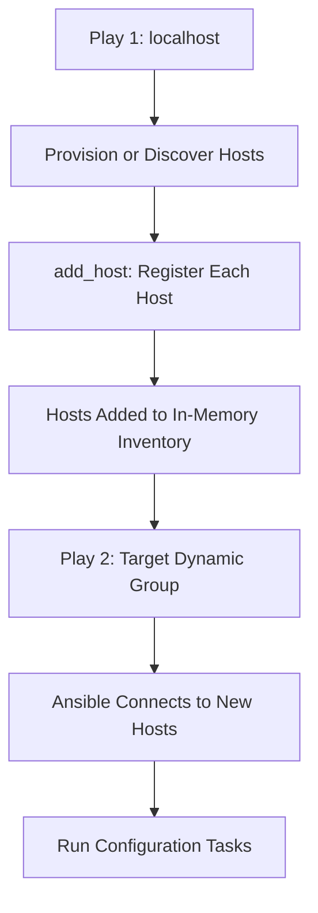

# How to Use Ansible add_host to Add Hosts Dynamically

Author: [nawazdhandala](https://www.github.com/nawazdhandala)

Tags: Ansible, Dynamic Inventory, add_host, Automation

Description: Learn how to use the Ansible add_host module to dynamically add hosts during playbook execution for flexible infrastructure management.

---

There are situations where the hosts you need to configure do not exist at the start of your playbook run. Maybe you are provisioning new cloud instances, or you are discovering hosts through an API call. The `add_host` module solves this problem by letting you register new hosts into the in-memory inventory while the playbook is running. Those hosts then become available for subsequent plays.

## The Basics of add_host

The `add_host` module takes a hostname and optionally a group name. Once you call it, Ansible treats that host as part of the inventory for the remainder of the playbook.

```yaml
# simple-add-host.yml - Add a single host at runtime
---
- name: Add a new host dynamically
  hosts: localhost
  gather_facts: false
  tasks:
    - name: Add web server to inventory
      ansible.builtin.add_host:
        name: 192.168.1.50
        groups: webservers
        ansible_user: deploy
        ansible_ssh_private_key_file: ~/.ssh/deploy_key

- name: Configure the dynamically added host
  hosts: webservers
  gather_facts: true
  tasks:
    - name: Install nginx
      ansible.builtin.apt:
        name: nginx
        state: present
      become: true
```

The first play runs on `localhost` and adds `192.168.1.50` to the `webservers` group. The second play then targets `webservers`, which now contains that host.

## Provisioning and Configuring in One Playbook

The most common use case for `add_host` is cloud provisioning. You spin up instances in one play, grab their IP addresses, and then configure them in the next play.

```yaml
# provision-and-configure.yml - Provision EC2 instances then configure them
---
- name: Provision EC2 instances
  hosts: localhost
  gather_facts: false
  vars:
    instance_count: 3
  tasks:
    - name: Launch EC2 instances
      amazon.aws.ec2_instance:
        name: "app-server"
        instance_type: t3.medium
        image_id: ami-0abcdef1234567890
        key_name: my-keypair
        security_group: app-sg
        subnet_id: subnet-12345678
        count: "{{ instance_count }}"
        state: running
        wait: true
      register: ec2_result

    - name: Add new instances to inventory
      ansible.builtin.add_host:
        name: "{{ item.private_ip_address }}"
        groups: new_instances
        ansible_user: ubuntu
        ansible_ssh_private_key_file: ~/.ssh/my-keypair.pem
        # Pass along instance metadata as host variables
        instance_id: "{{ item.instance_id }}"
        availability_zone: "{{ item.placement.availability_zone }}"
      loop: "{{ ec2_result.instances }}"

    - name: Wait for SSH to become available
      ansible.builtin.wait_for:
        host: "{{ item.private_ip_address }}"
        port: 22
        delay: 10
        timeout: 300
      loop: "{{ ec2_result.instances }}"

- name: Configure newly provisioned instances
  hosts: new_instances
  gather_facts: true
  become: true
  tasks:
    - name: Update apt cache
      ansible.builtin.apt:
        update_cache: true

    - name: Install application dependencies
      ansible.builtin.apt:
        name:
          - python3
          - python3-pip
          - nginx
        state: present
```

## Setting Host Variables with add_host

You can pass any number of host variables when calling `add_host`. These variables become available on the host just like variables defined in your inventory file.

```yaml
# host-vars.yml - Adding hosts with custom variables
---
- name: Add hosts with detailed variables
  hosts: localhost
  gather_facts: false
  tasks:
    - name: Add database primary
      ansible.builtin.add_host:
        name: db-primary.internal
        groups:
          - databases
          - db_primary
        ansible_user: admin
        db_role: primary
        db_port: 5432
        replication_enabled: true
        max_connections: 200

    - name: Add database replicas
      ansible.builtin.add_host:
        name: "db-replica-{{ item }}.internal"
        groups:
          - databases
          - db_replicas
        ansible_user: admin
        db_role: replica
        db_port: 5432
        replication_source: db-primary.internal
      loop:
        - 1
        - 2
        - 3

- name: Configure database nodes
  hosts: databases
  gather_facts: true
  tasks:
    - name: Show database role for each host
      ansible.builtin.debug:
        msg: "{{ inventory_hostname }} is a {{ db_role }} with port {{ db_port }}"
```

## Discovering Hosts from an API

Sometimes you need to pull a list of hosts from an external system, like a CMDB or a service discovery endpoint. You can use the `uri` module to query an API and then loop over the results with `add_host`.

```yaml
# api-discovery.yml - Discover hosts from a REST API
---
- name: Discover hosts from service registry
  hosts: localhost
  gather_facts: false
  tasks:
    - name: Query service registry for app nodes
      ansible.builtin.uri:
        url: "https://consul.internal/v1/catalog/service/myapp"
        method: GET
        return_content: true
      register: service_response

    - name: Parse and add discovered hosts
      ansible.builtin.add_host:
        name: "{{ item.Address }}"
        groups: discovered_app_nodes
        ansible_user: deploy
        service_port: "{{ item.ServicePort }}"
        node_name: "{{ item.Node }}"
      loop: "{{ service_response.json }}"
      when: service_response.status == 200

- name: Configure discovered nodes
  hosts: discovered_app_nodes
  gather_facts: true
  tasks:
    - name: Ensure app service is running
      ansible.builtin.systemd:
        name: myapp
        state: started
        enabled: true
      become: true
```

## The Execution Flow

Here is how `add_host` works across plays:



## Important Behavior: add_host Runs Once

A subtle but important detail: `add_host` always runs once, regardless of how many hosts are in the current play. Even if you have `hosts: all` with 50 hosts, `add_host` executes only on the first host. This is by design since adding a host to the inventory is a global action, not a per-host action.

If you need to add multiple hosts, use a loop:

```yaml
# multiple-hosts.yml - Adding multiple hosts with a loop
---
- name: Add multiple hosts
  hosts: localhost
  gather_facts: false
  vars:
    new_servers:
      - name: web1.example.com
        group: webservers
        ip: 10.0.1.10
      - name: web2.example.com
        group: webservers
        ip: 10.0.1.11
      - name: cache1.example.com
        group: cacheservers
        ip: 10.0.2.10
  tasks:
    - name: Add all servers to inventory
      ansible.builtin.add_host:
        name: "{{ item.name }}"
        groups: "{{ item.group }}"
        ansible_host: "{{ item.ip }}"
        ansible_user: deploy
      loop: "{{ new_servers }}"
```

## Combining add_host with Delegation

When you want one host to trigger the addition of another, `delegate_to` combined with `add_host` is the pattern you want.

```yaml
# delegation.yml - Use delegation with add_host
---
- name: Scale out based on load balancer info
  hosts: load_balancers
  gather_facts: false
  tasks:
    - name: Get list of backend servers from LB
      ansible.builtin.command:
        cmd: /usr/local/bin/lb-list-backends
      register: backend_list
      changed_when: false

    - name: Add each backend to inventory
      ansible.builtin.add_host:
        name: "{{ item }}"
        groups: lb_backends
        ansible_user: app
      loop: "{{ backend_list.stdout_lines }}"
      delegate_to: localhost
```

## Common Mistakes to Avoid

First, do not forget that `add_host` modifies only the in-memory inventory. Your actual inventory file remains untouched. If you run a different playbook afterwards, those dynamically added hosts will not be there.

Second, make sure SSH connectivity is established before trying to run tasks on dynamically added hosts. If you are provisioning cloud instances, include a `wait_for` task that checks for port 22 availability before moving on to the configuration play.

Third, remember that `add_host` bypasses the normal inventory plugin processing. This means host-specific `group_vars` and `host_vars` directories will not automatically apply to dynamically added hosts. You need to pass all necessary variables directly through the `add_host` call.

The `add_host` module is essential for any workflow that involves provisioning infrastructure and configuring it in the same playbook run. It bridges the gap between "these hosts do not exist yet" and "now configure them," all within a single automation workflow.
