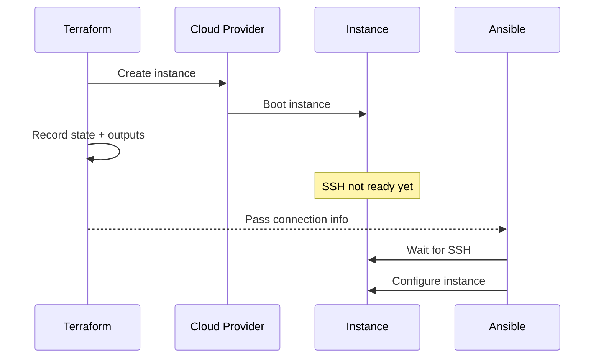

# How to Use Ansible After Terraform for Configuration Management

Author: [nawazdhandala](https://www.github.com/nawazdhandala)

Tags: Ansible, Terraform, Configuration Management, DevOps, Infrastructure as Code

Description: Learn practical patterns for running Ansible after Terraform to configure newly provisioned infrastructure with proper handoff workflows.

---

The handoff between Terraform and Ansible is one of the most common patterns in infrastructure automation. Terraform creates your cloud resources, and Ansible takes over to install software, manage configuration files, deploy applications, and handle everything that happens inside the operating system. Getting this handoff right can mean the difference between a smooth deployment and a frustrating debugging session.

This guide focuses specifically on what happens after Terraform finishes: how to get Ansible the information it needs, how to handle timing issues, and how to structure your configuration management layer.

## The Handoff Problem

When Terraform finishes provisioning a VM, the instance exists but is essentially blank. It has an IP address, maybe some tags, and a base operating system. That is it. Ansible needs to know where those instances are, how to connect to them, and what role each one plays. The gap between "instance exists" and "Ansible can reach it" is where most issues happen.



## Step 1: Terraform Outputs for Ansible

Structure your Terraform outputs so Ansible can consume them easily.

```hcl
# terraform/outputs.tf

output "inventory" {
  description = "Ansible inventory data"
  value = {
    webservers = {
      hosts = { for i, inst in aws_instance.web : inst.tags.Name => {
        ansible_host       = inst.public_ip
        private_ip         = inst.private_ip
        instance_id        = inst.id
        availability_zone  = inst.availability_zone
      }}
    }
    appservers = {
      hosts = { for i, inst in aws_instance.app : inst.tags.Name => {
        ansible_host       = inst.private_ip
        instance_id        = inst.id
        availability_zone  = inst.availability_zone
      }}
    }
    databases = {
      hosts = { for i, inst in aws_instance.db : inst.tags.Name => {
        ansible_host       = inst.private_ip
        instance_id        = inst.id
        availability_zone  = inst.availability_zone
      }}
    }
  }
}

output "shared_resources" {
  description = "Shared resource endpoints for application config"
  value = {
    rds_endpoint     = aws_db_instance.main.endpoint
    redis_endpoint   = aws_elasticache_cluster.cache.cache_nodes[0].address
    s3_bucket        = aws_s3_bucket.assets.id
    lb_dns           = aws_lb.main.dns_name
    vpc_id           = aws_vpc.main.id
  }
}
```

Export these to a JSON file after `terraform apply`.

```bash
# Export Terraform outputs as JSON for Ansible
terraform output -json > ../ansible/group_vars/all/terraform.json
```

## Step 2: Generate Ansible Inventory

Convert Terraform outputs into a proper Ansible inventory.

```python
#!/usr/bin/env python3
# ansible/inventory/from_terraform.py
"""Generate Ansible inventory from Terraform output JSON."""

import json
import os
import sys

TERRAFORM_DIR = os.path.join(os.path.dirname(__file__), "../../terraform")


def main():
    """Read Terraform outputs and produce Ansible inventory."""
    output_file = os.path.join(TERRAFORM_DIR, "outputs.json")

    # Try reading from file first, fall back to terraform command
    if os.path.exists(output_file):
        with open(output_file) as f:
            raw = json.load(f)
    else:
        import subprocess
        result = subprocess.run(
            ["terraform", "output", "-json"],
            cwd=TERRAFORM_DIR,
            capture_output=True,
            text=True,
        )
        raw = json.loads(result.stdout)

    # Extract the inventory structure
    inv_data = raw.get("inventory", {}).get("value", {})
    shared = raw.get("shared_resources", {}).get("value", {})

    inventory = {"_meta": {"hostvars": {}}, "all": {"vars": shared}}

    for group_name, group_data in inv_data.items():
        hosts = list(group_data.get("hosts", {}).keys())
        inventory[group_name] = {"hosts": hosts}

        for hostname, hostvars in group_data.get("hosts", {}).items():
            hostvars["ansible_user"] = "ubuntu"
            hostvars["ansible_ssh_private_key_file"] = "~/.ssh/deploy.pem"
            inventory["_meta"]["hostvars"][hostname] = hostvars

    print(json.dumps(inventory, indent=2))


if __name__ == "__main__":
    if "--list" in sys.argv:
        main()
    elif "--host" in sys.argv:
        print(json.dumps({}))
```

## Step 3: Wait for Instances to Be Ready

This is the part people forget. Just because Terraform says the instance is created does not mean SSH is accepting connections. Cloud-init might still be running, or the SSH daemon might not have started yet.

```yaml
# playbooks/wait-for-hosts.yml
---
- name: Wait for all hosts to become reachable
  hosts: all
  gather_facts: false

  tasks:
    # Wait for SSH to become available on each host
    - name: Wait for SSH connection
      ansible.builtin.wait_for_connection:
        delay: 10
        timeout: 300
        sleep: 5
      register: ssh_wait

    - name: Gather facts once connected
      ansible.builtin.setup:
      when: ssh_wait is succeeded
```

Alternatively, if you want to wait from localhost before even trying to connect:

```yaml
# playbooks/wait-from-localhost.yml
---
- name: Wait for instances from control node
  hosts: localhost
  gather_facts: false

  tasks:
    # Wait for SSH port to be open on each host
    - name: Wait for SSH port on web servers
      ansible.builtin.wait_for:
        host: "{{ hostvars[item].ansible_host }}"
        port: 22
        state: started
        timeout: 300
      loop: "{{ groups['webservers'] }}"
      loop_control:
        label: "{{ item }}"

    - name: Wait for SSH port on app servers
      ansible.builtin.wait_for:
        host: "{{ hostvars[item].ansible_host }}"
        port: 22
        state: started
        timeout: 300
      loop: "{{ groups['appservers'] }}"
      loop_control:
        label: "{{ item }}"
```

## Step 4: Base Configuration

Once SSH is up, apply base configuration that every server needs.

```yaml
# playbooks/base-config.yml
---
- name: Apply base configuration to all servers
  hosts: all
  become: true

  tasks:
    # Update package cache
    - name: Update apt cache
      ansible.builtin.apt:
        update_cache: true
        cache_valid_time: 3600
      when: ansible_os_family == "Debian"

    # Install common packages
    - name: Install base packages
      ansible.builtin.apt:
        name:
          - vim
          - htop
          - curl
          - wget
          - net-tools
          - jq
          - unzip
          - ntp
        state: present
      when: ansible_os_family == "Debian"

    # Configure NTP
    - name: Ensure NTP is running
      ansible.builtin.service:
        name: ntp
        state: started
        enabled: true

    # Set hostname from inventory
    - name: Set hostname
      ansible.builtin.hostname:
        name: "{{ inventory_hostname }}"

    # Configure sysctl for production
    - name: Set sysctl parameters
      ansible.posix.sysctl:
        name: "{{ item.key }}"
        value: "{{ item.value }}"
        sysctl_set: true
        reload: true
      loop:
        - { key: "net.core.somaxconn", value: "65535" }
        - { key: "vm.swappiness", value: "10" }
        - { key: "net.ipv4.tcp_max_syn_backlog", value: "65535" }

    # Set up log rotation
    - name: Configure logrotate for application logs
      ansible.builtin.copy:
        dest: /etc/logrotate.d/app
        content: |
          /var/log/app/*.log {
              daily
              missingok
              rotate 14
              compress
              delaycompress
              notifempty
          }
        mode: '0644'
```

## Step 5: Role-Specific Configuration

Apply role-specific configuration using the groups defined in your inventory.

```yaml
# playbooks/site.yml
---
- name: Wait for hosts
  ansible.builtin.import_playbook: wait-for-hosts.yml

- name: Base configuration
  ansible.builtin.import_playbook: base-config.yml

- name: Configure web servers
  hosts: webservers
  become: true
  roles:
    - role: nginx
      vars:
        nginx_worker_processes: auto
        nginx_worker_connections: 4096
    - role: ssl_certificates
    - role: monitoring_agent

- name: Configure application servers
  hosts: appservers
  become: true
  roles:
    - role: java_runtime
      vars:
        java_version: "17"
    - role: application_deploy
      vars:
        app_version: "{{ lookup('env', 'APP_VERSION') | default('latest') }}"
        db_host: "{{ shared_resources.rds_endpoint }}"
        redis_host: "{{ shared_resources.redis_endpoint }}"
    - role: monitoring_agent

- name: Configure database servers
  hosts: databases
  become: true
  roles:
    - role: postgresql
      vars:
        pg_version: "16"
        pg_data_dir: /data/postgresql
    - role: monitoring_agent
    - role: backup_agent
```

## Step 6: Verification

After configuration, verify everything is working.

```yaml
# playbooks/verify.yml
---
- name: Verify infrastructure is properly configured
  hosts: all
  become: true

  tasks:
    # Check that required services are running
    - name: Verify web server is running
      ansible.builtin.service_facts:

    - name: Assert nginx is running on web servers
      ansible.builtin.assert:
        that:
          - "'nginx.service' in services"
          - "services['nginx.service'].state == 'running'"
        fail_msg: "Nginx is not running on {{ inventory_hostname }}"
      when: "'webservers' in group_names"

    - name: Assert application is running on app servers
      ansible.builtin.assert:
        that:
          - "'myapp.service' in services"
          - "services['myapp.service'].state == 'running'"
        fail_msg: "Application is not running on {{ inventory_hostname }}"
      when: "'appservers' in group_names"

    # Verify connectivity between tiers
    - name: Test database connectivity from app servers
      ansible.builtin.command:
        cmd: "pg_isready -h {{ shared_resources.rds_endpoint }} -p 5432"
      changed_when: false
      when: "'appservers' in group_names"
```

## Handling Terraform Destroy and Rebuild

When Terraform destroys and recreates infrastructure, Ansible needs to handle SSH host key changes gracefully.

```yaml
# ansible.cfg
[defaults]
host_key_checking = False
retry_files_enabled = False
gathering = smart
fact_caching = jsonfile
fact_caching_connection = /tmp/ansible_facts
fact_caching_timeout = 3600

[ssh_connection]
ssh_args = -o ControlMaster=auto -o ControlPersist=60s -o StrictHostKeyChecking=no -o UserKnownHostsFile=/dev/null
pipelining = True
```

## Key Takeaways

After running this pattern on many projects, these are the things that matter most:

1. **Always wait for SSH.** Do not assume instances are ready just because Terraform succeeded. Add an explicit wait step.
2. **Use structured outputs.** The cleaner your Terraform outputs, the easier the Ansible side becomes. Spend time getting the output format right.
3. **Keep Terraform and Ansible concerns separate.** Terraform should not install packages. Ansible should not create cloud resources. Blurring these lines leads to maintenance headaches.
4. **Version your Ansible alongside Terraform.** They are two halves of the same deployment. Keep them in the same repository or at least tag releases together.
5. **Test the handoff regularly.** Do full destroy-and-rebuild cycles in a staging environment. You will find timing issues and dependency problems that only show up on fresh infrastructure.
