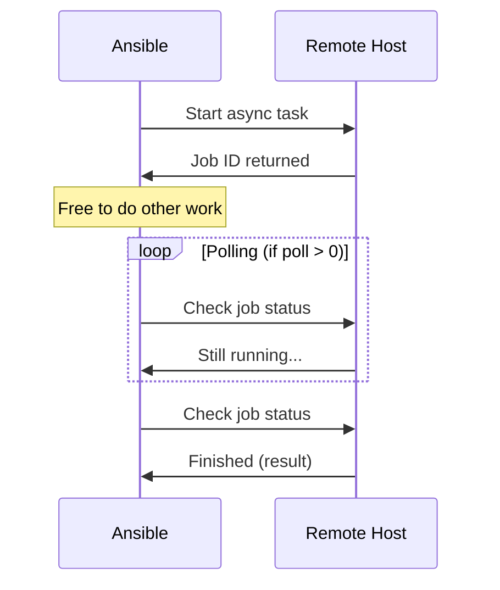

# How to Use Ansible async for Long-Running Tasks

Author: [nawazdhandala](https://www.github.com/nawazdhandala)

Tags: Ansible, Async, Performance, Automation

Description: Use Ansible async and poll to run long-running tasks in the background, parallelize independent operations, and avoid SSH timeouts.

---

Some tasks take a long time. Database backups, large package upgrades, application builds, and data migrations can run for minutes or even hours. Ansible's default behavior is to hold an SSH connection open while waiting for a task to complete, which ties up a fork slot and can trigger SSH timeouts. The `async` feature lets you launch tasks in the background, freeing up Ansible to do other work while the long task runs.

## How async Works

When you set `async` on a task, Ansible starts the task on the remote host and immediately returns. The task continues running in the background. Ansible can then either poll for completion or move on to other tasks and check back later.



## Basic async with Polling

The simplest async pattern launches a task and polls for completion:

```yaml
---
# Run a slow task with async polling
- hosts: databases
  tasks:
    - name: Run database backup
      command: /opt/scripts/full-backup.sh
      async: 3600    # Maximum runtime: 1 hour
      poll: 30       # Check every 30 seconds
      register: backup_result

    - name: Show backup result
      debug:
        msg: "Backup completed: {{ backup_result.stdout }}"
```

The `async: 3600` parameter tells Ansible the task is allowed to run for up to 3600 seconds (1 hour). The `poll: 30` parameter tells Ansible to check the task status every 30 seconds. If the task finishes before the timeout, Ansible picks up the result and moves on. If it exceeds the timeout, Ansible marks it as failed.

## Fire-and-Forget Pattern

Setting `poll: 0` launches the task and moves on immediately without waiting:

```yaml
---
# Fire-and-forget: start the task and move on
- hosts: app_servers
  tasks:
    - name: Start long-running data processing
      command: /opt/app/process-data.sh
      async: 7200
      poll: 0
      register: data_job

    - name: Continue with other work while processing runs
      copy:
        src: new-config.yml
        dest: /etc/myapp/config.yml

    - name: Deploy new application code
      copy:
        src: app-v2.tar.gz
        dest: /opt/app/

    # Now check back on the async task
    - name: Wait for data processing to complete
      async_status:
        jid: "{{ data_job.ansible_job_id }}"
      register: job_result
      until: job_result.finished
      retries: 120
      delay: 60
```

This pattern is powerful because the data processing runs in the background while Ansible continues with config and code deployment.

## Parallel Long-Running Tasks

One of the best uses of async is launching long tasks on multiple hosts simultaneously without waiting:

```yaml
---
# Launch backups on all database servers simultaneously
- hosts: databases
  tasks:
    - name: Start backup on all databases
      command: "/opt/scripts/backup.sh {{ inventory_hostname }}"
      async: 7200
      poll: 0
      register: backup_jobs

    - name: Wait for all backups to complete
      async_status:
        jid: "{{ backup_jobs.ansible_job_id }}"
      register: backup_result
      until: backup_result.finished
      retries: 240
      delay: 30
      # Each host polls its own backup job
```

Without async, Ansible would process each database backup sequentially (within each fork batch). With async, all backups start at roughly the same time.

## async with Package Updates

Large package updates are a common use case for async:

```yaml
---
# Run system upgrades asynchronously
- hosts: all
  become: true
  tasks:
    - name: Update all packages (async to avoid SSH timeout)
      apt:
        upgrade: dist
        update_cache: true
      async: 1800    # Allow up to 30 minutes
      poll: 60       # Check every minute
      register: upgrade_result

    - name: Check if reboot is required
      stat:
        path: /var/run/reboot-required
      register: reboot_flag

    - name: Reboot if needed
      reboot:
        reboot_timeout: 300
      when: reboot_flag.stat.exists
```

Without async, a dist-upgrade on a slow server could trigger an SSH timeout. The async parameter keeps the task running independently of the SSH connection.

## Multiple Independent async Tasks

Launch several independent tasks in parallel:

```yaml
---
# Run independent operations in parallel
- hosts: app_servers
  tasks:
    - name: Build frontend assets
      command: /opt/app/build-frontend.sh
      async: 600
      poll: 0
      register: frontend_build

    - name: Build backend
      command: /opt/app/build-backend.sh
      async: 600
      poll: 0
      register: backend_build

    - name: Run database migrations
      command: /opt/app/migrate.sh
      async: 600
      poll: 0
      register: migration
      run_once: true

    # Wait for all three to complete
    - name: Wait for frontend build
      async_status:
        jid: "{{ frontend_build.ansible_job_id }}"
      register: fe_result
      until: fe_result.finished
      retries: 60
      delay: 10

    - name: Wait for backend build
      async_status:
        jid: "{{ backend_build.ansible_job_id }}"
      register: be_result
      until: be_result.finished
      retries: 60
      delay: 10

    - name: Wait for migration
      async_status:
        jid: "{{ migration.ansible_job_id }}"
      register: mig_result
      until: mig_result.finished
      retries: 60
      delay: 10
      run_once: true
```

Without async, these three operations would run sequentially (build frontend, then build backend, then migrate). With async, they all run at the same time, and the total time equals the duration of the longest task rather than the sum of all three.

## Error Handling with async

Async tasks need explicit error handling since failures may not be detected until you check the status:

```yaml
---
# Proper error handling for async tasks
- hosts: app_servers
  tasks:
    - name: Run risky long operation
      command: /opt/scripts/risky-operation.sh
      async: 1800
      poll: 0
      register: risky_job

    - name: Do other work
      command: echo "other work"
      changed_when: false

    - name: Check risky operation status
      async_status:
        jid: "{{ risky_job.ansible_job_id }}"
      register: risky_result
      until: risky_result.finished
      retries: 90
      delay: 20
      failed_when: false

    - name: Handle failure
      debug:
        msg: "Operation failed: {{ risky_result.stderr | default('unknown error') }}"
      when: risky_result.finished is defined and risky_result.rc | default(0) != 0

    - name: Proceed only on success
      command: /opt/scripts/next-step.sh
      when: risky_result.rc | default(1) == 0
```

## async with Loops

You can use async with loops to launch many parallel tasks:

```yaml
---
# Launch async tasks in a loop
- hosts: localhost
  tasks:
    - name: Start health checks for all services
      uri:
        url: "http://{{ item }}:8080/health"
        timeout: 30
      async: 120
      poll: 0
      register: health_checks
      loop:
        - service1.internal
        - service2.internal
        - service3.internal
        - service4.internal
        - service5.internal

    - name: Wait for all health checks
      async_status:
        jid: "{{ item.ansible_job_id }}"
      register: check_result
      until: check_result.finished
      retries: 12
      delay: 10
      loop: "{{ health_checks.results }}"
```

## Limitations of async

There are important limitations to know:

```yaml
# async does NOT work with these module types:

# 1. Modules that require the connection to stay open
- name: This will NOT work with async
  raw: sleep 60
  async: 120  # raw module does not support async

# 2. Tasks with become that use passwords interactively
# (passwordless sudo works fine)

# 3. Inside blocks with rescue/always
- block:
    - name: This async will be unreliable
      command: long-task.sh
      async: 600  # Async in blocks can have issues with error handling
  rescue:
    - debug:
        msg: "Error handling with async in blocks is unreliable"
```

## Choosing async vs poll Values

The `async` value should be your maximum acceptable runtime plus a safety margin:

```yaml
# If the task normally takes 5 minutes, set async to 10 minutes
- name: Normal 5-minute task
  command: /opt/scripts/build.sh
  async: 600    # 10 minutes (2x normal)
  poll: 15      # Check every 15 seconds

# If the task could take up to 2 hours
- name: Large database export
  command: /opt/scripts/export-db.sh
  async: 10800  # 3 hours (1.5x expected max)
  poll: 60      # Check every minute (no need to poll frequently)
```

The `poll` interval should balance between responsiveness and overhead. Polling too frequently wastes SSH connections. Polling too rarely means Ansible sits idle after the task finishes:

| Task Duration | Recommended poll |
|---|---|
| Under 5 minutes | 10-15 seconds |
| 5-30 minutes | 30-60 seconds |
| 30+ minutes | 60-120 seconds |

## Cleaning Up Stale async Jobs

Async jobs create status files on the remote host. If Ansible crashes or loses connectivity, these files remain:

```yaml
---
# Clean up stale async job files
- hosts: all
  tasks:
    - name: Remove old async job status files
      shell: find ~/.ansible_async/ -type f -mtime +1 -delete
      changed_when: false
      ignore_errors: true
```

Ansible stores async status files in `~/.ansible_async/` on the remote host. Each file is a JSON document containing the job status, stdout, stderr, and return code.

The async feature is essential for any playbook that includes tasks with unpredictable or long execution times. It prevents SSH timeouts, enables parallel execution of independent operations, and keeps your playbooks responsive. Use it for backups, package upgrades, builds, and any task that takes more than a couple of minutes.
