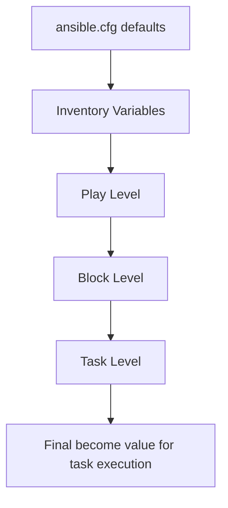

# How to Use Ansible become at Task Level vs Play Level

Author: [nawazdhandala](https://www.github.com/nawazdhandala)

Tags: Ansible, Privilege Escalation, Best Practices, DevOps

Description: Understand when to use Ansible become at the play level versus the task level and how scope inheritance works

---

One of the first decisions you make when writing an Ansible playbook is where to put the `become` directive. Do you set it at the play level so every task runs with elevated privileges? Or do you set it on individual tasks that actually need root access? The answer matters more than you might think. It affects security, debugging, file ownership, and the overall clarity of your playbooks.

This guide breaks down how become scope works in Ansible and gives you practical guidelines for choosing the right level.

## How Scope Inheritance Works

Ansible evaluates become directives in a hierarchy. More specific settings override more general ones.



A task-level `become` overrides a play-level `become`, which overrides inventory-level settings, which override ansible.cfg defaults. The most specific setting always wins.

## Play-Level become

Setting `become: true` at the play level means every task in that play runs with elevated privileges.

```yaml
# playbooks/play-level-become.yml
# All tasks run as root because become is set at the play level
---
- name: Full system setup
  hosts: webservers
  become: true
  become_user: root

  tasks:
    - name: Update package cache
      ansible.builtin.apt:
        update_cache: true

    - name: Install nginx
      ansible.builtin.apt:
        name: nginx
        state: present

    - name: Install certbot
      ansible.builtin.apt:
        name: certbot
        state: present

    - name: Enable nginx service
      ansible.builtin.service:
        name: nginx
        state: started
        enabled: true

    - name: Create web root directory
      ansible.builtin.file:
        path: /var/www/mysite
        state: directory
        owner: www-data
        mode: '0755'
```

This is clean and simple. When every task genuinely needs root access, play-level become keeps your playbook free of repetitive `become: true` on each task.

## Task-Level become

Setting `become` on individual tasks gives you fine-grained control.

```yaml
# playbooks/task-level-become.yml
# Only specific tasks get root access
---
- name: Application deployment
  hosts: webservers

  tasks:
    - name: Clone application code (as deploy user)
      ansible.builtin.git:
        repo: "https://github.com/myorg/myapp.git"
        dest: /home/deploy/myapp
        version: "{{ app_version }}"

    - name: Install Python dependencies (as deploy user)
      ansible.builtin.pip:
        requirements: /home/deploy/myapp/requirements.txt
        virtualenv: /home/deploy/myapp/venv

    - name: Copy systemd service file (needs root)
      ansible.builtin.copy:
        src: files/myapp.service
        dest: /etc/systemd/system/myapp.service
        mode: '0644'
      become: true

    - name: Reload systemd daemon (needs root)
      ansible.builtin.systemd:
        daemon_reload: true
      become: true

    - name: Start application service (needs root)
      ansible.builtin.systemd:
        name: myapp
        state: started
        enabled: true
      become: true

    - name: Verify application is responding (as deploy user)
      ansible.builtin.uri:
        url: http://localhost:8080/health
        status_code: 200
      retries: 5
      delay: 3
```

Here, only three out of six tasks need root access. The others run perfectly fine as the connecting user.

## Block-Level become

Blocks let you apply become to a group of related tasks without applying it to the entire play.

```yaml
# playbooks/block-level-become.yml
# Use blocks to group tasks that need the same privilege level
---
- name: Mixed privilege deployment
  hosts: webservers

  tasks:
    - name: Application tasks (no root needed)
      block:
        - name: Clone code
          ansible.builtin.git:
            repo: "https://github.com/myorg/myapp.git"
            dest: /home/deploy/myapp
            version: main

        - name: Install dependencies
          ansible.builtin.pip:
            requirements: /home/deploy/myapp/requirements.txt
            virtualenv: /home/deploy/myapp/venv

        - name: Create local config
          ansible.builtin.template:
            src: templates/app.conf.j2
            dest: /home/deploy/myapp/config/app.conf

    - name: System configuration (root needed)
      become: true
      block:
        - name: Install system packages
          ansible.builtin.apt:
            name:
              - libpq-dev
              - libssl-dev
            state: present

        - name: Configure logrotate
          ansible.builtin.copy:
            src: files/myapp-logrotate
            dest: /etc/logrotate.d/myapp
            mode: '0644'

        - name: Update systemd service
          ansible.builtin.template:
            src: templates/myapp.service.j2
            dest: /etc/systemd/system/myapp.service
          notify: restart myapp

  handlers:
    - name: restart myapp
      ansible.builtin.systemd:
        name: myapp
        state: restarted
        daemon_reload: true
      become: true
```

## Overriding Play-Level become at Task Level

You can disable become for specific tasks even when it is enabled at the play level.

```yaml
# playbooks/override-become.yml
# Play runs as root, but some tasks explicitly run as the SSH user
---
- name: System and user tasks
  hosts: webservers
  become: true

  tasks:
    - name: Install packages (runs as root, inherited)
      ansible.builtin.apt:
        name: nginx
        state: present

    - name: Check deploy user home (explicitly NOT as root)
      ansible.builtin.command: ls -la /home/deploy
      become: false
      register: home_check

    - name: Read deploy user's SSH keys (explicitly NOT as root)
      ansible.builtin.command: cat /home/deploy/.ssh/authorized_keys
      become: false
      register: ssh_keys

    - name: Restart nginx (runs as root, inherited)
      ansible.builtin.service:
        name: nginx
        state: restarted
```

## Why Task-Level become is Often Better

There are several concrete reasons to prefer task-level become over play-level.

### File Ownership Issues

When become is enabled, files created by Ansible modules are owned by the become_user (usually root). This can cause unexpected ownership.

```yaml
# Problem: files end up owned by root when become is at play level
---
- name: Problematic play
  hosts: webservers
  become: true

  tasks:
    - name: Create app config (owned by root, not deploy!)
      ansible.builtin.template:
        src: templates/app.conf.j2
        dest: /home/deploy/app.conf
        # Without explicit owner, this file is owned by root
```

```yaml
# Solution: Only become when needed, or specify ownership explicitly
---
- name: Better approach
  hosts: webservers

  tasks:
    - name: Create app config (owned by deploy)
      ansible.builtin.template:
        src: templates/app.conf.j2
        dest: /home/deploy/app.conf
      # No become, runs as deploy user, file owned by deploy
```

### Security Principle of Least Privilege

Running every task as root when only some need it increases the blast radius if something goes wrong.

```yaml
# Less secure: everything runs as root
---
- name: Deploy application
  hosts: webservers
  become: true
  tasks:
    - name: Download artifact (does not need root)
      ansible.builtin.get_url:
        url: https://releases.example.com/app-1.0.tar.gz
        dest: /tmp/app.tar.gz
    # If this URL is compromised, the download runs as root

# More secure: only escalate when necessary
---
- name: Deploy application
  hosts: webservers
  tasks:
    - name: Download artifact (runs as deploy user)
      ansible.builtin.get_url:
        url: https://releases.example.com/app-1.0.tar.gz
        dest: /tmp/app.tar.gz
    # If this URL is compromised, the download runs as an unprivileged user
```

### Debugging Clarity

When a task fails, knowing whether it ran with or without escalation helps narrow down the problem.

```yaml
# Clear: you can see exactly which tasks are privileged
---
- name: Transparent privilege usage
  hosts: webservers

  tasks:
    - name: Read config (no become = runs as deploy)
      ansible.builtin.slurp:
        src: /home/deploy/config.yml
      register: config

    - name: Write system config (become = runs as root)
      ansible.builtin.copy:
        content: "{{ config.content | b64decode }}"
        dest: /etc/myapp/config.yml
      become: true
```

## When to Use Play-Level become

Play-level become is the right choice when:

1. Every task in the play genuinely needs root access (system provisioning, package installation, service management)
2. You are writing a role that is always called with become (like a base system role)
3. The play is short and focused on a single privileged operation

```yaml
# Good use of play-level become: a focused system role
---
- name: Harden SSH configuration
  hosts: all
  become: true

  tasks:
    - name: Disable root login
      ansible.builtin.lineinfile:
        path: /etc/ssh/sshd_config
        regexp: '^PermitRootLogin'
        line: 'PermitRootLogin no'

    - name: Disable password authentication
      ansible.builtin.lineinfile:
        path: /etc/ssh/sshd_config
        regexp: '^PasswordAuthentication'
        line: 'PasswordAuthentication no'

    - name: Set idle timeout
      ansible.builtin.lineinfile:
        path: /etc/ssh/sshd_config
        regexp: '^ClientAliveInterval'
        line: 'ClientAliveInterval 300'

    - name: Restart SSH
      ansible.builtin.service:
        name: sshd
        state: restarted
```

Every task here modifies system files or manages services. Play-level become is appropriate and keeps the playbook clean.

## Summary of Guidelines

- Use **play-level become** when all or nearly all tasks need escalation
- Use **task-level become** when only some tasks need escalation (the more common case)
- Use **block-level become** to group related privileged tasks together
- Use `become: false` to explicitly disable escalation for specific tasks under a play-level become
- When in doubt, default to task-level become for better security and clarity

The right choice depends on your specific playbook. A system provisioning playbook that installs packages and configures services should probably use play-level become. An application deployment playbook that mostly operates as a regular user should use task-level become. The important thing is to be intentional about it rather than blindly setting `become: true` on everything.
