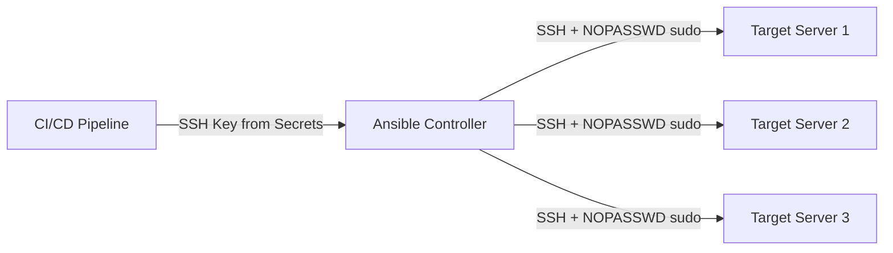

# How to Use Ansible become in CI/CD Environments

Author: [nawazdhandala](https://www.github.com/nawazdhandala)

Tags: Ansible, CI/CD, Privilege Escalation, DevOps, Automation

Description: Configure Ansible become for non-interactive CI/CD pipeline execution with secure credential handling and proper escalation

---

Running Ansible in a CI/CD pipeline is different from running it on your laptop. There is no human to type a sudo password. There is no interactive terminal for prompts. The pipeline runner might not have persistent SSH connections or a pre-configured ssh-agent. Every piece of the become configuration needs to work non-interactively and securely.

This guide covers the patterns and configurations for making Ansible become work reliably in CI/CD environments, from GitHub Actions to GitLab CI to Jenkins.

## The Non-Interactive Challenge

In CI/CD, several things that work on your laptop break down:

- `--ask-become-pass` and `-K` require an interactive terminal
- `vars_prompt` blocks the pipeline waiting for input that never comes
- SSH agents are not running by default
- Ansible Vault needs the vault password provided through automation-friendly means
- The pipeline runner has no pre-existing SSH configuration

Everything must be configured through environment variables, files, or command-line parameters.

## The Standard CI/CD Setup

The most reliable pattern is:

1. Target hosts have NOPASSWD sudo configured for the Ansible user
2. SSH keys are injected into the pipeline from CI/CD secrets
3. No vault password is needed at runtime (or it is provided via environment variable)



## GitHub Actions Configuration

Here is a complete GitHub Actions workflow that runs Ansible with become.

```yaml
# .github/workflows/deploy.yml
# Deploy using Ansible with become in GitHub Actions
name: Deploy with Ansible

on:
  push:
    branches: [main]
  workflow_dispatch:

jobs:
  deploy:
    runs-on: ubuntu-latest

    steps:
      - name: Checkout repository
        uses: actions/checkout@v4

      - name: Install Ansible
        run: |
          sudo apt-get update
          sudo apt-get install -y ansible

      - name: Setup SSH key
        run: |
          mkdir -p ~/.ssh
          echo "${{ secrets.DEPLOY_SSH_KEY }}" > ~/.ssh/deploy_key
          chmod 600 ~/.ssh/deploy_key
          ssh-keyscan -H ${{ secrets.TARGET_HOST }} >> ~/.ssh/known_hosts 2>/dev/null

      - name: Create vault password file
        run: |
          echo "${{ secrets.ANSIBLE_VAULT_PASSWORD }}" > .vault_pass
          chmod 600 .vault_pass

      - name: Run Ansible playbook
        env:
          ANSIBLE_HOST_KEY_CHECKING: "false"
          ANSIBLE_VAULT_PASSWORD_FILE: ".vault_pass"
        run: |
          ansible-playbook \
            -i inventory/production.ini \
            playbooks/deploy.yml \
            --private-key ~/.ssh/deploy_key \
            -v

      - name: Cleanup secrets
        if: always()
        run: |
          rm -f ~/.ssh/deploy_key .vault_pass
```

The corresponding ansible.cfg for this pipeline:

```ini
# ansible.cfg
[defaults]
remote_user = deploy
host_key_checking = false
timeout = 30
forks = 10

[privilege_escalation]
become = true
become_method = sudo
become_user = root
become_ask_pass = false

[ssh_connection]
ssh_args = -o ControlMaster=auto -o ControlPersist=60s -o StrictHostKeyChecking=no
pipelining = true
retries = 3
```

## GitLab CI Configuration

```yaml
# .gitlab-ci.yml
# Deploy using Ansible with become in GitLab CI
stages:
  - deploy

deploy_production:
  stage: deploy
  image: python:3.11-slim

  before_script:
    - pip install ansible pywinrm
    - mkdir -p ~/.ssh
    - echo "$DEPLOY_SSH_KEY" > ~/.ssh/deploy_key
    - chmod 600 ~/.ssh/deploy_key
    - echo "$ANSIBLE_VAULT_PASSWORD" > .vault_pass
    - chmod 600 .vault_pass

  script:
    - >
      ansible-playbook
      -i inventory/production.ini
      playbooks/deploy.yml
      --private-key ~/.ssh/deploy_key
      --vault-password-file .vault_pass
      -v

  after_script:
    - rm -f ~/.ssh/deploy_key .vault_pass

  variables:
    ANSIBLE_HOST_KEY_CHECKING: "false"
    ANSIBLE_FORCE_COLOR: "true"

  only:
    - main

  environment:
    name: production
```

## Jenkins Pipeline Configuration

```groovy
// Jenkinsfile
// Deploy using Ansible with become in Jenkins
pipeline {
    agent any

    environment {
        ANSIBLE_HOST_KEY_CHECKING = 'false'
        ANSIBLE_FORCE_COLOR = 'true'
    }

    stages {
        stage('Setup') {
            steps {
                // Write SSH key from Jenkins credentials
                withCredentials([
                    sshUserPrivateKey(
                        credentialsId: 'deploy-ssh-key',
                        keyFileVariable: 'SSH_KEY_FILE',
                        usernameVariable: 'SSH_USER'
                    ),
                    string(
                        credentialsId: 'ansible-vault-pass',
                        variable: 'VAULT_PASS'
                    )
                ]) {
                    sh '''
                        echo "$VAULT_PASS" > .vault_pass
                        chmod 600 .vault_pass
                        ansible-playbook \
                            -i inventory/production.ini \
                            playbooks/deploy.yml \
                            --private-key "$SSH_KEY_FILE" \
                            --vault-password-file .vault_pass \
                            -v
                    '''
                }
            }
        }
    }

    post {
        always {
            sh 'rm -f .vault_pass'
        }
    }
}
```

## Handling become Passwords in CI/CD

If your target hosts require a sudo password (NOPASSWD is not configured), you can pass it through environment variables.

```bash
# Set the become password from a CI/CD secret
export ANSIBLE_BECOME_PASSWORD="${SUDO_PASSWORD}"
ansible-playbook playbooks/deploy.yml
```

Or create a temporary become password file:

```bash
# Write the become password to a temp file
echo "${SUDO_PASSWORD}" > /tmp/become_pass
chmod 600 /tmp/become_pass

# Use it with the playbook
ansible-playbook playbooks/deploy.yml \
  --become-password-file /tmp/become_pass

# Clean up
rm -f /tmp/become_pass
```

However, the better approach is to configure NOPASSWD sudo on your target hosts for the CI/CD service account.

## Playbook Designed for CI/CD

A CI/CD-friendly playbook avoids interactive prompts and handles failures gracefully.

```yaml
# playbooks/cicd-deploy.yml
# Designed for non-interactive CI/CD execution
---
- name: CI/CD deployment
  hosts: production
  become: true
  serial: "{{ serial_count | default('25%') }}"
  max_fail_percentage: 0

  pre_tasks:
    - name: Verify connectivity before starting
      ansible.builtin.wait_for_connection:
        timeout: 30

    - name: Gather minimal facts
      ansible.builtin.setup:
        gather_subset: min

  tasks:
    - name: Pull latest application code
      ansible.builtin.git:
        repo: "{{ app_repo }}"
        dest: /opt/myapp/current
        version: "{{ deploy_version }}"
        force: true
      become_user: appuser

    - name: Install dependencies
      ansible.builtin.pip:
        requirements: /opt/myapp/current/requirements.txt
        virtualenv: /opt/myapp/venv
      become_user: appuser

    - name: Run database migrations
      ansible.builtin.command: /opt/myapp/venv/bin/python manage.py migrate --noinput
      args:
        chdir: /opt/myapp/current
      become_user: appuser
      register: migration_result

    - name: Restart application
      ansible.builtin.systemd:
        name: myapp
        state: restarted
      become_user: root

    - name: Wait for application to become healthy
      ansible.builtin.uri:
        url: "http://localhost:{{ app_port | default(8080) }}/health"
        status_code: 200
      register: health_check
      retries: 10
      delay: 5
      until: health_check.status == 200

  post_tasks:
    - name: Report deployment status
      ansible.builtin.debug:
        msg: "Deployment of {{ deploy_version }} to {{ inventory_hostname }} succeeded"
```

## Secure Credential Handling Patterns

Never expose credentials in CI/CD logs.

```yaml
# playbooks/secure-creds.yml
# Handle credentials securely in CI/CD
---
- name: Secure credential handling
  hosts: all
  become: true

  tasks:
    - name: Deploy database credentials
      ansible.builtin.template:
        src: templates/db-config.yml.j2
        dest: /opt/myapp/config/database.yml
        mode: '0600'
        owner: appuser
      become_user: root
      no_log: true

    - name: Set application secrets
      ansible.builtin.copy:
        content: "{{ vault_app_secret_key }}"
        dest: /opt/myapp/config/secret.key
        mode: '0600'
        owner: appuser
      become_user: root
      no_log: true
```

The `no_log: true` directive prevents Ansible from printing the task parameters (which contain secrets) in the CI/CD output.

## Multi-Environment CI/CD

Handle different environments with different become configurations.

```yaml
# .github/workflows/deploy.yml
# Multi-environment deployment with different become settings
name: Deploy

on:
  workflow_dispatch:
    inputs:
      environment:
        description: 'Target environment'
        required: true
        type: choice
        options:
          - staging
          - production

jobs:
  deploy:
    runs-on: ubuntu-latest
    environment: ${{ github.event.inputs.environment }}

    steps:
      - uses: actions/checkout@v4

      - name: Install Ansible
        run: pip install ansible

      - name: Setup SSH
        run: |
          mkdir -p ~/.ssh
          echo "${{ secrets.DEPLOY_SSH_KEY }}" > ~/.ssh/deploy_key
          chmod 600 ~/.ssh/deploy_key

      - name: Deploy to ${{ github.event.inputs.environment }}
        env:
          ANSIBLE_VAULT_PASSWORD_FILE: .vault_pass
        run: |
          echo "${{ secrets.VAULT_PASSWORD }}" > .vault_pass
          ansible-playbook \
            -i inventory/${{ github.event.inputs.environment }}.ini \
            playbooks/deploy.yml \
            --private-key ~/.ssh/deploy_key \
            -e "deploy_version=${{ github.sha }}" \
            -v
```

## Troubleshooting CI/CD become Issues

When become fails in CI/CD, the debugging process is different because you cannot SSH into the pipeline runner interactively.

```yaml
# Add debugging steps to your pipeline
- name: Debug Ansible configuration
  run: |
    ansible --version
    ansible-config dump --only-changed
    ansible-inventory -i inventory/production.ini --list | head -50

- name: Test connectivity
  run: |
    ansible all -i inventory/production.ini \
      --private-key ~/.ssh/deploy_key \
      -m ping -v

- name: Test become
  run: |
    ansible all -i inventory/production.ini \
      --private-key ~/.ssh/deploy_key \
      -m command -a "whoami" \
      --become -vvv
```

Common CI/CD-specific issues:

- SSH key not having the right permissions (must be 600)
- Missing `known_hosts` entries causing SSH to hang waiting for confirmation
- The CI runner's Python version conflicting with Ansible requirements
- Pipeline timeout killing Ansible before long-running tasks complete
- Vault password file created with a trailing newline that causes decryption to fail

For the vault password newline issue:

```bash
# Write vault password without trailing newline
printf '%s' "$ANSIBLE_VAULT_PASSWORD" > .vault_pass
```

Running Ansible become in CI/CD boils down to three things: NOPASSWD sudo on target hosts, SSH keys injected from secrets, and no interactive prompts anywhere in the pipeline. Get those three right and your automated deployments will run smoothly.
