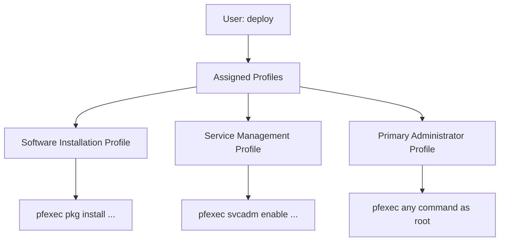

# How to Use Ansible become_method with pfexec

Author: [nawazdhandala](https://www.github.com/nawazdhandala)

Tags: Ansible, Solaris, pfexec, Privilege Escalation, RBAC

Description: Configure Ansible to use pfexec for privilege escalation on Oracle Solaris and illumos-based systems with RBAC

---

If you manage Oracle Solaris or illumos-based systems (like OmniOS, SmartOS, or OpenIndiana), you are likely familiar with `pfexec`. It is the Solaris way of executing commands with elevated privileges using the Role-Based Access Control (RBAC) framework. Unlike sudo, which grants all-or-nothing root access, pfexec uses fine-grained profiles and authorizations to give users exactly the privileges they need.

Ansible supports `pfexec` as a `become_method`, so you can manage Solaris systems without installing sudo.

## Understanding pfexec and Solaris RBAC

Solaris RBAC works through a hierarchy of concepts:

- **Authorizations**: Granular permissions (like `solaris.smf.manage`)
- **Execution Profiles**: Collections of commands with specific privileges
- **Roles**: Named collections of profiles assigned to users

When a user runs `pfexec command`, the RBAC framework checks whether that user has a profile that grants permission to run that command with elevated privileges.



## Setting Up RBAC for Ansible

Before Ansible can use pfexec, the remote Solaris host needs to grant the appropriate profiles to your Ansible user.

```bash
# On the Solaris host, assign the Primary Administrator profile to the deploy user
# This gives full root-equivalent access through pfexec
usermod -P 'Primary Administrator' deploy

# Verify the assignment
profiles deploy
# Output: Primary Administrator
#         Basic Solaris User
#         All
```

For more restrictive access, assign specific profiles instead of Primary Administrator.

```bash
# Assign only the profiles Ansible needs
usermod -P 'Software Installation,Service Management,File System Management' deploy

# Verify
profiles deploy
```

## Configuring Ansible for pfexec

Set `become_method` to `pfexec` in your Ansible configuration.

```ini
# ansible.cfg
[privilege_escalation]
become = true
become_method = pfexec
become_user = root
become_ask_pass = false
```

In your inventory:

```ini
# inventory/hosts.ini
[solaris_servers]
sol1 ansible_host=192.168.1.60 ansible_user=deploy
sol2 ansible_host=192.168.1.61 ansible_user=deploy

[solaris_servers:vars]
ansible_become=true
ansible_become_method=pfexec
ansible_become_user=root
ansible_python_interpreter=/usr/bin/python3
```

Note that the Python interpreter path on Solaris may differ from Linux. Check your system for the correct path.

## A Complete Playbook for Solaris

Here is a playbook that manages a Solaris system using pfexec.

```yaml
# playbooks/solaris-setup.yml
# Configure a Solaris server using pfexec for privilege escalation
---
- name: Setup Solaris server
  hosts: solaris_servers
  become: true
  become_method: pfexec
  gather_facts: true

  tasks:
    - name: Display OS information
      ansible.builtin.debug:
        msg: "Managing {{ ansible_distribution }} {{ ansible_distribution_version }}"

    - name: Install IPS packages
      ansible.builtin.command: "pkg install {{ item }}"
      loop:
        - developer/gcc
        - runtime/python-39
        - network/rsync
      register: pkg_result
      changed_when: "'installed' in pkg_result.stdout"
      failed_when: pkg_result.rc != 0 and 'already installed' not in pkg_result.stderr

    - name: Create application directory
      ansible.builtin.file:
        path: /opt/myapp
        state: directory
        owner: deploy
        group: staff
        mode: '0755'

    - name: Configure NTP service
      ansible.builtin.copy:
        content: |
          server 0.pool.ntp.org
          server 1.pool.ntp.org
          server 2.pool.ntp.org
        dest: /etc/inet/ntp.conf
        mode: '0644'
      notify: restart ntp

    - name: Enable NTP service
      ansible.builtin.command: svcadm enable svc:/network/ntp:default
      changed_when: false

  handlers:
    - name: restart ntp
      ansible.builtin.command: svcadm restart svc:/network/ntp:default
```

## Managing SMF Services with pfexec

Solaris uses the Service Management Facility (SMF) instead of systemd. Here is how to manage SMF services through Ansible with pfexec.

```yaml
# playbooks/solaris-services.yml
# Manage SMF services on Solaris using pfexec
---
- name: Manage Solaris services
  hosts: solaris_servers
  become: true
  become_method: pfexec

  tasks:
    - name: List running services
      ansible.builtin.command: svcs -a
      register: all_services
      changed_when: false

    - name: Enable SSH service
      ansible.builtin.command: svcadm enable svc:/network/ssh:default
      when: "'ssh' not in all_services.stdout"

    - name: Configure DNS client
      ansible.builtin.template:
        src: templates/resolv.conf.j2
        dest: /etc/resolv.conf
        mode: '0644'
      notify: restart dns-client

    - name: Deploy custom SMF manifest
      ansible.builtin.copy:
        src: files/myapp-manifest.xml
        dest: /lib/svc/manifest/application/myapp.xml
        mode: '0444'
      notify: import smf manifest

  handlers:
    - name: restart dns-client
      ansible.builtin.command: svcadm restart svc:/network/dns/client:default

    - name: import smf manifest
      ansible.builtin.command: svccfg import /lib/svc/manifest/application/myapp.xml
```

## RBAC Profile Configuration

For tighter security, create a custom RBAC profile specifically for Ansible operations.

```bash
# On the Solaris host, create a custom execution profile

# Add profile definition to /etc/security/prof_attr
echo "Ansible Automation:::Profile for Ansible automation:" >> /etc/security/prof_attr

# Add command authorizations to /etc/security/exec_attr
cat >> /etc/security/exec_attr << 'EOF'
Ansible Automation:solaris:cmd:::/usr/bin/pkg:uid=0
Ansible Automation:solaris:cmd:::/usr/sbin/svcadm:uid=0
Ansible Automation:solaris:cmd:::/usr/bin/cp:uid=0
Ansible Automation:solaris:cmd:::/usr/bin/mv:uid=0
Ansible Automation:solaris:cmd:::/usr/bin/mkdir:uid=0
Ansible Automation:solaris:cmd:::/usr/bin/chmod:uid=0
Ansible Automation:solaris:cmd:::/usr/bin/chown:uid=0
EOF

# Assign the profile to the deploy user
usermod -P 'Ansible Automation' deploy
```

This approach gives the deploy user root-level access only for the specific commands Ansible needs, which is much more secure than granting the Primary Administrator profile.

## Task-Level become_method

You can set the become_method per task, which is useful if some tasks need pfexec and others need a different method.

```yaml
# playbooks/mixed-escalation.yml
# Mix pfexec with other escalation methods
---
- name: Mixed privilege escalation
  hosts: solaris_servers

  tasks:
    - name: Task using pfexec
      ansible.builtin.command: whoami
      become: true
      become_method: pfexec
      register: pfexec_user

    - name: Task without escalation
      ansible.builtin.command: whoami
      register: normal_user

    - name: Display users
      ansible.builtin.debug:
        msg: "pfexec user: {{ pfexec_user.stdout }}, normal user: {{ normal_user.stdout }}"
```

## Using pfexec on illumos Systems

The pfexec configuration on illumos derivatives (OmniOS, SmartOS) is nearly identical to Solaris.

```ini
# inventory for illumos systems
[illumos_servers]
omnios1 ansible_host=192.168.1.70 ansible_user=deploy
smartos1 ansible_host=192.168.1.71 ansible_user=deploy

[illumos_servers:vars]
ansible_become=true
ansible_become_method=pfexec
ansible_python_interpreter=/opt/local/bin/python3
```

On SmartOS, the Python interpreter is typically in `/opt/local/bin/` since packages are managed by pkgin.

```yaml
# playbooks/smartos-setup.yml
# Manage a SmartOS zone using pfexec
---
- name: Configure SmartOS zone
  hosts: illumos_servers
  become: true
  become_method: pfexec

  tasks:
    - name: Install packages via pkgin
      ansible.builtin.command: "pkgin -y install {{ item }}"
      loop:
        - nginx
        - nodejs
        - git
      register: pkgin_result
      changed_when: "'installed' in pkgin_result.stdout"
      failed_when: pkgin_result.rc != 0 and 'already installed' not in pkgin_result.stdout
```

## Troubleshooting pfexec Issues

```bash
# Test pfexec manually on the Solaris host
ssh deploy@192.168.1.60 "pfexec whoami"
# Should output: root

# Check assigned profiles
ssh deploy@192.168.1.60 "profiles"

# Check what commands a profile allows
ssh deploy@192.168.1.60 "profiles -l 'Primary Administrator'"

# Run Ansible with verbose output
ansible solaris_servers -m ping --become --become-method=pfexec -vvvv
```

Common errors:

```
# "pfexec: not found"
# pfexec is not in PATH or the system is not Solaris/illumos
# Fix: Verify the system type and pfexec location (/usr/bin/pfexec)

# "pfexec: user deploy does not have required profile"
# RBAC profiles not assigned to the user
# Fix: Assign the appropriate profile with usermod -P

# Python not found
# Solaris does not include Python by default in older versions
# Fix: Install from IPS (pkg install runtime/python-39) and set ansible_python_interpreter
```

## pfexec vs sudo on Solaris

While you can install sudo on Solaris, pfexec is the native approach and integrates with the RBAC framework. Using pfexec means:

- No additional software to install and maintain
- Integration with Solaris auditing
- Fine-grained privilege control through execution profiles
- Consistent with how Solaris administrators expect the system to work

For Ansible automation on Solaris and illumos, pfexec is the natural choice. Setting `become_method: pfexec` is all you need to make your playbooks work with the native privilege escalation mechanism.
