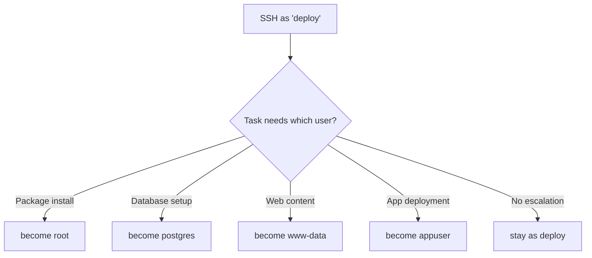

# How to Use Ansible become with Different Users for Different Tasks

Author: [nawazdhandala](https://www.github.com/nawazdhandala)

Tags: Ansible, Privilege Escalation, Linux, Multi-User, DevOps

Description: Configure Ansible playbooks to switch between multiple system users using become for proper service isolation and security

---

Real-world servers do not run everything as root. A well-configured server has separate user accounts for each service: postgres for the database, www-data for the web server, appuser for your application, and root for system-level operations. When managing these servers with Ansible, you need the ability to switch between these users within a single playbook run. The `become_user` directive, combined with task-level become, makes this possible.

This guide shows how to build playbooks that seamlessly switch between multiple users for different tasks.

## The Multi-User Pattern

Here is the general pattern: connect as a regular user via SSH, then use `become` to switch to whichever user each task requires.



## Basic Multi-User Playbook

Here is a straightforward example that uses different users for different operations.

```yaml
# playbooks/multi-user-deploy.yml
# Deploy a full stack application with proper user isolation
---
- name: Deploy full stack application
  hosts: app_servers

  tasks:
    - name: Install system packages
      ansible.builtin.apt:
        name:
          - nginx
          - postgresql
          - python3-pip
          - python3-venv
        state: present
        update_cache: true
      become: true
      become_user: root

    - name: Create application database
      community.postgresql.postgresql_db:
        name: myapp
        encoding: UTF-8
      become: true
      become_user: postgres

    - name: Create database user
      community.postgresql.postgresql_user:
        db: myapp
        name: myapp_user
        password: "{{ db_password }}"
        priv: ALL
      become: true
      become_user: postgres

    - name: Deploy application code
      ansible.builtin.git:
        repo: "https://github.com/myorg/myapp.git"
        dest: /opt/myapp/current
        version: "{{ app_version }}"
      become: true
      become_user: appuser

    - name: Install Python dependencies
      ansible.builtin.pip:
        requirements: /opt/myapp/current/requirements.txt
        virtualenv: /opt/myapp/venv
      become: true
      become_user: appuser

    - name: Deploy nginx configuration
      ansible.builtin.template:
        src: templates/nginx-site.conf.j2
        dest: /etc/nginx/sites-available/myapp.conf
        mode: '0644'
      become: true
      become_user: root
      notify: reload nginx

    - name: Deploy static assets
      ansible.builtin.copy:
        src: files/static/
        dest: /var/www/myapp/static/
        mode: '0644'
      become: true
      become_user: www-data

    - name: Restart application
      ansible.builtin.systemd:
        name: myapp
        state: restarted
      become: true
      become_user: root

  handlers:
    - name: reload nginx
      ansible.builtin.service:
        name: nginx
        state: reloaded
      become: true
      become_user: root
```

## Using Blocks to Group Tasks by User

Blocks make the code cleaner when you have multiple consecutive tasks for the same user.

```yaml
# playbooks/grouped-by-user.yml
# Group tasks by user context using blocks
---
- name: Deploy with grouped user contexts
  hosts: app_servers

  tasks:
    - name: System setup (as root)
      become: true
      become_user: root
      block:
        - name: Install required packages
          ansible.builtin.apt:
            name:
              - nginx
              - postgresql-client
              - redis-tools
            state: present

        - name: Create application user
          ansible.builtin.user:
            name: appuser
            system: true
            shell: /bin/bash
            home: /opt/myapp

        - name: Create log directory
          ansible.builtin.file:
            path: /var/log/myapp
            state: directory
            owner: appuser
            group: appuser
            mode: '0755'

    - name: Database setup (as postgres)
      become: true
      become_user: postgres
      block:
        - name: Create application database
          community.postgresql.postgresql_db:
            name: myapp_production

        - name: Run database migrations
          ansible.builtin.command: psql -d myapp_production -f /opt/myapp/current/sql/migrations.sql

        - name: Grant permissions
          community.postgresql.postgresql_privs:
            database: myapp_production
            type: table
            objs: ALL_IN_SCHEMA
            privs: SELECT,INSERT,UPDATE,DELETE
            roles: myapp_user

    - name: Application setup (as appuser)
      become: true
      become_user: appuser
      block:
        - name: Clone application code
          ansible.builtin.git:
            repo: "https://github.com/myorg/myapp.git"
            dest: /opt/myapp/current
            version: "{{ release_tag }}"

        - name: Create virtual environment
          ansible.builtin.pip:
            requirements: /opt/myapp/current/requirements.txt
            virtualenv: /opt/myapp/venv

        - name: Generate configuration
          ansible.builtin.template:
            src: templates/app-config.yml.j2
            dest: /opt/myapp/current/config.yml
            mode: '0600'
```

## Roles with Different become Users

When creating roles, you can set become_user at the role level or let the calling playbook decide.

```yaml
# roles/postgresql/tasks/main.yml
# Database role - tasks run as postgres user
---
- name: Create databases
  community.postgresql.postgresql_db:
    name: "{{ item.name }}"
    encoding: "{{ item.encoding | default('UTF-8') }}"
  loop: "{{ postgresql_databases }}"
  become: true
  become_user: postgres

- name: Create database users
  community.postgresql.postgresql_user:
    name: "{{ item.name }}"
    password: "{{ item.password }}"
    db: "{{ item.database }}"
    priv: "{{ item.priv | default('ALL') }}"
  loop: "{{ postgresql_users }}"
  become: true
  become_user: postgres
  no_log: true
```

```yaml
# roles/nginx/tasks/main.yml
# Nginx role - tasks run as root
---
- name: Install nginx
  ansible.builtin.apt:
    name: nginx
    state: present
  become: true
  become_user: root

- name: Deploy site configuration
  ansible.builtin.template:
    src: site.conf.j2
    dest: "/etc/nginx/sites-available/{{ nginx_site_name }}.conf"
    mode: '0644'
  become: true
  become_user: root
  notify: reload nginx
```

Call the roles from your playbook.

```yaml
# playbooks/full-deploy.yml
# Use roles that internally manage their own user contexts
---
- name: Full stack deployment
  hosts: app_servers

  roles:
    - role: postgresql
      vars:
        postgresql_databases:
          - name: myapp
        postgresql_users:
          - name: myapp_user
            password: "{{ vault_db_password }}"
            database: myapp

    - role: nginx
      vars:
        nginx_site_name: myapp

    - role: application
      vars:
        app_version: "{{ release_tag }}"
```

## Variable-Driven User Switching

For maximum flexibility, use variables to determine which user runs each task.

```yaml
# playbooks/variable-users.yml
# Define user contexts as variables for flexibility
---
- name: Deploy with variable user contexts
  hosts: app_servers

  vars:
    system_user: root
    db_user: postgres
    app_user: myapp
    web_user: www-data

  tasks:
    - name: System package installation
      ansible.builtin.apt:
        name: "{{ item }}"
        state: present
      loop:
        - python3
        - python3-pip
      become: true
      become_user: "{{ system_user }}"

    - name: Database operations
      ansible.builtin.command: "psql -c '{{ item }}'"
      loop:
        - "CREATE DATABASE IF NOT EXISTS mydb;"
        - "GRANT ALL ON DATABASE mydb TO myapp;"
      become: true
      become_user: "{{ db_user }}"

    - name: Application deployment
      ansible.builtin.git:
        repo: "https://github.com/myorg/myapp.git"
        dest: "/home/{{ app_user }}/app"
        version: main
      become: true
      become_user: "{{ app_user }}"
```

## Handling sudoers for Multi-User become

The SSH user (deploy) needs sudo permission to become each target user. Configure sudoers accordingly.

```
# /etc/sudoers.d/ansible-multi-user
# Allow deploy to become multiple specific users

# Become root (for system tasks)
deploy ALL=(root) NOPASSWD: ALL

# Become postgres (for database tasks)
deploy ALL=(postgres) NOPASSWD: ALL

# Become www-data (for web content tasks)
deploy ALL=(www-data) NOPASSWD: ALL

# Become appuser (for application tasks)
deploy ALL=(appuser) NOPASSWD: ALL
```

Here is a playbook to set this up automatically.

```yaml
# playbooks/setup-sudoers.yml
# Configure sudoers for multi-user become
---
- name: Configure multi-user sudo access
  hosts: all
  become: true

  vars:
    ansible_ssh_user: deploy
    allowed_become_users:
      - root
      - postgres
      - www-data
      - appuser
      - redis

  tasks:
    - name: Create sudoers file for Ansible
      ansible.builtin.template:
        src: templates/ansible-sudoers.j2
        dest: /etc/sudoers.d/ansible
        mode: '0440'
        validate: "visudo -cf %s"
```

```jinja2
# templates/ansible-sudoers.j2
# Sudoers configuration for Ansible multi-user access

{{ ansible_ssh_user }} ALL=({{ user }}) NOPASSWD: ALL

```

## Common Pitfalls

### Home Directory Access

When you become a user, the HOME environment variable changes. Tasks that reference `~` or `$HOME` will point to the new user's home directory.

```yaml
# This creates the file in /root/ when become_user is root
- name: Potential surprise
  ansible.builtin.copy:
    content: "test"
    dest: ~/test.txt
  become: true
  become_user: root
# Result: /root/test.txt

# Use absolute paths to avoid ambiguity
- name: Explicit path
  ansible.builtin.copy:
    content: "test"
    dest: /home/appuser/test.txt
  become: true
  become_user: root
```

### File Ownership

Files created by a task are owned by the become_user unless you explicitly set the owner.

```yaml
# This file is owned by root, not appuser
- name: Wrong ownership
  ansible.builtin.template:
    src: app.conf.j2
    dest: /opt/myapp/app.conf
  become: true
  become_user: root

# Fix: either set owner explicitly, or become the correct user
- name: Correct ownership via become_user
  ansible.builtin.template:
    src: app.conf.j2
    dest: /opt/myapp/app.conf
  become: true
  become_user: appuser

# Or set owner explicitly
- name: Correct ownership via owner parameter
  ansible.builtin.template:
    src: app.conf.j2
    dest: /opt/myapp/app.conf
    owner: appuser
    group: appuser
  become: true
  become_user: root
```

## Debugging Multi-User Playbooks

Add debug tasks to verify which user is running each section.

```yaml
- name: Debug user context
  ansible.builtin.command: id
  register: user_context
  become: true
  become_user: "{{ target_user }}"

- name: Show context
  ansible.builtin.debug:
    msg: "Context: {{ user_context.stdout }}"
```

Switching between users within a single Ansible playbook is a powerful capability that lets you respect service isolation boundaries on your servers. The key is being explicit about which user each task runs as and making sure your sudoers configuration allows the transitions your playbook needs.
