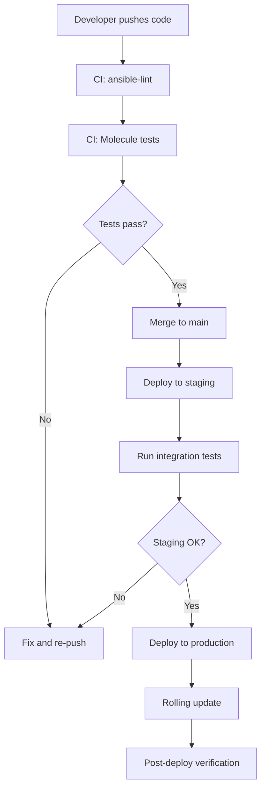

# How to Use Ansible Best Practices for Large Projects

Author: [nawazdhandala](https://www.github.com/nawazdhandala)

Tags: Ansible, DevOps, Best Practices, Enterprise Automation

Description: A comprehensive guide to Ansible best practices for large-scale projects covering roles, testing, performance, and team collaboration strategies.

---

When an Ansible project grows past a dozen playbooks and a handful of roles, things can get messy fast. What worked for a small team managing 20 servers falls apart when you are orchestrating hundreds of nodes across multiple environments. I have been through that transition more than once, and these are the practices that kept things manageable.

## Use Roles for Everything

The single most impactful practice is wrapping all logic in roles. Playbooks should be thin wrappers that map roles to host groups. Nothing more.

```yaml
# playbooks/webservers.yml
# Thin playbook that only maps roles to hosts
- name: Configure web servers
  hosts: webservers
  become: yes
  roles:
    - role: common
      tags: [common]
    - role: security_baseline
      tags: [security]
    - role: nginx
      tags: [nginx]
    - role: app_deploy
      tags: [deploy]
    - role: monitoring_agent
      tags: [monitoring]
```

Each role handles one thing. The `common` role installs base packages and configures SSH. The `security_baseline` role handles firewall rules and hardening. The `nginx` role manages the web server. This separation means you can test, update, and debug each concern independently.

## Pin Your Versions

In large projects, you need reproducible builds. Pin every external dependency:

```yaml
# requirements.yml
# Pin exact versions for reproducibility
collections:
  - name: community.general
    version: 8.2.0
  - name: ansible.posix
    version: 1.5.4
  - name: community.crypto
    version: 2.16.0

roles:
  - name: geerlingguy.docker
    version: 6.1.0
  - name: geerlingguy.nginx
    version: 3.1.4
```

Also pin Ansible itself in your project:

```
# requirements.txt
# Pin Ansible version for consistency across the team
ansible-core==2.16.2
ansible-lint==6.22.1
molecule==6.0.3
```

## Implement Variable Precedence Properly

Ansible has over 20 levels of variable precedence. In large projects, use only a few well-defined layers:

```yaml
# roles/nginx/defaults/main.yml
# Lowest priority - safe defaults that always work
nginx_worker_processes: auto
nginx_worker_connections: 1024
nginx_keepalive_timeout: 65
nginx_client_max_body_size: 10m
nginx_ssl_protocols: "TLSv1.2 TLSv1.3"
```

```yaml
# inventories/production/group_vars/webservers.yml
# Override defaults per environment and group
nginx_worker_connections: 4096
nginx_client_max_body_size: 50m
nginx_ssl_certificate: /etc/ssl/certs/prod.crt
nginx_ssl_certificate_key: /etc/ssl/private/prod.key
```

```yaml
# inventories/production/host_vars/web01.yml
# Host-specific overrides only when absolutely necessary
nginx_worker_processes: 8  # This host has 8 cores
```

Avoid using `vars` in playbooks or `set_fact` for configuration values. Those are harder to track and override.

## Use Tags Strategically

Tags let you run subsets of your playbook. Define a clear tagging strategy:

```yaml
# roles/app_deploy/tasks/main.yml
# Tag tasks by function so operators can run partial deploys
- name: Pull latest application code
  ansible.builtin.git:
    repo: "{{ app_repo }}"
    dest: "{{ app_dir }}"
    version: "{{ app_version }}"
  tags: [deploy, code]

- name: Install application dependencies
  ansible.builtin.pip:
    requirements: "{{ app_dir }}/requirements.txt"
    virtualenv: "{{ app_venv }}"
  tags: [deploy, dependencies]

- name: Run database migrations
  ansible.builtin.command:
    cmd: "{{ app_venv }}/bin/python manage.py migrate"
    chdir: "{{ app_dir }}"
  tags: [deploy, migrations]
  run_once: true

- name: Restart application service
  ansible.builtin.systemd:
    name: "{{ app_service }}"
    state: restarted
  tags: [deploy, restart]
```

## Break Playbooks into Stages

For complex deployments, use multiple playbooks orchestrated by a master playbook:

```yaml
# playbooks/full-deploy.yml
# Orchestrate a full deployment across all tiers
- name: Pre-flight checks
  import_playbook: preflight.yml

- name: Deploy database changes
  import_playbook: deploy-database.yml

- name: Deploy application servers (rolling)
  import_playbook: deploy-app.yml

- name: Deploy load balancer config
  import_playbook: deploy-lb.yml

- name: Post-deployment verification
  import_playbook: verify.yml
```

## Use ansible-lint and CI

Every commit should pass `ansible-lint`. Set it up in your CI pipeline:

```yaml
# .github/workflows/ansible-lint.yml
# Lint all Ansible code on every push and PR
name: Ansible Lint
on: [push, pull_request]

jobs:
  lint:
    runs-on: ubuntu-latest
    steps:
      - uses: actions/checkout@v4
      - name: Install dependencies
        run: pip install ansible-lint ansible-core
      - name: Run ansible-lint
        run: ansible-lint playbooks/ roles/
```

## Performance Optimization

Large inventories need performance tuning. Configure these in `ansible.cfg`:

```ini
# ansible.cfg
[defaults]
# Increase parallelism for large inventories
forks = 50

# Gather only the facts you need
gathering = smart
fact_caching = jsonfile
fact_caching_connection = /tmp/ansible_facts_cache
fact_caching_timeout = 7200

# Use mitogen for faster execution (if installed)
# strategy_plugins = /path/to/mitogen/ansible_mitogen/plugins/strategy
# strategy = mitogen_linear

[ssh_connection]
# Reuse SSH connections
pipelining = true
ssh_args = -o ControlMaster=auto -o ControlPersist=60s -o PreferredAuthentications=publickey
```

Also be selective with fact gathering in playbooks:

```yaml
# Only gather the facts you actually need
- name: Configure application servers
  hosts: appservers
  gather_facts: false
  pre_tasks:
    - name: Gather only network and hardware facts
      ansible.builtin.setup:
        gather_subset:
          - network
          - hardware
```

## Implement Role Testing with Molecule

Every role should have Molecule tests:

```yaml
# roles/nginx/molecule/default/molecule.yml
# Molecule test configuration for the nginx role
dependency:
  name: galaxy
driver:
  name: docker
platforms:
  - name: ubuntu-test
    image: ubuntu:22.04
    pre_build_image: true
    privileged: true
    command: /sbin/init
provisioner:
  name: ansible
verifier:
  name: ansible
```

```yaml
# roles/nginx/molecule/default/converge.yml
# Apply the role during testing
- name: Converge
  hosts: all
  become: yes
  vars:
    nginx_worker_connections: 512
  roles:
    - nginx
```

```yaml
# roles/nginx/molecule/default/verify.yml
# Verify the role did what we expect
- name: Verify
  hosts: all
  tasks:
    - name: Check nginx is installed
      ansible.builtin.command: nginx -v
      changed_when: false

    - name: Check nginx is running
      ansible.builtin.service_facts:

    - name: Assert nginx service is active
      ansible.builtin.assert:
        that:
          - "'nginx.service' in services"
          - "services['nginx.service'].state == 'running'"
```

## Deployment Flow for Large Projects



## Use Inventory Plugins for Dynamic Environments

Static inventory files do not scale. Use dynamic inventory for cloud environments:

```yaml
# inventories/production/aws_ec2.yml
# Dynamic inventory from AWS EC2
plugin: amazon.aws.aws_ec2
regions:
  - us-east-1
  - us-west-2
keyed_groups:
  - key: tags.Environment
    prefix: env
  - key: tags.Role
    prefix: role
  - key: placement.availability_zone
    prefix: az
filters:
  instance-state-name: running
  "tag:ManagedBy": ansible
compose:
  ansible_host: private_ip_address
```

## Summary

Large Ansible projects require discipline. Pin your versions. Use roles for everything. Keep playbooks thin. Lint and test in CI. Optimize SSH and fact gathering for performance. Use dynamic inventory when static files become unmanageable. These practices are not optional for large teams; they are survival mechanisms that keep your infrastructure automation reliable and your team productive.
