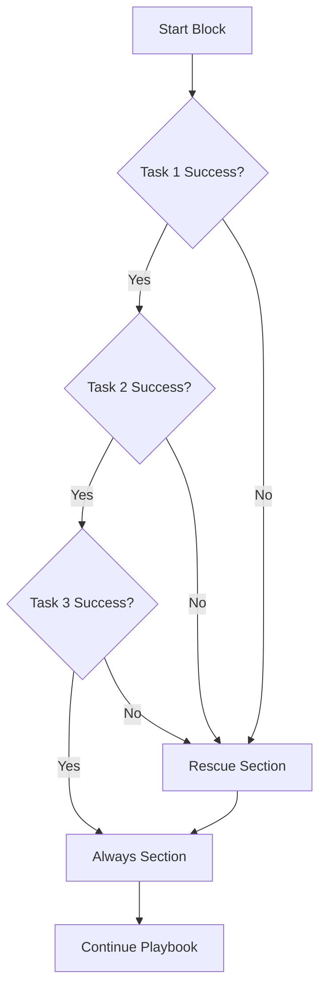

# How to Use Ansible Block/Rescue/Always for Error Handling

Author: [nawazdhandala](https://www.github.com/nawazdhandala)

Tags: Ansible, Error Handling, Block, Automation

Description: Learn how to use Ansible block, rescue, and always sections to implement structured error handling similar to try/catch/finally.

---

Ansible's `block/rescue/always` structure gives you error handling similar to try/catch/finally in traditional programming languages. The `block` section contains the tasks you want to run. If any task in the block fails, execution jumps to the `rescue` section. The `always` section runs no matter what, whether the block succeeded or failed. This structure transforms Ansible from a tool that simply stops on error into one that can handle failures gracefully.

## Basic Block/Rescue/Always Structure

Here is the fundamental pattern showing all three sections.

```yaml
# Basic block/rescue/always structure
---
- name: Error handling demo
  hosts: webservers
  become: true

  tasks:
    - name: Deploy application with error handling
      block:
        - name: Stop the application
          ansible.builtin.systemd:
            name: myapp
            state: stopped

        - name: Deploy new version
          ansible.builtin.copy:
            src: app-v2.jar
            dest: /opt/app/app.jar
            backup: true

        - name: Start the application
          ansible.builtin.systemd:
            name: myapp
            state: started

      rescue:
        - name: Log the failure
          ansible.builtin.debug:
            msg: "Deployment failed on {{ inventory_hostname }}, initiating rollback"

        - name: Restore previous version
          ansible.builtin.command:
            cmd: cp /opt/app/app.jar.bak /opt/app/app.jar
          when: ansible_check_mode is not defined

        - name: Restart with old version
          ansible.builtin.systemd:
            name: myapp
            state: started

      always:
        - name: Verify application is running
          ansible.builtin.systemd:
            name: myapp
          register: app_status

        - name: Report final status
          ansible.builtin.debug:
            msg: "Application status: {{ app_status.status.ActiveState }}"
```

When this runs, Ansible executes the block tasks in order. If the copy or any other task fails, it jumps to rescue and runs those tasks. Regardless of what happened in block or rescue, the always section runs at the end.

## How Execution Flow Works

Understanding the execution flow is critical for writing correct error handling.



Key points about the flow:
- If a block task fails, remaining block tasks are skipped
- Rescue runs only if a block task failed
- Always runs in every case
- After rescue completes, the play continues (the failure is "rescued")

## Real World Example: Database Migration

Database migrations are a prime use case because a failed migration needs rollback.

```yaml
# Safe database migration with rollback
---
- name: Database migration with safety
  hosts: dbservers
  become: true
  become_user: postgres

  tasks:
    - name: Run database migration
      block:
        - name: Create backup before migration
          ansible.builtin.command:
            cmd: pg_dump -Fc myapp_db -f /var/backups/pre_migration_{{ ansible_date_time.epoch }}.dump

        - name: Apply migration scripts
          ansible.builtin.command:
            cmd: psql -d myapp_db -f /opt/migrations/{{ item }}
          loop:
            - "001_add_users_table.sql"
            - "002_add_orders_table.sql"
            - "003_add_indexes.sql"

        - name: Verify migration integrity
          ansible.builtin.command:
            cmd: /opt/app/verify_schema.sh
          register: schema_check
          failed_when: schema_check.rc != 0

      rescue:
        - name: Migration failed, restoring from backup
          ansible.builtin.debug:
            msg: "Migration failed, starting database restore"

        - name: Find latest backup
          ansible.builtin.command:
            cmd: ls -t /var/backups/pre_migration_*.dump
          register: backup_files

        - name: Restore database from backup
          ansible.builtin.command:
            cmd: pg_restore -d myapp_db --clean {{ backup_files.stdout_lines[0] }}
          when: backup_files.stdout_lines | length > 0

        - name: Mark migration as failed
          ansible.builtin.copy:
            content: "FAILED at {{ ansible_date_time.iso8601 }}"
            dest: /opt/migrations/.last_status

      always:
        - name: Record migration attempt
          ansible.builtin.lineinfile:
            path: /var/log/migration_history.log
            line: "{{ ansible_date_time.iso8601 }} - Migration attempt completed"
            create: true

        - name: Check database connectivity
          ansible.builtin.command:
            cmd: pg_isready
          register: db_ready

        - name: Report database status
          ansible.builtin.debug:
            msg: "Database is {{ 'READY' if db_ready.rc == 0 else 'NOT READY' }}"
```

## Nested Blocks

You can nest blocks inside other blocks for multi-level error handling.

```yaml
# Nested blocks for layered error handling
---
- name: Multi-stage deployment
  hosts: app_servers
  become: true

  tasks:
    - name: Full deployment pipeline
      block:
        - name: Stage 1 - Pre-deployment checks
          block:
            - name: Check disk space
              ansible.builtin.command:
                cmd: df -h /opt
              register: disk_check
              failed_when: "'100%' in disk_check.stdout"

            - name: Check system load
              ansible.builtin.command:
                cmd: uptime
              register: load_check

          rescue:
            - name: Pre-deployment check failed
              ansible.builtin.fail:
                msg: "Pre-deployment checks failed, aborting deployment"

        - name: Stage 2 - Deploy application
          block:
            - name: Pull new Docker image
              community.docker.docker_image:
                name: "myapp:{{ app_version }}"
                source: pull

            - name: Stop current container
              community.docker.docker_container:
                name: myapp
                state: stopped

            - name: Start new container
              community.docker.docker_container:
                name: myapp
                image: "myapp:{{ app_version }}"
                state: started
                ports:
                  - "8080:8080"

          rescue:
            - name: Deployment failed, rolling back
              community.docker.docker_container:
                name: myapp
                image: "myapp:{{ app_version_previous }}"
                state: started
                ports:
                  - "8080:8080"

      always:
        - name: Run health check
          ansible.builtin.uri:
            url: "http://localhost:8080/health"
            status_code: 200
          register: health
          retries: 5
          delay: 3
          ignore_errors: true

        - name: Send deployment notification
          ansible.builtin.uri:
            url: "{{ slack_webhook }}"
            method: POST
            body_format: json
            body:
              text: "Deployment on {{ inventory_hostname }}: {{ 'SUCCESS' if health is success else 'FAILED' }}"
          ignore_errors: true
```

## Block-Level Attributes

You can apply attributes like `become`, `when`, and `environment` at the block level, and they apply to all tasks within.

```yaml
# Block-level attributes
---
- name: Block attributes demo
  hosts: all

  tasks:
    - name: Root-level operations with error handling
      block:
        - name: Install system packages
          ansible.builtin.apt:
            name: "{{ item }}"
            state: present
          loop:
            - nginx
            - certbot

        - name: Configure nginx
          ansible.builtin.template:
            src: nginx.conf.j2
            dest: /etc/nginx/nginx.conf

      rescue:
        - name: Revert to default nginx config
          ansible.builtin.copy:
            src: /etc/nginx/nginx.conf.default
            dest: /etc/nginx/nginx.conf
            remote_src: true

      always:
        - name: Ensure nginx is running
          ansible.builtin.systemd:
            name: nginx
            state: started

      # These apply to ALL tasks in block, rescue, and always
      become: true
      when: "'webservers' in group_names"
```

## Using ansible_failed_task and ansible_failed_result

Inside a rescue block, Ansible provides special variables that give you information about what failed.

```yaml
# Access failure information in rescue
---
- name: Detailed error handling
  hosts: all
  become: true

  tasks:
    - name: Perform risky operations
      block:
        - name: Run database query
          ansible.builtin.command:
            cmd: mysql -e "ALTER TABLE users ADD COLUMN age INT"
          register: db_operation

        - name: Update application config
          ansible.builtin.template:
            src: app.conf.j2
            dest: /etc/app/app.conf

      rescue:
        - name: Log which task failed
          ansible.builtin.debug:
            msg: |
              FAILURE DETAILS:
              Failed task: {{ ansible_failed_task.name }}
              Failed result: {{ ansible_failed_result.msg | default('No message') }}
              Host: {{ inventory_hostname }}

        - name: Write failure details to log
          ansible.builtin.copy:
            content: |
              Timestamp: {{ ansible_date_time.iso8601 }}
              Task: {{ ansible_failed_task.name }}
              Error: {{ ansible_failed_result | to_nice_json }}
            dest: "/var/log/ansible_failures/{{ ansible_date_time.epoch }}.json"

        - name: Send detailed alert
          ansible.builtin.uri:
            url: "{{ alerting_webhook }}"
            method: POST
            body_format: json
            body:
              severity: "high"
              host: "{{ inventory_hostname }}"
              failed_task: "{{ ansible_failed_task.name }}"
              error: "{{ ansible_failed_result.msg | default('Unknown error') }}"
          ignore_errors: true
```

## Error Handling Strategy Pattern

Here is a reusable pattern for operations that need different recovery strategies.

```yaml
# Configurable error handling strategy
---
- name: Deployment with configurable error handling
  hosts: app_servers
  become: true

  vars:
    error_strategy: "rollback"  # Options: rollback, ignore, fail

  tasks:
    - name: Deploy with error handling
      block:
        - name: Deploy application
          ansible.builtin.copy:
            src: "app-{{ version }}.tar.gz"
            dest: /opt/app/
          register: deploy_result

        - name: Extract and install
          ansible.builtin.unarchive:
            src: /opt/app/app-{{ version }}.tar.gz
            dest: /opt/app/
            remote_src: true

      rescue:
        - name: Strategy - Rollback
          ansible.builtin.command:
            cmd: /opt/app/rollback.sh
          when: error_strategy == "rollback"

        - name: Strategy - Ignore (log and continue)
          ansible.builtin.debug:
            msg: "Deployment failed but error_strategy is 'ignore', continuing"
          when: error_strategy == "ignore"

        - name: Strategy - Fail (re-raise the error)
          ansible.builtin.fail:
            msg: "Deployment failed and error_strategy is 'fail'"
          when: error_strategy == "fail"

      always:
        - name: Record deployment attempt
          ansible.builtin.lineinfile:
            path: /var/log/deployments.log
            line: "{{ ansible_date_time.iso8601 }} version={{ version }} host={{ inventory_hostname }} strategy={{ error_strategy }}"
            create: true
```

The `block/rescue/always` pattern is essential for production Ansible automation. It lets you handle the inevitable failures that occur in distributed systems without leaving things in an inconsistent state. Every deployment playbook should have some form of error handling, and this structure makes it straightforward to implement.
