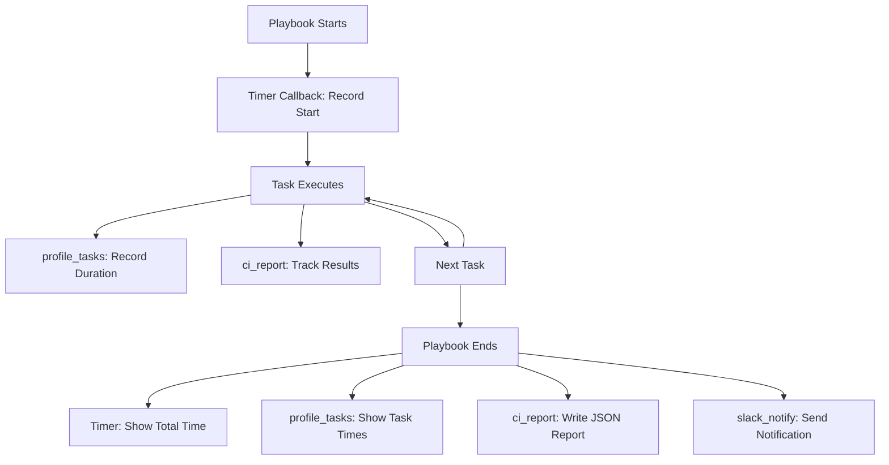

# How to Use Ansible Callback Plugins for CI/CD Reporting

Author: [nawazdhandala](https://www.github.com/nawazdhandala)

Tags: Ansible, CI/CD, Callback Plugins, Reporting, DevOps

Description: Use Ansible callback plugins to generate structured CI/CD reports, send notifications, and integrate with monitoring tools during pipeline runs.

---

When Ansible runs inside a CI/CD pipeline, the default output is a wall of text in the build log. That is fine for debugging, but it does not help your team understand what changed, how long it took, or whether anything failed. Ansible callback plugins let you customize the output format, send notifications to Slack or Teams, generate machine-readable reports, and push metrics to monitoring systems.

This guide covers the built-in callback plugins useful for CI/CD, how to write custom ones, and practical patterns for integrating Ansible reporting into your pipelines.

## What Are Callback Plugins

Callback plugins hook into Ansible's execution lifecycle. They get called at specific events: when a playbook starts, when a task begins, when a task succeeds or fails, when a play ends, and so on. You can use them to:

- Change the console output format
- Send notifications to external systems
- Write reports to files
- Push timing metrics to monitoring tools
- Generate CI/CD-friendly output (like JUnit XML)

## Enabling Built-in Callback Plugins

Ansible ships with several useful callback plugins. Enable them in `ansible.cfg`.

```ini
# ansible.cfg
[defaults]
# Set the stdout callback (only one can be active)
stdout_callback = yaml

# Enable additional callback plugins (comma-separated)
callback_whitelist = timer, profile_tasks, profile_roles

# Or in newer Ansible versions
callbacks_enabled = timer, profile_tasks, profile_roles
```

## The Timer Callback

Shows total playbook execution time. Simple but useful for CI/CD.

```ini
# ansible.cfg
[defaults]
callbacks_enabled = timer
```

Output looks like:

```
Playbook run took 0 days, 0 hours, 3 minutes, 42 seconds
```

## The profile_tasks Callback

Shows how long each task took. This is invaluable for identifying slow tasks.

```ini
# ansible.cfg
[defaults]
callbacks_enabled = profile_tasks
```

Output includes timing per task:

```
Thursday 20 February 2026  14:32:10 +0000 (0:00:02.341) 0:03:42.123 *****
===============================================================
Install packages ---------------------------------------- 45.23s
Deploy application -------------------------------------- 32.11s
Configure nginx ----------------------------------------- 12.45s
Restart services ----------------------------------------  2.34s
```

## The profile_roles Callback

Aggregates timing by role instead of individual tasks.

```ini
# ansible.cfg
[defaults]
callbacks_enabled = profile_roles
```

## The JSON Callback

Outputs the entire playbook result as JSON. Perfect for machine parsing in CI/CD.

```ini
# ansible.cfg
[defaults]
stdout_callback = json
```

Capture the JSON output in your pipeline.

```yaml
# GitHub Actions example
- name: Run Ansible with JSON output
  run: |
    ansible-playbook -i inventory/staging.ini playbooks/site.yml > ansible_output.json 2>&1 || true
  env:
    ANSIBLE_STDOUT_CALLBACK: json

- name: Parse Ansible results
  run: |
    # Extract stats from JSON output
    cat ansible_output.json | jq '.stats'
    # Check for failures
    FAILURES=$(cat ansible_output.json | jq '[.stats[].failures] | add')
    if [ "$FAILURES" -gt 0 ]; then
      echo "Ansible reported failures!"
      exit 1
    fi
```

## The YAML Callback

Produces more readable output than the default format. Good for CI/CD logs.

```ini
# ansible.cfg
[defaults]
stdout_callback = yaml
```

## Writing a Custom Callback Plugin

For specific CI/CD integrations, write your own callback plugin.

```python
# callback_plugins/ci_report.py
from ansible.plugins.callback import CallbackBase
import json
import time
import os


class CallbackModule(CallbackBase):
    """
    Custom callback plugin for CI/CD reporting.
    Generates a summary report and optionally sends to a webhook.
    """
    CALLBACK_VERSION = 2.0
    CALLBACK_TYPE = 'aggregate'
    CALLBACK_NAME = 'ci_report'
    CALLBACK_NEEDS_WHITELIST = True

    def __init__(self):
        super(CallbackModule, self).__init__()
        self.start_time = None
        self.task_results = []
        self.failed_tasks = []
        self.changed_tasks = []

    def v2_playbook_on_start(self, playbook):
        self.start_time = time.time()
        self.playbook_name = os.path.basename(playbook._file_name)

    def v2_runner_on_ok(self, result):
        task_name = result._task.get_name()
        host = result._host.get_name()
        changed = result._result.get('changed', False)

        self.task_results.append({
            'task': task_name,
            'host': host,
            'status': 'changed' if changed else 'ok',
        })

        if changed:
            self.changed_tasks.append({
                'task': task_name,
                'host': host,
            })

    def v2_runner_on_failed(self, result, ignore_errors=False):
        task_name = result._task.get_name()
        host = result._host.get_name()
        msg = result._result.get('msg', 'No error message')

        self.failed_tasks.append({
            'task': task_name,
            'host': host,
            'error': msg,
            'ignored': ignore_errors,
        })

    def v2_playbook_on_stats(self, stats):
        """Called at the end of the playbook run."""
        duration = time.time() - self.start_time

        report = {
            'playbook': self.playbook_name,
            'duration_seconds': round(duration, 2),
            'total_tasks': len(self.task_results),
            'changed_count': len(self.changed_tasks),
            'failed_count': len([f for f in self.failed_tasks if not f['ignored']]),
            'changed_tasks': self.changed_tasks,
            'failed_tasks': self.failed_tasks,
            'hosts': {},
        }

        # Build per-host stats
        for host in sorted(stats.processed.keys()):
            summary = stats.summarize(host)
            report['hosts'][host] = summary

        # Write report to file
        report_file = os.environ.get('CI_REPORT_FILE', 'ansible_report.json')
        with open(report_file, 'w') as f:
            json.dump(report, f, indent=2)

        # Print summary
        self._display.banner('CI/CD DEPLOYMENT REPORT')
        self._display.display(f"Playbook: {report['playbook']}")
        self._display.display(f"Duration: {report['duration_seconds']}s")
        self._display.display(f"Tasks: {report['total_tasks']} total, "
                            f"{report['changed_count']} changed, "
                            f"{report['failed_count']} failed")

        if self.failed_tasks:
            self._display.display("\nFailed tasks:", color='red')
            for task in self.failed_tasks:
                self._display.display(
                    f"  - {task['task']} on {task['host']}: {task['error']}",
                    color='red'
                )
```

Enable it in your configuration.

```ini
# ansible.cfg
[defaults]
callback_plugins = ./callback_plugins
callbacks_enabled = ci_report
```

## Slack Notification Callback

Here is a callback plugin that sends deployment notifications to Slack.

```python
# callback_plugins/slack_notify.py
from ansible.plugins.callback import CallbackBase
import json
import os

try:
    from urllib.request import Request, urlopen
except ImportError:
    from urllib2 import Request, urlopen


class CallbackModule(CallbackBase):
    """Send deployment notifications to Slack."""
    CALLBACK_VERSION = 2.0
    CALLBACK_TYPE = 'notification'
    CALLBACK_NAME = 'slack_notify'
    CALLBACK_NEEDS_WHITELIST = True

    def __init__(self):
        super(CallbackModule, self).__init__()
        self.webhook_url = os.environ.get('SLACK_WEBHOOK_URL', '')
        self.failures = []

    def _send_slack(self, message, color='good'):
        if not self.webhook_url:
            return

        payload = {
            'attachments': [{
                'color': color,
                'text': message,
                'footer': 'Ansible CI/CD',
            }]
        }

        req = Request(
            self.webhook_url,
            data=json.dumps(payload).encode('utf-8'),
            headers={'Content-Type': 'application/json'}
        )
        urlopen(req)

    def v2_runner_on_failed(self, result, ignore_errors=False):
        if not ignore_errors:
            self.failures.append(result._task.get_name())

    def v2_playbook_on_stats(self, stats):
        hosts = sorted(stats.processed.keys())
        total_failures = sum(stats.summarize(h)['failures'] for h in hosts)
        total_changed = sum(stats.summarize(h)['changed'] for h in hosts)

        if total_failures > 0:
            msg = f"Deployment FAILED - {total_failures} failures across {len(hosts)} hosts"
            self._send_slack(msg, color='danger')
        else:
            msg = f"Deployment SUCCESS - {total_changed} changes across {len(hosts)} hosts"
            self._send_slack(msg, color='good')
```

## Using Multiple Callbacks Together

You can use one stdout callback and multiple aggregate/notification callbacks simultaneously.

```ini
# ansible.cfg
[defaults]
# Pretty YAML output for the console
stdout_callback = yaml

# Enable timer, profiling, custom report, and Slack notifications
callbacks_enabled = timer, profile_tasks, ci_report, slack_notify
```

## CI/CD Callback Workflow



## Tips for Callback Plugins in CI/CD

1. Use `profile_tasks` in every CI/CD pipeline. Knowing which tasks are slow helps you optimize your deployment time.
2. The `json` stdout callback is great for machine processing but terrible for human readability. Use `yaml` for humans and write JSON to a separate file via a custom callback.
3. Set `ANSIBLE_FORCE_COLOR=true` in your CI/CD environment if the platform supports ANSI colors (GitHub Actions, GitLab CI do).
4. Custom callback plugins should handle exceptions gracefully. A broken callback should never cause the playbook to fail.
5. Use environment variables to configure callback plugin behavior (webhook URLs, output file paths). This keeps your ansible.cfg portable.
6. The `callbacks_enabled` list is processed in order. Put your most important callbacks first.

Callback plugins turn Ansible's raw output into actionable CI/CD intelligence. Whether you need a simple Slack notification or a detailed JSON report, callback plugins are the right tool for the job.
