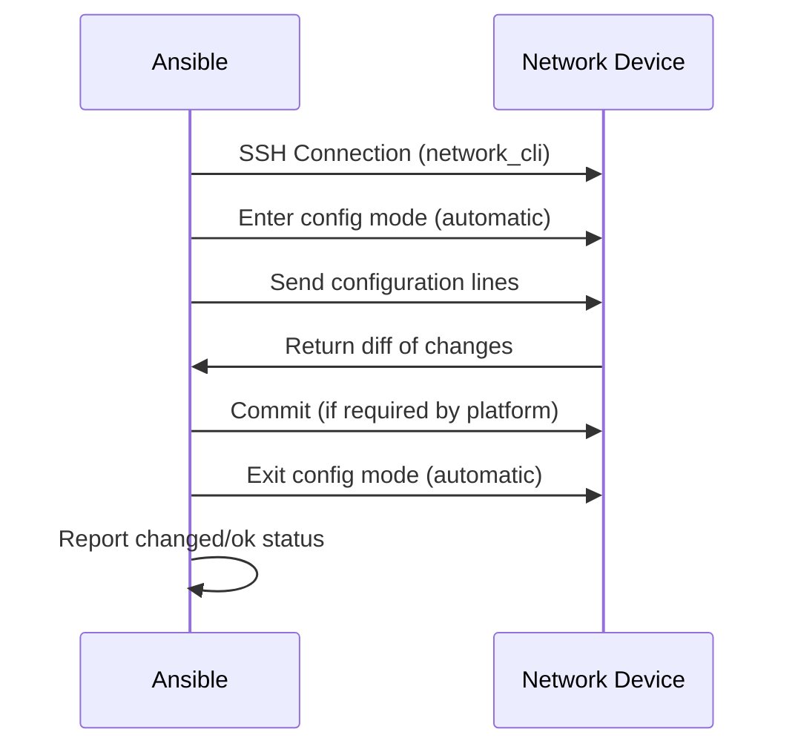

# How to Use Ansible cli_config Module for Network Configuration

Author: [nawazdhandala](https://www.github.com/nawazdhandala)

Tags: Ansible, Network Automation, Configuration Management, Multi-Vendor

Description: Learn how to use the Ansible cli_config module for pushing configuration changes to network devices across multiple vendor platforms.

---

The `cli_config` module from the `ansible.netcommon` collection is the vendor-agnostic way to push configuration to network devices. While `cli_command` is for operational show commands, `cli_config` is specifically designed for configuration changes. It handles entering configuration mode, sending your commands, exiting configuration mode, and optionally committing changes on platforms that require it (like JunOS and IOS-XR).

This module is particularly valuable when you are managing a multi-vendor network and want to write playbooks that work across different platforms without duplicating logic for each vendor.

## How cli_config Works



The module automatically detects the platform from `ansible_network_os` and handles the platform-specific workflow. On IOS, it enters `configure terminal` and exits with `end`. On JunOS, it enters `configure` mode and runs `commit`. On VyOS, it enters `configure` mode and runs `commit`.

## Basic Usage

Here is the simplest way to push configuration with `cli_config`:

```yaml
# playbook-basic-config.yml
# Pushes a simple configuration change to a network device
- name: Basic configuration push
  hosts: ios_routers
  gather_facts: no

  tasks:
    - name: Configure a loopback interface
      ansible.netcommon.cli_config:
        config: |
          interface Loopback99
           description Managed by Ansible
           ip address 10.255.255.1 255.255.255.255
           no shutdown

    - name: Configure logging settings
      ansible.netcommon.cli_config:
        config: |
          logging host 10.0.100.50
          logging trap informational
          logging source-interface Loopback0
```

The `config` parameter accepts a multi-line string with the configuration commands. The module handles entering and exiting configuration mode.

## Using Templates for Configuration

For more complex configurations, use Jinja2 templates:

```yaml
# playbook-template-config.yml
# Uses a Jinja2 template to generate and push configuration
- name: Configure from template
  hosts: all_network
  gather_facts: no

  vars:
    ntp_servers:
      - 10.0.0.50
      - 10.0.0.51
    syslog_server: 10.0.100.50
    snmp_community: "{{ vault_snmp_community }}"

  tasks:
    - name: Push baseline configuration from template
      ansible.netcommon.cli_config:
        config: "{{ lookup('template', 'templates/baseline-{{ platform_short }}.j2') }}"
      vars:
        platform_short: "{{ ansible_network_os.split('.')[-1] }}"
```

With a template file for IOS (`templates/baseline-ios.j2`):

```
! NTP Configuration

ntp server {{ server }}


! Syslog Configuration
logging host {{ syslog_server }}
logging trap informational
no logging console

! SNMP Configuration
snmp-server community {{ snmp_community }} RO
snmp-server location {{ snmp_location | default('Unspecified') }}
snmp-server contact netops@corp.local
```

## Configuration Diff

One of the most useful features of `cli_config` is the ability to show what changed. The `diff_match` and `diff_replace` parameters control how diffs are generated:

```yaml
# playbook-config-diff.yml
# Applies configuration and shows what changed
- name: Configure with diff output
  hosts: ios_routers
  gather_facts: no

  tasks:
    - name: Apply NTP configuration with diff
      ansible.netcommon.cli_config:
        config: |
          ntp server 10.0.0.50
          ntp server 10.0.0.51
          ntp server 10.0.0.52
        diff_match: line
      register: config_result

    - name: Show configuration changes
      ansible.builtin.debug:
        msg: |
          Changed: {{ config_result.changed }}
          Diff: {{ config_result.diff | default('No diff available') }}
      when: config_result.changed
```

Diff match modes:

| Mode | Description |
|------|-------------|
| `line` | Compare configuration line by line |
| `strict` | Compare line by line, order matters |
| `exact` | Configuration must match exactly |
| `none` | Do not compare, always push config |

## Backup Before Changes

Always create a backup before pushing configuration changes:

```yaml
# playbook-config-with-backup.yml
# Creates a backup before applying configuration changes
- name: Configure with backup
  hosts: all_network
  gather_facts: no

  tasks:
    - name: Apply configuration with automatic backup
      ansible.netcommon.cli_config:
        config: |
          interface Loopback0
           description Updated by Ansible
        backup: yes
        backup_options:
          dir_path: "./backups/pre-change/"
          filename: "{{ inventory_hostname }}-{{ lookup('pipe', 'date +%Y%m%d-%H%M%S') }}.cfg"
```

The backup captures the running configuration before any changes are made. This is your safety net for rolling back if something goes wrong.

## Multi-Vendor Configuration Pattern

Here is a practical pattern for pushing the same logical configuration to devices from different vendors:

```yaml
# playbook-multi-vendor-config.yml
# Pushes equivalent configuration across multiple vendor platforms
- name: Multi-vendor syslog configuration
  hosts: all_network
  gather_facts: no

  vars:
    syslog_server: 10.0.100.50
    syslog_port: 514

  tasks:
    - name: Configure syslog on IOS devices
      ansible.netcommon.cli_config:
        config: |
          logging host {{ syslog_server }}
          logging trap informational
          service timestamps log datetime msec localtime
      when: ansible_network_os == 'cisco.ios.ios'

    - name: Configure syslog on NX-OS devices
      ansible.netcommon.cli_config:
        config: |
          logging server {{ syslog_server }} 6 use-vrf management
          logging timestamp milliseconds
          logging level local7 6
      when: ansible_network_os == 'cisco.nxos.nxos'

    - name: Configure syslog on EOS devices
      ansible.netcommon.cli_config:
        config: |
          logging host {{ syslog_server }}
          logging trap informational
          logging facility local7
      when: ansible_network_os == 'arista.eos.eos'

    - name: Configure syslog on JunOS devices
      ansible.netcommon.cli_config:
        config: |
          set system syslog host {{ syslog_server }} any info
          set system syslog host {{ syslog_server }} authorization any
          set system syslog time-override
      when: ansible_network_os == 'junipernetworks.junos.junos'

    - name: Configure syslog on VyOS devices
      ansible.netcommon.cli_config:
        config: |
          set system syslog host {{ syslog_server }} facility all level info
      when: ansible_network_os == 'vyos.vyos.vyos'
```

## Commit-Based Platform Support

For platforms that use a commit model (JunOS, IOS-XR, VyOS), the `cli_config` module handles commits automatically. You can also control the commit behavior:

```yaml
# playbook-commit-control.yml
# Demonstrates commit control on commit-based platforms
- name: Configuration with commit control
  hosts: junos_routers
  gather_facts: no

  tasks:
    - name: Apply configuration with commit comment
      ansible.netcommon.cli_config:
        config: |
          set interfaces lo0 unit 0 description "Updated by Ansible"
        commit_comment: "Ansible automated change - {{ lookup('pipe', 'date') }}"

    - name: Apply configuration with commit confirmed
      ansible.netcommon.cli_config:
        config: |
          set protocols ospf area 0 interface xe-0/0/2
        commit_comment: "Adding OSPF interface - auto-rollback in 5 min"
      register: ospf_change
```

## Replacing Configuration

Instead of merging configuration, you can replace entire sections. This is useful when you want to ensure the configuration matches exactly:

```yaml
# playbook-config-replace.yml
# Replaces configuration sections instead of merging
- name: Replace configuration section
  hosts: ios_routers
  gather_facts: no

  tasks:
    - name: Replace NTP configuration entirely
      ansible.netcommon.cli_config:
        config: |
          no ntp server 10.0.0.50
          no ntp server 10.0.0.51
          no ntp server 10.0.0.52
          ntp server 172.16.0.50
          ntp server 172.16.0.51
        diff_replace: block
        diff_match: exact
```

## Loading Configuration from Files

You can load configuration from external files:

```yaml
# playbook-config-from-file.yml
# Loads configuration from a file specific to each device
- name: Load per-device configuration
  hosts: all_network
  gather_facts: no

  tasks:
    - name: Check if device config file exists
      ansible.builtin.stat:
        path: "./configs/{{ inventory_hostname }}.cfg"
      register: config_file
      delegate_to: localhost

    - name: Push device-specific configuration
      ansible.netcommon.cli_config:
        config: "{{ lookup('file', './configs/' + inventory_hostname + '.cfg') }}"
        backup: yes
        backup_options:
          dir_path: "./backups/"
          filename: "{{ inventory_hostname }}-pre-deploy.cfg"
      when: config_file.stat.exists
```

## Rollback and Recovery

Building rollback capabilities into your playbooks is essential for production networks:

```yaml
# playbook-config-with-rollback.yml
# Applies configuration with automatic rollback on failure
- name: Configuration with rollback safety
  hosts: ios_routers
  gather_facts: no

  tasks:
    - name: Backup current configuration
      ansible.netcommon.cli_config:
        backup: yes
        backup_options:
          dir_path: "./backups/"
          filename: "{{ inventory_hostname }}-rollback.cfg"
        config: ""

    - name: Apply new configuration
      ansible.netcommon.cli_config:
        config: |
          interface GigabitEthernet0/1
           description New Customer Link
           ip address 172.16.0.1 255.255.255.252
           no shutdown
      register: config_applied

    - name: Verify connectivity after change
      ansible.netcommon.cli_command:
        command: ping 172.16.0.2 repeat 3
      register: ping_test
      failed_when: "'Success rate is 0' in ping_test.stdout"
      ignore_errors: yes

    - name: Rollback if verification fails
      ansible.netcommon.cli_config:
        config: |
          interface GigabitEthernet0/1
           shutdown
           no ip address
           no description
      when: ping_test.failed | default(false)

    - name: Report rollback status
      ansible.builtin.debug:
        msg: "Configuration was rolled back due to failed connectivity test"
      when: ping_test.failed | default(false)
```

## Security Hardening Across Multiple Vendors

Here is a practical example that applies security hardening configuration across a multi-vendor network:

```yaml
# playbook-security-hardening.yml
# Applies security hardening across all network devices
- name: Network security hardening
  hosts: all_network
  gather_facts: no

  tasks:
    - name: Harden IOS devices
      ansible.netcommon.cli_config:
        config: |
          service password-encryption
          no ip http server
          no ip http secure-server
          ip ssh version 2
          ip ssh time-out 60
          no cdp run
          banner motd ^C Authorized access only ^C
          line vty 0 15
           transport input ssh
           exec-timeout 15 0
        backup: yes
        backup_options:
          dir_path: "./backups/pre-hardening/"
          filename: "{{ inventory_hostname }}.cfg"
      when: ansible_network_os == 'cisco.ios.ios'

    - name: Harden EOS devices
      ansible.netcommon.cli_config:
        config: |
          no ip http server
          management ssh
           idle-timeout 15
          banner motd
          Authorized access only
          EOF
        backup: yes
        backup_options:
          dir_path: "./backups/pre-hardening/"
          filename: "{{ inventory_hostname }}.cfg"
      when: ansible_network_os == 'arista.eos.eos'

    - name: Harden NX-OS devices
      ansible.netcommon.cli_config:
        config: |
          no feature telnet
          ssh key rsa 2048
          banner motd @
          Authorized access only. All activity is monitored.
          @
          line vty
           session-limit 10
           exec-timeout 15
        backup: yes
        backup_options:
          dir_path: "./backups/pre-hardening/"
          filename: "{{ inventory_hostname }}.cfg"
      when: ansible_network_os == 'cisco.nxos.nxos'
```

## Tips for Using cli_config

**Always create backups.** The `backup: yes` parameter is your insurance policy. Use it on every configuration change, especially in production.

**Use diff mode for visibility.** Set `diff_match: line` to see exactly what lines will be added or changed. Run with `--check --diff` to preview changes without applying them.

**Group related changes.** Put all related configuration into a single `cli_config` task. On commit-based platforms, each task triggers a separate commit, and you want related changes to be atomic.

**Handle platform differences in templates.** Rather than writing inline configuration for each vendor, use Jinja2 templates organized by platform. This keeps your playbooks clean and your configuration logic in one place.

**Test with check mode first.** Always run `ansible-playbook playbook.yml --check --diff` before applying changes to production devices. This shows you what would change without actually making any modifications.

**Do not mix cli_config and cli_command.** Use `cli_config` for configuration mode commands and `cli_command` for exec/operational commands. They operate in different contexts and mixing them can lead to unexpected behavior.

The `cli_config` module bridges the gap between vendor-specific configuration modules and raw CLI access. It gives you the flexibility to work across multiple platforms while maintaining the safety features (backups, diffs, check mode) that production network management requires. When combined with Jinja2 templates and proper version control, it forms the foundation of a robust network-as-code practice.
