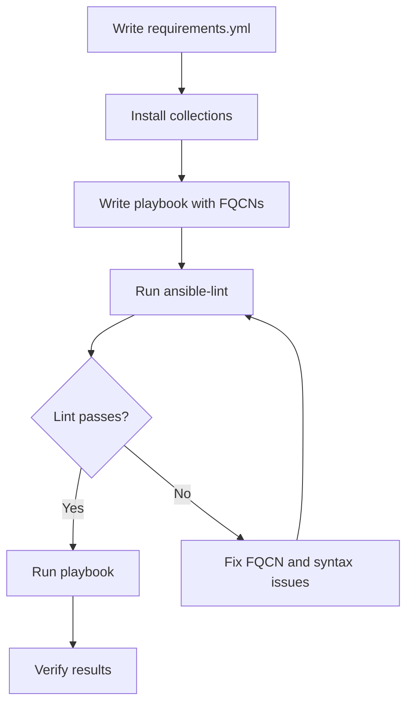

# How to Use Ansible Collections in Playbooks

Author: [nawazdhandala](https://www.github.com/nawazdhandala)

Tags: Ansible, Collections, Playbooks, Automation, DevOps

Description: Learn how to reference and use Ansible collections inside your playbooks with practical examples and best practices for collection-based automation.

---

Ansible collections changed the way we organize and consume automation content. Before collections existed, every module shipped with Ansible core, which made releases heavy and slow. Now, collections let you pull in exactly the modules and plugins you need, and your playbooks reference them with clear namespaces.

This post walks through how to actually use collections inside your playbooks, from basic module references to advanced patterns like setting collection search paths and pinning versions.

## What Are Collections in the Context of Playbooks?

A collection is a packaged bundle of Ansible content: modules, plugins, roles, and playbooks. When you use a collection in your playbook, you reference its content using a Fully Qualified Collection Name (FQCN). For example, instead of writing `yum`, you write `ansible.builtin.yum`. Instead of writing `docker_container`, you write `community.docker.docker_container`.

This namespacing removes ambiguity. If two collections ship a module with the same short name, the FQCN tells Ansible exactly which one you mean.

## Basic Usage: Calling Modules by FQCN

The simplest way to use a collection module in a playbook is to reference it by its full name.

This playbook installs nginx using the fully qualified name for the yum module:

```yaml
# install-nginx.yml - Uses FQCN to call the yum module
---
- name: Install nginx on RHEL servers
  hosts: webservers
  become: true
  tasks:
    - name: Install nginx package
      ansible.builtin.yum:
        name: nginx
        state: present

    - name: Start and enable nginx
      ansible.builtin.systemd:
        name: nginx
        state: started
        enabled: true
```

Every module call here uses the `ansible.builtin` namespace, which is the collection that ships with ansible-core. You do not need to install it separately.

## Using the collections Keyword

If you are pulling modules from a specific collection repeatedly, typing the full namespace on every task gets tedious. The `collections` keyword lets you set a search path so Ansible can resolve short names.

This playbook sets a collection search path and then uses short module names:

```yaml
# manage-containers.yml - Uses collections keyword for shorter references
---
- name: Manage Docker containers
  hosts: docker_hosts
  collections:
    - community.docker
    - ansible.builtin
  tasks:
    - name: Pull the redis image
      docker_image:
        name: redis
        tag: "7-alpine"
        source: pull

    - name: Start redis container
      docker_container:
        name: redis_cache
        image: "redis:7-alpine"
        ports:
          - "6379:6379"
        state: started
        restart_policy: always
```

When Ansible encounters `docker_image`, it searches through the collections list in order. It finds `community.docker.docker_image` and uses that. If the module name exists in multiple listed collections, the first match wins.

One thing to keep in mind: the Ansible documentation recommends using FQCNs over the `collections` keyword. FQCNs make your playbooks explicit and easier to debug. The `collections` keyword is convenient but can introduce ambiguity if you are not careful about the search order.

## Specifying Collection Dependencies in requirements.yml

Before your playbook can use a collection, that collection needs to be installed. The standard approach is to create a `requirements.yml` file that lists your collection dependencies.

This requirements file pins specific versions of the collections your playbook needs:

```yaml
# requirements.yml - Pin collection versions for reproducible builds
---
collections:
  - name: community.docker
    version: ">=3.4.0,<4.0.0"
  - name: community.postgresql
    version: "3.2.0"
  - name: ansible.posix
    version: ">=1.5.0"
```

Install everything with a single command:

```bash
# Install all collections listed in requirements.yml
ansible-galaxy collection install -r requirements.yml
```

This keeps your playbook portable. Anyone who clones your repository can install the exact same collection versions.

## Using Collection Roles in Playbooks

Collections can include roles, and you reference them the same way you reference modules: with FQCNs.

This playbook uses a role from a collection:

```yaml
# setup-monitoring.yml - Import a role from a collection
---
- name: Set up monitoring stack
  hosts: monitoring
  become: true
  roles:
    - role: community.grafana.grafana
      vars:
        grafana_port: 3000
        grafana_admin_password: "{{ vault_grafana_password }}"
  tasks:
    - name: Verify Grafana is responding
      ansible.builtin.uri:
        url: "http://localhost:3000/api/health"
        return_content: true
      register: grafana_health

    - name: Show health check result
      ansible.builtin.debug:
        var: grafana_health.json
```

The role `community.grafana.grafana` is the `grafana` role inside the `community.grafana` collection. Ansible resolves this namespace automatically when the collection is installed.

## Mixing Multiple Collections

Real-world playbooks typically pull from several collections at once. Here is a playbook that provisions infrastructure using modules from three different collections:

```yaml
# provision-app-stack.yml - Combines modules from multiple collections
---
- name: Provision application stack
  hosts: app_servers
  become: true
  vars:
    app_db_name: myapp
    app_db_user: appuser
    app_db_password: "{{ vault_db_password }}"

  tasks:
    - name: Install required packages
      ansible.builtin.dnf:
        name:
          - postgresql-server
          - python3-psycopg2
          - firewalld
        state: present

    - name: Initialize PostgreSQL database
      ansible.builtin.command:
        cmd: postgresql-setup --initdb
        creates: /var/lib/pgsql/data/PG_VERSION

    - name: Start PostgreSQL
      ansible.builtin.systemd:
        name: postgresql
        state: started
        enabled: true

    - name: Create application database
      community.postgresql.postgresql_db:
        name: "{{ app_db_name }}"
        state: present
      become_user: postgres

    - name: Create application database user
      community.postgresql.postgresql_user:
        db: "{{ app_db_name }}"
        name: "{{ app_db_user }}"
        password: "{{ app_db_password }}"
        priv: "ALL"
        state: present
      become_user: postgres

    - name: Open firewall for PostgreSQL
      ansible.posix.firewalld:
        port: 5432/tcp
        permanent: true
        state: enabled
        immediate: true
```

This playbook uses `ansible.builtin` for package management and service control, `community.postgresql` for database operations, and `ansible.posix` for firewall rules. Each module call is unambiguous because of the FQCN.

## Overriding Module Defaults with module_defaults

You can set default parameters for collection modules using `module_defaults` with group syntax. This reduces repetition when multiple tasks share the same parameters.

This example sets default connection parameters for all PostgreSQL modules:

```yaml
# db-setup.yml - Use module_defaults to reduce parameter repetition
---
- name: Configure PostgreSQL databases
  hosts: db_servers
  become: true
  become_user: postgres
  module_defaults:
    group/community.postgresql.postgresql:
      login_host: localhost
      login_user: postgres
      port: 5432
  tasks:
    - name: Create staging database
      community.postgresql.postgresql_db:
        name: staging_db

    - name: Create production database
      community.postgresql.postgresql_db:
        name: production_db

    - name: Create readonly user
      community.postgresql.postgresql_user:
        name: readonly_user
        password: "{{ vault_readonly_password }}"
        role_attr_flags: NOSUPERUSER,NOCREATEDB
```

The `group/community.postgresql.postgresql` syntax applies defaults to all modules in that collection's module group. Not every collection supports module_defaults groups, so check the collection documentation.

## Workflow: From requirements.yml to Running Playbooks

Here is the typical workflow when working with collection-based playbooks:



## Tips for Production Use

Pin your collection versions in `requirements.yml`. A floating version can break your automation when a new release introduces breaking changes.

Always use FQCNs in shared playbooks. The `collections` keyword is fine for quick scripts, but FQCNs prevent confusion when multiple engineers work on the same codebase.

Run `ansible-lint` with the `fqcn` rule enabled. It will flag any tasks that use short module names and suggest the correct FQCN.

Keep your collection install path consistent. By default, collections install to `~/.ansible/collections`. For CI/CD pipelines, use `ansible-galaxy collection install -p ./collections -r requirements.yml` to install them locally within your project directory, then set `ANSIBLE_COLLECTIONS_PATH=./collections` in your environment.

Test collection upgrades in a staging environment before rolling them out to production. Collections can change module parameters between major versions.

## Conclusion

Using Ansible collections in playbooks is straightforward once you get the naming conventions down. Stick with FQCNs for clarity, manage dependencies through `requirements.yml`, and pin versions for reproducibility. This approach scales well whether you are managing ten servers or ten thousand.
