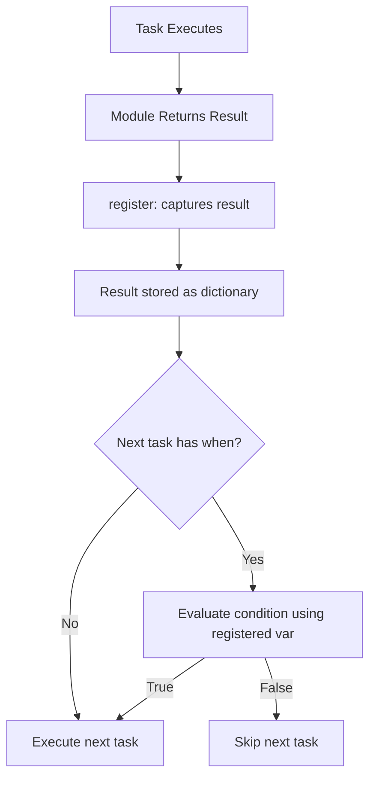

# How to Use Ansible Conditionals with Registered Variables

Author: [nawazdhandala](https://www.github.com/nawazdhandala)

Tags: Ansible, Conditionals, register, Variables, Task Control

Description: Learn how to use registered variables in Ansible conditionals to make decisions based on the output of previous tasks.

---

Ansible's `register` keyword captures the output of a task into a variable. That variable contains far more than just the command output. It includes return codes, changed status, stdout, stderr, and module-specific data. Using this registered data in `when` clauses is how you build intelligent workflows where later tasks react to what happened in earlier ones.

## What a Registered Variable Contains

Every registered variable is a dictionary with a predictable structure. The exact keys depend on the module, but several are always present:

```yaml
# show-registered-var.yml - Inspect a registered variable
---
- name: Inspect registered variable structure
  hosts: localhost
  gather_facts: false
  tasks:
    - name: Run a command
      ansible.builtin.command:
        cmd: echo "hello world"
      register: cmd_result
      changed_when: false

    - name: Show the full registered variable
      ansible.builtin.debug:
        var: cmd_result
```

Output:

```json
{
    "changed": false,
    "cmd": ["echo", "hello world"],
    "rc": 0,
    "stdout": "hello world",
    "stdout_lines": ["hello world"],
    "stderr": "",
    "stderr_lines": [],
    "failed": false
}
```

## Checking Return Codes

The `rc` field (return code) is available for command and shell modules. Zero typically means success.

```yaml
# check-rc.yml - Conditionals based on return code
---
- name: Return code conditionals
  hosts: all
  gather_facts: false
  become: true
  tasks:
    - name: Check if nginx is installed
      ansible.builtin.command:
        cmd: which nginx
      register: nginx_check
      failed_when: false
      changed_when: false

    - name: Install nginx if not found
      ansible.builtin.apt:
        name: nginx
        state: present
      when: nginx_check.rc != 0

    - name: Configure nginx if already installed
      ansible.builtin.template:
        src: nginx.conf.j2
        dest: /etc/nginx/nginx.conf
        mode: '0644'
      when: nginx_check.rc == 0
      notify: reload nginx
```

## Checking stdout Content

You can check what a command printed to stdout:

```yaml
# check-stdout.yml - Conditionals based on command output
---
- name: stdout-based conditionals
  hosts: all
  gather_facts: false
  become: true
  tasks:
    - name: Get current Java version
      ansible.builtin.command:
        cmd: java -version
      register: java_version
      failed_when: false
      changed_when: false

    - name: Install Java if not present or wrong version
      ansible.builtin.apt:
        name: openjdk-17-jdk
        state: present
      when: java_version.rc != 0 or '17' not in java_version.stderr

    - name: Check disk usage
      ansible.builtin.command:
        cmd: df -h /
      register: disk_usage
      changed_when: false

    - name: Show disk usage output
      ansible.builtin.debug:
        msg: "{{ disk_usage.stdout_lines }}"

    - name: Get active service status
      ansible.builtin.command:
        cmd: systemctl is-active myapp
      register: service_status
      failed_when: false
      changed_when: false

    - name: Start service if not running
      ansible.builtin.systemd:
        name: myapp
        state: started
      when: service_status.stdout != "active"
```

## Using the changed Status

When a task changes something, `changed` is `true`. This is useful for triggering follow-up actions without using handlers.

```yaml
# check-changed.yml - React to task changes
---
- name: React to changes
  hosts: all
  gather_facts: false
  become: true
  tasks:
    - name: Update application configuration
      ansible.builtin.template:
        src: app.conf.j2
        dest: /etc/app/app.conf
        mode: '0644'
      register: config_update

    - name: Restart app if config changed
      ansible.builtin.systemd:
        name: myapp
        state: restarted
      when: config_update.changed

    - name: Run database migration
      ansible.builtin.command:
        cmd: /opt/app/bin/migrate
      register: migration
      changed_when: "'No migrations to run' not in migration.stdout"

    - name: Clear application cache after migration
      ansible.builtin.command:
        cmd: /opt/app/bin/clear-cache
      when: migration.changed
      changed_when: true
```

## Checking the failed Status

You can check whether a task failed (when using `failed_when: false` or `ignore_errors: true`) and react accordingly:

```yaml
# check-failed.yml - Handle task failures gracefully
---
- name: Graceful failure handling
  hosts: all
  gather_facts: false
  become: true
  tasks:
    - name: Try to connect to database
      ansible.builtin.command:
        cmd: pg_isready -h {{ db_host }} -p {{ db_port }}
      register: db_check
      failed_when: false
      changed_when: false

    - name: Run database-dependent tasks
      when: not db_check.failed and db_check.rc == 0
      block:
        - name: Run migrations
          ansible.builtin.command:
            cmd: /opt/app/bin/migrate
          changed_when: true

        - name: Seed test data
          ansible.builtin.command:
            cmd: /opt/app/bin/seed
          when: deploy_env != "production"
          changed_when: true

    - name: Log database unavailability
      ansible.builtin.lineinfile:
        path: /var/log/deploy.log
        line: "{{ now(utc=true, fmt='%Y-%m-%d %H:%M:%S') }} - Database unavailable at {{ db_host }}:{{ db_port }}"
        create: true
        mode: '0644'
      when: db_check.failed or db_check.rc != 0
```

## Working with Module-Specific Output

Different modules return different data structures. The `stat` module is a good example:

```yaml
# module-specific.yml - Module-specific registered data
---
- name: Module-specific registered variables
  hosts: all
  gather_facts: false
  become: true
  tasks:
    - name: Check if config file exists
      ansible.builtin.stat:
        path: /etc/app/app.conf
      register: config_file

    - name: Create default config if missing
      ansible.builtin.copy:
        src: default-app.conf
        dest: /etc/app/app.conf
        mode: '0644'
      when: not config_file.stat.exists

    - name: Check config file permissions
      ansible.builtin.debug:
        msg: "Config file is world-readable, fixing..."
      when:
        - config_file.stat.exists
        - config_file.stat.mode == '0644'

    - name: Get list of installed packages
      ansible.builtin.package_facts:
        manager: auto
      register: pkg_facts

    - name: Install nginx only if apache is not installed
      ansible.builtin.apt:
        name: nginx
        state: present
      when: "'apache2' not in ansible_facts.packages"
```

## Registered Variables with Loops

When you register a variable inside a loop, the registered variable contains a `results` list with one entry per loop iteration:

```yaml
# register-loop.yml - Registered variables in loops
---
- name: Registered variables with loops
  hosts: all
  gather_facts: false
  become: true
  tasks:
    - name: Check status of multiple services
      ansible.builtin.command:
        cmd: "systemctl is-active {{ item }}"
      loop:
        - nginx
        - postgresql
        - redis
      register: service_checks
      failed_when: false
      changed_when: false

    - name: Show which services are not running
      ansible.builtin.debug:
        msg: "{{ item.item }} is not active (status: {{ item.stdout }})"
      loop: "{{ service_checks.results }}"
      when: item.stdout != "active"
      loop_control:
        label: "{{ item.item }}"

    - name: Start services that are not running
      ansible.builtin.systemd:
        name: "{{ item.item }}"
        state: started
      loop: "{{ service_checks.results }}"
      when: item.stdout != "active"
      loop_control:
        label: "{{ item.item }}"
```

## The Flow of Registered Variables



## Checking for skipped Tasks

If a task was skipped due to a `when` condition, its registered variable has a `skipped` field:

```yaml
# check-skipped.yml - React to skipped tasks
---
- name: Handle skipped tasks
  hosts: all
  gather_facts: true
  tasks:
    - name: Run expensive check only on production
      ansible.builtin.command:
        cmd: /opt/tools/security-scan
      register: security_scan
      when: deploy_env | default('development') == "production"
      changed_when: false
      failed_when: false

    - name: Process scan results
      ansible.builtin.debug:
        msg: "Security scan passed"
      when:
        - security_scan is not skipped
        - security_scan.rc == 0

    - name: Log that scan was skipped
      ansible.builtin.debug:
        msg: "Security scan skipped (non-production environment)"
      when: security_scan is skipped
```

## Best Practices

Always use `failed_when: false` on tasks whose failure you want to handle gracefully rather than `ignore_errors: true`, which is noisier. Add `changed_when: false` to check commands that do not modify anything. Access registered variable fields with dot notation (`result.stdout`) rather than bracket notation (`result['stdout']`) for readability. When checking command output, prefer `result.rc` for exit codes and use string matching on `result.stdout` only when the return code is not sufficient. Remember that registered variables from skipped tasks exist but have a `skipped: true` field and lack the usual module-specific fields.

Registered variables are the connective tissue of Ansible workflows. They let you build sequences where each task reacts intelligently to what came before, turning a flat list of tasks into a dynamic decision tree.
