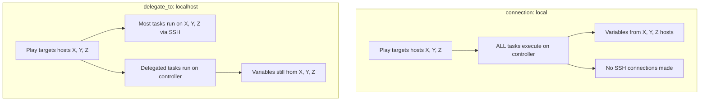

# How to Use Ansible connection: local vs delegate_to: localhost

Author: [nawazdhandala](https://www.github.com/nawazdhandala)

Tags: Ansible, Connection, Delegation, Configuration Management

Description: Understand the differences between connection local and delegate_to localhost in Ansible and when to use each approach.

---

Ansible provides two ways to run tasks on the local machine: `connection: local` and `delegate_to: localhost`. They look similar but behave differently in important ways. Choosing the wrong one can lead to confusing variable resolution, incorrect fact gathering, and tasks running in the wrong context. Let me break down exactly how they differ and when to use each.

## connection: local

Setting `connection: local` at the play level changes the connection method for ALL tasks in that play. Every task runs on the controller machine, but the play still targets the hosts you specified. This means variables and facts are resolved against those hosts, but execution happens locally.

```yaml
# connection-local.yml - All tasks run locally
---
- name: Manage cloud resources (all tasks run locally)
  hosts: localhost
  connection: local
  gather_facts: false
  tasks:
    - name: Create EC2 instance
      amazon.aws.ec2_instance:
        name: web-server-01
        instance_type: t3.medium
        image_id: ami-0abcdef1234567890
        region: us-east-1
        state: running
      register: ec2

    - name: Create Route53 DNS record
      amazon.aws.route53:
        zone: example.com
        record: web-server-01.example.com
        type: A
        value: "{{ ec2.instances[0].public_ip_address }}"
        state: present
```

This is the standard pattern for cloud provisioning playbooks where every task calls a cloud API from the controller.

## delegate_to: localhost

`delegate_to: localhost` redirects a single task to run on the controller while the play targets remote hosts. The variable context stays with the original remote host.

```yaml
# delegate-to-localhost.yml - Most tasks run remotely, some delegated locally
---
- name: Deploy and register servers
  hosts: webservers
  tasks:
    - name: Install application (runs on remote web server)
      ansible.builtin.apt:
        name: myapp
        state: present
      become: true

    - name: Register in DNS (runs on controller)
      amazon.aws.route53:
        zone: example.com
        record: "{{ inventory_hostname }}.example.com"
        type: A
        value: "{{ ansible_host }}"
        state: present
      delegate_to: localhost
      # inventory_hostname and ansible_host refer to the REMOTE web server
```

## The Key Differences

Here is a side-by-side comparison:



Here is a concrete example showing the difference:

```yaml
# difference-demo.yml - Shows the behavioral differences
---
# Play 1: connection: local with remote hosts
- name: Connection local with webservers
  hosts: webservers
  connection: local
  gather_facts: false
  tasks:
    - name: This runs LOCALLY for each webserver
      ansible.builtin.shell: hostname
      register: result

    - name: Show the result
      ansible.builtin.debug:
        msg: >
          inventory_hostname={{ inventory_hostname }},
          actual hostname={{ result.stdout }}
      # inventory_hostname = web1.example.com (the remote host)
      # result.stdout = your-controller-hostname (because it ran locally)

# Play 2: delegate_to localhost
- name: Normal play with delegation
  hosts: webservers
  gather_facts: false
  tasks:
    - name: This runs on the REMOTE webserver
      ansible.builtin.shell: hostname
      register: remote_result

    - name: This runs LOCALLY
      ansible.builtin.shell: hostname
      register: local_result
      delegate_to: localhost

    - name: Show both results
      ansible.builtin.debug:
        msg: >
          Remote: {{ remote_result.stdout }},
          Local: {{ local_result.stdout }}
      # remote_result.stdout = web1.example.com (ran on the remote host)
      # local_result.stdout = your-controller-hostname (ran locally)
```

## When to Use connection: local

Use `connection: local` when ALL tasks in the play should run on the controller. This is typical for:

Cloud provisioning and management:

```yaml
# cloud-provisioning.yml - Pure cloud management play
---
- name: Provision AWS infrastructure
  hosts: localhost
  connection: local
  gather_facts: false
  vars:
    region: us-east-1
  tasks:
    - name: Create VPC
      amazon.aws.ec2_vpc_net:
        name: myapp-vpc
        cidr_block: 10.0.0.0/16
        region: "{{ region }}"
        state: present
      register: vpc

    - name: Create subnet
      amazon.aws.ec2_vpc_subnet:
        vpc_id: "{{ vpc.vpc.id }}"
        cidr: 10.0.1.0/24
        region: "{{ region }}"
        state: present
      register: subnet

    - name: Create security group
      amazon.aws.ec2_security_group:
        name: myapp-sg
        description: Security group for myapp
        vpc_id: "{{ vpc.vpc.id }}"
        region: "{{ region }}"
        rules:
          - proto: tcp
            from_port: 80
            to_port: 80
            cidr_ip: 0.0.0.0/0
        state: present
```

Running local scripts or tools:

```yaml
# local-tools.yml - Running local tools
---
- name: Run local infrastructure tools
  hosts: localhost
  connection: local
  gather_facts: false
  tasks:
    - name: Run terraform plan
      ansible.builtin.shell: |
        cd /opt/infrastructure
        terraform plan -out=tfplan
      register: tf_plan

    - name: Build Docker image locally
      community.docker.docker_image:
        name: myapp
        tag: "{{ version }}"
        source: build
        build:
          path: /opt/myapp
```

## When to Use delegate_to: localhost

Use `delegate_to: localhost` when you are running a play against remote hosts but need specific tasks to execute locally:

Mixed remote and local tasks:

```yaml
# mixed-tasks.yml - Some remote, some local tasks
---
- name: Deploy and configure web servers
  hosts: webservers
  serial: 2
  tasks:
    # Remote task: install on the web server
    - name: Install nginx
      ansible.builtin.apt:
        name: nginx
        state: present
      become: true

    # Remote task: configure on the web server
    - name: Deploy nginx config
      ansible.builtin.template:
        src: nginx.conf.j2
        dest: /etc/nginx/nginx.conf
      become: true
      notify: Reload nginx

    # Local task: update DNS for this specific web server
    - name: Update DNS record
      amazon.aws.route53:
        zone: example.com
        record: "{{ inventory_hostname }}"
        type: A
        value: "{{ ansible_host }}"
        state: present
      delegate_to: localhost

    # Local task: notify external system about this specific server
    - name: Notify monitoring
      ansible.builtin.uri:
        url: "http://monitoring.example.com/api/hosts/{{ inventory_hostname }}/config-updated"
        method: POST
      delegate_to: localhost

  handlers:
    - name: Reload nginx
      ansible.builtin.systemd:
        name: nginx
        state: reloaded
      become: true
```

## The connection: local Trap

A common mistake is using `connection: local` on a play that targets remote hosts, expecting tasks to run remotely. They will not. Every task runs locally.

```yaml
# THE TRAP - Do NOT do this
---
- name: This does NOT work as expected
  hosts: webservers
  connection: local     # EVERY task runs on controller
  tasks:
    - name: This will NOT install on the web server
      ansible.builtin.apt:
        name: nginx
        state: present
      become: true
      # This installs nginx on the CONTROLLER, not on the web server!
```

If you intended most tasks to run remotely with a few local ones, use `delegate_to: localhost` on the specific tasks.

## Per-Task Connection Override

You can also set the connection type per task, which provides another way to achieve local execution:

```yaml
# per-task-connection.yml - Override connection at the task level
---
- name: Mix of local and remote tasks using connection override
  hosts: webservers
  tasks:
    - name: Remote task (uses default SSH connection)
      ansible.builtin.shell: uptime
      register: uptime_result

    - name: Local task (connection override)
      ansible.builtin.shell: |
        echo "Host {{ inventory_hostname }} uptime: {{ uptime_result.stdout }}" >> /tmp/uptime-report.txt
      vars:
        ansible_connection: local
      # This is equivalent to delegate_to: localhost
```

## Performance Considerations

`connection: local` avoids SSH overhead entirely, which is faster for pure-local plays. `delegate_to: localhost` still establishes SSH connections to the remote hosts for non-delegated tasks.

```yaml
# For cloud provisioning, connection: local is faster
# because there are no SSH connections at all
- name: Fast cloud provisioning
  hosts: localhost
  connection: local
  tasks:
    - name: Create 50 EC2 instances
      amazon.aws.ec2_instance:
        name: "web-{{ item }}"
        instance_type: t3.micro
        image_id: ami-0abcdef1234567890
      loop: "{{ range(1, 51) | list }}"
      # Zero SSH overhead
```

## Summary

The choice between `connection: local` and `delegate_to: localhost` depends on your use case. Use `connection: local` (typically with `hosts: localhost`) when every task in the play should run on the controller, like cloud provisioning or running local tools. Use `delegate_to: localhost` on individual tasks when the play targets remote hosts but specific tasks need to execute locally, like API calls, notifications, or file generation. The most common mistake is using `connection: local` on a play targeting remote hosts, which causes all tasks to execute on the controller instead of the remote machines.
