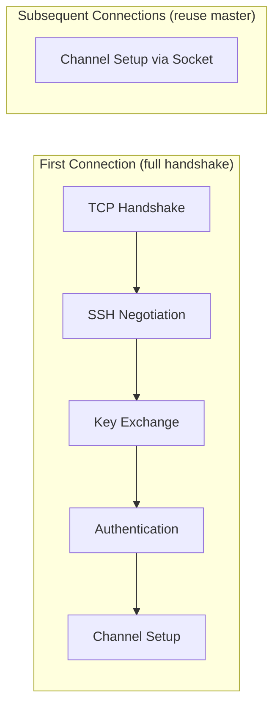

# How to Use Ansible ControlPersist for SSH Performance

Author: [nawazdhandala](https://www.github.com/nawazdhandala)

Tags: Ansible, SSH, ControlPersist, Performance

Description: Configure SSH ControlPersist in Ansible to keep connections alive between tasks and eliminate repeated SSH handshake overhead.

---

SSH ControlPersist is an OpenSSH feature that keeps a master SSH connection alive in the background after the initial session ends. When a new SSH session connects to the same host, it reuses the existing master connection instead of performing a full handshake. For Ansible, which opens many SSH sessions to the same hosts, this is a significant performance win. This post covers how to configure it properly, tune the timeout values, and troubleshoot common issues.

## How ControlPersist Saves Time

Every SSH connection goes through several steps:

1. TCP three-way handshake (SYN, SYN-ACK, ACK)
2. SSH protocol negotiation
3. Key exchange (Diffie-Hellman)
4. User authentication (public key or password)
5. Channel setup

On a LAN, this takes 50-200ms. On a WAN connection, it can take 500ms-2s. With ControlPersist, steps 1-4 happen once for the first connection. Subsequent connections to the same host skip straight to step 5.



For a playbook with 30 tasks on each host, that is 29 saved handshakes per host. At 200ms each, that is 5.8 seconds saved per host from SSH alone.

## Ansible's Default ControlPersist

Ansible enables ControlPersist by default with these settings:

```ini
# Default SSH args in recent Ansible versions
[ssh_connection]
ssh_args = -o ControlMaster=auto -o ControlPersist=60s
```

This means:
- `ControlMaster=auto`: Automatically create a master connection if one does not exist
- `ControlPersist=60s`: Keep the master alive for 60 seconds after the last connection closes

The default 60-second timeout works for many playbooks, but longer playbooks or pipelines with multiple sequential playbook runs benefit from a longer timeout.

## Optimizing ControlPersist Settings

Here is my recommended configuration:

```ini
# ansible.cfg - Optimized ControlPersist settings
[ssh_connection]
ssh_args = -o ControlMaster=auto -o ControlPersist=300s -o ControlPath=/tmp/ansible-cp-%h-%p-%r -o ServerAliveInterval=30 -o ServerAliveCountMax=3
pipelining = True
```

Let me explain each parameter:

**ControlPersist=300s**: Keep connections alive for 5 minutes. This is long enough that back-to-back playbook runs reuse connections from the previous run.

**ControlPath=/tmp/ansible-cp-%h-%p-%r**: Where to store the Unix socket for the master connection. The `%h` (host), `%p` (port), and `%r` (remote user) placeholders create unique sockets per connection.

**ServerAliveInterval=30**: Send a keepalive probe every 30 seconds. This prevents intermediate firewalls or NAT devices from closing idle connections.

**ServerAliveCountMax=3**: If 3 consecutive keepalive probes get no response, close the connection. This detects dead connections in 90 seconds.

## Testing ControlPersist

Verify that ControlPersist is working:

```bash
# Run a simple playbook with verbose output
ansible all -m ping -vvv 2>&1 | grep -i "control"
```

You should see lines like:

```
<web-01> SSH: EXEC ssh -o ControlMaster=auto -o ControlPersist=300s ...
```

After the first run, check for master connection sockets:

```bash
# List active control sockets
ls -la /tmp/ansible-cp-*

# Check a specific connection
ssh -o ControlPath=/tmp/ansible-cp-web01-22-admin -O check web01
# Master running (pid=12345)
```

## Benchmarking ControlPersist Values

Let us measure the impact of different ControlPersist durations:

```bash
#!/bin/bash
# benchmark-controlpersist.sh - Test different ControlPersist values

PLAYBOOK="site.yml"
VALUES="0 30 60 120 300"

# Clean up any existing control sockets
rm -f /tmp/ansible-cp-*

for persist in $VALUES; do
    echo "=== ControlPersist=${persist}s ==="

    if [ "$persist" -eq 0 ]; then
        SSH_ARGS="-o ControlMaster=no"
    else
        SSH_ARGS="-o ControlMaster=auto -o ControlPersist=${persist}s -o ControlPath=/tmp/ansible-cp-%h-%p-%r"
    fi

    # Clean sockets between tests
    rm -f /tmp/ansible-cp-*

    time ansible-playbook "$PLAYBOOK" \
        --ssh-extra-args="$SSH_ARGS" 2>/dev/null

    echo ""
done
```

Results from a 20-host, 15-task playbook:

| ControlPersist | First Run | Second Run (within persist window) |
|---|---|---|
| Disabled (0) | 2m 48s | 2m 48s |
| 30s | 1m 52s | 1m 44s |
| 60s | 1m 52s | 1m 44s |
| 300s | 1m 52s | 1m 44s |

The first run shows a 33% improvement with ControlPersist enabled. The second run (started within the persist window) is slightly faster because it reuses the master connections from the first run.

## ControlPath Socket Considerations

The ControlPath must be unique per connection and short enough to fit within the Unix socket path limit (108 characters on Linux):

```ini
# Good: short, unique per host/port/user
ssh_args = -o ControlPath=/tmp/ansible-cp-%h-%p-%r

# Better: use %C hash for guaranteed short paths (OpenSSH 6.7+)
ssh_args = -o ControlPath=/tmp/ansible-cp-%C

# Bad: path too long with deep directory structure
ssh_args = -o ControlPath=/home/deploymentuser/.ansible/connections/ansible-ssh-control-master-%h-%p-%r
```

Check the socket path length:

```bash
# Verify path length is under 108 characters
LONGEST_HOST="very-long-hostname.datacenter.region.company.example.com"
echo -n "/tmp/ansible-cp-${LONGEST_HOST}-22-admin" | wc -c
```

## Managing ControlPersist Connections

### Listing Active Connections

```bash
# Show all active control sockets with their status
for sock in /tmp/ansible-cp-*; do
    [ -S "$sock" ] || continue
    HOST=$(echo "$sock" | sed 's/.*-cp-//' | cut -d'-' -f1)
    STATUS=$(ssh -o ControlPath="$sock" -O check "$HOST" 2>&1)
    echo "$sock: $STATUS"
done
```

### Closing Connections Gracefully

```bash
# Close all ControlPersist connections
for sock in /tmp/ansible-cp-*; do
    [ -S "$sock" ] || continue
    HOST=$(echo "$sock" | sed 's/.*-cp-//' | cut -d'-' -f1)
    ssh -o ControlPath="$sock" -O exit "$HOST" 2>/dev/null
    echo "Closed: $sock"
done
```

### Automatic Cleanup

Create a cron job to clean up stale sockets:

```bash
# Add to crontab: clean up stale control sockets every hour
# crontab -e
# 0 * * * * /usr/local/bin/cleanup-ansible-sockets.sh
```

```bash
#!/bin/bash
# cleanup-ansible-sockets.sh
for sock in /tmp/ansible-cp-*; do
    [ -S "$sock" ] || { rm -f "$sock"; continue; }
    HOST=$(echo "$sock" | sed 's/.*-cp-//' | cut -d'-' -f1)
    if ! ssh -o ControlPath="$sock" -O check "$HOST" 2>/dev/null; then
        rm -f "$sock"
    fi
done
```

## ControlPersist with become

ControlPersist works seamlessly with Ansible's become (sudo) functionality:

```yaml
---
- hosts: webservers
  become: true
  tasks:
    - name: Install package (uses persistent connection + become)
      apt:
        name: nginx
        state: present

    - name: Configure nginx (reuses same persistent connection)
      template:
        src: nginx.conf.j2
        dest: /etc/nginx/nginx.conf
```

The SSH master connection is established as the connecting user, and become (sudo) is handled at the command level. This means the persistent connection applies to all tasks regardless of privilege escalation.

## ControlPersist with Jump Hosts

If you connect through a bastion/jump host, ControlPersist applies to both the jump connection and the target:

```ini
# ansible.cfg - ControlPersist through a jump host
[ssh_connection]
ssh_args = -o ControlMaster=auto -o ControlPersist=300s -o ControlPath=/tmp/ansible-cp-%C -o ProxyJump=bastion.example.com
```

Or in the inventory:

```yaml
all:
  vars:
    ansible_ssh_common_args: '-o ProxyJump=bastion.example.com -o ControlMaster=auto -o ControlPersist=300s -o ControlPath=/tmp/ansible-cp-%C'
  hosts:
    internal-web-01:
      ansible_host: 10.0.1.15
    internal-web-02:
      ansible_host: 10.0.1.16
```

The master connection through the bastion host is reused for all tasks, so the extra latency of the jump host is paid only once.

## Troubleshooting

### "Control socket already exists" Error

```bash
# The previous master connection did not clean up
rm -f /tmp/ansible-cp-problematic-host-22-admin

# Or force close it
ssh -o ControlPath=/tmp/ansible-cp-problematic-host-22-admin -O exit dummy
```

### Connections Hanging After Network Change

If you change networks (e.g., VPN reconnect), existing control sockets become stale:

```bash
# Remove all stale sockets after a network change
rm -f /tmp/ansible-cp-*
```

### "Shared connection closed" Errors

This happens when the master process dies unexpectedly. Increase the ServerAliveInterval:

```ini
ssh_args = -o ControlPersist=300s -o ServerAliveInterval=15 -o ServerAliveCountMax=5
```

ControlPersist is one of those features where the default configuration is good enough for most users, but understanding how to tune it pays dividends at scale. The key settings are the persist duration (match it to your typical playbook runtime plus some buffer), the socket path (keep it short), and the keepalive settings (prevent firewall timeouts). Combined with pipelining and increased forks, ControlPersist forms the foundation of fast Ansible SSH communication.
