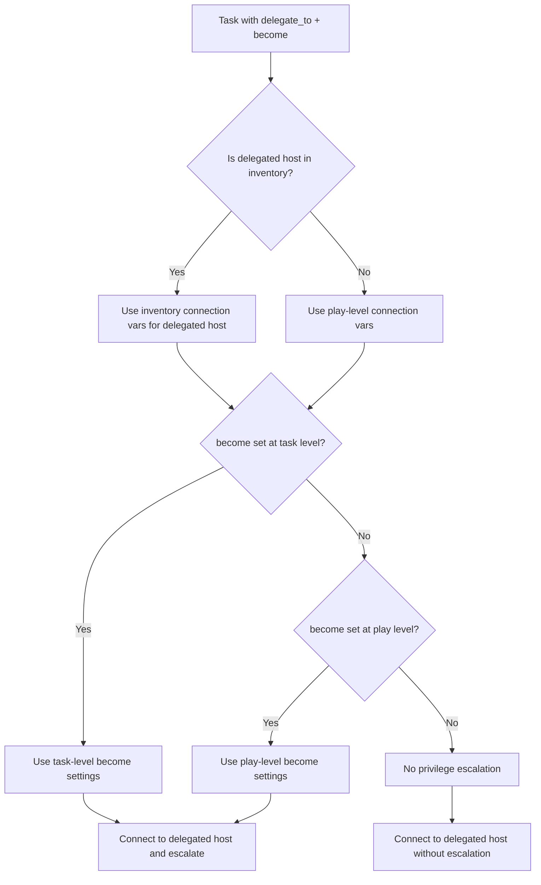

# How to Use Ansible delegate_to with Become

Author: [nawazdhandala](https://www.github.com/nawazdhandala)

Tags: Ansible, Delegation, Privilege Escalation, Security

Description: Learn how to combine Ansible delegate_to with become for privilege escalation on delegated hosts, including common pitfalls and working examples.

---

Combining `delegate_to` with `become` in Ansible is one of those things that seems straightforward until you actually try it. The interaction between task delegation and privilege escalation has some nuances that can trip you up if you are not aware of them. In this post, we will cover how these two features work together, what the common pitfalls are, and how to get reliable privilege escalation on delegated tasks.

## How become Works with delegate_to

When you use `delegate_to` on a task, Ansible runs that task on the delegated host instead of the current target. When you also set `become: true`, the privilege escalation applies on the delegated host, not on the original target host. This is important to understand because the become configuration (user, method, password) needs to be valid for the delegated host.

Here is a simple example:

```yaml
# basic_delegate_become.yml - Install a package on a different host with sudo
---
- name: Demonstrate delegate_to with become
  hosts: webservers
  gather_facts: false
  tasks:
    - name: Install monitoring agent on the monitoring server
      ansible.builtin.apt:
        name: prometheus-node-exporter
        state: present
      delegate_to: monitoring.example.com
      become: true
      become_user: root
      become_method: sudo
      run_once: true
```

In this play, even though we are targeting `webservers`, the apt task actually runs on `monitoring.example.com` with sudo privileges. The `run_once: true` prevents the task from executing once per web server.

## The Connection User Problem

The trickiest part of combining delegation with become is understanding which credentials get used. By default, when you delegate to a host, Ansible uses the connection variables (like `ansible_user` and `ansible_ssh_pass`) from the delegated host's inventory entry, but it uses the become settings from the task itself.

If the delegated host is not in your inventory, Ansible falls back to the connection settings of the current play.

```yaml
# connection_user_example.yml - Showing which credentials apply where
---
- name: Show credential behavior with delegation
  hosts: appservers
  become: false
  vars:
    ansible_user: deploy
  tasks:
    # This task connects to db.example.com as whatever user
    # is defined for db.example.com in inventory,
    # then escalates to root via sudo
    - name: Restart PostgreSQL on the database server
      ansible.builtin.systemd:
        name: postgresql
        state: restarted
      delegate_to: db.example.com
      become: true
      become_user: root
```

To explicitly control the connection user for the delegated host, set the variables at the inventory level.

```ini
# inventory/hosts - Set connection vars per host
[databases]
db.example.com ansible_user=admin ansible_become_pass=secretpass

[appservers]
app01.example.com ansible_user=deploy
app02.example.com ansible_user=deploy
```

## Delegating to localhost with become

A very common pattern is delegating to localhost to run local commands with elevated privileges. This is useful for updating local configuration files, managing local services, or running privileged commands on the Ansible control node.

```yaml
# delegate_localhost_become.yml - Run privileged local commands
---
- name: Update local firewall rules based on remote host IPs
  hosts: webservers
  gather_facts: true
  tasks:
    - name: Add iptables rule for each web server
      ansible.builtin.iptables:
        chain: INPUT
        source: "{{ ansible_default_ipv4.address }}"
        protocol: tcp
        destination_port: "9090"
        jump: ACCEPT
      delegate_to: localhost
      become: true
      become_user: root
```

Watch out for a common gotcha here: if you are running Ansible as a non-root user on your control machine, you need to make sure that user has sudo access on localhost. This is separate from any SSH-based become configuration.

## Overriding become per Delegated Task

Sometimes your play-level `become` settings do not match what the delegated host needs. You can override become at the task level.

```yaml
# override_become.yml - Different become settings for delegated tasks
---
- name: Play with mixed privilege requirements
  hosts: appservers
  become: true
  become_user: root
  become_method: sudo
  tasks:
    - name: Deploy application (runs on appservers as root)
      ansible.builtin.copy:
        src: /opt/releases/myapp-v2.tar.gz
        dest: /opt/myapp/
        remote_src: true

    - name: Update DNS record on DNS server (needs different become)
      ansible.builtin.lineinfile:
        path: /etc/bind/zones/example.com.zone
        regexp: "{{ inventory_hostname }}\\s+IN\\s+A"
        line: "{{ inventory_hostname }}  IN  A  {{ ansible_default_ipv4.address }}"
      delegate_to: dns.example.com
      become: true
      become_user: bind
      become_method: sudo

    - name: Record deployment in local log (no become needed)
      ansible.builtin.lineinfile:
        path: /var/log/deployments.log
        line: "{{ inventory_hostname }} deployed at {{ ansible_date_time.iso8601 }}"
        create: true
      delegate_to: localhost
      become: false
```

## Handling become Passwords with Delegation

If your delegated host requires a different become password than your play targets, you need to set it through inventory variables or at the task level using `vars`.

```yaml
# become_password_delegation.yml - Handle different become passwords
---
- name: Manage services across hosts with different passwords
  hosts: webservers
  become: true
  tasks:
    - name: Restart web service locally
      ansible.builtin.systemd:
        name: nginx
        state: restarted

    - name: Flush cache on the cache server
      ansible.builtin.command: redis-cli FLUSHALL
      delegate_to: cache.example.com
      become: true
      become_user: redis
      vars:
        ansible_become_pass: "{{ vault_cache_server_become_pass }}"
```

Store the password in an Ansible Vault file to keep it secure:

```yaml
# group_vars/all/vault.yml (encrypted with ansible-vault)
---
vault_cache_server_become_pass: "s3cur3p4ss"
```

## Using become with delegate_to and register

When you register the output of a delegated task, the registered variable is assigned to the current host in the loop, not the delegated host. This is true regardless of become settings.

```yaml
# register_delegated.yml - Register output from delegated become tasks
---
- name: Check service status on multiple hosts
  hosts: monitoring_server
  gather_facts: false
  tasks:
    - name: Check nginx status on each web server
      ansible.builtin.systemd:
        name: nginx
      delegate_to: "{{ item }}"
      become: true
      register: nginx_status
      loop: "{{ groups['webservers'] }}"

    - name: Report any stopped nginx instances
      ansible.builtin.debug:
        msg: "nginx is NOT running on {{ item.item }}"
      loop: "{{ nginx_status.results }}"
      when: item.status.ActiveState != "active"
```

## Flow Diagram

Here is how Ansible resolves credentials when you combine delegation with become:



## Common Pitfalls and Solutions

**Pitfall 1: become_user mismatch.** If you set `become_user: postgres` at the play level and then delegate to localhost, Ansible will try to become the postgres user on your local machine. That user might not exist locally. Always override become settings on delegated tasks when the delegated host has a different user setup.

**Pitfall 2: Missing sudo configuration.** The delegated host needs sudo (or whatever become method you use) configured for the connecting user. Just because your appservers have passwordless sudo does not mean your database server does too.

**Pitfall 3: Forgetting that become applies to the delegated host.** This is the most common mistake. When you write `become: true` on a delegated task, it escalates privileges on the host you are delegating to, not on the original target host.

**Pitfall 4: ansible_become_pass not reaching the delegated host.** If you set `ansible_become_pass` in your play vars, it applies to all tasks including delegated ones. Use host-specific variables in your inventory to handle different passwords per host.

## Best Practice: Explicit Over Implicit

When mixing delegation and become, always be explicit about your settings. Do not rely on play-level defaults cascading to delegated tasks. Spell out `become`, `become_user`, `become_method`, and connection variables directly on the delegated task. It makes the playbook more readable and prevents surprises when the delegated host has a different configuration than your primary targets.

```yaml
    # Good: explicit about everything
    - name: Clear cache on remote host
      ansible.builtin.command: redis-cli FLUSHALL
      delegate_to: cache.example.com
      become: true
      become_user: redis
      become_method: sudo
      vars:
        ansible_user: admin
        ansible_become_pass: "{{ vault_cache_become_pass }}"
```

This approach eliminates ambiguity and makes debugging much simpler when something goes wrong.
