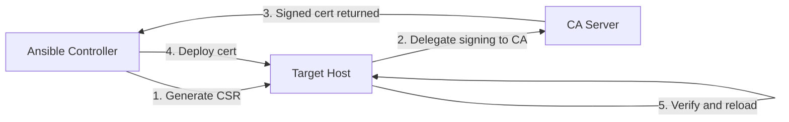

# How to Use Ansible Delegation for Certificate Management

Author: [nawazdhandala](https://www.github.com/nawazdhandala)

Tags: Ansible, SSL, Certificates, Delegation, Security

Description: Learn how to use Ansible delegation to manage SSL/TLS certificates across your infrastructure using a centralized certificate authority.

---

SSL/TLS certificate management is a perfect use case for Ansible delegation. You generate certificates on a Certificate Authority (CA) server or through an API, then distribute them to the hosts that need them. Delegation lets you do this in a single playbook: generate on the CA, copy to the target, and verify everything works.

## The Certificate Management Workflow

Here is the typical flow for certificate management with delegation:



## Generating and Signing Certificates with Delegation

This playbook generates a Certificate Signing Request (CSR) on the target host, gets it signed by your internal CA, and deploys the signed certificate back:

```yaml
# cert-management.yml - Full certificate lifecycle with delegation
---
- name: Manage SSL certificates
  hosts: webservers
  become: true
  vars:
    ca_server: ca.internal.example.com
    cert_dir: /etc/ssl/myapp
    ca_cert_dir: /opt/ca
    cert_validity_days: 365
  tasks:
    - name: Ensure certificate directory exists
      ansible.builtin.file:
        path: "{{ cert_dir }}"
        state: directory
        mode: '0750'
        owner: root
        group: ssl-cert

    - name: Generate private key on target host
      community.crypto.openssl_privatekey:
        path: "{{ cert_dir }}/{{ inventory_hostname }}.key"
        size: 4096
        mode: '0640'
        owner: root
        group: ssl-cert

    - name: Generate CSR on target host
      community.crypto.openssl_csr:
        path: "{{ cert_dir }}/{{ inventory_hostname }}.csr"
        privatekey_path: "{{ cert_dir }}/{{ inventory_hostname }}.key"
        common_name: "{{ inventory_hostname }}"
        subject_alt_name:
          - "DNS:{{ inventory_hostname }}"
          - "DNS:{{ inventory_hostname_short }}"
          - "IP:{{ ansible_default_ipv4.address }}"
        organization_name: "MyOrg"
        mode: '0644'

    - name: Fetch CSR to controller
      ansible.builtin.fetch:
        src: "{{ cert_dir }}/{{ inventory_hostname }}.csr"
        dest: "/tmp/certs/{{ inventory_hostname }}.csr"
        flat: true

    - name: Sign CSR on the CA server
      ansible.builtin.shell: |
        openssl x509 -req \
          -in /tmp/certs/{{ inventory_hostname }}.csr \
          -CA {{ ca_cert_dir }}/ca.crt \
          -CAkey {{ ca_cert_dir }}/ca.key \
          -CAcreateserial \
          -out /tmp/certs/{{ inventory_hostname }}.crt \
          -days {{ cert_validity_days }} \
          -sha256 \
          -extfile <(printf "subjectAltName=DNS:{{ inventory_hostname }},DNS:{{ inventory_hostname_short }},IP:{{ ansible_default_ipv4.address }}")
      delegate_to: "{{ ca_server }}"
      become: true

    - name: Fetch signed certificate from CA to controller
      ansible.builtin.fetch:
        src: "/tmp/certs/{{ inventory_hostname }}.crt"
        dest: "/tmp/certs/{{ inventory_hostname }}.crt"
        flat: true
      delegate_to: "{{ ca_server }}"

    - name: Deploy signed certificate to target host
      ansible.builtin.copy:
        src: "/tmp/certs/{{ inventory_hostname }}.crt"
        dest: "{{ cert_dir }}/{{ inventory_hostname }}.crt"
        mode: '0644'
        owner: root
        group: ssl-cert

    - name: Deploy CA certificate chain
      ansible.builtin.copy:
        src: "ca-chain.crt"
        dest: "{{ cert_dir }}/ca-chain.crt"
        mode: '0644'

    - name: Create full chain certificate
      ansible.builtin.shell: |
        cat {{ cert_dir }}/{{ inventory_hostname }}.crt {{ cert_dir }}/ca-chain.crt \
          > {{ cert_dir }}/{{ inventory_hostname }}-fullchain.crt
      changed_when: true

    - name: Verify certificate
      ansible.builtin.shell: |
        openssl verify -CAfile {{ cert_dir }}/ca-chain.crt {{ cert_dir }}/{{ inventory_hostname }}.crt
      register: cert_verify
      changed_when: false

    - name: Reload nginx to use new certificate
      ansible.builtin.systemd:
        name: nginx
        state: reloaded
```

## Let's Encrypt Certificate Management

For public-facing services, Let's Encrypt certificates are common. The ACME challenge often requires coordination between the web server and the controller.

```yaml
# letsencrypt-certs.yml - Let's Encrypt certificate management
---
- name: Manage Let's Encrypt certificates
  hosts: webservers
  become: true
  vars:
    acme_email: admin@example.com
    cert_dir: /etc/letsencrypt/live
  tasks:
    - name: Install certbot
      ansible.builtin.apt:
        name:
          - certbot
          - python3-certbot-nginx
        state: present

    - name: Check if certificate exists and is valid
      ansible.builtin.shell: |
        if [ -f {{ cert_dir }}/{{ inventory_hostname }}/fullchain.pem ]; then
          EXPIRY=$(openssl x509 -enddate -noout -in {{ cert_dir }}/{{ inventory_hostname }}/fullchain.pem | cut -d= -f2)
          EXPIRY_EPOCH=$(date -d "$EXPIRY" +%s)
          NOW_EPOCH=$(date +%s)
          DAYS_LEFT=$(( ($EXPIRY_EPOCH - $NOW_EPOCH) / 86400 ))
          echo "$DAYS_LEFT"
        else
          echo "0"
        fi
      register: cert_days_left
      changed_when: false

    - name: Request new certificate if needed
      ansible.builtin.command: >
        certbot certonly
        --nginx
        --non-interactive
        --agree-tos
        --email {{ acme_email }}
        -d {{ inventory_hostname }}
        -d www.{{ inventory_hostname_short }}.example.com
      when: cert_days_left.stdout | int < 30
      register: certbot_result
      notify: Reload nginx

    - name: Update certificate in cloud CDN
      ansible.builtin.uri:
        url: "https://api.cloudflare.com/client/v4/zones/{{ cf_zone_id }}/custom_certificates"
        method: POST
        headers:
          Authorization: "Bearer {{ cloudflare_api_token }}"
        body_format: json
        body:
          certificate: "{{ lookup('file', cert_dir + '/' + inventory_hostname + '/fullchain.pem') }}"
          private_key: "{{ lookup('file', cert_dir + '/' + inventory_hostname + '/privkey.pem') }}"
      delegate_to: localhost
      when: certbot_result is changed
      no_log: true

  handlers:
    - name: Reload nginx
      ansible.builtin.systemd:
        name: nginx
        state: reloaded
```

## Certificate Rotation Strategy

For rotating certificates across a fleet without downtime:

```yaml
# cert-rotation.yml - Rolling certificate rotation
---
- name: Rotate certificates across web fleet
  hosts: webservers
  serial: 1          # One at a time to avoid downtime
  become: true
  vars:
    cert_dir: /etc/ssl/myapp
    ca_server: ca.internal.example.com
  tasks:
    - name: Generate new private key (keep old one until switch)
      community.crypto.openssl_privatekey:
        path: "{{ cert_dir }}/{{ inventory_hostname }}.key.new"
        size: 4096
        mode: '0640'

    - name: Generate new CSR
      community.crypto.openssl_csr:
        path: "{{ cert_dir }}/{{ inventory_hostname }}.csr.new"
        privatekey_path: "{{ cert_dir }}/{{ inventory_hostname }}.key.new"
        common_name: "{{ inventory_hostname }}"
        subject_alt_name:
          - "DNS:{{ inventory_hostname }}"
          - "IP:{{ ansible_default_ipv4.address }}"

    - name: Copy CSR to CA server and sign
      block:
        - name: Copy CSR to CA server
          ansible.builtin.copy:
            src: "{{ cert_dir }}/{{ inventory_hostname }}.csr.new"
            dest: "/tmp/{{ inventory_hostname }}.csr"
          delegate_to: "{{ ca_server }}"

        - name: Sign the certificate
          ansible.builtin.shell: |
            openssl x509 -req \
              -in /tmp/{{ inventory_hostname }}.csr \
              -CA /opt/ca/ca.crt \
              -CAkey /opt/ca/ca.key \
              -CAcreateserial \
              -out /tmp/{{ inventory_hostname }}.crt \
              -days 365 -sha256
          delegate_to: "{{ ca_server }}"
          become: true

        - name: Fetch signed cert back
          ansible.builtin.fetch:
            src: "/tmp/{{ inventory_hostname }}.crt"
            dest: "/tmp/signed-certs/{{ inventory_hostname }}.crt"
            flat: true
          delegate_to: "{{ ca_server }}"

    - name: Deploy new certificate
      ansible.builtin.copy:
        src: "/tmp/signed-certs/{{ inventory_hostname }}.crt"
        dest: "{{ cert_dir }}/{{ inventory_hostname }}.crt.new"
        mode: '0644'

    - name: Atomic swap - replace old cert with new
      ansible.builtin.shell: |
        mv {{ cert_dir }}/{{ inventory_hostname }}.key {{ cert_dir }}/{{ inventory_hostname }}.key.old
        mv {{ cert_dir }}/{{ inventory_hostname }}.crt {{ cert_dir }}/{{ inventory_hostname }}.crt.old
        mv {{ cert_dir }}/{{ inventory_hostname }}.key.new {{ cert_dir }}/{{ inventory_hostname }}.key
        mv {{ cert_dir }}/{{ inventory_hostname }}.crt.new {{ cert_dir }}/{{ inventory_hostname }}.crt

    - name: Reload web server
      ansible.builtin.systemd:
        name: nginx
        state: reloaded

    - name: Verify new certificate is serving
      ansible.builtin.shell: |
        echo | openssl s_client -connect {{ ansible_host }}:443 -servername {{ inventory_hostname }} 2>/dev/null | \
          openssl x509 -noout -dates -subject
      register: live_cert
      delegate_to: localhost
      changed_when: false

    - name: Show certificate info
      ansible.builtin.debug:
        msg: "Live certificate: {{ live_cert.stdout }}"
```

## Certificate Expiry Monitoring

Use delegation to check certificate expiry across your fleet:

```yaml
# cert-monitor.yml - Check certificate expiry across all hosts
---
- name: Monitor certificate expiry
  hosts: webservers
  gather_facts: false
  tasks:
    - name: Check certificate expiry remotely
      ansible.builtin.shell: |
        echo | openssl s_client -connect {{ ansible_host }}:443 -servername {{ inventory_hostname }} 2>/dev/null | \
          openssl x509 -noout -enddate | cut -d= -f2
      register: cert_expiry
      delegate_to: localhost
      changed_when: false
      ignore_errors: true

    - name: Calculate days until expiry
      ansible.builtin.set_fact:
        days_until_expiry: >-
          {{ ((cert_expiry.stdout | to_datetime('%b %d %H:%M:%S %Y %Z')).timestamp() - now().timestamp()) / 86400 | int }}
      when: cert_expiry is succeeded

    - name: Report certificates expiring within 30 days
      ansible.builtin.debug:
        msg: "WARNING: {{ inventory_hostname }} certificate expires in {{ days_until_expiry }} days ({{ cert_expiry.stdout }})"
      when:
        - cert_expiry is succeeded
        - days_until_expiry | int < 30

    - name: Send alert for near-expiry certificates
      ansible.builtin.uri:
        url: "{{ slack_webhook_url }}"
        method: POST
        body_format: json
        body:
          text: "Certificate expiring soon: {{ inventory_hostname }} - {{ days_until_expiry }} days remaining"
      delegate_to: localhost
      when:
        - cert_expiry is succeeded
        - days_until_expiry | int < 14
```

## Summary

Certificate management with Ansible delegation centralizes the signing process while distributing certificates to the hosts that need them. Generate keys and CSRs on the target host, delegate signing to your CA server, then deploy the signed certificate back. For Let's Encrypt, the target host handles the ACME challenge while the controller manages API updates. Always rotate certificates one server at a time using `serial: 1`, verify the new certificate is serving correctly before moving to the next host, and use delegation to monitor expiry dates from the controller.
