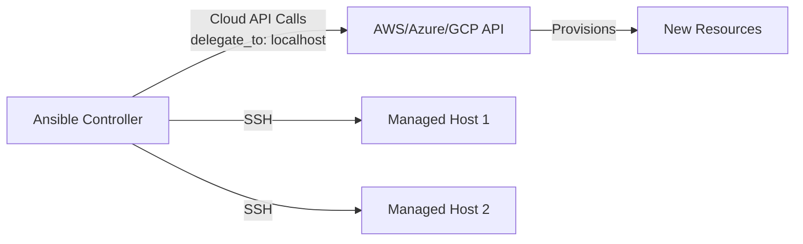

# How to Use Ansible Delegation for Cloud API Operations

Author: [nawazdhandala](https://www.github.com/nawazdhandala)

Tags: Ansible, Cloud, AWS, Azure, Delegation

Description: Learn how to use Ansible delegation to manage cloud resources through API operations during infrastructure automation workflows.

---

Cloud resource management through Ansible almost always involves delegation to localhost. Cloud APIs (AWS, Azure, GCP) are called from the controller, not from the managed hosts. Whether you are provisioning new instances, updating security groups, managing DNS, or configuring load balancers, the cloud modules run locally and communicate with the cloud provider's API endpoints. Understanding how delegation works with cloud modules helps you build playbooks that mix cloud operations with server configuration in a single workflow.

## Why Cloud Operations Need Delegation

Cloud modules call provider APIs. These API calls need credentials (IAM roles, service principals, API keys) and network access to the cloud API endpoints. Your Ansible controller has these; your managed hosts typically do not and should not.



## AWS Operations with Delegation

Here is a playbook that provisions and configures AWS infrastructure alongside server configuration:

```yaml
# aws-cloud-ops.yml - AWS operations mixed with server configuration
---
- name: Deploy application with AWS resource management
  hosts: webservers
  gather_facts: true
  vars:
    aws_region: us-east-1
    app_version: "2.5.0"
  tasks:
    # Cloud operation: Update security group (runs once on controller)
    - name: Ensure security group allows app port
      amazon.aws.ec2_security_group:
        name: myapp-sg
        description: "Security group for myapp"
        region: "{{ aws_region }}"
        rules:
          - proto: tcp
            from_port: 8080
            to_port: 8080
            cidr_ip: "10.0.0.0/8"
            rule_desc: "Internal app access"
          - proto: tcp
            from_port: 443
            to_port: 443
            cidr_ip: "0.0.0.0/0"
            rule_desc: "HTTPS"
        state: present
      delegate_to: localhost
      run_once: true

    # Cloud operation: Deregister from target group (per host, on controller)
    - name: Deregister instance from ALB target group
      community.aws.elb_target:
        target_group_arn: "{{ target_group_arn }}"
        target_id: "{{ ec2_instance_id }}"
        state: absent
        region: "{{ aws_region }}"
      delegate_to: localhost

    # Server operation: Deploy application (on the remote host)
    - name: Deploy application code
      ansible.builtin.copy:
        src: "/releases/myapp-{{ app_version }}/"
        dest: /opt/myapp/
      become: true

    - name: Restart application
      ansible.builtin.systemd:
        name: myapp
        state: restarted
      become: true

    # Server operation: Wait for health (on remote host)
    - name: Wait for application to be healthy
      ansible.builtin.uri:
        url: http://localhost:8080/health
        status_code: 200
      register: health
      retries: 15
      delay: 5
      until: health.status == 200

    # Cloud operation: Register back with target group
    - name: Register instance with ALB target group
      community.aws.elb_target:
        target_group_arn: "{{ target_group_arn }}"
        target_id: "{{ ec2_instance_id }}"
        target_port: 8080
        state: present
        region: "{{ aws_region }}"
      delegate_to: localhost

    # Cloud operation: Update Route53 DNS (per host, on controller)
    - name: Update DNS record
      amazon.aws.route53:
        zone: "example.com"
        record: "{{ inventory_hostname }}.example.com"
        type: A
        value: "{{ ansible_default_ipv4.address }}"
        ttl: 300
        state: present
        overwrite: true
      delegate_to: localhost
```

## Azure Operations with Delegation

Azure cloud operations follow the same delegation pattern:

```yaml
# azure-cloud-ops.yml - Azure operations during deployment
---
- name: Deploy to Azure VMs with cloud resource management
  hosts: azure_vms
  gather_facts: true
  vars:
    resource_group: myapp-rg
    location: eastus
  tasks:
    # Cloud: Update NSG rules
    - name: Ensure network security group allows traffic
      azure.azcollection.azure_rm_securitygroup:
        resource_group: "{{ resource_group }}"
        name: myapp-nsg
        rules:
          - name: AllowHTTPS
            protocol: Tcp
            destination_port_range: 443
            access: Allow
            priority: 100
            direction: Inbound
          - name: AllowAppPort
            protocol: Tcp
            destination_port_range: 8080
            access: Allow
            priority: 110
            direction: Inbound
            source_address_prefix: VirtualNetwork
      delegate_to: localhost
      run_once: true

    # Cloud: Remove from Azure Load Balancer backend pool
    - name: Get current VM NIC info
      azure.azcollection.azure_rm_networkinterface_info:
        resource_group: "{{ resource_group }}"
        name: "{{ inventory_hostname }}-nic"
      register: nic_info
      delegate_to: localhost

    # Server: Deploy application
    - name: Deploy application
      ansible.builtin.copy:
        src: /releases/{{ version }}/
        dest: /opt/myapp/
      become: true

    - name: Restart application
      ansible.builtin.systemd:
        name: myapp
        state: restarted
      become: true

    # Cloud: Update VMSS health if using scale sets
    - name: Wait and verify health
      ansible.builtin.uri:
        url: "http://{{ ansible_host }}:8080/health"
        status_code: 200
      delegate_to: localhost
      retries: 20
      delay: 5
      register: health
      until: health.status == 200
```

## Multi-Cloud Operations

When your infrastructure spans multiple cloud providers, delegation to localhost handles all of them:

```yaml
# multi-cloud-ops.yml - Operations across AWS and Azure
---
- name: Multi-cloud deployment coordination
  hosts: all_app_servers
  gather_facts: true
  tasks:
    # AWS operations for AWS-hosted servers
    - name: Update AWS Route53 DNS
      amazon.aws.route53:
        zone: "example.com"
        record: "{{ inventory_hostname }}.example.com"
        type: A
        value: "{{ ansible_default_ipv4.address }}"
        state: present
      delegate_to: localhost
      when: "'aws_servers' in group_names"

    # Azure operations for Azure-hosted servers
    - name: Update Azure DNS
      azure.azcollection.azure_rm_dnsrecordset:
        resource_group: dns-rg
        zone_name: example.com
        relative_name: "{{ inventory_hostname_short }}"
        record_type: A
        records:
          - entry: "{{ ansible_default_ipv4.address }}"
      delegate_to: localhost
      when: "'azure_servers' in group_names"

    # Common operations run on all servers regardless of cloud
    - name: Deploy application
      ansible.builtin.copy:
        src: /releases/{{ version }}/
        dest: /opt/myapp/
      become: true

    - name: Update global service registry
      ansible.builtin.uri:
        url: "https://registry.example.com/api/v1/services/myapp/instances"
        method: POST
        body_format: json
        body:
          hostname: "{{ inventory_hostname }}"
          ip: "{{ ansible_default_ipv4.address }}"
          cloud: "{{ 'aws' if 'aws_servers' in group_names else 'azure' }}"
          version: "{{ version }}"
      delegate_to: localhost
```

## Provisioning and Configuration in One Playbook

A common workflow provisions cloud resources and then configures them, all in one playbook:

```yaml
# provision-and-configure.yml - Provision EC2 then configure
---
# Play 1: Provision on localhost
- name: Provision EC2 instances
  hosts: localhost
  connection: local
  gather_facts: false
  tasks:
    - name: Launch EC2 instances
      amazon.aws.ec2_instance:
        name: "web-{{ item }}"
        instance_type: t3.medium
        image_id: ami-0abcdef1234567890
        region: us-east-1
        vpc_subnet_id: subnet-12345
        security_group: myapp-sg
        key_name: deploy-key
        state: running
        wait: true
        wait_timeout: 300
        tags:
          Role: webserver
          Environment: production
      register: ec2_result
      loop: "{{ range(1, 4) | list }}"

    - name: Add new instances to inventory
      ansible.builtin.add_host:
        name: "{{ item.instances[0].public_ip_address }}"
        groups: new_webservers
        ec2_instance_id: "{{ item.instances[0].instance_id }}"
      loop: "{{ ec2_result.results }}"

    - name: Wait for SSH on new instances
      ansible.builtin.wait_for:
        host: "{{ item.instances[0].public_ip_address }}"
        port: 22
        delay: 10
        timeout: 300
      loop: "{{ ec2_result.results }}"

# Play 2: Configure the new instances
- name: Configure new web servers
  hosts: new_webservers
  become: true
  gather_facts: true
  tasks:
    - name: Install application dependencies
      ansible.builtin.apt:
        name:
          - nginx
          - python3
          - python3-pip
        state: present
        update_cache: true

    - name: Deploy application
      ansible.builtin.copy:
        src: /releases/latest/
        dest: /opt/myapp/

    - name: Start application
      ansible.builtin.systemd:
        name: myapp
        state: started
        enabled: true

    # Cloud operation from within server play
    - name: Register with ALB target group
      community.aws.elb_target:
        target_group_arn: "arn:aws:elasticloadbalancing:us-east-1:123456:targetgroup/web-tg/abc123"
        target_id: "{{ ec2_instance_id }}"
        target_port: 8080
        state: present
        region: us-east-1
      delegate_to: localhost

    - name: Create DNS record
      amazon.aws.route53:
        zone: example.com
        record: "{{ inventory_hostname_short }}.example.com"
        type: A
        value: "{{ ansible_default_ipv4.address }}"
        state: present
      delegate_to: localhost
```

## Handling Cloud API Rate Limits

Cloud APIs have rate limits. When processing many hosts, use `throttle` to limit concurrent API calls:

```yaml
# rate-limiting.yml - Handle cloud API rate limits
---
- name: Update cloud resources for all servers
  hosts: all_servers
  tasks:
    - name: Tag EC2 instances (throttled to avoid API rate limits)
      amazon.aws.ec2_tag:
        resource: "{{ ec2_instance_id }}"
        region: us-east-1
        tags:
          AppVersion: "{{ version }}"
          LastDeployed: "{{ now(utc=true).isoformat() }}"
        state: present
      delegate_to: localhost
      throttle: 5         # Max 5 concurrent API calls

    - name: Update Route53 records (throttled)
      amazon.aws.route53:
        zone: example.com
        record: "{{ inventory_hostname }}.example.com"
        type: A
        value: "{{ ansible_default_ipv4.address }}"
        state: present
      delegate_to: localhost
      throttle: 3          # Route53 has stricter rate limits
      retries: 3
      delay: 5
      register: dns_result
      until: dns_result is succeeded
```

## Summary

Cloud API operations in Ansible are inherently local operations that call remote APIs. Delegation to localhost is the standard pattern, whether you are working with AWS, Azure, GCP, or any cloud provider. Use `run_once` for operations that affect shared resources (security groups, DNS zones), per-host delegation for instance-specific operations (target group registration, instance tagging), and `throttle` to respect API rate limits. The ability to mix cloud operations with server configuration in a single playbook is one of Ansible's strengths for infrastructure automation.
