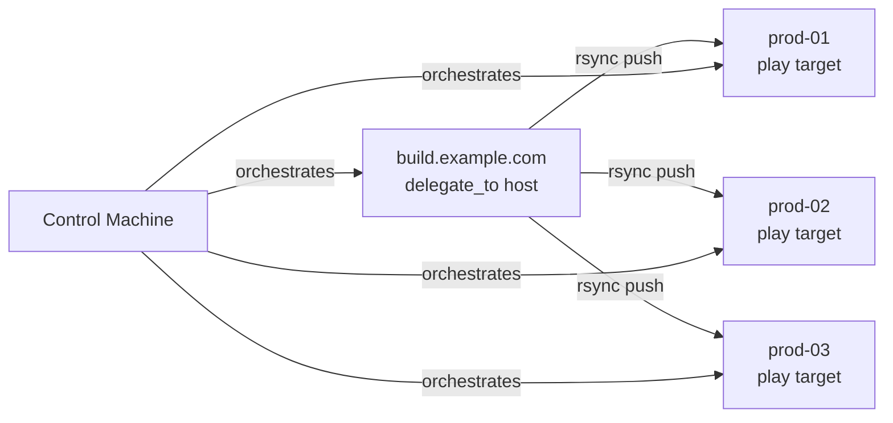

# How to Use Ansible Delegation for Cross-Host File Operations

Author: [nawazdhandala](https://www.github.com/nawazdhandala)

Tags: Ansible, Delegation, File Operations, DevOps

Description: Learn how to use Ansible delegation to copy files between remote hosts, synchronize configs across servers, and perform cross-host file management.

---

Moving files between hosts during an Ansible play is a common requirement. Maybe you need to pull a TLS certificate from a vault server and push it to your web servers. Or perhaps you need to grab a configuration file from one server and distribute it to a dozen others. Ansible's `delegate_to` feature combined with file modules gives you a solid toolkit for cross-host file operations without manual steps.

This post covers practical patterns for copying, syncing, and managing files across different hosts using delegation.

## The Challenge of Cross-Host File Transfers

Ansible tasks normally operate on a single host at a time. The `copy` module copies from the control machine to a remote host. The `fetch` module does the reverse. But what about copying directly from one remote host to another? There is no built-in "remote-to-remote copy" module, so you need to use delegation patterns to achieve this.

## Pattern 1: Fetch Then Distribute

The most reliable approach is to fetch a file to the control machine first, then distribute it to the targets.

```yaml
# fetch_and_distribute.yml - Pull a file from one host, push to many
---
- name: Distribute SSL certificate from vault to web servers
  hosts: webservers
  gather_facts: false
  vars:
    cert_source_host: vault.example.com
    cert_remote_path: /etc/ssl/certs/wildcard.example.com.pem
    cert_local_temp: /tmp/ansible-cert-staging/

  tasks:
    - name: Fetch certificate from vault server to control machine
      ansible.builtin.fetch:
        src: "{{ cert_remote_path }}"
        dest: "{{ cert_local_temp }}"
        flat: true
      delegate_to: "{{ cert_source_host }}"
      run_once: true

    - name: Copy certificate to all web servers
      ansible.builtin.copy:
        src: "{{ cert_local_temp }}wildcard.example.com.pem"
        dest: /etc/nginx/ssl/wildcard.example.com.pem
        owner: root
        group: root
        mode: "0644"

    - name: Clean up temporary cert file on control machine
      ansible.builtin.file:
        path: "{{ cert_local_temp }}"
        state: absent
      delegate_to: localhost
      run_once: true
```

The `flat: true` parameter on the fetch module prevents Ansible from creating the hostname-based directory structure in the destination. This simplifies the subsequent copy step.

## Pattern 2: Synchronize Module with Delegation

The `synchronize` module wraps rsync and supports delegation. This is great for large file transfers or directory syncs between hosts.

```yaml
# sync_between_hosts.yml - Use synchronize to copy between remote hosts
---
- name: Sync application files from build server to production
  hosts: production_servers
  gather_facts: false
  tasks:
    - name: Sync built artifacts from build server
      ansible.posix.synchronize:
        src: /opt/builds/myapp-latest/
        dest: /opt/myapp/current/
        mode: push
        delete: true
        rsync_opts:
          - "--exclude=.git"
          - "--exclude=node_modules"
          - "--compress"
      delegate_to: build.example.com
```

When you delegate `synchronize` to a host, that host becomes the source and pushes files to the current target. The `mode: push` means the delegated host pushes to the play target. If you use `mode: pull`, the play target pulls from the delegated host.

Here is a diagram showing how the synchronize delegation flow works:



## Pattern 3: Reading Remote Files and Writing Elsewhere

Use the `slurp` module to read file contents from one host, then write them to another using delegation.

```yaml
# slurp_and_write.yml - Read config from one host, write to another
---
- name: Copy database config from primary to replicas
  hosts: db_primary
  gather_facts: false
  tasks:
    - name: Read PostgreSQL config from primary
      ansible.builtin.slurp:
        src: /etc/postgresql/15/main/postgresql.conf
      register: pg_config

    - name: Read pg_hba.conf from primary
      ansible.builtin.slurp:
        src: /etc/postgresql/15/main/pg_hba.conf
      register: pg_hba_config

    - name: Write PostgreSQL config to each replica
      ansible.builtin.copy:
        content: "{{ pg_config.content | b64decode }}"
        dest: /etc/postgresql/15/main/postgresql.conf
        owner: postgres
        group: postgres
        mode: "0644"
      delegate_to: "{{ item }}"
      loop: "{{ groups['db_replicas'] }}"

    - name: Write pg_hba.conf to each replica
      ansible.builtin.copy:
        content: "{{ pg_hba_config.content | b64decode }}"
        dest: /etc/postgresql/15/main/pg_hba.conf
        owner: postgres
        group: postgres
        mode: "0640"
      delegate_to: "{{ item }}"
      loop: "{{ groups['db_replicas'] }}"
```

The `slurp` module returns file contents as base64-encoded data. You decode it with the `b64decode` filter before writing. This approach works well for text configuration files but is not ideal for large binary files since everything passes through the control machine's memory.

## Pattern 4: Template Rendering with Cross-Host Variables

A powerful pattern is using variables from one host to render templates on another. Delegation combined with `hostvars` makes this possible.

```yaml
# cross_host_template.yml - Use facts from multiple hosts in a template
---
- name: Gather facts from all relevant hosts
  hosts: databases:webservers
  gather_facts: true

- name: Generate HAProxy config using database host info
  hosts: loadbalancers
  gather_facts: false
  tasks:
    - name: Render HAProxy config with backend server IPs
      ansible.builtin.template:
        src: templates/haproxy.cfg.j2
        dest: /etc/haproxy/haproxy.cfg
        owner: root
        mode: "0644"
      notify: reload haproxy

  handlers:
    - name: reload haproxy
      ansible.builtin.systemd:
        name: haproxy
        state: reloaded
```

The template can reference other hosts' facts:

```jinja2
# templates/haproxy.cfg.j2 - HAProxy config using cross-host variables
backend webservers
    balance roundrobin

    server {{ host }} {{ hostvars[host]['ansible_default_ipv4']['address'] }}:80 check


backend databases
    balance leastconn

    server {{ host }} {{ hostvars[host]['ansible_default_ipv4']['address'] }}:5432 check

```

## Pattern 5: Delegated File Existence Checks

Before performing cross-host operations, you often need to verify files exist on the source host.

```yaml
# check_before_copy.yml - Verify source files before cross-host copy
---
- name: Safely copy configs between hosts
  hosts: target_servers
  gather_facts: false
  tasks:
    - name: Check if source config exists on config server
      ansible.builtin.stat:
        path: /etc/shared-configs/app.yml
      delegate_to: config.example.com
      register: source_config
      run_once: true

    - name: Fail if source config is missing
      ansible.builtin.fail:
        msg: "Source config file not found on config.example.com"
      when: not source_config.stat.exists
      run_once: true

    - name: Fetch config from config server
      ansible.builtin.fetch:
        src: /etc/shared-configs/app.yml
        dest: /tmp/app.yml
        flat: true
      delegate_to: config.example.com
      run_once: true

    - name: Distribute config to all targets
      ansible.builtin.copy:
        src: /tmp/app.yml
        dest: /etc/myapp/app.yml
        owner: appuser
        group: appuser
        mode: "0640"
```

## Pattern 6: Archiving and Transferring Directories

For large directory transfers, compress first, then transfer:

```yaml
# archive_and_transfer.yml - Compress, transfer, extract across hosts
---
- name: Transfer application directory between hosts
  hosts: new_server
  gather_facts: false
  tasks:
    - name: Archive app directory on source server
      community.general.archive:
        path: /opt/myapp
        dest: /tmp/myapp-backup.tar.gz
        format: gz
      delegate_to: old_server.example.com
      run_once: true

    - name: Fetch archive to control machine
      ansible.builtin.fetch:
        src: /tmp/myapp-backup.tar.gz
        dest: /tmp/myapp-backup.tar.gz
        flat: true
      delegate_to: old_server.example.com
      run_once: true

    - name: Copy archive to new server
      ansible.builtin.copy:
        src: /tmp/myapp-backup.tar.gz
        dest: /tmp/myapp-backup.tar.gz

    - name: Extract archive on new server
      ansible.builtin.unarchive:
        src: /tmp/myapp-backup.tar.gz
        dest: /opt/
        remote_src: true

    - name: Clean up archives
      ansible.builtin.file:
        path: /tmp/myapp-backup.tar.gz
        state: absent
      delegate_to: "{{ item }}"
      loop:
        - localhost
        - old_server.example.com
```

## Performance Considerations

When doing cross-host file operations at scale, keep these points in mind:

1. **Serial transfers are slow.** If you need to distribute a file to 100 hosts, Ansible will do it one at a time (or based on your `serial` setting). Use the `synchronize` module for large files since rsync is much faster.

2. **Memory limits with slurp.** The `slurp` module loads entire files into memory. Do not use it for files larger than a few megabytes. Use `fetch` and `copy` instead.

3. **Control machine as bottleneck.** In the fetch-then-distribute pattern, every byte passes through your control machine. For very large transfers, consider using `synchronize` with direct host-to-host communication or a shared storage mount.

4. **Parallel execution.** Set `strategy: free` or increase `forks` in your ansible.cfg to speed up distribution to multiple hosts.

These delegation patterns give you the building blocks for almost any cross-host file operation scenario. Mix and match them based on your file sizes, network topology, and security requirements.
