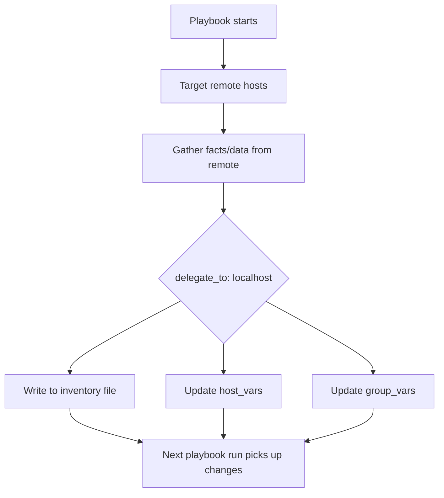

# How to Use Ansible Delegation for Inventory Updates

Author: [nawazdhandala](https://www.github.com/nawazdhandala)

Tags: Ansible, Delegation, Inventory, Automation

Description: Learn how to use Ansible delegation to dynamically update inventory files and host variables across your infrastructure from any managed node.

---

Managing inventory in Ansible gets tricky when your playbooks need to modify the inventory itself during execution. Maybe you are provisioning new hosts and need to register them, or you need to update host variables based on information gathered from other machines. Ansible delegation provides a clean way to handle these scenarios by letting you run tasks on one host while targeting another.

In this post, we will walk through practical patterns for using `delegate_to` to update inventory files, modify host variables, and keep your infrastructure state consistent without manual intervention.

## Understanding the Problem

Consider a scenario where you spin up a new EC2 instance from your control node. After provisioning, you want to add that instance to your inventory so subsequent plays can target it. Without delegation, you would need to run separate playbooks or manually update files between runs.

Delegation lets you execute a task on a different host than the one being iterated over. Combined with `localhost` delegation, you can write back to your control machine's inventory files from any play.

## Adding Hosts to Inventory Dynamically

The simplest form of inventory update during a play uses the `add_host` module. This module adds a host to the in-memory inventory for the current playbook run.

```yaml
# add_new_host.yml - Dynamically add a provisioned host to inventory
---
- name: Provision and register new hosts
  hosts: localhost
  gather_facts: false
  tasks:
    - name: Create a new EC2 instance
      amazon.aws.ec2_instance:
        name: "web-server-new"
        instance_type: t3.medium
        image_id: ami-0abcdef1234567890
        region: us-east-1
        wait: true
      register: ec2_result

    - name: Add new instance to in-memory inventory
      ansible.builtin.add_host:
        name: "{{ ec2_result.instances[0].public_ip_address }}"
        groups:
          - webservers
          - new_hosts
        ansible_user: ec2-user
        ansible_ssh_private_key_file: ~/.ssh/my-key.pem

- name: Configure the newly added host
  hosts: new_hosts
  become: true
  tasks:
    - name: Install nginx
      ansible.builtin.apt:
        name: nginx
        state: present
```

The `add_host` module only affects the current playbook run. Once the playbook finishes, the host is gone from inventory. For persistent changes, you need to write to actual inventory files.

## Writing to Static Inventory Files with Delegation

When you need to persist inventory changes, delegate a task to localhost that modifies your inventory file directly.

```yaml
# update_static_inventory.yml - Write new hosts to INI inventory file
---
- name: Update static inventory after provisioning
  hosts: localhost
  gather_facts: false
  vars:
    new_host_ip: "10.0.1.50"
    new_host_name: "web-prod-05"
    inventory_file: "/etc/ansible/hosts"

  tasks:
    - name: Check if host already exists in inventory
      ansible.builtin.lineinfile:
        path: "{{ inventory_file }}"
        regexp: "^{{ new_host_name }}"
        state: absent
      check_mode: true
      register: host_check
      changed_when: false

    - name: Add host to webservers group in inventory
      ansible.builtin.lineinfile:
        path: "{{ inventory_file }}"
        insertafter: '^\[webservers\]'
        line: "{{ new_host_name }} ansible_host={{ new_host_ip }} ansible_user=deploy"
      when: host_check.found == 0
```

## Delegating Inventory Updates from Remote Hosts

Here is where delegation really shines. Suppose you are running a play against your web servers, and each server knows its own database connection details. You want to collect that info and update inventory variables on your control machine.

```yaml
# collect_and_update.yml - Gather info from remotes, update inventory locally
---
- name: Collect DB info from web servers and update inventory
  hosts: webservers
  gather_facts: true
  tasks:
    - name: Read database config from the remote host
      ansible.builtin.slurp:
        src: /etc/myapp/db.conf
      register: db_config_raw

    - name: Parse the database host from config
      ansible.builtin.set_fact:
        db_host: "{{ (db_config_raw.content | b64decode | from_yaml).database.host }}"

    - name: Update host_vars file on control machine
      ansible.builtin.copy:
        content: |
          ---
          # Auto-generated by Ansible on {{ ansible_date_time.iso8601 }}
          db_backend: "{{ db_host }}"
          app_version: "{{ ansible_facts['distribution_version'] }}"
        dest: "/etc/ansible/host_vars/{{ inventory_hostname }}.yml"
      delegate_to: localhost
```

The key line is `delegate_to: localhost`. The task runs on your control machine, but it has access to all the variables and facts from the remote host being iterated.

## Updating YAML Inventory Files

If you use YAML-format inventory (which is increasingly common), you can use a template approach to regenerate the inventory file.

```yaml
# rebuild_yaml_inventory.yml - Regenerate YAML inventory from gathered facts
---
- name: Gather data from all hosts
  hosts: all
  gather_facts: true
  tasks:
    - name: Store host data for inventory rebuild
      ansible.builtin.set_fact:
        host_inventory_data:
          ansible_host: "{{ ansible_default_ipv4.address }}"
          ansible_user: "{{ ansible_user_id }}"
          os_family: "{{ ansible_os_family }}"

- name: Rebuild YAML inventory on localhost
  hosts: localhost
  gather_facts: false
  tasks:
    - name: Generate inventory from collected data
      ansible.builtin.template:
        src: templates/inventory.yml.j2
        dest: /etc/ansible/inventory/hosts.yml
        backup: true
```

And the corresponding Jinja2 template:

```yaml
# templates/inventory.yml.j2 - Dynamic YAML inventory template
---
all:
  children:
    webservers:
      hosts:

        {{ host }}:
          ansible_host: {{ hostvars[host]['host_inventory_data']['ansible_host'] }}
          ansible_user: {{ hostvars[host]['host_inventory_data']['ansible_user'] }}

    databases:
      hosts:

        {{ host }}:
          ansible_host: {{ hostvars[host]['host_inventory_data']['ansible_host'] }}
          ansible_user: {{ hostvars[host]['host_inventory_data']['ansible_user'] }}

```

## Removing Hosts from Inventory via Delegation

Decommissioning is just as important as provisioning. Here is how to remove a host from inventory when it gets terminated.

```yaml
# decommission_host.yml - Remove a host from static inventory
---
- name: Decommission and remove host from inventory
  hosts: decommission_targets
  gather_facts: false
  tasks:
    - name: Stop all application services
      ansible.builtin.service:
        name: "{{ item }}"
        state: stopped
      loop:
        - nginx
        - myapp
      ignore_errors: true

    - name: Remove host entry from inventory file
      ansible.builtin.lineinfile:
        path: /etc/ansible/hosts
        regexp: "^{{ inventory_hostname }}\\s"
        state: absent
      delegate_to: localhost

    - name: Remove host_vars file
      ansible.builtin.file:
        path: "/etc/ansible/host_vars/{{ inventory_hostname }}.yml"
        state: absent
      delegate_to: localhost

    - name: Remove host from known_hosts
      ansible.builtin.known_hosts:
        name: "{{ ansible_host }}"
        state: absent
      delegate_to: localhost
```

## Using delegate_facts for Inventory Variable Sharing

When you combine `delegate_to` with `delegate_facts: true`, the facts gathered by the delegated task get assigned to the delegated host rather than the current host. This is useful for sharing discovered information across your inventory.

```yaml
# share_facts.yml - Use delegate_facts to share info across hosts
---
- name: Discover load balancer IP and share with all web servers
  hosts: webservers
  gather_facts: false
  tasks:
    - name: Get the load balancer's public IP
      ansible.builtin.command: curl -s http://169.254.169.254/latest/meta-data/public-ipv4
      delegate_to: "{{ groups['loadbalancers'][0] }}"
      delegate_facts: true
      run_once: true
      register: lb_ip

    - name: Write LB IP to each web server's host_vars
      ansible.builtin.lineinfile:
        path: "/etc/ansible/host_vars/{{ inventory_hostname }}.yml"
        regexp: "^lb_public_ip:"
        line: "lb_public_ip: {{ lb_ip.stdout }}"
        create: true
      delegate_to: localhost
```

## Workflow Diagram

Here is a visual representation of the delegation flow for inventory updates:



## Tips and Gotchas

A few things to keep in mind when using delegation for inventory updates:

First, always use `run_once: true` when you only need to update inventory once per play, not once per host. Without it, you might get race conditions writing to the same file from multiple delegated tasks.

Second, use the `backup` parameter on file-writing modules. If your template or lineinfile task corrupts the inventory, having a backup saves you from a bad situation.

Third, remember that `add_host` changes are not persistent. They only last for the duration of the playbook run. If you need changes to survive across runs, write to files.

Finally, consider using a proper dynamic inventory script or plugin for cloud environments instead of manipulating static files. Tools like `aws_ec2`, `azure_rm`, or `gcp_compute` inventory plugins pull live data from your cloud provider and eliminate the need for most manual inventory updates.

Delegation for inventory updates is a powerful technique, but use it judiciously. For large-scale environments, dynamic inventory is almost always the better path.
