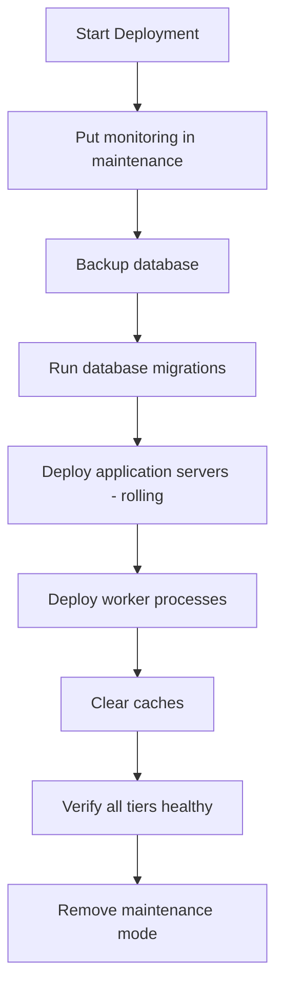

# How to Use Ansible Delegation for Multi-Tier Deployments

Author: [nawazdhandala](https://www.github.com/nawazdhandala)

Tags: Ansible, Delegation, Deployment, Multi-Tier Architecture

Description: Learn how to use Ansible delegation to coordinate deployments across multiple application tiers including web, app, and database layers.

---

Multi-tier applications have dependent layers: databases, application servers, caches, load balancers, and queue workers. Deploying changes that span multiple tiers requires careful coordination. You cannot update the database schema and the application code at the same time in random order. Ansible delegation lets you orchestrate these cross-tier dependencies from a single playbook, ensuring the right operations happen on the right hosts in the right sequence.

## Multi-Tier Deployment Flow

A typical multi-tier deployment follows this sequence:



## The Full Multi-Tier Deployment Playbook

Here is a comprehensive playbook that deploys across all tiers:

```yaml
# multi-tier-deploy.yml - Complete multi-tier deployment
---
# Play 1: Pre-deployment preparation
- name: Pre-deployment checks and preparation
  hosts: appservers[0]    # Just need one host to coordinate from
  gather_facts: false
  tasks:
    - name: Set deployment start time
      ansible.builtin.set_fact:
        deploy_start: "{{ now(utc=true).isoformat() }}"

    - name: Notify team about deployment start
      ansible.builtin.uri:
        url: "{{ slack_webhook }}"
        method: POST
        body_format: json
        body:
          text: "Starting deployment of v{{ version }} to {{ env }}"
      delegate_to: localhost

    - name: Set monitoring maintenance window
      ansible.builtin.uri:
        url: "http://monitoring.internal:9090/api/v1/maintenance"
        method: POST
        body_format: json
        body:
          duration_minutes: 30
          reason: "Deployment v{{ version }}"
      delegate_to: localhost

# Play 2: Database tier
- name: Database tier operations
  hosts: appservers[0]    # Use first app server to coordinate DB tasks
  gather_facts: false
  tasks:
    - name: Create database backup
      ansible.builtin.shell: |
        BACKUP_FILE="/var/backups/myapp_pre_v{{ version }}_$(date +%Y%m%d%H%M%S).dump"
        pg_dump -Fc myapp_production > "$BACKUP_FILE"
        echo "$BACKUP_FILE"
      register: backup
      delegate_to: "{{ groups['databases'][0] }}"
      become: true
      become_user: postgres

    - name: Check for pending migrations
      ansible.builtin.shell: |
        cd /opt/myapp && python3 manage.py showmigrations --plan | grep '\[ \]' | wc -l
      register: pending
      delegate_to: "{{ groups['databases'][0] }}"
      changed_when: false

    - name: Run database migrations
      ansible.builtin.shell: |
        cd /opt/myapp && python3 manage.py migrate --no-input 2>&1
      register: migration_output
      delegate_to: "{{ groups['databases'][0] }}"
      become: true
      become_user: myapp
      when: pending.stdout | int > 0

    - name: Verify migration success
      ansible.builtin.shell: |
        cd /opt/myapp && python3 manage.py showmigrations --plan | grep '\[ \]' | wc -l
      register: remaining_migrations
      delegate_to: "{{ groups['databases'][0] }}"
      changed_when: false

    - name: Fail if migrations are still pending
      ansible.builtin.fail:
        msg: "{{ remaining_migrations.stdout }} migrations still pending after migration run"
      when: remaining_migrations.stdout | int > 0

# Play 3: Application tier (rolling update)
- name: Application tier rolling deployment
  hosts: appservers
  serial: 1
  max_fail_percentage: 0
  tasks:
    - name: Remove from load balancer
      ansible.builtin.shell: |
        echo "set server app_backend/{{ inventory_hostname }} state drain" | \
          socat stdio /var/run/haproxy/admin.sock
      delegate_to: "{{ item }}"
      loop: "{{ groups['loadbalancers'] }}"

    - name: Wait for connection drain
      ansible.builtin.pause:
        seconds: 15

    - name: Stop application
      ansible.builtin.systemd:
        name: myapp
        state: stopped
      become: true

    - name: Deploy new application code
      ansible.builtin.unarchive:
        src: "/releases/myapp-{{ version }}.tar.gz"
        dest: /opt/myapp/
        remote_src: false
      become: true

    - name: Update configuration
      ansible.builtin.template:
        src: "app-config-{{ env }}.yml.j2"
        dest: /opt/myapp/config/settings.yml
        owner: myapp
        group: myapp
        mode: '0640'
      become: true

    - name: Install/update Python dependencies
      ansible.builtin.pip:
        requirements: /opt/myapp/requirements.txt
        virtualenv: /opt/myapp/venv
      become: true
      become_user: myapp

    - name: Start application
      ansible.builtin.systemd:
        name: myapp
        state: started
      become: true

    - name: Wait for health check
      ansible.builtin.uri:
        url: "http://{{ ansible_host }}:8080/health"
        status_code: 200
      delegate_to: localhost
      register: health
      retries: 20
      delay: 5
      until: health.status == 200

    - name: Re-enable in load balancer
      ansible.builtin.shell: |
        echo "set server app_backend/{{ inventory_hostname }} state ready" | \
          socat stdio /var/run/haproxy/admin.sock
      delegate_to: "{{ item }}"
      loop: "{{ groups['loadbalancers'] }}"

# Play 4: Worker tier
- name: Worker tier deployment
  hosts: workers
  serial: "50%"    # Workers can be updated more aggressively
  tasks:
    - name: Stop worker processes
      ansible.builtin.systemd:
        name: "myapp-worker@{{ item }}"
        state: stopped
      become: true
      loop: "{{ range(1, worker_count + 1) | list }}"

    - name: Deploy new code to workers
      ansible.builtin.unarchive:
        src: "/releases/myapp-{{ version }}.tar.gz"
        dest: /opt/myapp/
        remote_src: false
      become: true

    - name: Start worker processes
      ansible.builtin.systemd:
        name: "myapp-worker@{{ item }}"
        state: started
      become: true
      loop: "{{ range(1, worker_count + 1) | list }}"

    - name: Verify workers are processing
      ansible.builtin.shell: |
        # Check worker is connected to the queue
        curl -s http://localhost:9100/metrics | grep worker_queue_connected | grep 1
      register: worker_check
      retries: 5
      delay: 5
      until: worker_check.rc == 0

# Play 5: Cache tier
- name: Cache tier operations
  hosts: appservers[0]
  gather_facts: false
  tasks:
    - name: Flush application caches
      ansible.builtin.shell: |
        redis-cli -h {{ item }} FLUSHDB
      delegate_to: localhost
      loop: "{{ groups['cache_servers'] }}"

    - name: Warm critical caches
      ansible.builtin.uri:
        url: "http://{{ groups['appservers'][0] }}:8080/admin/cache/warm"
        method: POST
        timeout: 60
      delegate_to: localhost

# Play 6: Post-deployment verification
- name: Post-deployment verification
  hosts: appservers[0]
  gather_facts: false
  tasks:
    - name: Run integration tests
      ansible.builtin.shell: |
        cd /opt/tests && python3 -m pytest integration/ \
          --target-url=http://{{ groups['loadbalancers'][0] }}:80 \
          --expected-version={{ version }} \
          -v --tb=short
      register: integration_tests
      delegate_to: localhost

    - name: Remove monitoring maintenance window
      ansible.builtin.uri:
        url: "http://monitoring.internal:9090/api/v1/maintenance"
        method: DELETE
      delegate_to: localhost

    - name: Notify team about deployment completion
      ansible.builtin.uri:
        url: "{{ slack_webhook }}"
        method: POST
        body_format: json
        body:
          text: >
            Deployment complete: v{{ version }} to {{ env }}
            Duration: {{ ((now(utc=true) - deploy_start | to_datetime).total_seconds() / 60) | round(1) }} minutes
            Integration tests: {{ 'PASSED' if integration_tests.rc == 0 else 'FAILED' }}
      delegate_to: localhost
```

## Handling Cross-Tier Dependencies

Sometimes one tier depends on another being in a specific state. Here is how to check dependencies across tiers:

```yaml
# tier-dependencies.yml - Verify cross-tier dependencies before proceeding
---
- name: Verify all tier dependencies
  hosts: appservers[0]
  gather_facts: false
  tasks:
    - name: Verify database is accessible
      community.postgresql.postgresql_ping:
        db: myapp_production
        login_host: "{{ groups['databases'][0] }}"
        login_user: myapp
      delegate_to: "{{ groups['databases'][0] }}"

    - name: Verify cache is accessible
      ansible.builtin.shell: |
        redis-cli -h {{ item }} ping
      register: cache_check
      delegate_to: localhost
      loop: "{{ groups['cache_servers'] }}"
      failed_when: "'PONG' not in cache_check.stdout"

    - name: Verify queue system is running
      ansible.builtin.uri:
        url: "http://{{ groups['queue_servers'][0] }}:15672/api/healthchecks/node"
        url_username: "{{ rabbitmq_admin_user }}"
        url_password: "{{ rabbitmq_admin_password }}"
        force_basic_auth: true
        status_code: 200
      delegate_to: localhost

    - name: Verify load balancers are healthy
      ansible.builtin.shell: |
        echo "show info" | socat stdio /var/run/haproxy/admin.sock | grep "^Uptime_sec"
      delegate_to: "{{ item }}"
      loop: "{{ groups['loadbalancers'] }}"
      changed_when: false
```

## Rollback Across Tiers

When a multi-tier deployment fails, you need to roll back in reverse order:

```yaml
# multi-tier-rollback.yml - Rollback across all tiers
---
- name: Rollback application tier
  hosts: appservers
  serial: "50%"      # Rollback can be faster than deploy
  tasks:
    - name: Stop current application
      ansible.builtin.systemd:
        name: myapp
        state: stopped
      become: true

    - name: Restore previous version
      ansible.builtin.shell: |
        rm -rf /opt/myapp/current
        ln -s /opt/myapp/releases/{{ previous_version }} /opt/myapp/current
      become: true

    - name: Start previous version
      ansible.builtin.systemd:
        name: myapp
        state: started
      become: true

- name: Rollback database if needed
  hosts: appservers[0]
  gather_facts: false
  tasks:
    - name: Rollback database migration
      ansible.builtin.shell: |
        cd /opt/myapp/releases/{{ previous_version }}
        python3 manage.py migrate {{ migration_target }} --no-input
      delegate_to: "{{ groups['databases'][0] }}"
      become: true
      become_user: myapp
      when: rollback_database | default(false) | bool

- name: Rollback workers
  hosts: workers
  tasks:
    - name: Restart workers with previous version
      ansible.builtin.shell: |
        rm -rf /opt/myapp/current
        ln -s /opt/myapp/releases/{{ previous_version }} /opt/myapp/current
        systemctl restart myapp-worker@*
      become: true

- name: Flush caches after rollback
  hosts: appservers[0]
  gather_facts: false
  tasks:
    - name: Clear caches
      ansible.builtin.shell: |
        redis-cli -h {{ item }} FLUSHDB
      delegate_to: localhost
      loop: "{{ groups['cache_servers'] }}"

    - name: Notify about rollback
      ansible.builtin.uri:
        url: "{{ slack_webhook }}"
        method: POST
        body_format: json
        body:
          text: "ROLLBACK complete: {{ env }} rolled back from v{{ version }} to v{{ previous_version }}"
      delegate_to: localhost
```

## Summary

Multi-tier deployments with Ansible delegation follow a pattern: prepare, migrate database, deploy application tier (rolling), deploy worker tier, clear caches, verify. Delegation is the glue that connects these tiers, letting you run database tasks from the app server play, manage load balancers from the controller, and coordinate cache operations centrally. Use separate plays for each tier to keep the logic clean, `serial` for rolling updates on stateless tiers, and `run_once` for operations that should happen exactly once across the fleet. Always have a rollback playbook ready that reverses the operations in the correct order.
