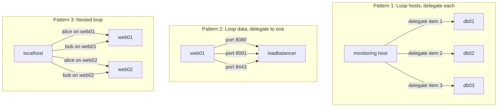

# How to Use Ansible Delegation with Loop

Author: [nawazdhandala](https://www.github.com/nawazdhandala)

Tags: Ansible, Delegation, Loops, Automation

Description: Learn how to combine Ansible delegate_to with loop constructs to run tasks across multiple hosts efficiently with practical examples.

---

Combining `delegate_to` with loops in Ansible opens up powerful patterns for orchestrating tasks across multiple hosts from a single play. You can iterate over a list of hosts and delegate each iteration to a different target, or you can loop over data items while delegating all of them to a specific host. Understanding how these two features interact is key to writing clean, efficient playbooks.

## Basic Delegation with Loop

The simplest pattern is looping over a list of hosts and delegating each task iteration to the corresponding host.

```yaml
# basic_delegate_loop.yml - Run a command on multiple hosts via delegation
---
- name: Check disk space on all database servers from monitoring host
  hosts: monitoring
  gather_facts: false
  tasks:
    - name: Check disk usage on each database server
      ansible.builtin.command: df -h /var/lib/postgresql
      delegate_to: "{{ item }}"
      loop: "{{ groups['databases'] }}"
      register: disk_check

    - name: Display disk usage results
      ansible.builtin.debug:
        msg: "{{ item.item }}: {{ item.stdout_lines[-1] }}"
      loop: "{{ disk_check.results }}"
      loop_control:
        label: "{{ item.item }}"
```

In this example, the play targets the monitoring host, but each task iteration delegates to a different database server. The `register` captures results as a list, and each result includes the `item` it was associated with.

## Loop Over Data, Delegate to One Host

Another common pattern is looping over a data structure and delegating all iterations to a single host. This is useful when you need to perform multiple operations on a remote host based on data from the current target.

```yaml
# delegate_data_loop.yml - Loop over data, delegate all to one host
---
- name: Register web server endpoints with the load balancer
  hosts: webservers
  gather_facts: true
  vars:
    app_ports:
      - 8080
      - 8081
      - 8443
  tasks:
    - name: Add each port to the HAProxy backend on the LB
      ansible.builtin.lineinfile:
        path: /etc/haproxy/haproxy.cfg
        insertafter: "backend app_servers"
        line: "    server {{ inventory_hostname }}-{{ item }} {{ ansible_default_ipv4.address }}:{{ item }} check"
      delegate_to: "{{ groups['loadbalancers'][0] }}"
      loop: "{{ app_ports }}"
```

Here, for each web server in the play, we loop over three ports and add a backend entry on the load balancer. The delegation target stays the same across all loop iterations, but the data changes with each iteration.

## Nested Loops with Delegation

When you need to combine multiple lists, use the `product` filter or `subelements` to create a nested loop with delegation.

```yaml
# nested_delegate_loop.yml - Cross-product loop with delegation
---
- name: Create user accounts on multiple servers
  hosts: localhost
  gather_facts: false
  vars:
    users:
      - name: alice
        groups: "sudo,docker"
      - name: bob
        groups: "docker"
      - name: charlie
        groups: "sudo"
    target_servers:
      - web01.example.com
      - web02.example.com
      - db01.example.com
  tasks:
    - name: Create each user on each server
      ansible.builtin.user:
        name: "{{ item.0.name }}"
        groups: "{{ item.0.groups }}"
        state: present
        create_home: true
      delegate_to: "{{ item.1 }}"
      loop: "{{ users | product(target_servers) | list }}"
      loop_control:
        label: "{{ item.0.name }} on {{ item.1 }}"
```

This creates all three users on all three servers. The `product` filter generates every combination of user and server. The `loop_control.label` keeps the output readable instead of dumping the entire data structure.

## Using loop_control with Delegation

When you loop with delegation, the default output can be very noisy. Use `loop_control` to clean it up.

```yaml
# clean_output.yml - Use loop_control for readable delegation output
---
- name: Collect service status from all hosts
  hosts: monitoring
  gather_facts: false
  tasks:
    - name: Check if nginx is running on each web server
      ansible.builtin.systemd:
        name: nginx
      delegate_to: "{{ item }}"
      loop: "{{ groups['webservers'] }}"
      loop_control:
        label: "checking {{ item }}"
        pause: 1
      register: nginx_results
      ignore_errors: true

    - name: Build status report
      ansible.builtin.set_fact:
        service_report: >-
          {{ service_report | default([]) + [{
            'host': item.item,
            'running': item.status.ActiveState | default('unknown')
          }] }}
      loop: "{{ nginx_results.results }}"
      loop_control:
        label: "{{ item.item }}"

    - name: Display status report
      ansible.builtin.debug:
        var: service_report
```

The `pause: 1` adds a one-second delay between iterations, which helps avoid overwhelming a target host when many delegated tasks hit it in rapid succession.

## Delegation Loop Patterns Diagram

Here is how different loop-delegation patterns work:



## Delegating with dict2items

When your data comes as a dictionary, use `dict2items` to loop over key-value pairs and delegate accordingly.

```yaml
# dict_delegate_loop.yml - Loop over a dictionary with delegation
---
- name: Set hostname on multiple servers
  hosts: localhost
  gather_facts: false
  vars:
    server_hostnames:
      "10.0.1.10": "web-prod-01"
      "10.0.1.11": "web-prod-02"
      "10.0.1.12": "api-prod-01"
      "10.0.1.13": "db-prod-01"
  tasks:
    - name: Set hostname on each server
      ansible.builtin.hostname:
        name: "{{ item.value }}"
      delegate_to: "{{ item.key }}"
      loop: "{{ server_hostnames | dict2items }}"
      loop_control:
        label: "{{ item.key }} -> {{ item.value }}"
```

## Conditional Delegation in Loops

You can combine `when` conditions with delegation loops to selectively run tasks.

```yaml
# conditional_delegate_loop.yml - Skip certain iterations based on conditions
---
- name: Deploy config updates to healthy hosts only
  hosts: deploy_controller
  gather_facts: false
  tasks:
    - name: Health check each target
      ansible.builtin.uri:
        url: "http://{{ item }}:8080/health"
        return_content: true
        status_code: 200
      delegate_to: localhost
      loop: "{{ groups['appservers'] }}"
      register: health_checks
      ignore_errors: true

    - name: Build list of healthy hosts
      ansible.builtin.set_fact:
        healthy_hosts: "{{ health_checks.results | selectattr('status', 'equalto', 200) | map(attribute='item') | list }}"

    - name: Deploy updated config to healthy hosts only
      ansible.builtin.template:
        src: templates/app.conf.j2
        dest: /etc/myapp/app.conf
        owner: appuser
        mode: "0644"
      delegate_to: "{{ item }}"
      loop: "{{ healthy_hosts }}"
      loop_control:
        label: "deploying to {{ item }}"

    - name: Report skipped unhealthy hosts
      ansible.builtin.debug:
        msg: "Skipped unhealthy host: {{ item.item }}"
      loop: "{{ health_checks.results }}"
      when: item.status | default(0) != 200
      loop_control:
        label: "{{ item.item }}"
```

## Handling Errors in Delegation Loops

When one delegated host in a loop fails, it normally stops the entire task. Use `ignore_errors` or `ignore_unreachable` to handle failures gracefully.

```yaml
# error_handling_loop.yml - Continue looping even when delegation fails
---
- name: Collect info from hosts, tolerating failures
  hosts: monitoring
  gather_facts: false
  tasks:
    - name: Get uptime from each server
      ansible.builtin.command: uptime
      delegate_to: "{{ item }}"
      loop: "{{ groups['all'] }}"
      register: uptime_results
      ignore_unreachable: true
      ignore_errors: true

    - name: Show results for reachable hosts
      ansible.builtin.debug:
        msg: "{{ item.item }}: {{ item.stdout | default('UNREACHABLE') }}"
      loop: "{{ uptime_results.results }}"
      loop_control:
        label: "{{ item.item }}"
```

## Performance Tips for Delegation Loops

A few things to consider when using delegation with loops:

**Serial execution.** Each iteration in a loop runs sequentially by default. If you are delegating to 50 different hosts in a loop, all 50 tasks run one after another. For better parallelism, consider restructuring your play to target those hosts directly rather than using delegation loops.

**Forks setting.** The `forks` setting in ansible.cfg controls parallelism at the host level, not at the loop level. Delegation within a loop does not benefit from forks. If performance matters, target the hosts directly.

**Throttle parameter.** Use `throttle` to limit how many loop iterations run in parallel when using `async` with delegation. This prevents overloading a single delegated target.

```yaml
    - name: Run background task on multiple hosts
      ansible.builtin.command: /opt/scripts/heavy-job.sh
      delegate_to: "{{ item }}"
      loop: "{{ groups['workers'] }}"
      async: 300
      poll: 0
      throttle: 5
```

The `throttle: 5` ensures no more than 5 async jobs run simultaneously, even if the loop has dozens of iterations.

These patterns give you a comprehensive toolkit for combining delegation with loops. The key is choosing the right pattern for your use case and being mindful of performance implications when scaling to many hosts.
