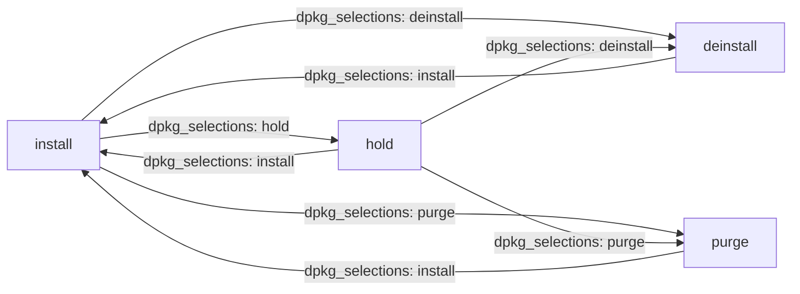

# How to Use Ansible dpkg_selections Module

Author: [nawazdhandala](https://www.github.com/nawazdhandala)

Tags: Ansible, dpkg, Ubuntu, Package Management

Description: A complete guide to using the Ansible dpkg_selections module to hold, unhold, and manage package selections on Debian and Ubuntu.

---

The `dpkg_selections` module in Ansible controls the dpkg package selection state on Debian and Ubuntu systems. Its primary use is holding packages to prevent upgrades and unholding them when you are ready to update. While it sounds like a niche tool, it is one of the most important modules for production systems where unplanned package upgrades can cause outages. This post covers everything you need to know about it.

## What Are dpkg Selections?

Every package known to dpkg has a selection state that tells the package manager what should happen to it. The main states are:

- **install** - The normal state. The package should be installed (or upgraded during a system update).
- **hold** - The package is locked at its current version. `apt upgrade` and `apt dist-upgrade` will skip it.
- **deinstall** - The package is marked for removal but config files are kept.
- **purge** - The package is marked for complete removal including config files.

You can see the current selections with `dpkg --get-selections`.

## Holding a Package

The most common use case is preventing a package from being upgraded:

```yaml
# Hold a package to prevent any upgrades
- name: Hold PostgreSQL at current version
  ansible.builtin.dpkg_selections:
    name: postgresql-15
    selection: hold
```

After this runs, `apt-get upgrade` and `apt-get dist-upgrade` will output:

```
The following packages have been kept back:
  postgresql-15
```

The package stays installed at its current version until you release the hold.

## Holding Multiple Packages

Usually you want to hold an entire package group together:

```yaml
# Hold all PostgreSQL-related packages together
- name: Hold PostgreSQL packages
  ansible.builtin.dpkg_selections:
    name: "{{ item }}"
    selection: hold
  loop:
    - postgresql-15
    - postgresql-client-15
    - postgresql-common
    - postgresql-client-common
    - libpq5
```

This is important because holding only `postgresql-15` while leaving `libpq5` unheld means a library upgrade could still affect your database server.

## Releasing a Hold

When you are ready to allow upgrades again:

```yaml
# Release the hold on PostgreSQL
- name: Unhold PostgreSQL packages
  ansible.builtin.dpkg_selections:
    name: "{{ item }}"
    selection: install
  loop:
    - postgresql-15
    - postgresql-client-15
    - postgresql-common
    - postgresql-client-common
    - libpq5
```

Setting `selection: install` returns the package to its normal state where apt will include it in upgrades.

## Checking Current Hold Status

Before changing selections, you might want to audit what is currently held:

```yaml
# Collect and display held packages
- name: Get all package selections
  ansible.builtin.command:
    cmd: dpkg --get-selections
  register: all_selections
  changed_when: false

- name: Filter and display held packages
  ansible.builtin.set_fact:
    held_packages: "{{ all_selections.stdout_lines | select('search', 'hold') | list }}"

- name: Show held packages
  ansible.builtin.debug:
    msg: "{{ held_packages }}"
```

To check a specific package:

```yaml
# Check if a specific package is held
- name: Check PostgreSQL hold status
  ansible.builtin.command:
    cmd: dpkg --get-selections postgresql-15
  register: pg_selection
  changed_when: false

- name: Display status
  ansible.builtin.debug:
    msg: "PostgreSQL selection: {{ pg_selection.stdout }}"
```

## A Complete Hold/Upgrade/Re-hold Workflow

The standard workflow for upgrading a held package is: unhold, upgrade, re-hold. Here is how it looks in Ansible:

```yaml
# Controlled upgrade of a held package
- name: Upgrade PostgreSQL from 15.4 to 15.5
  hosts: database_servers
  become: yes
  serial: 1
  vars:
    pg_packages:
      - postgresql-15
      - postgresql-client-15
      - postgresql-common
      - libpq5
    target_version: "15.5-1.pgdg22.04+1"
  tasks:
    - name: Stop application connections
      ansible.builtin.command:
        cmd: /opt/scripts/drain_connections.sh
      changed_when: true

    - name: Release holds on PostgreSQL packages
      ansible.builtin.dpkg_selections:
        name: "{{ item }}"
        selection: install
      loop: "{{ pg_packages }}"

    - name: Update apt cache
      ansible.builtin.apt:
        update_cache: yes

    - name: Upgrade PostgreSQL to target version
      ansible.builtin.apt:
        name: "postgresql-15={{ target_version }}"
        state: present

    - name: Re-hold PostgreSQL packages
      ansible.builtin.dpkg_selections:
        name: "{{ item }}"
        selection: hold
      loop: "{{ pg_packages }}"

    - name: Verify PostgreSQL is running
      ansible.builtin.command:
        cmd: pg_isready
      register: pg_status
      retries: 5
      delay: 5
      until: pg_status.rc == 0
      changed_when: false

    - name: Resume application connections
      ansible.builtin.command:
        cmd: /opt/scripts/resume_connections.sh
      changed_when: true
```

The `serial: 1` ensures database servers are upgraded one at a time.

## Using dpkg_selections in a Patching Playbook

Here is how to integrate holds into a system patching workflow:

```yaml
# Patching playbook that respects held packages
- name: Monthly system patching
  hosts: all
  become: yes
  serial: "25%"
  vars:
    critical_packages:
      - postgresql-15
      - postgresql-client-15
      - redis-server
      - elasticsearch
  tasks:
    - name: Ensure critical packages are held
      ansible.builtin.dpkg_selections:
        name: "{{ item }}"
        selection: hold
      loop: "{{ critical_packages }}"
      ignore_errors: yes

    - name: Update apt cache
      ansible.builtin.apt:
        update_cache: yes

    - name: Perform dist-upgrade (held packages will be skipped)
      ansible.builtin.apt:
        upgrade: dist

    - name: Clean up orphaned packages
      ansible.builtin.apt:
        autoremove: yes

    - name: Check if reboot is required
      ansible.builtin.stat:
        path: /var/run/reboot-required
      register: reboot_file

    - name: Reboot if needed
      ansible.builtin.reboot:
        reboot_timeout: 300
      when: reboot_file.stat.exists

    - name: Verify held packages are still at expected versions
      ansible.builtin.command:
        cmd: "dpkg -l {{ item }}"
      loop: "{{ critical_packages }}"
      register: version_check
      changed_when: false
      ignore_errors: yes

    - name: Display held package versions
      ansible.builtin.debug:
        msg: "{{ item.stdout_lines | last }}"
      loop: "{{ version_check.results }}"
      loop_control:
        label: "{{ item.item }}"
      when: item.rc == 0
```

## Using dpkg_selections with the deinstall State

You can mark a package for removal on the next `apt autoremove`:

```yaml
# Mark a package for removal
- name: Mark package for deinstallation
  ansible.builtin.dpkg_selections:
    name: old-monitoring-agent
    selection: deinstall
```

In practice, this is less common than using `apt` with `state: absent` directly, but it can be useful when you want to prepare selections without immediately acting on them.

## Using dpkg_selections with the purge State

Similarly, you can mark a package for purging:

```yaml
# Mark a package for purge (removal including config files)
- name: Mark package for purge
  ansible.builtin.dpkg_selections:
    name: old-monitoring-agent
    selection: purge
```

Again, most people just use the `apt` module with `state: absent` and `purge: yes` for immediate effect.

## Automating Hold Management with a Variable List

Define your holds in inventory variables for easy management:

```yaml
# group_vars/database_servers.yml
held_packages:
  - name: postgresql-15
    reason: "Tested against app v3.2 only"
    held_since: "2024-01-15"
  - name: postgresql-client-15
    reason: "Must match server version"
    held_since: "2024-01-15"
  - name: libpq5
    reason: "Must match PostgreSQL version"
    held_since: "2024-01-15"
```

The playbook:

```yaml
# Apply holds from inventory configuration
- name: Apply configured package holds
  ansible.builtin.dpkg_selections:
    name: "{{ item.name }}"
    selection: hold
  loop: "{{ held_packages | default([]) }}"
  loop_control:
    label: "{{ item.name }} ({{ item.reason }})"
```

## Selection State Transitions



## Comparison with APT Preferences

The `dpkg_selections` module and APT preferences both prevent upgrades, but they work differently:

| Feature | dpkg_selections (hold) | APT Preferences (pin) |
|---------|----------------------|----------------------|
| Granularity | Per package | Per package + version/repo |
| Wildcard support | No | Yes |
| Version control | Current version only | Any version or range |
| Complexity | Simple | Flexible but complex |
| Override | Cannot be overridden by apt | Priority-based |

Use `dpkg_selections` for simple "keep this package where it is" scenarios. Use APT preferences when you need to control which version is preferred or block specific versions while allowing others.

## Best Practices

1. **Hold related packages together.** A database server, its client tools, and shared libraries should all be held or unheld as a unit.

2. **Track your holds in version control.** Keep the list of held packages in your Ansible inventory so it is auditable and reviewable.

3. **Include the reason and date in your variables.** When someone looks at the hold six months later, they need to know why it was set and whether it is still relevant.

4. **Test unholds in staging.** Before upgrading a held package in production, test the exact upgrade sequence in a staging environment.

5. **Audit holds regularly.** A quarterly review of held packages ensures you are not missing security updates on forgotten holds.

The `dpkg_selections` module is small and focused, but it fills a critical role in production Ansible workflows. Combined with a disciplined approach to tracking and reviewing holds, it keeps your systems stable without falling behind on updates permanently.
