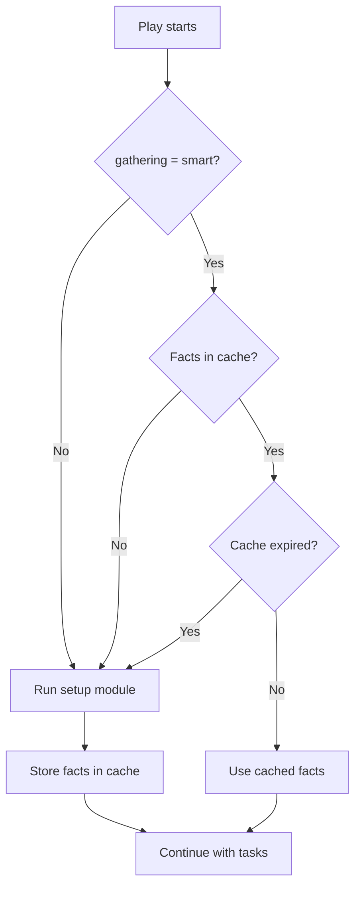

# How to Use Ansible Fact Caching with JSON Files

Author: [nawazdhandala](https://www.github.com/nawazdhandala)

Tags: Ansible, Fact Caching, Performance, JSON

Description: Set up Ansible fact caching using JSON files to avoid redundant fact gathering and speed up repeated playbook runs.

---

Every time Ansible starts a play, it runs the `setup` module on each host to gather facts like IP addresses, OS version, memory, and disk info. This fact gathering adds several seconds per host, and if you run playbooks frequently against the same infrastructure, you are repeating that work over and over. Fact caching stores gathered facts locally so they can be reused across playbook runs. The simplest caching backend is JSON files, which requires zero external dependencies.

## How Fact Caching Works

Ansible's fact caching has three modes controlled by the `gathering` setting:

- `implicit` (default): Gather facts at the start of every play
- `explicit`: Only gather facts when you explicitly use `gather_facts: true`
- `smart`: Gather facts only if they are not already in the cache

The `smart` mode is what makes caching useful. It checks the cache first and only runs the setup module if the cached facts have expired.



## Configuring JSON File Caching

Add these settings to your `ansible.cfg`:

```ini
# Enable JSON file fact caching with 24-hour expiry
[defaults]
gathering = smart
fact_caching = jsonfile
fact_caching_connection = /tmp/ansible_fact_cache
fact_caching_timeout = 86400
```

Let us break down each setting:

- `gathering = smart` tells Ansible to check the cache before gathering facts
- `fact_caching = jsonfile` selects the JSON file backend
- `fact_caching_connection = /tmp/ansible_fact_cache` is the directory where cache files are stored
- `fact_caching_timeout = 86400` sets the cache TTL in seconds (86400 = 24 hours)

Create the cache directory:

```bash
# Create the cache directory with appropriate permissions
mkdir -p /tmp/ansible_fact_cache
chmod 700 /tmp/ansible_fact_cache
```

## What the Cache Looks Like

After running a playbook, Ansible creates one JSON file per host in the cache directory:

```bash
# List cached fact files
ls -la /tmp/ansible_fact_cache/
# -rw------- 1 ansible ansible 45K Feb 21 10:15 web-01.example.com
# -rw------- 1 ansible ansible 43K Feb 21 10:15 web-02.example.com
# -rw------- 1 ansible ansible 47K Feb 21 10:15 db-01.example.com
```

Each file contains a JSON object with all the facts for that host:

```bash
# Peek at the cached facts for a host (pretty-printed)
python3 -m json.tool /tmp/ansible_fact_cache/web-01.example.com | head -30
```

The output looks something like:

```json
{
    "ansible_hostname": "web-01",
    "ansible_fqdn": "web-01.example.com",
    "ansible_distribution": "Ubuntu",
    "ansible_distribution_version": "22.04",
    "ansible_memtotal_mb": 16384,
    "ansible_processor_vcpus": 4,
    "ansible_default_ipv4": {
        "address": "10.0.1.15",
        "interface": "eth0"
    }
}
```

## Testing the Cache

Let us create a playbook that uses facts and run it twice to see caching in action:

```yaml
---
# test-cache.yml - Run this twice to see caching at work
- hosts: webservers
  tasks:
    - name: Display OS info
      debug:
        msg: "{{ inventory_hostname }} runs {{ ansible_distribution }} {{ ansible_distribution_version }}"

    - name: Show memory
      debug:
        msg: "{{ inventory_hostname }} has {{ ansible_memtotal_mb }} MB RAM"
```

Run it the first time with profiling:

```bash
# First run - facts will be gathered and cached
ANSIBLE_CALLBACKS_ENABLED=profile_tasks ansible-playbook test-cache.yml

# Check that cache files were created
ls -la /tmp/ansible_fact_cache/
```

Run it again:

```bash
# Second run - facts should come from cache (no setup module execution)
ANSIBLE_CALLBACKS_ENABLED=profile_tasks ansible-playbook test-cache.yml
```

On the second run, you should notice that the "Gathering Facts" step is either much faster or absent entirely. With 20 hosts, I typically see the fact gathering phase drop from 8-12 seconds to under 1 second.

## Cache Location Best Practices

Using `/tmp` works for testing, but in production you will want a more durable location:

```ini
# Production cache configuration
[defaults]
gathering = smart
fact_caching = jsonfile
fact_caching_connection = /var/cache/ansible/facts
fact_caching_timeout = 86400
```

Set up the directory with proper permissions:

```bash
# Create a persistent cache directory
sudo mkdir -p /var/cache/ansible/facts
sudo chown ansible:ansible /var/cache/ansible/facts
chmod 700 /var/cache/ansible/facts
```

If you are running Ansible from a CI/CD pipeline, you might want to put the cache in the project directory so it persists across pipeline runs (assuming your CI caches that directory):

```ini
# CI/CD cache configuration - relative to project root
[defaults]
gathering = smart
fact_caching = jsonfile
fact_caching_connection = .ansible_fact_cache
fact_caching_timeout = 3600
```

Add the cache directory to `.gitignore`:

```bash
# Add cache directory to gitignore
echo ".ansible_fact_cache/" >> .gitignore
```

## Cache Invalidation

The `fact_caching_timeout` controls automatic expiry, but sometimes you need to manually invalidate the cache. Here are several approaches:

```bash
# Clear the entire cache
rm -rf /var/cache/ansible/facts/*

# Clear cache for a specific host
rm /var/cache/ansible/facts/web-01.example.com

# Clear cache for a group of hosts (using a pattern)
rm /var/cache/ansible/facts/web-*.example.com
```

You can also force Ansible to re-gather facts for specific plays:

```yaml
---
# Force fact re-gathering even with smart gathering enabled
- hosts: webservers
  gather_facts: true
  tasks:
    - name: Refresh facts explicitly
      setup:

    - name: Use fresh facts
      debug:
        msg: "Fresh fact: {{ ansible_uptime_seconds }}"
```

## Combining with gather_subset

You can reduce what gets cached by combining fact caching with `gather_subset`:

```yaml
---
# Only cache network and hardware facts
- hosts: all
  gather_subset:
    - network
    - hardware
  tasks:
    - name: Show IP and CPU count
      debug:
        msg: "{{ ansible_default_ipv4.address }} - {{ ansible_processor_vcpus }} CPUs"
```

This results in smaller cache files and faster cache reads. A full fact set can be 40-50 KB per host, while a subset might be 5-10 KB.

## Handling Cache Corruption

Occasionally a cache file might get corrupted (partial write during a crash, disk full, etc.). Ansible will throw a JSON decode error:

```
ERROR! Unexpected Exception, this is probably a bug: Expecting value: line 1 column 1 (char 0)
```

Fix it by removing the corrupt file:

```bash
# Find and remove corrupted cache files (invalid JSON)
for f in /var/cache/ansible/facts/*; do
    python3 -c "import json; json.load(open('$f'))" 2>/dev/null || {
        echo "Removing corrupt cache: $f"
        rm "$f"
    }
done
```

Or build a simple maintenance script:

```bash
#!/bin/bash
# clean-fact-cache.sh - Remove stale and corrupt fact cache files

CACHE_DIR="/var/cache/ansible/facts"
MAX_AGE_DAYS=7

# Remove files older than MAX_AGE_DAYS
find "$CACHE_DIR" -type f -mtime +$MAX_AGE_DAYS -delete

# Remove corrupt files
for f in "$CACHE_DIR"/*; do
    [ -f "$f" ] || continue
    python3 -c "import json; json.load(open('$f'))" 2>/dev/null || rm "$f"
done

echo "Cache cleanup complete. Files remaining: $(ls "$CACHE_DIR" | wc -l)"
```

## Performance Numbers

Here are benchmarks from a 50-host playbook with 8 tasks:

| Configuration | Fact Gathering Time | Total Run Time |
|---|---|---|
| No caching (implicit) | 18.3s | 52.1s |
| JSON caching (first run) | 18.3s | 52.4s |
| JSON caching (cached) | 0.8s | 34.6s |

The first run with caching is slightly slower due to the cache write overhead, but subsequent runs save 17+ seconds on fact gathering alone. For playbooks you run multiple times per day, this adds up fast.

JSON file caching is the simplest way to get started with Ansible fact caching. It requires no external services, works on any system with a filesystem, and provides significant speedups for repeated playbook runs. If you need shared caching across multiple control nodes, look into Redis or Memcached backends instead.
