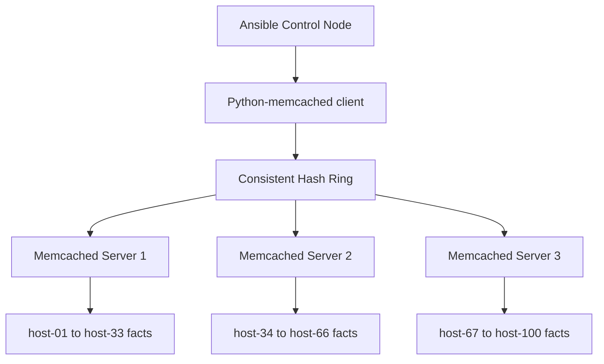

# How to Use Ansible Fact Caching with Memcached

Author: [nawazdhandala](https://www.github.com/nawazdhandala)

Tags: Ansible, Memcached, Fact Caching, Performance

Description: Configure Ansible to use Memcached for distributed fact caching, enabling shared cache access across multiple control nodes.

---

Memcached is a high-performance, distributed memory caching system that works well as an Ansible fact cache backend. Like Redis, it provides network-accessible caching that multiple Ansible control nodes can share. Unlike Redis, Memcached is simpler in design and focuses purely on key-value caching without persistence. This makes it a lightweight choice when you need shared fact caching but do not need Redis's extra features.

## Memcached vs Redis for Fact Caching

Both work well for Ansible fact caching, but they have different characteristics:

| Feature | Memcached | Redis |
|---|---|---|
| Data persistence | No (memory only) | Optional (RDB/AOF) |
| Data structures | Key-value only | Rich (strings, hashes, lists) |
| Memory efficiency | Higher for simple k/v | Slightly lower |
| Clustering | Built-in distributed | Sentinel/Cluster |
| Max value size | 1 MB default | 512 MB |
| Setup complexity | Minimal | Low |

For Ansible fact caching, both are overkill in terms of features. Memcached's simplicity is actually an advantage here since you do not need persistence (facts can always be re-gathered) and you do not need complex data structures.

## Installing Prerequisites

Install Memcached and the Python client:

```bash
# Install Memcached server on Ubuntu/Debian
sudo apt-get update
sudo apt-get install -y memcached

# Install the Python memcached library on the control node
pip install python-memcached
```

Start Memcached:

```bash
# Start and enable Memcached
sudo systemctl start memcached
sudo systemctl enable memcached

# Verify it is running
echo "stats" | nc localhost 11211 | head -5
```

## Basic Configuration

Configure Ansible to use Memcached in `ansible.cfg`:

```ini
# Configure Memcached fact caching
[defaults]
gathering = smart
fact_caching = memcached
fact_caching_connection = localhost:11211
fact_caching_timeout = 86400
```

The connection string is simply the Memcached server address and port. That is all you need for a basic setup.

Run a playbook to populate the cache:

```bash
# Run any playbook - facts will be cached in Memcached
ansible-playbook site.yml
```

## Multiple Memcached Servers

Memcached supports distributed caching natively. You can specify multiple servers and the client library will distribute keys across them using consistent hashing:

```ini
# Distribute fact cache across multiple Memcached servers
[defaults]
gathering = smart
fact_caching = memcached
fact_caching_connection = memcache1.internal:11211,memcache2.internal:11211,memcache3.internal:11211
fact_caching_timeout = 86400
```

The client library handles all the distribution logic. Keys (host facts) are spread evenly across servers. If one server goes down, only the keys stored on that server are lost, and Ansible will simply re-gather facts for those hosts on the next run.



## Memcached Server Configuration

The default Memcached configuration works for testing, but production deployments need tuning:

```bash
# /etc/memcached.conf - Production settings for fact caching

# Memory allocation (256 MB should handle thousands of hosts)
-m 256

# Listen on internal network interface
-l 10.0.1.50

# Maximum connections
-c 1024

# Run as memcache user
-u memcache

# Port
-p 11211

# Max item size (default 1MB is fine for fact data)
-I 1m
```

Here is a playbook to deploy Memcached with production settings:

```yaml
---
# setup-memcached.yml - Deploy Memcached for Ansible fact caching
- hosts: memcached_servers
  become: true
  vars:
    memcached_memory: 256
    memcached_port: 11211
    memcached_bind: "{{ ansible_default_ipv4.address }}"
    memcached_max_connections: 1024
  tasks:
    - name: Install Memcached
      apt:
        name:
          - memcached
          - libmemcached-tools
        state: present

    - name: Configure Memcached
      template:
        src: memcached.conf.j2
        dest: /etc/memcached.conf
        owner: root
        group: root
        mode: '0644'
      notify: restart memcached

    - name: Start Memcached
      service:
        name: memcached
        state: started
        enabled: true

  handlers:
    - name: restart memcached
      service:
        name: memcached
        state: restarted
```

And the template:

```ini
# memcached.conf.j2 - Memcached configuration for Ansible fact caching
-m {{ memcached_memory }}
-p {{ memcached_port }}
-l {{ memcached_bind }}
-c {{ memcached_max_connections }}
-u memcache
-I 1m
```

## Verifying the Cache

Use `memcached-tool` or `nc` to inspect the cache:

```bash
# Check Memcached stats
memcached-tool localhost:11211 stats

# Check slab allocation (shows how memory is being used)
memcached-tool localhost:11211 display

# Get cache hit/miss ratio
echo "stats" | nc localhost 11211 | grep -E "get_hits|get_misses|curr_items"
```

For a more detailed look at cached keys:

```bash
# List cached keys (works for debugging, not for production with many keys)
# First, dump slab stats
echo "stats items" | nc localhost 11211

# Then dump keys from a specific slab (e.g., slab 1)
echo "stats cachedump 1 100" | nc localhost 11211
```

## Testing the Cache Behavior

Create a test playbook to verify caching works:

```yaml
---
# test-memcached-cache.yml - Verify fact caching is working
- hosts: webservers
  tasks:
    - name: Display cached fact
      debug:
        msg: >
          Host {{ inventory_hostname }} runs
          {{ ansible_distribution }} {{ ansible_distribution_version }}
          with {{ ansible_memtotal_mb }} MB RAM

    - name: Show fact gathering status
      debug:
        msg: "If this is a cached run, fact gathering should be skipped"
```

Run it twice and compare:

```bash
# First run - gathers and caches facts
time ansible-playbook test-memcached-cache.yml -v

# Second run - should use cached facts
time ansible-playbook test-memcached-cache.yml -v
```

On the second run, you should see that the "Gathering Facts" task is either absent or completes in under a second.

## Cache Timeout Strategies

The `fact_caching_timeout` determines how long facts remain valid. The right value depends on how frequently your infrastructure changes:

```ini
# For static infrastructure (facts rarely change)
fact_caching_timeout = 604800  # 7 days

# For dynamic environments (frequent changes)
fact_caching_timeout = 3600  # 1 hour

# For CI/CD pipelines (cache within a run, expire quickly)
fact_caching_timeout = 1800  # 30 minutes
```

You can also force fact refresh in specific plays:

```yaml
---
# Force fresh facts despite the cache
- hosts: webservers
  gather_facts: false
  tasks:
    - name: Manually gather fresh facts
      setup:

    - name: Use freshly gathered facts
      debug:
        msg: "{{ ansible_uptime_seconds }} seconds uptime"
```

## Memory Sizing

Memcached stores all data in memory with no disk backing. Here is how to size it:

```
Hosts * Average Fact Size = Required Memory

100 hosts * 50 KB = 5 MB
1,000 hosts * 50 KB = 50 MB
10,000 hosts * 50 KB = 500 MB
```

Add 20% overhead for Memcached's internal data structures:

```bash
# Calculate memory requirement
HOSTS=1000
FACT_SIZE_KB=50
OVERHEAD=1.2
MEMORY_MB=$(echo "$HOSTS * $FACT_SIZE_KB * $OVERHEAD / 1024" | bc)
echo "Recommended Memcached memory: ${MEMORY_MB} MB"
```

## Handling Memcached Failures

Memcached is a cache, not a database. If it goes down, data is lost. Ansible handles this gracefully by falling back to gathering facts when the cache is unavailable:

```yaml
---
# This playbook works whether Memcached is up or down
- hosts: all
  tasks:
    - name: This task uses facts
      debug:
        msg: "{{ ansible_hostname }}"
    # If Memcached is down, Ansible gathers facts normally
    # If Memcached is up, facts come from cache
```

For monitoring, set up a health check:

```yaml
---
# monitor-memcached.yml - Check Memcached health
- hosts: memcached_servers
  tasks:
    - name: Check Memcached is responding
      wait_for:
        host: "{{ ansible_default_ipv4.address }}"
        port: 11211
        timeout: 5

    - name: Get Memcached stats
      command: "memcached-tool {{ ansible_default_ipv4.address }}:11211 stats"
      register: mc_stats
      changed_when: false

    - name: Display hit rate
      debug:
        msg: "{{ mc_stats.stdout_lines | select('match', '.*(get_hits|get_misses).*') | list }}"
```

## Firewall Configuration

If Memcached runs on a separate server, open the port on your firewall:

```yaml
---
# Allow Ansible control nodes to reach Memcached
- hosts: memcached_servers
  become: true
  tasks:
    - name: Allow Memcached port from control nodes
      ufw:
        rule: allow
        port: '11211'
        proto: tcp
        src: "{{ item }}"
      loop:
        - 10.0.1.10  # control-node-1
        - 10.0.1.11  # control-node-2
        - 10.0.1.12  # control-node-3
```

Memcached is a solid choice for Ansible fact caching when you need a shared cache with minimal setup. It lacks persistence and advanced features compared to Redis, but for a fact cache where data can always be re-generated, simplicity and speed are what matter. If your organization already runs Memcached for application caching, reusing it for Ansible fact caching is an easy win.
