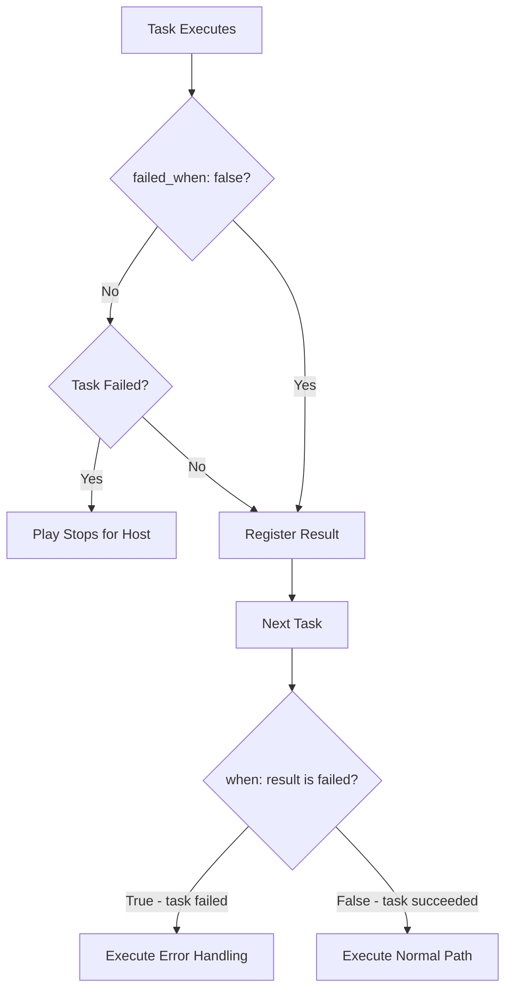

# How to Use Ansible failed Test in Conditionals

Author: [nawazdhandala](https://www.github.com/nawazdhandala)

Tags: Ansible, Conditionals, failed Test, Error Handling, Jinja2 Tests

Description: Learn how to use the Ansible failed test in when clauses to build resilient playbooks that handle task failures gracefully.

---

When a task fails in Ansible, the default behavior is to stop execution on that host. But sometimes you want to continue and make decisions based on whether a task succeeded or failed. The `failed` test (and its companion `succeeded` test) let you check the outcome of a registered task and branch your logic accordingly. This is different from `ignore_errors` because it gives you programmatic control over what happens next.

## Understanding the failed Test

The `failed` Jinja2 test checks whether a registered variable represents a failed task. It works with any registered result from any module.

```yaml
# basic-failed-test.yml - Basic usage of the failed test
---
- name: Demonstrate the failed test
  hosts: all
  gather_facts: false
  tasks:
    - name: Try to reach an API endpoint
      ansible.builtin.uri:
        url: http://api.internal/health
        timeout: 5
      register: api_check
      failed_when: false  # Prevent task from stopping the play

    - name: API is reachable
      ansible.builtin.debug:
        msg: "API is healthy"
      when: api_check is not failed

    - name: API is not reachable
      ansible.builtin.debug:
        msg: "API check failed, activating fallback"
      when: api_check is failed
```

The `failed_when: false` on the first task is critical. Without it, a failed HTTP request would stop the playbook before reaching the conditional tasks.

## failed vs succeeded vs not failed

Ansible provides several related tests:

```yaml
# comparison.yml - failed, succeeded, and their negations
---
- name: Test comparison
  hosts: localhost
  gather_facts: false
  tasks:
    - name: Run a command that might fail
      ansible.builtin.command:
        cmd: ls /nonexistent/path
      register: cmd_result
      failed_when: false
      changed_when: false

    - name: Check using different tests
      ansible.builtin.debug:
        msg:
          - "is failed: {{ cmd_result is failed }}"         # true
          - "is not failed: {{ cmd_result is not failed }}"  # false
          - "is succeeded: {{ cmd_result is succeeded }}"    # false
          - "is success: {{ cmd_result is success }}"        # false (alias)
```

The `succeeded` and `success` tests are equivalent. Similarly, `failed` and `failure` are aliases. Use whichever reads more naturally in your context.

## Practical Example: Service Health Checks with Fallback

A real deployment scenario where you check multiple services and fall back to alternatives:

```yaml
# health-fallback.yml - Service health check with fallback logic
---
- name: Service health check with fallback
  hosts: app_servers
  gather_facts: false
  become: true
  vars:
    primary_db: db-primary.internal
    secondary_db: db-secondary.internal
  tasks:
    - name: Check primary database connectivity
      ansible.builtin.command:
        cmd: "pg_isready -h {{ primary_db }} -p 5432 -t 5"
      register: primary_db_check
      failed_when: false
      changed_when: false

    - name: Check secondary database if primary failed
      ansible.builtin.command:
        cmd: "pg_isready -h {{ secondary_db }} -p 5432 -t 5"
      register: secondary_db_check
      failed_when: false
      changed_when: false
      when: primary_db_check is failed

    - name: Set active database host
      ansible.builtin.set_fact:
        active_db_host: >-
          {{ primary_db if primary_db_check is not failed
             else secondary_db if (secondary_db_check is defined and secondary_db_check is not failed)
             else 'none' }}

    - name: Fail if no database is available
      ansible.builtin.fail:
        msg: "Neither primary nor secondary database is reachable"
      when: active_db_host == 'none'

    - name: Configure application with active database
      ansible.builtin.template:
        src: database.yml.j2
        dest: /opt/app/config/database.yml
        mode: '0640'
      vars:
        db_host: "{{ active_db_host }}"

    - name: Log which database is active
      ansible.builtin.debug:
        msg: "Application configured to use {{ active_db_host }}"
```

## Using failed with Blocks

The block/rescue pattern uses failure detection implicitly, but you can also use the `failed` test within rescue blocks for more granular handling:

```yaml
# block-rescue-failed.yml - Granular error handling in rescue
---
- name: Deployment with granular error handling
  hosts: app_servers
  gather_facts: false
  become: true
  tasks:
    - name: Deployment attempt
      block:
        - name: Stop service
          ansible.builtin.systemd:
            name: myapp
            state: stopped
          register: stop_result

        - name: Deploy new code
          ansible.builtin.copy:
            src: /releases/latest/
            dest: /opt/app/
            mode: '0755'
          register: deploy_result

        - name: Start service
          ansible.builtin.systemd:
            name: myapp
            state: started
          register: start_result

        - name: Health check
          ansible.builtin.uri:
            url: http://localhost:8080/health
            status_code: 200
          register: health_result
          retries: 10
          delay: 3
          until: health_result is not failed

      rescue:
        - name: Determine which step failed
          ansible.builtin.set_fact:
            failure_step: >-
              {{ 'stop' if stop_result is defined and stop_result is failed
                 else 'deploy' if deploy_result is defined and deploy_result is failed
                 else 'start' if start_result is defined and start_result is failed
                 else 'health_check' if health_result is defined and health_result is failed
                 else 'unknown' }}

        - name: Log failure details
          ansible.builtin.debug:
            msg: "Deployment failed at step: {{ failure_step }}"

        - name: Rollback only if deployment was attempted
          ansible.builtin.copy:
            src: /opt/app/backup/
            dest: /opt/app/
            remote_src: true
            mode: '0755'
          when: deploy_result is defined and deploy_result is not failed

        - name: Ensure service is running after rollback
          ansible.builtin.systemd:
            name: myapp
            state: started
```

## Checking Multiple Results

When you need to evaluate the success or failure of multiple prior tasks:

```yaml
# multi-check.yml - Check multiple task results
---
- name: Multi-service validation
  hosts: all
  gather_facts: false
  tasks:
    - name: Check Redis
      ansible.builtin.command:
        cmd: redis-cli ping
      register: redis_check
      failed_when: false
      changed_when: false

    - name: Check PostgreSQL
      ansible.builtin.command:
        cmd: pg_isready
      register: postgres_check
      failed_when: false
      changed_when: false

    - name: Check Elasticsearch
      ansible.builtin.uri:
        url: http://localhost:9200/_cluster/health
        timeout: 5
      register: es_check
      failed_when: false

    - name: Build service status report
      ansible.builtin.set_fact:
        service_status:
          redis: "{{ 'healthy' if redis_check is not failed else 'down' }}"
          postgres: "{{ 'healthy' if postgres_check is not failed else 'down' }}"
          elasticsearch: "{{ 'healthy' if es_check is not failed else 'down' }}"

    - name: Display service status
      ansible.builtin.debug:
        var: service_status

    - name: Count failed services
      ansible.builtin.set_fact:
        failed_services: >-
          {{ [redis_check, postgres_check, es_check]
             | selectattr('failed', 'equalto', true) | list | length }}

    - name: Alert if any service is down
      ansible.builtin.debug:
        msg: "WARNING: {{ failed_services }} service(s) are down"
      when: failed_services | int > 0

    - name: Block deployment if critical services are down
      ansible.builtin.fail:
        msg: "Cannot deploy: critical services are unavailable"
      when:
        - postgres_check is failed or redis_check is failed
```

## Using failed with retry Logic

The `until` loop can use the `failed` test to retry until a task succeeds:

```yaml
# retry-until-success.yml - Retry tasks until they succeed
---
- name: Retry with failed test
  hosts: all
  gather_facts: false
  tasks:
    - name: Wait for service to become healthy
      ansible.builtin.uri:
        url: http://localhost:8080/health
        status_code: 200
      register: health
      until: health is not failed
      retries: 30
      delay: 10

    - name: Wait for database to accept connections
      ansible.builtin.command:
        cmd: pg_isready -h db.internal -t 3
      register: db_ready
      until: db_ready is not failed
      retries: 20
      delay: 5
      changed_when: false
```

## The Decision Flow



## failed Test with Skipped Tasks

A subtle point: if a task was skipped (due to a `when` clause), it is neither failed nor succeeded. You need to check for `skipped` separately:

```yaml
# skipped-vs-failed.yml - Handle all three states
---
- name: Handle skipped, failed, and succeeded
  hosts: all
  gather_facts: false
  tasks:
    - name: Conditional task
      ansible.builtin.command:
        cmd: echo "only on certain hosts"
      register: conditional_result
      when: inventory_hostname in groups.get('special', [])
      failed_when: false
      changed_when: false

    - name: Handle all outcomes
      ansible.builtin.debug:
        msg: >-
          {{
            'Task was skipped' if conditional_result is skipped
            else 'Task failed' if conditional_result is failed
            else 'Task succeeded'
          }}
```

## Combining failed with Other Tests

You can combine `failed` with other conditions for precise control:

```yaml
# combined-conditions.yml - failed test with additional checks
---
- name: Combined failure conditions
  hosts: all
  gather_facts: false
  tasks:
    - name: Run deployment script
      ansible.builtin.command:
        cmd: /opt/deploy.sh
      register: deploy_result
      failed_when: false
      changed_when: true

    - name: Handle specific failure cases
      ansible.builtin.debug:
        msg: "Script failed with timeout"
      when:
        - deploy_result is failed
        - "'timeout' in deploy_result.stderr | default('')"

    - name: Handle permission errors specifically
      ansible.builtin.debug:
        msg: "Permission denied during deployment"
      when:
        - deploy_result is failed
        - "'Permission denied' in deploy_result.stderr | default('')"

    - name: Handle unknown failures
      ansible.builtin.debug:
        msg: "Unknown failure: {{ deploy_result.stderr | default('no stderr') }}"
      when:
        - deploy_result is failed
        - "'timeout' not in deploy_result.stderr | default('')"
        - "'Permission denied' not in deploy_result.stderr | default('')"
```

## Best Practices

Always use `failed_when: false` (not `ignore_errors: true`) when you plan to check the result with the `failed` test. The `ignore_errors` directive is noisier and does not integrate as cleanly with conditional logic. Check for `is skipped` separately from `is failed` when a task might have been conditionally skipped. Use descriptive variable names for registered results so the failure chain is readable. Combine the `failed` test with string matching on stderr for granular error classification. In retry loops, `until: result is not failed` is the cleanest syntax. Remember that `is failed` checks the registered result, not the current state of the system, so if a service has recovered since the check, the registered variable still shows the old failure.

The `failed` test turns Ansible from a "stop on error" tool into one that handles errors as data. Once you start using it, your playbooks become significantly more resilient and your deployments require less manual intervention when things go sideways.
