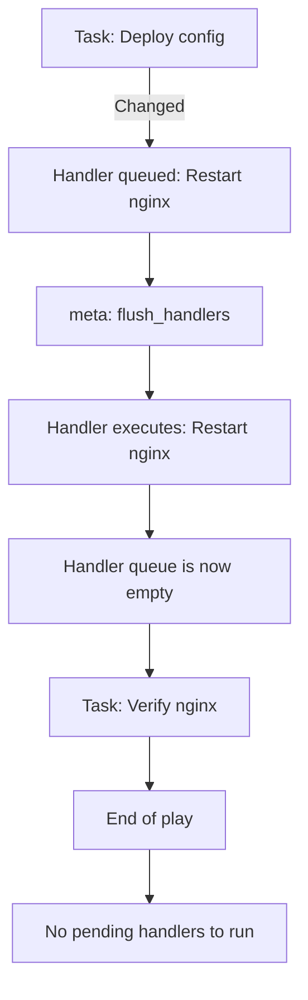

# How to Use Ansible flush_handlers to Run Handlers Immediately

Author: [nawazdhandala](https://www.github.com/nawazdhandala)

Tags: Ansible, Handlers, Task Execution, DevOps

Description: Learn how to use the meta flush_handlers directive in Ansible to trigger pending handlers immediately instead of waiting until the end of the play.

---

By default, Ansible handlers run at the very end of a play. This is usually what you want, but there are situations where you need a handler to execute mid-play, before subsequent tasks run. The `meta: flush_handlers` task forces all pending handlers to run immediately at that point in the playbook. This is crucial for tasks that depend on a service being restarted or a configuration being reloaded before they can proceed.

## The Problem

Consider this playbook:

```yaml
# broken-order.yml - Handler runs too late
---
- name: Setup and verify web server
  hosts: webservers
  become: yes

  handlers:
    - name: Restart nginx
      systemd:
        name: nginx
        state: restarted

  tasks:
    - name: Install nginx
      apt:
        name: nginx
        state: present

    - name: Deploy nginx configuration
      template:
        src: nginx.conf.j2
        dest: /etc/nginx/nginx.conf
      notify: Restart nginx

    - name: Verify nginx is serving the new site
      uri:
        url: http://localhost/health
        status_code: 200
      # BUG: This runs BEFORE the handler restarts nginx!
      # nginx is still running with the OLD configuration
```

The verification task fails because nginx has not been restarted yet. The handler is queued but will not run until after all tasks complete.

## The Solution: flush_handlers

Insert `meta: flush_handlers` between the notify and the task that depends on the restart:

```yaml
# fixed-order.yml - Flush handlers before verification
---
- name: Setup and verify web server
  hosts: webservers
  become: yes

  handlers:
    - name: Restart nginx
      systemd:
        name: nginx
        state: restarted

  tasks:
    - name: Install nginx
      apt:
        name: nginx
        state: present

    - name: Deploy nginx configuration
      template:
        src: nginx.conf.j2
        dest: /etc/nginx/nginx.conf
      notify: Restart nginx

    # Force all pending handlers to run NOW
    - name: Run pending handlers
      meta: flush_handlers

    - name: Verify nginx is serving the new site
      uri:
        url: http://localhost/health
        status_code: 200
      retries: 5
      delay: 3
      # Now this works because nginx was already restarted
```

## How flush_handlers Works



After `flush_handlers` runs, the handler queue is cleared. If the same handler is notified again later in the play, it will run again at the end of the play (or at the next flush_handlers).

## Practical Example: Database and Application Deployment

Here is a real deployment where flush_handlers is essential:

```yaml
# deploy.yml - Multi-stage deployment requiring mid-play handler execution
---
- name: Deploy application with database changes
  hosts: app_servers
  become: yes
  serial: 3

  handlers:
    - name: Restart application
      systemd:
        name: myapp
        state: restarted

    - name: Reload nginx
      systemd:
        name: nginx
        state: reloaded

  tasks:
    # Phase 1: Update application code
    - name: Deploy new application code
      unarchive:
        src: "files/myapp-{{ version }}.tar.gz"
        dest: /opt/myapp
      notify: Restart application

    - name: Update application configuration
      template:
        src: config.yml.j2
        dest: /etc/myapp/config.yml
      notify: Restart application

    # FLUSH: Application must be running new code before migrations
    - name: Flush handlers to restart application now
      meta: flush_handlers

    # Phase 2: Database operations (needs new code running)
    - name: Run database migrations
      command: /opt/myapp/bin/migrate --apply
      run_once: true
      register: migration
      changed_when: "'Applied' in migration.stdout"

    - name: Verify application health after migration
      uri:
        url: "http://{{ inventory_hostname }}:8080/health"
        status_code: 200
      retries: 10
      delay: 5

    # Phase 3: Update nginx (may notify handlers again)
    - name: Update nginx configuration
      template:
        src: nginx-app.conf.j2
        dest: /etc/nginx/sites-available/myapp.conf
      notify: Reload nginx

    # Handlers from Phase 3 run at end of play automatically
```

## Multiple flush_handlers

You can use `flush_handlers` multiple times in a play:

```yaml
# multi-flush.yml - Multiple handler flush points
---
- name: Complex deployment with multiple flush points
  hosts: all
  become: yes

  handlers:
    - name: Restart database
      systemd:
        name: postgresql
        state: restarted

    - name: Restart application
      systemd:
        name: myapp
        state: restarted

    - name: Restart nginx
      systemd:
        name: nginx
        state: restarted

  tasks:
    # Stage 1: Database configuration
    - name: Update PostgreSQL configuration
      template:
        src: postgresql.conf.j2
        dest: /etc/postgresql/14/main/postgresql.conf
      notify: Restart database

    - name: Update pg_hba.conf
      template:
        src: pg_hba.conf.j2
        dest: /etc/postgresql/14/main/pg_hba.conf
      notify: Restart database

    # Flush: Database must be restarted before app can use new settings
    - name: Flush database handlers
      meta: flush_handlers

    - name: Verify database is accepting connections
      command: pg_isready -h localhost
      register: pg_ready
      until: pg_ready.rc == 0
      retries: 10
      delay: 3
      changed_when: false

    # Stage 2: Application configuration
    - name: Update application database config
      template:
        src: database.yml.j2
        dest: /etc/myapp/database.yml
      notify: Restart application

    # Flush: Application must be running before nginx health checks
    - name: Flush application handlers
      meta: flush_handlers

    - name: Wait for application to start
      uri:
        url: http://localhost:8080/health
        status_code: 200
      retries: 15
      delay: 5

    # Stage 3: Web server configuration
    - name: Update nginx configuration
      template:
        src: nginx.conf.j2
        dest: /etc/nginx/sites-available/myapp.conf
      notify: Restart nginx

    # Final handlers run at end of play
```

## flush_handlers with Blocks

You can use `flush_handlers` inside blocks:

```yaml
# flush-in-block.yml - Flush handlers within block structures
---
- name: Deploy with block-level handler flushing
  hosts: app_servers
  become: yes

  handlers:
    - name: Restart myapp
      systemd:
        name: myapp
        state: restarted

  tasks:
    - name: Safe deployment with handler flush
      block:
        - name: Update configuration
          template:
            src: config.j2
            dest: /etc/myapp/config.yml
          notify: Restart myapp

        - name: Flush handlers within block
          meta: flush_handlers

        - name: Run post-restart verification
          uri:
            url: http://localhost:8080/health
            status_code: 200
          retries: 10
          delay: 5

      rescue:
        - name: Rollback configuration
          copy:
            src: /etc/myapp/config.yml.bak
            dest: /etc/myapp/config.yml
            remote_src: yes
          notify: Restart myapp

        - name: Flush handlers after rollback
          meta: flush_handlers
```

## flush_handlers and Idempotency

A handler flushed mid-play will not run again at the end of the play unless it is notified again after the flush:

```yaml
# flush-idempotency.yml - Handler runs only when notified after flush
---
- name: Handler flush behavior demo
  hosts: all
  become: yes

  handlers:
    - name: Restart nginx
      systemd:
        name: nginx
        state: restarted

  tasks:
    - name: Update main config
      template:
        src: nginx.conf.j2
        dest: /etc/nginx/nginx.conf
      notify: Restart nginx

    - name: Flush to apply main config
      meta: flush_handlers
    # nginx restarts HERE (if config changed)

    - name: Do some other work
      apt:
        name: certbot
        state: present

    - name: Update SSL config
      template:
        src: ssl.conf.j2
        dest: /etc/nginx/conf.d/ssl.conf
      notify: Restart nginx
    # If SSL config changed, nginx restarts AGAIN at end of play

    # Without the second notify, nginx would NOT restart again
```

## Common Patterns

### Certificate Renewal and Service Restart

```yaml
# cert-renewal.yml - Renew certs and immediately restart
---
- name: Renew SSL certificates
  hosts: webservers
  become: yes

  handlers:
    - name: Reload nginx
      systemd:
        name: nginx
        state: reloaded

  tasks:
    - name: Renew SSL certificate
      command: certbot renew --quiet
      register: certbot
      changed_when: "'renewed' in certbot.stdout"
      notify: Reload nginx

    - name: Flush handlers to apply new certificate
      meta: flush_handlers

    - name: Verify SSL certificate is valid
      command: >
        openssl s_client -connect {{ inventory_hostname }}:443
        -servername {{ domain }}
        </dev/null 2>/dev/null |
        openssl x509 -noout -dates
      register: cert_check
      changed_when: false
      delegate_to: localhost
```

### Service Dependency Chain

```yaml
# service-chain.yml - Start services in order with verification
---
- name: Start service dependency chain
  hosts: all
  become: yes

  handlers:
    - name: Start redis
      systemd:
        name: redis-server
        state: started

    - name: Start app
      systemd:
        name: myapp
        state: started

    - name: Start nginx
      systemd:
        name: nginx
        state: started

  tasks:
    - name: Configure Redis
      template:
        src: redis.conf.j2
        dest: /etc/redis/redis.conf
      notify: Start redis

    - name: Flush to start Redis first
      meta: flush_handlers

    - name: Verify Redis is responding
      command: redis-cli ping
      register: redis_ping
      until: redis_ping.stdout == "PONG"
      retries: 5
      delay: 2
      changed_when: false

    - name: Configure application
      template:
        src: app.conf.j2
        dest: /etc/myapp/app.conf
      notify: Start app

    - name: Flush to start application
      meta: flush_handlers

    - name: Verify application health
      uri:
        url: http://localhost:8080/health
      retries: 10
      delay: 3

    - name: Configure nginx
      template:
        src: nginx.conf.j2
        dest: /etc/nginx/nginx.conf
      notify: Start nginx
    # nginx handler runs at end of play
```

## Summary

The `meta: flush_handlers` directive is essential when subsequent tasks depend on handlers running first. Use it between configuration changes and verification steps, between service restarts in a dependency chain, and in any scenario where task ordering matters. Remember that flushed handlers clear from the queue, so they will only run again if notified after the flush point. Place your flush_handlers calls strategically to create clear phases in your deployment process.
