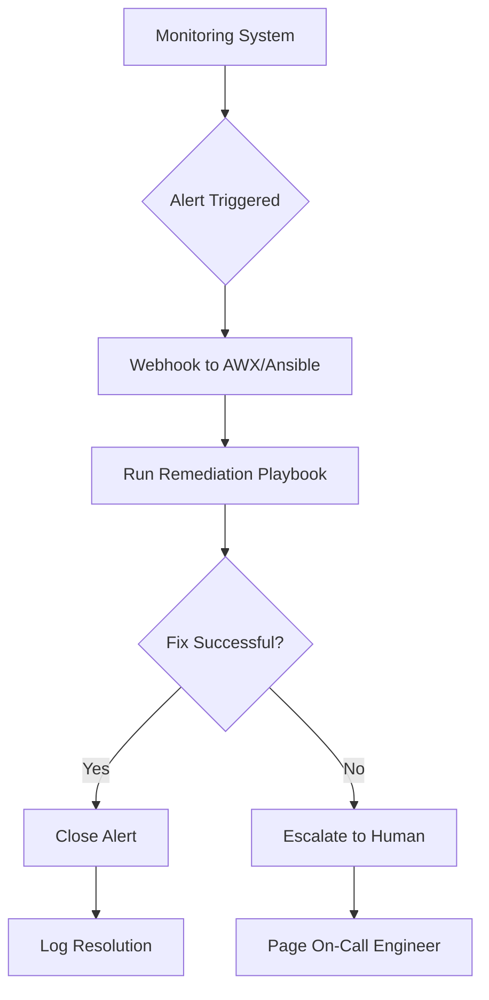

# How to Use Ansible for Automated Remediation

Author: [nawazdhandala](https://www.github.com/nawazdhandala)

Tags: Ansible, Automated Remediation, Self-Healing, Monitoring

Description: Build automated remediation workflows with Ansible that detect and fix common infrastructure problems without human intervention using monitoring triggers.

---

Automated remediation closes the loop between monitoring and action. Instead of an alert waking up an engineer at 3 AM to restart a crashed service, the monitoring system triggers an Ansible playbook that restarts it automatically. The engineer gets a notification that the problem was detected and fixed, not a page demanding immediate attention.

## The Remediation Architecture



## Connecting Monitoring to Ansible

Set up webhooks from your monitoring system to trigger Ansible playbooks:

```yaml
# Prometheus alertmanager configuration
# alertmanager.yml
route:
  receiver: ansible-remediation
  routes:
    - match:
        severity: auto-remediate
      receiver: ansible-remediation
    - match:
        severity: critical
      receiver: pagerduty

receivers:
  - name: ansible-remediation
    webhook_configs:
      - url: 'http://awx.example.com:8080/api/v2/job_templates/42/launch/'
        send_resolved: true
        http_config:
          bearer_token: '{{ awx_api_token }}'
```

```yaml
# Prometheus alert rules
# alerts/remediation.yml
groups:
  - name: auto-remediation
    rules:
      - alert: ServiceDown
        expr: up{job="myapp"} == 0
        for: 2m
        labels:
          severity: auto-remediate
          remediation: restart_service
        annotations:
          summary: "{{ $labels.instance }} is down"
          service_name: "myapp"

      - alert: HighDiskUsage
        expr: node_filesystem_avail_bytes{mountpoint="/"} / node_filesystem_size_bytes{mountpoint="/"} < 0.1
        for: 5m
        labels:
          severity: auto-remediate
          remediation: disk_cleanup
        annotations:
          summary: "{{ $labels.instance }} disk usage above 90%"

      - alert: HighMemoryUsage
        expr: (1 - (node_memory_MemAvailable_bytes / node_memory_MemTotal_bytes)) > 0.95
        for: 5m
        labels:
          severity: auto-remediate
          remediation: memory_cleanup
```

## Remediation Dispatcher

A dispatcher playbook routes alerts to the correct remediation:

```yaml
# playbooks/remediate.yml
# Dispatch alerts to appropriate remediation playbooks
- name: Remediation dispatcher
  hosts: localhost
  gather_facts: false

  vars:
    alert_host: "{{ alert_labels.instance | regex_replace(':.*', '') }}"
    remediation_type: "{{ alert_labels.remediation }}"

  tasks:
    - name: Log incoming alert
      ansible.builtin.debug:
        msg: |
          Received alert: {{ alert_name }}
          Host: {{ alert_host }}
          Remediation: {{ remediation_type }}

    - name: Add target host to inventory
      ansible.builtin.add_host:
        hostname: "{{ alert_host }}"
        groupname: remediation_targets

    - name: Dispatch to service restart remediation
      ansible.builtin.include_tasks: remediations/restart-service.yml
      when: remediation_type == 'restart_service'

    - name: Dispatch to disk cleanup remediation
      ansible.builtin.include_tasks: remediations/disk-cleanup.yml
      when: remediation_type == 'disk_cleanup'

    - name: Dispatch to memory cleanup remediation
      ansible.builtin.include_tasks: remediations/memory-cleanup.yml
      when: remediation_type == 'memory_cleanup'
```

## Service Restart Remediation

```yaml
# playbooks/remediations/restart-service.yml
# Automatically restart a failed service

- name: Restart failed service
  hosts: remediation_targets
  become: yes
  tasks:
    - name: Collect pre-restart diagnostics
      ansible.builtin.command: journalctl -u {{ service_name }} --since "10 minutes ago" --no-pager -n 50
      register: pre_restart_logs
      changed_when: false

    - name: Restart the service
      ansible.builtin.service:
        name: "{{ service_name }}"
        state: restarted

    - name: Wait for service to become healthy
      ansible.builtin.uri:
        url: "http://localhost:{{ service_port | default(8080) }}/health"
        status_code: 200
      retries: 15
      delay: 5
      register: health_check

    - name: Report successful remediation
      ansible.builtin.debug:
        msg: "Service {{ service_name }} restarted successfully on {{ inventory_hostname }}"
      when: health_check is succeeded
```

## Disk Cleanup Remediation

```yaml
# playbooks/remediations/disk-cleanup.yml
# Automatic disk space recovery

- name: Clean up disk space
  hosts: remediation_targets
  become: yes
  tasks:
    - name: Record disk usage before cleanup
      ansible.builtin.command: df -h /
      register: disk_before
      changed_when: false

    - name: Truncate large log files (keep last 1000 lines)
      ansible.builtin.shell: |
        for log in $(find /var/log -name "*.log" -size +100M); do
          tail -1000 "$log" > "${log}.tmp" && mv "${log}.tmp" "$log"
        done
      changed_when: true

    - name: Clean package cache
      ansible.builtin.apt:
        autoclean: yes

    - name: Remove old journal logs
      ansible.builtin.command: journalctl --vacuum-size=100M
      changed_when: true

    - name: Remove core dumps
      ansible.builtin.find:
        paths: /var/crash
        patterns: "*.crash"
      register: crash_files

    - name: Delete crash files
      ansible.builtin.file:
        path: "{{ item.path }}"
        state: absent
      loop: "{{ crash_files.files }}"
      loop_control:
        label: "{{ item.path }}"

    - name: Record disk usage after cleanup
      ansible.builtin.command: df -h /
      register: disk_after
      changed_when: false

    - name: Report cleanup results
      ansible.builtin.debug:
        msg: |
          Disk cleanup on {{ inventory_hostname }}:
          Before: {{ disk_before.stdout_lines[-1] }}
          After: {{ disk_after.stdout_lines[-1] }}
```

## Memory Cleanup Remediation

```yaml
# playbooks/remediations/memory-cleanup.yml
# Automated memory pressure relief

- name: Relieve memory pressure
  hosts: remediation_targets
  become: yes
  tasks:
    - name: Record memory before cleanup
      ansible.builtin.command: free -m
      register: mem_before
      changed_when: false

    - name: Clear filesystem caches
      ansible.builtin.command: sync
      changed_when: false

    - name: Drop caches
      ansible.builtin.shell: echo 3 > /proc/sys/vm/drop_caches
      changed_when: true

    - name: Find and kill zombie processes
      ansible.builtin.shell: |
        ps -eo pid,stat | awk '$2 ~ /Z/ {print $1}' | xargs -r kill -9
      changed_when: true
      failed_when: false

    - name: Record memory after cleanup
      ansible.builtin.command: free -m
      register: mem_after
      changed_when: false

    - name: Report results
      ansible.builtin.debug:
        msg: |
          Memory cleanup on {{ inventory_hostname }}:
          Before: {{ mem_before.stdout_lines[1] }}
          After: {{ mem_after.stdout_lines[1] }}
```

## Remediation Safety Limits

Prevent remediation loops and excessive automated actions:

```yaml
# playbooks/remediations/safety-checks.yml
# Safety guardrails for automated remediation

- name: Check remediation cooldown
  ansible.builtin.stat:
    path: "/tmp/remediation-{{ remediation_type }}-{{ inventory_hostname }}.lock"
  register: cooldown_lock
  delegate_to: localhost

- name: Abort if recently remediated
  ansible.builtin.fail:
    msg: >
      Remediation {{ remediation_type }} was already triggered for
      {{ inventory_hostname }} within the cooldown period.
      Escalating to human.
  when:
    - cooldown_lock.stat.exists
    - (ansible_date_time.epoch | int) - (cooldown_lock.stat.mtime | int) < remediation_cooldown_seconds | default(1800)

- name: Create cooldown lock
  ansible.builtin.file:
    path: "/tmp/remediation-{{ remediation_type }}-{{ inventory_hostname }}.lock"
    state: touch
    mode: '0644'
  delegate_to: localhost

- name: Check daily remediation count
  ansible.builtin.shell: |
    grep -c "{{ inventory_hostname }}" /var/log/remediation.log 2>/dev/null || echo 0
  register: daily_count
  delegate_to: localhost
  changed_when: false

- name: Abort if too many remediations today
  ansible.builtin.fail:
    msg: >
      Host {{ inventory_hostname }} has been auto-remediated
      {{ daily_count.stdout }} times today. Maximum is
      {{ max_daily_remediations | default(3) }}. Escalating.
  when: daily_count.stdout | int >= max_daily_remediations | default(3)
```

## Summary

Automated remediation with Ansible bridges monitoring and action. Connect your alerting system to Ansible via webhooks. Build a dispatcher that routes alerts to specific remediation playbooks. Include safety guardrails like cooldown periods and daily limits to prevent remediation loops. Log every automated action for audit purposes. The goal is to handle routine issues automatically while escalating truly unusual problems to humans. Start with simple remediations like service restarts and disk cleanup, then expand as you gain confidence.
