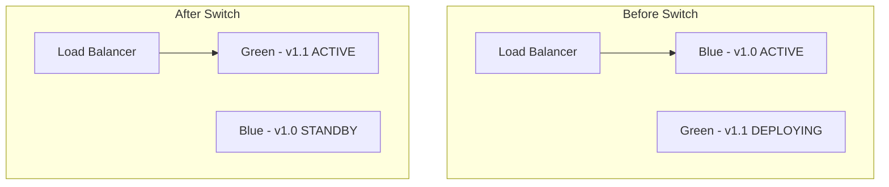
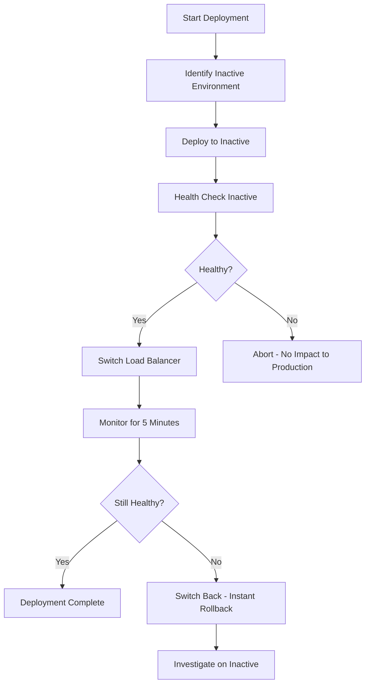

# How to Use Ansible for Blue/Green Deployments

Author: [nawazdhandala](https://www.github.com/nawazdhandala)

Tags: Ansible, Blue/Green Deployment, Zero Downtime, DevOps

Description: Implement blue/green deployment strategies with Ansible for zero-downtime releases using load balancer switching and automated health checks.

---

Blue/green deployment is a release strategy where you maintain two identical production environments. One (blue) serves live traffic while the other (green) receives the new deployment. Once the green environment is verified, you switch traffic from blue to green. If something goes wrong, you switch back instantly. Ansible is a great tool for orchestrating this pattern because it can handle the deployment, health checking, and traffic switching in a single coordinated workflow.

This guide covers implementing blue/green deployments with Ansible across different infrastructure setups.

## How Blue/Green Works

The concept is straightforward:

1. Blue environment is currently serving production traffic
2. Deploy the new version to the green environment
3. Run health checks and tests on green
4. Switch the load balancer to point to green
5. Green is now production, blue becomes the standby
6. If issues are found, switch back to blue (instant rollback)



## Project Structure

```
blue-green-deploy/
  inventory/
    production.ini
    group_vars/
      all.yml
      blue.yml
      green.yml
  playbooks/
    deploy.yml
    switch.yml
    rollback.yml
    health-check.yml
  roles/
    app-deploy/
    lb-switch/
    health-check/
  ansible.cfg
```

## Inventory Setup

Define blue and green server groups in your inventory.

```ini
# inventory/production.ini
[blue]
blue-web-01 ansible_host=10.0.1.10
blue-web-02 ansible_host=10.0.1.11

[green]
green-web-01 ansible_host=10.0.2.10
green-web-02 ansible_host=10.0.2.11

[webservers:children]
blue
green

[loadbalancer]
lb-01 ansible_host=10.0.0.10

[all:vars]
ansible_user=deploy
ansible_ssh_private_key_file=~/.ssh/deploy_key
```

Define environment-specific variables.

```yaml
# inventory/group_vars/all.yml
---
app_name: webapp
app_port: 8080
health_endpoint: "/health"
lb_type: nginx  # or haproxy, aws_alb, etc.

# Track which environment is currently active
# This gets updated by the switch playbook
active_environment: blue
```

```yaml
# inventory/group_vars/blue.yml
---
env_color: blue
app_dir: /opt/app-blue
```

```yaml
# inventory/group_vars/green.yml
---
env_color: green
app_dir: /opt/app-green
```

## Determining the Target Environment

First, figure out which environment is currently inactive (that is where we deploy).

```yaml
# playbooks/determine-target.yml
---
- name: Determine Deployment Target
  hosts: loadbalancer
  gather_facts: false

  tasks:
    # Read the current active environment from the load balancer config
    - name: Get current active environment
      shell: grep -oP 'upstream\s+\K(blue|green)' /etc/nginx/conf.d/app.conf | head -1
      register: current_active
      changed_when: false

    - name: Set deployment target
      set_fact:
        deploy_target: "{{ 'green' if current_active.stdout == 'blue' else 'blue' }}"
        current_active: "{{ current_active.stdout }}"

    - name: Display deployment plan
      debug:
        msg: |
          Current active: {{ current_active }}
          Deploying to: {{ deploy_target }}
```

## The Deploy Playbook

Deploy to the inactive environment.

```yaml
# playbooks/deploy.yml
---
# Step 1: Determine which environment to deploy to
- name: Determine target environment
  hosts: loadbalancer
  gather_facts: false
  tasks:
    - name: Get current active environment
      shell: grep -oP 'upstream\s+\K(blue|green)' /etc/nginx/conf.d/app.conf | head -1
      register: current_active
      changed_when: false

    - name: Set target facts
      set_fact:
        deploy_target: "{{ 'green' if current_active.stdout == 'blue' else 'blue' }}"

    - name: Announce deployment target
      debug:
        msg: "Deploying version {{ deploy_version }} to {{ deploy_target }} environment"

# Step 2: Deploy to the inactive environment
- name: Deploy Application
  hosts: "{{ hostvars['lb-01']['deploy_target'] }}"
  become: true
  gather_facts: true

  vars:
    deploy_version: "{{ lookup('env', 'DEPLOY_VERSION') | default('latest') }}"

  tasks:
    # Stop the application on inactive environment
    - name: Stop application
      systemd:
        name: "{{ app_name }}"
        state: stopped
      ignore_errors: true

    # Download the new version
    - name: Download application artifact
      get_url:
        url: "https://artifacts.example.com/{{ app_name }}/{{ deploy_version }}/{{ app_name }}.tar.gz"
        dest: "/tmp/{{ app_name }}-{{ deploy_version }}.tar.gz"

    # Clean and prepare the deploy directory
    - name: Clean deploy directory
      file:
        path: "{{ app_dir }}/app"
        state: absent

    - name: Create deploy directory
      file:
        path: "{{ app_dir }}/app"
        state: directory
        owner: deploy
        group: deploy
        mode: '0755'

    # Extract application
    - name: Extract application
      unarchive:
        src: "/tmp/{{ app_name }}-{{ deploy_version }}.tar.gz"
        dest: "{{ app_dir }}/app"
        remote_src: true
        owner: deploy
        group: deploy

    # Deploy configuration
    - name: Deploy configuration
      template:
        src: ../roles/app-deploy/templates/config.yml.j2
        dest: "{{ app_dir }}/app/config.yml"
        owner: deploy
        group: deploy
        mode: '0640'

    # Write version file
    - name: Write version file
      copy:
        content: "{{ deploy_version }}"
        dest: "{{ app_dir }}/VERSION"
        mode: '0644'

    # Start the application
    - name: Start application
      systemd:
        name: "{{ app_name }}"
        state: started

    # Wait for application to be ready
    - name: Wait for application to start
      uri:
        url: "http://localhost:{{ app_port }}{{ health_endpoint }}"
        status_code: 200
      register: health
      retries: 30
      delay: 5
      until: health.status == 200

# Step 3: Health check the deployed environment
- name: Health Check Deployed Environment
  hosts: "{{ hostvars['lb-01']['deploy_target'] }}"
  gather_facts: false

  tasks:
    - name: Run comprehensive health check
      uri:
        url: "http://localhost:{{ app_port }}{{ health_endpoint }}"
        status_code: 200
        return_content: true
      register: health_result

    - name: Verify version
      uri:
        url: "http://localhost:{{ app_port }}/version"
        return_content: true
      register: version_result

    - name: Display health status
      debug:
        msg: "{{ inventory_hostname }}: Health={{ health_result.status }}, Version={{ version_result.content | trim }}"
```

## The Switch Playbook

Switch traffic from the current active environment to the newly deployed one.

```yaml
# playbooks/switch.yml
---
- name: Switch Traffic to New Environment
  hosts: loadbalancer
  become: true
  gather_facts: false

  tasks:
    # Determine current and target environments
    - name: Get current active environment
      shell: grep -oP 'upstream\s+\K(blue|green)' /etc/nginx/conf.d/app.conf | head -1
      register: current_active
      changed_when: false

    - name: Set target environment
      set_fact:
        new_active: "{{ 'green' if current_active.stdout == 'blue' else 'blue' }}"
        old_active: "{{ current_active.stdout }}"

    - name: Display switch plan
      debug:
        msg: "Switching traffic from {{ old_active }} to {{ new_active }}"

    # Update Nginx configuration to point to the new environment
    - name: Switch Nginx upstream to new environment
      template:
        src: ../roles/lb-switch/templates/nginx-upstream.conf.j2
        dest: /etc/nginx/conf.d/app.conf
        mode: '0644'
      vars:
        active_upstream: "{{ new_active }}"

    # Test Nginx configuration before reloading
    - name: Test Nginx configuration
      command: nginx -t
      register: nginx_test

    # Reload Nginx to apply the switch
    - name: Reload Nginx
      systemd:
        name: nginx
        state: reloaded
      when: nginx_test.rc == 0

    # Verify the switch
    - name: Wait for switch to take effect
      pause:
        seconds: 5

    - name: Verify traffic is going to new environment
      uri:
        url: "http://localhost/version"
        return_content: true
      register: live_version

    - name: Display active version
      debug:
        msg: "Live traffic is now serving: {{ live_version.content | trim }}"
```

## The Nginx Upstream Template

```nginx
# roles/lb-switch/templates/nginx-upstream.conf.j2
# Active environment: {{ active_upstream }}
# Managed by Ansible - do not edit manually

upstream {{ active_upstream }} {

    server 10.0.1.10:8080;
    server 10.0.1.11:8080;

    server 10.0.2.10:8080;
    server 10.0.2.11:8080;

}

server {
    listen 80;
    server_name app.example.com;

    location / {
        proxy_pass http://{{ active_upstream }};
        proxy_set_header Host $host;
        proxy_set_header X-Real-IP $remote_addr;
        proxy_set_header X-Forwarded-For $proxy_add_x_forwarded_for;
    }

    location /health {
        proxy_pass http://{{ active_upstream }}/health;
    }
}
```

## The Rollback Playbook

Rollback is just switching back to the previous environment.

```yaml
# playbooks/rollback.yml
---
- name: Rollback - Switch Back to Previous Environment
  hosts: loadbalancer
  become: true
  gather_facts: false

  tasks:
    - name: Get current active environment
      shell: grep -oP 'upstream\s+\K(blue|green)' /etc/nginx/conf.d/app.conf | head -1
      register: current_active
      changed_when: false

    - name: Set rollback target
      set_fact:
        rollback_to: "{{ 'green' if current_active.stdout == 'blue' else 'blue' }}"

    - name: Display rollback plan
      debug:
        msg: "Rolling back from {{ current_active.stdout }} to {{ rollback_to }}"

    # Switch back to the previous environment
    - name: Switch Nginx upstream back
      template:
        src: ../roles/lb-switch/templates/nginx-upstream.conf.j2
        dest: /etc/nginx/conf.d/app.conf
      vars:
        active_upstream: "{{ rollback_to }}"

    - name: Test Nginx configuration
      command: nginx -t

    - name: Reload Nginx
      systemd:
        name: nginx
        state: reloaded

    - name: Verify rollback
      uri:
        url: "http://localhost/version"
        return_content: true
      register: live_version

    - name: Rollback complete
      debug:
        msg: "Rolled back. Live version: {{ live_version.content | trim }}"
```

## AWS ALB Blue/Green Switch

If you use an AWS Application Load Balancer, switch target groups instead of Nginx upstreams.

```yaml
# playbooks/switch-alb.yml
---
- name: Switch ALB Target Group
  hosts: localhost
  connection: local
  gather_facts: false

  vars:
    alb_listener_arn: "arn:aws:elasticloadbalancing:us-east-1:123456789:listener/app/my-alb/abc123/def456"
    blue_target_group: "arn:aws:elasticloadbalancing:us-east-1:123456789:targetgroup/blue-tg/abc123"
    green_target_group: "arn:aws:elasticloadbalancing:us-east-1:123456789:targetgroup/green-tg/def456"

  tasks:
    # Get current target group
    - name: Get current listener rules
      command: >
        aws elbv2 describe-listeners
        --listener-arns {{ alb_listener_arn }}
        --query 'Listeners[0].DefaultActions[0].TargetGroupArn'
        --output text
      register: current_tg
      changed_when: false

    - name: Determine new target group
      set_fact:
        new_tg: "{{ green_target_group if current_tg.stdout == blue_target_group else blue_target_group }}"

    - name: Switch ALB to new target group
      command: >
        aws elbv2 modify-listener
        --listener-arn {{ alb_listener_arn }}
        --default-actions Type=forward,TargetGroupArn={{ new_tg }}

    - name: Wait for targets to be healthy
      command: >
        aws elbv2 describe-target-health
        --target-group-arn {{ new_tg }}
        --query 'TargetHealthDescriptions[*].TargetHealth.State'
        --output text
      register: target_health
      retries: 30
      delay: 10
      until: "'unhealthy' not in target_health.stdout"
      changed_when: false

    - name: Switch complete
      debug:
        msg: "ALB switched to {{ 'green' if new_tg == green_target_group else 'blue' }}"
```

## Complete CI/CD Pipeline

```yaml
# .github/workflows/blue-green-deploy.yml
name: Blue/Green Deployment

on:
  workflow_dispatch:
    inputs:
      version:
        description: 'Version to deploy'
        required: true

jobs:
  deploy:
    runs-on: ubuntu-latest
    environment: production
    steps:
      - uses: actions/checkout@v4
      - run: pip install ansible==8.7.0
      - run: |
          mkdir -p ~/.ssh
          echo "${{ secrets.SSH_KEY }}" > ~/.ssh/id_rsa
          chmod 600 ~/.ssh/id_rsa

      - name: Deploy to inactive environment
        run: |
          DEPLOY_VERSION=${{ inputs.version }} \
          ansible-playbook -i inventory/production.ini playbooks/deploy.yml
        env:
          ANSIBLE_HOST_KEY_CHECKING: "false"

      - name: Switch traffic
        run: |
          ansible-playbook -i inventory/production.ini playbooks/switch.yml
        env:
          ANSIBLE_HOST_KEY_CHECKING: "false"

      - name: Verify deployment
        run: curl -f https://app.example.com/health

  rollback:
    runs-on: ubuntu-latest
    needs: deploy
    if: failure()
    steps:
      - uses: actions/checkout@v4
      - run: pip install ansible==8.7.0
      - run: |
          mkdir -p ~/.ssh
          echo "${{ secrets.SSH_KEY }}" > ~/.ssh/id_rsa
          chmod 600 ~/.ssh/id_rsa
      - name: Rollback
        run: |
          ansible-playbook -i inventory/production.ini playbooks/rollback.yml
        env:
          ANSIBLE_HOST_KEY_CHECKING: "false"
```

## Blue/Green Deployment Flow



## Tips for Blue/Green Deployments

1. Both environments must be truly identical in terms of infrastructure. Use the same server specs, same network configuration, and same OS version.
2. Database migrations are the hardest part. The new code must work with both the old and new database schema during the transition. Use backward-compatible migrations.
3. Test your rollback procedure regularly. Do not wait for an actual incident to find out it does not work.
4. The switch should be as fast as possible. A load balancer config reload takes seconds, not minutes.
5. Keep the old environment running for at least 30 minutes after a switch so you can roll back quickly if delayed issues surface.
6. Warm up the new environment before switching. Cold caches and JIT compilation can cause a performance dip right after the switch.

Blue/green deployment with Ansible gives you the confidence to deploy frequently with minimal risk. The instant rollback capability alone justifies the extra infrastructure cost of maintaining two environments.
