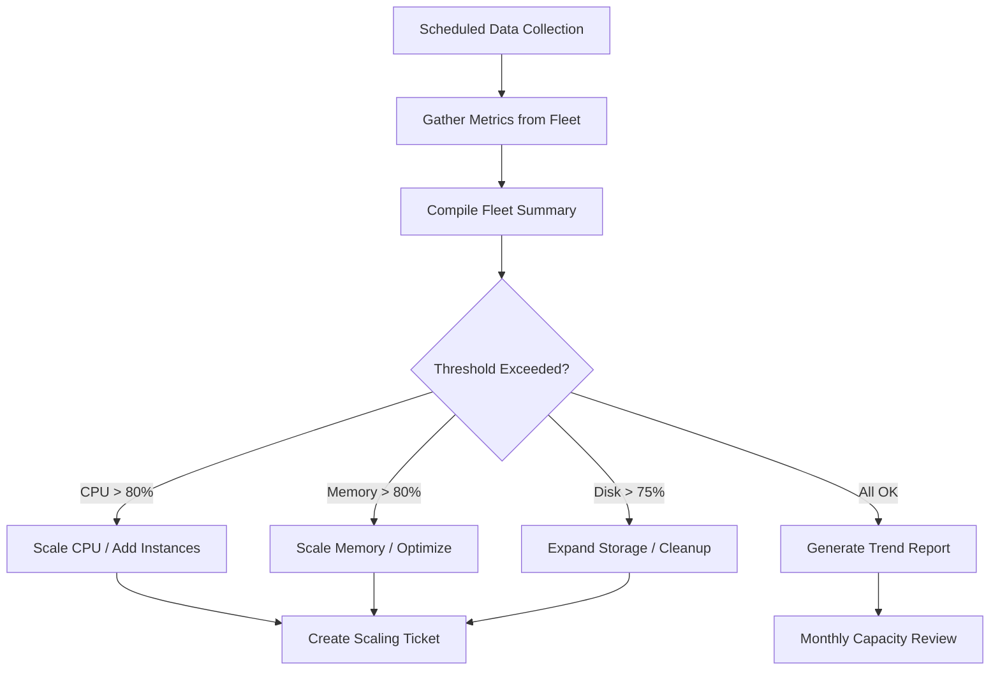

# How to Use Ansible for Capacity Planning Automation

Author: [nawazdhandala](https://www.github.com/nawazdhandala)

Tags: Ansible, Capacity Planning, Infrastructure, Monitoring

Description: Automate capacity planning data collection and analysis with Ansible to predict resource needs and prevent performance bottlenecks before they occur.

---

Capacity planning without data is guessing. You need to know current resource utilization, growth trends, and headroom before deciding whether to scale up, scale out, or do nothing. Ansible can collect this data from every server in your fleet, compile it into reports, and even trigger scaling actions when thresholds are crossed.

## Capacity Data Collection

Gather resource utilization from every host:

```yaml
# playbooks/capacity-audit.yml
# Collect capacity metrics from all servers
- name: Capacity planning data collection
  hosts: all
  become: yes
  gather_facts: yes
  strategy: free

  tasks:
    - name: Collect CPU information
      ansible.builtin.set_fact:
        cpu_info:
          cores: "{{ ansible_processor_vcpus }}"
          architecture: "{{ ansible_architecture }}"

    - name: Get CPU usage average (1 min)
      ansible.builtin.command: cat /proc/loadavg
      register: loadavg
      changed_when: false

    - name: Collect memory information
      ansible.builtin.set_fact:
        memory_info:
          total_mb: "{{ ansible_memtotal_mb }}"
          free_mb: "{{ ansible_memfree_mb }}"
          used_pct: "{{ ((ansible_memtotal_mb - ansible_memfree_mb) / ansible_memtotal_mb * 100) | round(1) }}"

    - name: Collect disk information
      ansible.builtin.set_fact:
        disk_info: >-
          {{ ansible_mounts | map(attribute='mount') | zip(
             ansible_mounts | map(attribute='size_total'),
             ansible_mounts | map(attribute='size_available')) | list }}

    - name: Get disk I/O stats
      ansible.builtin.command: iostat -d -x 1 2
      register: iostat_output
      changed_when: false
      failed_when: false

    - name: Count open file descriptors
      ansible.builtin.command: cat /proc/sys/fs/file-nr
      register: file_nr
      changed_when: false

    - name: Get network connection count
      ansible.builtin.command: ss -s
      register: net_connections
      changed_when: false

    - name: Check swap usage
      ansible.builtin.command: free -m
      register: swap_info
      changed_when: false

    - name: Compile capacity report
      ansible.builtin.set_fact:
        capacity_report:
          hostname: "{{ inventory_hostname }}"
          timestamp: "{{ ansible_date_time.iso8601 }}"
          groups: "{{ group_names }}"
          os: "{{ ansible_distribution }} {{ ansible_distribution_version }}"
          cpu:
            cores: "{{ ansible_processor_vcpus }}"
            load_1m: "{{ loadavg.stdout.split()[0] }}"
            load_5m: "{{ loadavg.stdout.split()[1] }}"
            load_15m: "{{ loadavg.stdout.split()[2] }}"
            utilization_pct: "{{ (loadavg.stdout.split()[0] | float / ansible_processor_vcpus * 100) | round(1) }}"
          memory:
            total_mb: "{{ ansible_memtotal_mb }}"
            used_pct: "{{ ((ansible_memtotal_mb - ansible_memfree_mb) / ansible_memtotal_mb * 100) | round(1) }}"
            swap_used_mb: "{{ ansible_swaptotal_mb - ansible_swapfree_mb }}"
          disk:
            root_total_gb: "{{ (ansible_mounts | selectattr('mount', 'equalto', '/') | first).size_total / 1073741824 | round(2) }}"
            root_used_pct: "{{ (100 - (ansible_mounts | selectattr('mount', 'equalto', '/') | first).size_available / (ansible_mounts | selectattr('mount', 'equalto', '/') | first).size_total * 100) | round(1) }}"
          network:
            connections: "{{ net_connections.stdout_lines[0] | default('') }}"
          uptime_days: "{{ (ansible_uptime_seconds / 86400) | round(1) }}"

    - name: Write capacity data to local file
      ansible.builtin.copy:
        content: "{{ capacity_report | to_nice_json }}\n"
        dest: "/tmp/capacity-{{ inventory_hostname }}.json"
      delegate_to: localhost
```

## Fleet-Wide Capacity Summary

```yaml
# playbooks/capacity-summary.yml
# Generate fleet-wide capacity summary
- name: Compile fleet capacity summary
  hosts: localhost
  gather_facts: yes

  tasks:
    - name: Read all capacity reports
      ansible.builtin.find:
        paths: /tmp
        patterns: "capacity-*.json"
      register: report_files

    - name: Load all reports
      ansible.builtin.slurp:
        src: "{{ item.path }}"
      register: raw_reports
      loop: "{{ report_files.files }}"
      loop_control:
        label: "{{ item.path | basename }}"

    - name: Parse reports
      ansible.builtin.set_fact:
        all_reports: "{{ raw_reports.results | map(attribute='content') | map('b64decode') | map('from_json') | list }}"

    - name: Calculate fleet statistics
      ansible.builtin.set_fact:
        fleet_stats:
          total_servers: "{{ all_reports | length }}"
          total_cpu_cores: "{{ all_reports | map(attribute='cpu.cores') | map('int') | sum }}"
          avg_cpu_utilization: "{{ (all_reports | map(attribute='cpu.utilization_pct') | map('float') | sum / all_reports | length) | round(1) }}"
          avg_memory_utilization: "{{ (all_reports | map(attribute='memory.used_pct') | map('float') | sum / all_reports | length) | round(1) }}"
          high_cpu_hosts: "{{ all_reports | selectattr('cpu.utilization_pct', 'gt', '80') | list | length }}"
          high_memory_hosts: "{{ all_reports | selectattr('memory.used_pct', 'gt', '80') | list | length }}"
          high_disk_hosts: "{{ all_reports | selectattr('disk.root_used_pct', 'gt', '80') | list | length }}"

    - name: Display fleet capacity summary
      ansible.builtin.debug:
        msg: |
          Fleet Capacity Summary ({{ ansible_date_time.date }})

          Total Servers: {{ fleet_stats.total_servers }}
          Total CPU Cores: {{ fleet_stats.total_cpu_cores }}

          Average CPU Utilization: {{ fleet_stats.avg_cpu_utilization }}%
          Average Memory Utilization: {{ fleet_stats.avg_memory_utilization }}%

          Hosts with CPU > 80%: {{ fleet_stats.high_cpu_hosts }}
          Hosts with Memory > 80%: {{ fleet_stats.high_memory_hosts }}
          Hosts with Disk > 80%: {{ fleet_stats.high_disk_hosts }}
```

## Capacity Alerting Thresholds

```yaml
# playbooks/capacity-alerts.yml
# Alert when capacity thresholds are crossed
- name: Check capacity thresholds
  hosts: all
  become: yes
  gather_facts: yes

  vars:
    cpu_warning_threshold: 70
    cpu_critical_threshold: 90
    memory_warning_threshold: 80
    memory_critical_threshold: 95
    disk_warning_threshold: 75
    disk_critical_threshold: 90

  tasks:
    - name: Calculate current utilization
      ansible.builtin.set_fact:
        cpu_pct: "{{ (ansible_processor_count | float / ansible_processor_vcpus * 100) | round(1) }}"
        mem_pct: "{{ ((ansible_memtotal_mb - ansible_memfree_mb) / ansible_memtotal_mb * 100) | round(1) }}"
        disk_pct: "{{ (100 - (ansible_mounts | selectattr('mount', 'equalto', '/') | first).size_available / (ansible_mounts | selectattr('mount', 'equalto', '/') | first).size_total * 100) | round(1) }}"

    - name: Alert on critical disk usage
      ansible.builtin.uri:
        url: "{{ alerting_webhook }}"
        method: POST
        body_format: json
        body:
          text: "CRITICAL: {{ inventory_hostname }} disk at {{ disk_pct }}%"
      delegate_to: localhost
      when: disk_pct | float > disk_critical_threshold
```

## Capacity Planning Flow



## Automated Scaling Triggers

```yaml
# playbooks/auto-scale.yml
# Trigger scaling actions based on capacity data
- name: Auto-scale based on capacity
  hosts: localhost

  tasks:
    - name: Check if web tier needs scaling
      ansible.builtin.uri:
        url: "{{ prometheus_url }}/api/v1/query"
        body_format: form-urlencoded
        body:
          query: "avg(100 - (avg by(instance)(rate(node_cpu_seconds_total{mode='idle', job='webservers'}[5m])) * 100))"
      register: web_cpu

    - name: Scale up web tier if CPU is high
      amazon.aws.ec2_instance:
        name: "web-{{ ansible_date_time.epoch }}"
        instance_type: t3.medium
        image_id: "{{ web_ami }}"
        state: running
      when: web_cpu.json.data.result[0].value[1] | float > 75
      register: new_instance

    - name: Configure new instance
      ansible.builtin.add_host:
        hostname: "{{ new_instance.instances[0].private_ip_address }}"
        groupname: new_web_servers
      when: new_instance is changed
```

## Summary

Capacity planning with Ansible means collecting resource data from every server, compiling fleet-wide summaries, alerting on threshold breaches, and optionally triggering automated scaling. Schedule capacity audits to run daily or weekly. Track trends over time to predict when you will need more resources. Set clear thresholds for warnings and critical alerts. Automate scaling actions for elastic workloads. The data Ansible collects feeds into your capacity planning decisions and prevents performance bottlenecks from surprising you.
