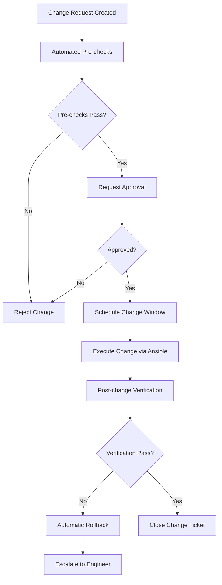

# How to Use Ansible for Change Management Automation

Author: [nawazdhandala](https://www.github.com/nawazdhandala)

Tags: Ansible, Change Management, ITIL, Automation

Description: Automate your change management process with Ansible by implementing approval workflows, change logging, rollback procedures, and audit trails.

---

Change management ensures that infrastructure modifications are planned, approved, and documented. In traditional ITIL workflows, this involves tickets, approval chains, and manual documentation. With Ansible, you can automate most of this process while maintaining the governance that compliance teams require. Changes become traceable, repeatable, and reversible.

## The Automated Change Workflow



## Change Request Validation

Before any change runs, validate prerequisites:

```yaml
# playbooks/change-precheck.yml
# Run pre-flight checks before executing a change
- name: Change request pre-checks
  hosts: "{{ target_hosts }}"
  become: yes
  gather_facts: yes

  vars:
    change_id: "{{ change_ticket | mandatory }}"
    change_type: "{{ change_category | default('standard') }}"

  tasks:
    - name: Verify change ticket exists
      ansible.builtin.uri:
        url: "{{ itsm_api_url }}/changes/{{ change_id }}"
        method: GET
        headers:
          Authorization: "Bearer {{ itsm_api_token }}"
        status_code: 200
      register: change_ticket_data
      delegate_to: localhost
      run_once: true

    - name: Verify change is approved
      ansible.builtin.assert:
        that:
          - change_ticket_data.json.status == 'approved'
        fail_msg: "Change {{ change_id }} is not approved. Current status: {{ change_ticket_data.json.status }}"
      run_once: true

    - name: Verify we are in the change window
      ansible.builtin.assert:
        that:
          - ansible_date_time.iso8601 >= change_ticket_data.json.start_time
          - ansible_date_time.iso8601 <= change_ticket_data.json.end_time
        fail_msg: "Current time is outside the approved change window"
      run_once: true

    - name: Check system health before change
      ansible.builtin.uri:
        url: "http://{{ inventory_hostname }}:{{ app_port }}/health"
        status_code: 200
      register: health_before
      failed_when: false

    - name: Record pre-change state
      ansible.builtin.set_fact:
        pre_change_health: "{{ health_before.status | default('unreachable') }}"
        pre_change_timestamp: "{{ ansible_date_time.iso8601 }}"
```

## Change Execution with Logging

Wrap every change in logging and audit trail:

```yaml
# playbooks/execute-change.yml
# Execute a change with full audit trail
- name: Execute approved change
  hosts: "{{ target_hosts }}"
  become: yes
  vars:
    change_id: "{{ change_ticket | mandatory }}"
    rollback_enabled: true

  pre_tasks:
    - name: Log change start to ITSM
      ansible.builtin.uri:
        url: "{{ itsm_api_url }}/changes/{{ change_id }}/log"
        method: POST
        headers:
          Authorization: "Bearer {{ itsm_api_token }}"
          Content-Type: application/json
        body_format: json
        body:
          status: "in_progress"
          message: "Change execution started on {{ inventory_hostname }}"
          timestamp: "{{ ansible_date_time.iso8601 }}"
          executor: "ansible-automation"
      delegate_to: localhost

    - name: Create backup before change
      ansible.builtin.include_role:
        name: backup
      vars:
        backup_label: "pre-change-{{ change_id }}"

  roles:
    - role: "{{ change_role }}"
      tags: [change]

  post_tasks:
    - name: Run post-change verification
      ansible.builtin.include_tasks: verify-change.yml

    - name: Log change completion to ITSM
      ansible.builtin.uri:
        url: "{{ itsm_api_url }}/changes/{{ change_id }}/log"
        method: POST
        headers:
          Authorization: "Bearer {{ itsm_api_token }}"
          Content-Type: application/json
        body_format: json
        body:
          status: "completed"
          message: "Change executed successfully on {{ inventory_hostname }}"
          timestamp: "{{ ansible_date_time.iso8601 }}"
      delegate_to: localhost
```

## Rollback on Failure

Implement automatic rollback when post-change checks fail:

```yaml
# playbooks/change-with-rollback.yml
# Execute change with automatic rollback on failure
- name: Execute change with rollback capability
  hosts: "{{ target_hosts }}"
  become: yes
  vars:
    change_id: "{{ change_ticket | mandatory }}"

  tasks:
    - name: Backup current configuration
      ansible.builtin.copy:
        src: "{{ item }}"
        dest: "{{ item }}.backup-{{ change_id }}"
        remote_src: yes
      loop: "{{ change_affected_files }}"

    - name: Execute change
      block:
        - name: Apply configuration changes
          ansible.builtin.include_role:
            name: "{{ change_role }}"

        - name: Verify services are healthy
          ansible.builtin.uri:
            url: "http://localhost:{{ app_port }}/health"
            status_code: 200
          retries: 5
          delay: 10

        - name: Run application smoke tests
          ansible.builtin.command:
            cmd: /opt/scripts/smoke-test.sh
          changed_when: false

      rescue:
        - name: Change failed - initiating rollback
          ansible.builtin.debug:
            msg: "Change {{ change_id }} failed on {{ inventory_hostname }}. Rolling back."

        - name: Restore configuration from backup
          ansible.builtin.copy:
            src: "{{ item }}.backup-{{ change_id }}"
            dest: "{{ item }}"
            remote_src: yes
          loop: "{{ change_affected_files }}"

        - name: Restart affected services
          ansible.builtin.service:
            name: "{{ item }}"
            state: restarted
          loop: "{{ change_affected_services }}"

        - name: Log rollback to ITSM
          ansible.builtin.uri:
            url: "{{ itsm_api_url }}/changes/{{ change_id }}/log"
            method: POST
            headers:
              Authorization: "Bearer {{ itsm_api_token }}"
              Content-Type: application/json
            body_format: json
            body:
              status: "rolled_back"
              message: "Change rolled back on {{ inventory_hostname }} due to verification failure"
          delegate_to: localhost

        - name: Fail the playbook after rollback
          ansible.builtin.fail:
            msg: "Change {{ change_id }} was rolled back. Manual investigation required."

      always:
        - name: Clean up backup files
          ansible.builtin.file:
            path: "{{ item }}.backup-{{ change_id }}"
            state: absent
          loop: "{{ change_affected_files }}"
```

## Change Types and Automation Levels

Define different automation levels for different change types:

```yaml
# vars/change_policies.yml
# Define automation policies by change type

change_policies:
  standard:
    # Pre-approved routine changes
    requires_approval: false
    requires_change_window: false
    auto_rollback: true
    examples:
      - "Update monitoring agent"
      - "Rotate log files"
      - "Update SSL certificates"

  normal:
    # Standard changes requiring approval
    requires_approval: true
    requires_change_window: true
    auto_rollback: true
    examples:
      - "Application deployment"
      - "Configuration change"
      - "Package update"

  emergency:
    # Urgent changes bypassing normal approval
    requires_approval: false
    requires_change_window: false
    auto_rollback: true
    requires_post_approval: true
    examples:
      - "Security patch"
      - "Incident remediation"
```

## Change Audit Trail

Create a local audit log for all changes:

```yaml
# roles/change_audit/tasks/main.yml
# Log every change to a central audit file

- name: Create audit log directory
  ansible.builtin.file:
    path: /var/log/ansible-changes
    state: directory
    owner: root
    group: root
    mode: '0750'

- name: Write change audit entry
  ansible.builtin.lineinfile:
    path: /var/log/ansible-changes/audit.log
    line: >
      {{ ansible_date_time.iso8601 }} |
      CHANGE={{ change_id | default('unknown') }} |
      HOST={{ inventory_hostname }} |
      ROLE={{ change_role | default('unknown') }} |
      USER={{ ansible_user_id }} |
      STATUS={{ change_status | default('executed') }}
    create: yes
    mode: '0640'
```

## Integration with ITSM Tools

Connect Ansible to your ITSM platform:

```yaml
# roles/itsm_integration/tasks/servicenow.yml
# Create and update ServiceNow change requests

- name: Create change request in ServiceNow
  ansible.builtin.uri:
    url: "https://{{ snow_instance }}.service-now.com/api/now/table/change_request"
    method: POST
    user: "{{ snow_user }}"
    password: "{{ snow_password }}"
    force_basic_auth: yes
    body_format: json
    body:
      short_description: "{{ change_description }}"
      category: "{{ change_category }}"
      priority: "{{ change_priority | default('3') }}"
      assignment_group: "{{ change_assignment_group }}"
      start_date: "{{ change_start_time }}"
      end_date: "{{ change_end_time }}"
      description: |
        Automated change executed by Ansible
        Playbook: {{ ansible_play_name }}
        Hosts: {{ ansible_play_hosts | join(', ') }}
    status_code: 201
  register: snow_change
  delegate_to: localhost
  run_once: true

- name: Store change number
  ansible.builtin.set_fact:
    change_number: "{{ snow_change.json.result.number }}"
```

## Summary

Ansible automates change management by encoding approval checks, execution, verification, and rollback into playbooks. Pre-checks validate that changes are approved and within the scheduled window. Block/rescue patterns handle automatic rollback when changes fail. Every step logs to your ITSM platform for audit compliance. Standard changes can run fully automated, while normal changes require approval gates. This approach satisfies governance requirements while eliminating the manual overhead that slows teams down.
