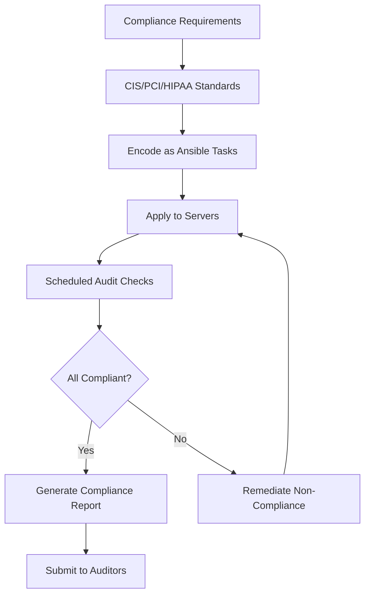

# How to Use Ansible for Compliance as Code

Author: [nawazdhandala](https://www.github.com/nawazdhandala)

Tags: Ansible, Compliance, Security, CIS Benchmarks

Description: Implement compliance as code with Ansible to automate security benchmarks, audit checks, and regulatory requirements across your infrastructure.

---

Compliance audits are painful when done manually. An auditor asks for proof that all servers have password policies configured, firewalls enabled, and unnecessary services disabled. Your team spends days collecting evidence from dozens of servers. With Ansible, you codify these requirements as playbooks, enforce them automatically, and generate audit reports on demand.

## What Is Compliance as Code?

Compliance as code means expressing regulatory and security requirements as executable automation. Instead of a spreadsheet saying "SSH root login must be disabled," you have an Ansible task that enforces and verifies it.

```yaml
# roles/cis_benchmark/tasks/ssh.yml
# CIS Benchmark 5.2.8 - Ensure SSH root login is disabled

- name: "CIS 5.2.8 - Ensure SSH root login is disabled"
  ansible.builtin.lineinfile:
    path: /etc/ssh/sshd_config
    regexp: '^#?PermitRootLogin'
    line: 'PermitRootLogin no'
    state: present
  notify: restart sshd
  tags:
    - cis
    - ssh
    - level1

- name: "CIS 5.2.9 - Ensure SSH PermitEmptyPasswords is disabled"
  ansible.builtin.lineinfile:
    path: /etc/ssh/sshd_config
    regexp: '^#?PermitEmptyPasswords'
    line: 'PermitEmptyPasswords no'
    state: present
  notify: restart sshd
  tags:
    - cis
    - ssh
    - level1

- name: "CIS 5.2.11 - Ensure SSH MaxAuthTries is set to 4 or less"
  ansible.builtin.lineinfile:
    path: /etc/ssh/sshd_config
    regexp: '^#?MaxAuthTries'
    line: 'MaxAuthTries 4'
    state: present
  notify: restart sshd
  tags:
    - cis
    - ssh
    - level1
```

## Building a CIS Benchmark Role

Structure your compliance role by benchmark sections:

```
roles/cis_benchmark/
├── tasks/
│   ├── main.yml
│   ├── section1_filesystem.yml
│   ├── section2_services.yml
│   ├── section3_network.yml
│   ├── section4_logging.yml
│   ├── section5_access.yml
│   └── section6_maintenance.yml
├── defaults/
│   └── main.yml
├── handlers/
│   └── main.yml
├── templates/
│   ├── audit_rules.j2
│   ├── sysctl.conf.j2
│   └── limits.conf.j2
└── vars/
    ├── ubuntu22.yml
    └── rhel9.yml
```

```yaml
# roles/cis_benchmark/tasks/main.yml
# Apply CIS Benchmark controls by section

- name: Include OS-specific variables
  ansible.builtin.include_vars: "{{ ansible_distribution | lower }}{{ ansible_distribution_major_version }}.yml"

- name: Section 1 - Filesystem Configuration
  ansible.builtin.include_tasks: section1_filesystem.yml
  tags: [cis, filesystem]

- name: Section 2 - Services
  ansible.builtin.include_tasks: section2_services.yml
  tags: [cis, services]

- name: Section 3 - Network Configuration
  ansible.builtin.include_tasks: section3_network.yml
  tags: [cis, network]

- name: Section 4 - Logging and Auditing
  ansible.builtin.include_tasks: section4_logging.yml
  tags: [cis, logging]

- name: Section 5 - Access and Authentication
  ansible.builtin.include_tasks: section5_access.yml
  tags: [cis, access]

- name: Section 6 - System Maintenance
  ansible.builtin.include_tasks: section6_maintenance.yml
  tags: [cis, maintenance]
```

## Filesystem Controls

```yaml
# roles/cis_benchmark/tasks/section1_filesystem.yml
# CIS Section 1: Filesystem Configuration

- name: "CIS 1.1.1.1 - Ensure cramfs filesystem is disabled"
  ansible.builtin.lineinfile:
    path: /etc/modprobe.d/cis.conf
    line: "install cramfs /bin/true"
    create: yes
    mode: '0644'
  tags: [cis, filesystem, level1]

- name: "CIS 1.1.1.2 - Ensure freevxfs filesystem is disabled"
  ansible.builtin.lineinfile:
    path: /etc/modprobe.d/cis.conf
    line: "install freevxfs /bin/true"
    create: yes
    mode: '0644'
  tags: [cis, filesystem, level1]

- name: "CIS 1.4.1 - Ensure permissions on bootloader config"
  ansible.builtin.file:
    path: /boot/grub/grub.cfg
    owner: root
    group: root
    mode: '0400'
  when: ansible_os_family == 'Debian'
  tags: [cis, filesystem, level1]

- name: "CIS 1.5.1 - Ensure core dumps are restricted"
  ansible.builtin.lineinfile:
    path: /etc/security/limits.conf
    line: "* hard core 0"
    state: present
  tags: [cis, filesystem, level1]
```

## Network Controls

```yaml
# roles/cis_benchmark/tasks/section3_network.yml
# CIS Section 3: Network Configuration

- name: "CIS 3.1.1 - Ensure IP forwarding is disabled"
  ansible.posix.sysctl:
    name: net.ipv4.ip_forward
    value: '0'
    sysctl_set: yes
    state: present
    reload: yes
  when: not cis_is_router
  tags: [cis, network, level1]

- name: "CIS 3.2.1 - Ensure source routed packets are not accepted"
  ansible.posix.sysctl:
    name: "{{ item }}"
    value: '0'
    sysctl_set: yes
    state: present
    reload: yes
  loop:
    - net.ipv4.conf.all.accept_source_route
    - net.ipv4.conf.default.accept_source_route
  tags: [cis, network, level1]

- name: "CIS 3.2.2 - Ensure ICMP redirects are not accepted"
  ansible.posix.sysctl:
    name: "{{ item }}"
    value: '0'
    sysctl_set: yes
    state: present
    reload: yes
  loop:
    - net.ipv4.conf.all.accept_redirects
    - net.ipv4.conf.default.accept_redirects
  tags: [cis, network, level1]

- name: "CIS 3.3.1 - Ensure TCP SYN cookies are enabled"
  ansible.posix.sysctl:
    name: net.ipv4.tcp_syncookies
    value: '1'
    sysctl_set: yes
    state: present
    reload: yes
  tags: [cis, network, level1]
```

## Compliance Audit Mode

Run compliance checks without making changes to generate an audit report:

```yaml
# playbooks/compliance-audit.yml
# Run in check mode to audit compliance without changing anything
- name: Compliance audit
  hosts: all
  become: yes
  check_mode: yes

  pre_tasks:
    - name: Record audit start time
      ansible.builtin.set_fact:
        audit_start: "{{ ansible_date_time.iso8601 }}"

  roles:
    - role: cis_benchmark
      tags: [cis]

  post_tasks:
    - name: Record audit completion
      ansible.builtin.debug:
        msg: "Audit completed for {{ inventory_hostname }} at {{ ansible_date_time.iso8601 }}"
```

```bash
# Generate audit report
ansible-playbook playbooks/compliance-audit.yml \
  -i inventories/production/hosts.yml \
  --check --diff 2>&1 | tee compliance-report-$(date +%Y%m%d).txt
```

## Compliance Flow



## Configurable Compliance Levels

Let teams choose which controls to apply:

```yaml
# roles/cis_benchmark/defaults/main.yml
# Toggle individual controls based on environment needs
cis_level: 1  # 1 for Level 1 (basic), 2 for Level 2 (advanced)

cis_is_router: false
cis_is_server: true

# SSH controls
cis_ssh_max_auth_tries: 4
cis_ssh_idle_timeout: 300
cis_ssh_allowed_users: []

# Password controls
cis_password_max_days: 365
cis_password_min_days: 7
cis_password_min_length: 14

# Audit controls
cis_auditd_max_log_file: 8
cis_auditd_space_left_action: email

# Controls to skip (for documented exceptions)
cis_skip_rules: []
```

```yaml
# inventories/production/group_vars/all.yml
# Production gets full compliance
cis_level: 2
cis_ssh_allowed_users:
  - deploy
  - admin

# inventories/development/group_vars/all.yml
# Development is less strict
cis_level: 1
cis_skip_rules:
  - "1.4.1"  # Bootloader permissions
  - "5.2.11" # SSH MaxAuthTries (devs need more attempts)
```

## Generating Compliance Evidence

Create a playbook that collects evidence for auditors:

```yaml
# playbooks/collect-evidence.yml
# Gather compliance evidence from all servers
- name: Collect compliance evidence
  hosts: all
  become: yes
  tasks:
    - name: Collect SSH configuration
      ansible.builtin.slurp:
        src: /etc/ssh/sshd_config
      register: sshd_config

    - name: Collect sysctl settings
      ansible.builtin.command: sysctl -a
      register: sysctl_output
      changed_when: false

    - name: Collect running services
      ansible.builtin.command: systemctl list-units --type=service --state=running
      register: running_services
      changed_when: false

    - name: Collect firewall rules
      ansible.builtin.command: ufw status verbose
      register: firewall_rules
      changed_when: false

    - name: Write evidence to local file
      ansible.builtin.copy:
        content: |
          Host: {{ inventory_hostname }}
          Date: {{ ansible_date_time.iso8601 }}

          === SSH Configuration ===
          {{ sshd_config.content | b64decode }}

          === Sysctl Settings ===
          {{ sysctl_output.stdout }}

          === Running Services ===
          {{ running_services.stdout }}

          === Firewall Rules ===
          {{ firewall_rules.stdout }}
        dest: "/tmp/evidence-{{ inventory_hostname }}.txt"
      delegate_to: localhost
```

## Summary

Compliance as code transforms audit preparation from a manual scramble into an automated process. Encode compliance requirements as Ansible tasks with clear CIS or regulatory references. Use check mode to audit without changes. Make controls configurable so different environments can have different compliance levels. Run scheduled audits and generate reports automatically. Collect evidence programmatically for auditors. This approach ensures compliance is continuous, not a once-a-year panic.
