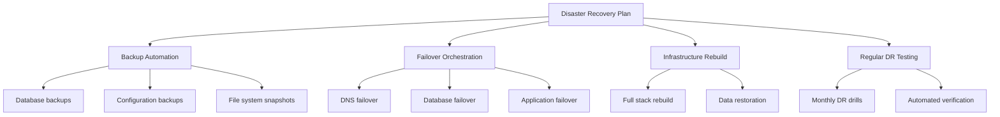

# How to Use Ansible for Disaster Recovery Planning

Author: [nawazdhandala](https://www.github.com/nawazdhandala)

Tags: Ansible, Disaster Recovery, Business Continuity, Infrastructure

Description: Learn how to use Ansible to automate disaster recovery procedures including failover, backup verification, and infrastructure rebuild from scratch.

---

When a disaster hits, the last thing you want is someone frantically reading a wiki page to figure out how to bring systems back online. Disaster recovery needs to be automated, tested regularly, and executable by anyone on the team. Ansible turns your DR plan from a dusty document into runnable code.

## DR Strategy Overview

A solid disaster recovery plan with Ansible covers four areas: backup automation, failover orchestration, infrastructure rebuild, and regular testing.



## Backup Automation

Automate backups with a dedicated role:

```yaml
# roles/backup/tasks/main.yml
# Automated backup tasks for all managed services

- name: Create backup directory
  ansible.builtin.file:
    path: "{{ backup_base_dir }}/{{ ansible_date_time.date }}"
    state: directory
    owner: root
    group: root
    mode: '0700'

- name: Backup PostgreSQL databases
  ansible.builtin.include_tasks: backup_postgresql.yml
  when: "'dbservers' in group_names"

- name: Backup application configurations
  ansible.builtin.include_tasks: backup_configs.yml

- name: Upload backups to offsite storage
  ansible.builtin.include_tasks: upload_offsite.yml

- name: Clean up old local backups
  ansible.builtin.include_tasks: cleanup.yml
```

```yaml
# roles/backup/tasks/backup_postgresql.yml
# PostgreSQL backup with verification

- name: Create PostgreSQL backup
  ansible.builtin.command:
    cmd: >
      pg_dump -Fc -h localhost -U {{ postgresql_backup_user }}
      {{ item }} -f {{ backup_base_dir }}/{{ ansible_date_time.date }}/{{ item }}.dump
  environment:
    PGPASSWORD: "{{ postgresql_backup_password }}"
  loop: "{{ postgresql_databases }}"
  changed_when: true
  no_log: true

- name: Verify backup files exist and are not empty
  ansible.builtin.stat:
    path: "{{ backup_base_dir }}/{{ ansible_date_time.date }}/{{ item }}.dump"
  register: backup_files
  loop: "{{ postgresql_databases }}"

- name: Fail if any backup is empty
  ansible.builtin.assert:
    that:
      - item.stat.exists
      - item.stat.size > 0
    fail_msg: "Backup for {{ item.item }} is missing or empty"
  loop: "{{ backup_files.results }}"
  loop_control:
    label: "{{ item.item }}"
```

```yaml
# roles/backup/tasks/upload_offsite.yml
# Upload backups to S3 for offsite storage

- name: Upload backups to S3
  amazon.aws.s3_object:
    bucket: "{{ backup_s3_bucket }}"
    object: "{{ inventory_hostname }}/{{ ansible_date_time.date }}/{{ item }}"
    src: "{{ backup_base_dir }}/{{ ansible_date_time.date }}/{{ item }}"
    mode: put
  loop: "{{ lookup('fileglob', backup_base_dir + '/' + ansible_date_time.date + '/*', wantlist=True) | map('basename') | list }}"
```

## Database Failover Playbook

Automate database failover for when the primary goes down:

```yaml
# playbooks/db-failover.yml
# Promote a PostgreSQL replica to primary
- name: Database failover procedure
  hosts: "{{ new_primary | mandatory }}"
  become: yes
  vars:
    old_primary: "{{ failed_primary | mandatory }}"

  tasks:
    - name: Verify this host is currently a replica
      ansible.builtin.command: pg_controldata /var/lib/postgresql/15/main
      register: pg_status
      changed_when: false

    - name: Abort if host is already primary
      ansible.builtin.fail:
        msg: "{{ inventory_hostname }} is already a primary. Aborting failover."
      when: "'in archive recovery' not in pg_status.stdout"

    - name: Promote replica to primary
      ansible.builtin.command: pg_ctlcluster 15 main promote
      register: promote_result

    - name: Wait for promotion to complete
      ansible.builtin.command: pg_isready -h localhost
      register: pg_ready
      until: pg_ready.rc == 0
      retries: 30
      delay: 2

    - name: Verify host is now primary
      ansible.builtin.command: psql -c "SELECT pg_is_in_recovery()"
      register: recovery_check
      changed_when: false
      become_user: postgres

    - name: Confirm promotion succeeded
      ansible.builtin.assert:
        that: "'f' in recovery_check.stdout"
        fail_msg: "Promotion failed - host is still in recovery mode"

    - name: Log failover event
      ansible.builtin.debug:
        msg: >
          Failover complete. {{ inventory_hostname }} is now the primary.
          Old primary was {{ old_primary }}.
          Time: {{ ansible_date_time.iso8601 }}

- name: Update application servers to use new primary
  hosts: app_servers
  become: yes
  tasks:
    - name: Update database connection string
      ansible.builtin.lineinfile:
        path: /etc/myapp/database.conf
        regexp: '^DB_HOST='
        line: "DB_HOST={{ new_primary }}"
      notify: restart application

  handlers:
    - name: restart application
      ansible.builtin.service:
        name: myapp
        state: restarted
```

## Full Infrastructure Rebuild

When you need to rebuild everything from scratch:

```yaml
# playbooks/rebuild-infrastructure.yml
# Complete infrastructure rebuild from backups
- name: Phase 1 - Provision base infrastructure
  hosts: all
  become: yes
  roles:
    - common
    - security_baseline

- name: Phase 2 - Rebuild database servers
  hosts: dbservers
  become: yes
  serial: 1
  roles:
    - postgresql

  post_tasks:
    - name: Restore database from latest backup
      ansible.builtin.shell: |
        LATEST_BACKUP=$(aws s3 ls s3://{{ backup_s3_bucket }}/{{ inventory_hostname }}/ \
          --recursive | sort | tail -n 1 | awk '{print $4}')
        aws s3 cp "s3://{{ backup_s3_bucket }}/${LATEST_BACKUP}" /tmp/restore.dump
        pg_restore -h localhost -U postgres -d {{ database_name }} -c /tmp/restore.dump
      register: restore_result
      no_log: true

    - name: Verify database restoration
      ansible.builtin.command:
        cmd: psql -U postgres -d {{ database_name }} -c "SELECT count(*) FROM pg_tables WHERE schemaname = 'public'"
      register: table_count
      changed_when: false

    - name: Confirm tables were restored
      ansible.builtin.assert:
        that:
          - table_count.stdout | trim | int > 0
        fail_msg: "Database restore may have failed - no tables found"

- name: Phase 3 - Rebuild application servers
  hosts: app_servers
  become: yes
  roles:
    - nginx
    - app_deploy

- name: Phase 4 - Rebuild load balancers
  hosts: loadbalancers
  become: yes
  roles:
    - haproxy

- name: Phase 5 - Verify all services
  hosts: all
  tasks:
    - name: Run health checks
      ansible.builtin.uri:
        url: "http://{{ inventory_hostname }}:{{ item.port }}{{ item.path }}"
        status_code: 200
      loop:
        - { port: 80, path: "/health" }
      when: "'webservers' in group_names"
      register: health_results
```

## Backup Verification Playbook

Regularly verify backups can be restored:

```yaml
# playbooks/verify-backups.yml
# Spin up a temporary server, restore backup, verify data
- name: Verify backup integrity
  hosts: localhost
  tasks:
    - name: Launch temporary restore instance
      amazon.aws.ec2_instance:
        name: "backup-verify-{{ ansible_date_time.epoch }}"
        instance_type: t3.medium
        image_id: "{{ base_ami_id }}"
        key_name: "{{ ssh_key_name }}"
        security_group: "{{ restore_security_group }}"
        subnet_id: "{{ restore_subnet_id }}"
        state: running
        wait: yes
        tags:
          Purpose: backup-verification
          AutoDelete: "true"
      register: restore_instance

    - name: Add instance to temporary group
      ansible.builtin.add_host:
        hostname: "{{ restore_instance.instances[0].public_ip_address }}"
        groupname: restore_test

    - name: Wait for SSH
      ansible.builtin.wait_for:
        host: "{{ restore_instance.instances[0].public_ip_address }}"
        port: 22
        delay: 30
        timeout: 300

- name: Restore and verify backup
  hosts: restore_test
  become: yes
  tasks:
    - name: Install PostgreSQL
      ansible.builtin.apt:
        name: postgresql-15
        state: present

    - name: Download latest backup
      ansible.builtin.command:
        cmd: >
          aws s3 cp s3://{{ backup_s3_bucket }}/db01/latest/appdb.dump
          /tmp/restore.dump

    - name: Restore backup
      ansible.builtin.command:
        cmd: pg_restore -U postgres -d appdb -c /tmp/restore.dump
      become_user: postgres

    - name: Verify data integrity
      ansible.builtin.command:
        cmd: psql -U postgres -d appdb -c "{{ item }}"
      loop:
        - "SELECT count(*) FROM users"
        - "SELECT count(*) FROM orders WHERE created_at > now() - interval '24 hours'"
      register: verify_results
      changed_when: false
      become_user: postgres

    - name: Report verification results
      ansible.builtin.debug:
        msg: "Backup verification passed: {{ item.stdout }}"
      loop: "{{ verify_results.results }}"

- name: Cleanup restore instance
  hosts: localhost
  tasks:
    - name: Terminate temporary instance
      amazon.aws.ec2_instance:
        instance_ids: "{{ restore_instance.instance_ids }}"
        state: terminated
```

## DR Testing Schedule

```yaml
# playbooks/dr-drill.yml
# Monthly DR drill - simulates failure and recovery
- name: DR Drill - Simulate and recover
  hosts: localhost
  tasks:
    - name: Document drill start
      ansible.builtin.debug:
        msg: "DR drill started at {{ ansible_date_time.iso8601 }}"

    - name: Run backup verification
      ansible.builtin.include_tasks: verify-backups.yml

    - name: Test database failover
      ansible.builtin.include_tasks: test-db-failover.yml

    - name: Test application failover
      ansible.builtin.include_tasks: test-app-failover.yml

    - name: Generate DR drill report
      ansible.builtin.template:
        src: dr-drill-report.j2
        dest: "/tmp/dr-drill-{{ ansible_date_time.date }}.html"
      delegate_to: localhost
```

## Summary

Disaster recovery with Ansible means your recovery procedures are code, not documentation. Automate backups with verification. Create failover playbooks for every critical service. Build infrastructure rebuild playbooks that can recreate your entire stack from scratch. Test your DR procedures monthly with automated drills. When disaster strikes, running `ansible-playbook playbooks/db-failover.yml` is faster and more reliable than following a manual runbook under pressure.
