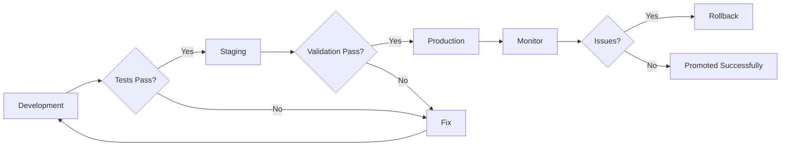

# How to Use Ansible for Environment Promotion

Author: [nawazdhandala](https://www.github.com/nawazdhandala)

Tags: Ansible, Environment Promotion, CI/CD, Deployment Pipeline

Description: Learn how to implement environment promotion workflows with Ansible to safely move changes through development, staging, and production environments.

---

Environment promotion is the practice of moving changes through a series of environments before they reach production. A configuration change starts in development, gets validated in staging, and only then gets applied to production. Ansible makes this process repeatable because the same playbook runs in every environment with different variables.

## The Promotion Pipeline



## Environment Configuration

Each environment uses the same playbooks but different inventories and variables:

```yaml
# inventories/development/group_vars/all.yml
env_name: development
env_tier: 1
domain: dev.example.com
app_replicas: 1
db_instance_class: db.t3.micro
enable_debug: true
deploy_serial: "100%"
max_fail_percentage: 0
health_check_retries: 5
```

```yaml
# inventories/staging/group_vars/all.yml
env_name: staging
env_tier: 2
domain: staging.example.com
app_replicas: 2
db_instance_class: db.t3.small
enable_debug: false
deploy_serial: "50%"
max_fail_percentage: 0
health_check_retries: 15
```

```yaml
# inventories/production/group_vars/all.yml
env_name: production
env_tier: 3
domain: example.com
app_replicas: 6
db_instance_class: db.r6g.large
enable_debug: false
deploy_serial: "25%"
max_fail_percentage: 5
health_check_retries: 30
```

## Promotion Playbook

Create a promotion playbook that handles the entire flow:

```yaml
# playbooks/promote.yml
# Promote a change from one environment to the next
- name: Environment promotion
  hosts: "{{ target_hosts | default('all') }}"
  become: yes
  serial: "{{ deploy_serial }}"
  max_fail_percentage: "{{ max_fail_percentage }}"

  pre_tasks:
    - name: Validate promotion order
      ansible.builtin.assert:
        that:
          - env_tier | int > 0
          - env_tier | int <= 3
        fail_msg: "Invalid environment tier: {{ env_tier }}"
      run_once: true

    - name: Verify lower environment was promoted first
      ansible.builtin.assert:
        that:
          - promotion_verified_in_lower_env | default(false) | bool
        fail_msg: >
          Cannot promote to {{ env_name }} without verification
          in the lower environment first. Set promotion_verified_in_lower_env=true
          to confirm.
      when: env_tier | int > 1
      run_once: true

    - name: Record pre-promotion state
      ansible.builtin.include_tasks: tasks/snapshot-state.yml

    - name: Remove from load balancer
      ansible.builtin.include_tasks: tasks/lb-drain.yml
      when: "'webservers' in group_names"

  roles:
    - role: "{{ promote_role }}"
      when: promote_role is defined
      tags: [promote]

  post_tasks:
    - name: Run post-promotion verification
      ansible.builtin.include_tasks: tasks/verify-promotion.yml

    - name: Re-add to load balancer
      ansible.builtin.include_tasks: tasks/lb-enable.yml
      when: "'webservers' in group_names"

    - name: Record promotion success
      ansible.builtin.uri:
        url: "{{ promotion_tracker_url | default(omit) }}"
        method: POST
        body_format: json
        body:
          environment: "{{ env_name }}"
          version: "{{ promote_version | default('unknown') }}"
          timestamp: "{{ ansible_date_time.iso8601 }}"
          status: "success"
      delegate_to: localhost
      run_once: true
      when: promotion_tracker_url is defined
```

## Verification Tasks

```yaml
# tasks/verify-promotion.yml
# Run checks to verify the promotion was successful

- name: Wait for application to start
  ansible.builtin.wait_for:
    port: "{{ app_port | default(8080) }}"
    delay: 5
    timeout: 120

- name: Check application health endpoint
  ansible.builtin.uri:
    url: "http://localhost:{{ app_port | default(8080) }}/health"
    status_code: 200
    timeout: 10
  retries: "{{ health_check_retries }}"
  delay: 5
  register: health_result

- name: Run smoke tests
  ansible.builtin.command:
    cmd: /opt/scripts/smoke-test.sh
  register: smoke_result
  changed_when: false
  failed_when: smoke_result.rc != 0

- name: Verify service metrics
  ansible.builtin.uri:
    url: "http://localhost:{{ metrics_port | default(9090) }}/metrics"
    return_content: yes
  register: metrics
  changed_when: false

- name: Check error rate is below threshold
  ansible.builtin.assert:
    that:
      - "'http_errors_total' in metrics.content"
    fail_msg: "Metrics endpoint not returning expected data"
```

## CI/CD Promotion Pipeline

```yaml
# .github/workflows/promote.yml
name: Environment Promotion

on:
  workflow_dispatch:
    inputs:
      target_environment:
        description: 'Target environment'
        required: true
        type: choice
        options:
          - staging
          - production
      version:
        description: 'Version to promote'
        required: true

jobs:
  promote-staging:
    if: inputs.target_environment == 'staging'
    runs-on: ubuntu-latest
    environment: staging
    steps:
      - uses: actions/checkout@v4
        with:
          ref: "v${{ inputs.version }}"

      - name: Install Ansible
        run: |
          pip install ansible-core
          ansible-galaxy collection install -r requirements.yml

      - name: Deploy to staging
        run: |
          ansible-playbook playbooks/site.yml \
            -i inventories/staging/hosts.yml \
            -e "promote_version=${{ inputs.version }}" \
            -e "promotion_verified_in_lower_env=true"

      - name: Run integration tests
        run: |
          ansible-playbook playbooks/integration-tests.yml \
            -i inventories/staging/hosts.yml

  promote-production:
    if: inputs.target_environment == 'production'
    runs-on: ubuntu-latest
    environment: production
    steps:
      - uses: actions/checkout@v4
        with:
          ref: "v${{ inputs.version }}"

      - name: Verify staging deployment
        run: |
          # Check that this version was successfully deployed to staging
          ansible-playbook playbooks/verify-lower-env.yml \
            -i inventories/staging/hosts.yml \
            -e "expected_version=${{ inputs.version }}"

      - name: Deploy to production
        run: |
          ansible-playbook playbooks/site.yml \
            -i inventories/production/hosts.yml \
            -e "promote_version=${{ inputs.version }}" \
            -e "promotion_verified_in_lower_env=true"
```

## Canary Promotion

Before full promotion, deploy to a canary subset:

```yaml
# playbooks/canary-promote.yml
# Deploy to canary hosts before full promotion
- name: Canary promotion
  hosts: "canary_{{ target_group | default('webservers') }}"
  become: yes
  serial: 1

  roles:
    - role: "{{ promote_role }}"

  post_tasks:
    - name: Wait for canary metrics
      ansible.builtin.pause:
        minutes: "{{ canary_observation_minutes | default(5) }}"

    - name: Check canary error rate
      ansible.builtin.uri:
        url: "{{ monitoring_api }}/query?query=rate(http_errors[5m])"
        return_content: yes
      register: error_rate
      delegate_to: localhost

    - name: Abort if canary error rate is high
      ansible.builtin.fail:
        msg: "Canary error rate too high. Aborting promotion."
      when: error_rate.json.data.result[0].value[1] | float > 0.05
```

## Promotion State Tracking

Track which version is deployed in each environment:

```yaml
# playbooks/promotion-status.yml
# Check deployment status across all environments
- name: Check promotion status
  hosts: localhost
  gather_facts: false

  tasks:
    - name: Check development version
      ansible.builtin.command:
        cmd: >
          ansible all -i inventories/development/hosts.yml
          -a "cat /etc/ansible-version" --one-line
      register: dev_version
      changed_when: false

    - name: Check staging version
      ansible.builtin.command:
        cmd: >
          ansible all -i inventories/staging/hosts.yml
          -a "cat /etc/ansible-version" --one-line
      register: staging_version
      changed_when: false

    - name: Check production version
      ansible.builtin.command:
        cmd: >
          ansible all -i inventories/production/hosts.yml
          -a "cat /etc/ansible-version" --one-line
      register: prod_version
      changed_when: false

    - name: Display promotion status
      ansible.builtin.debug:
        msg: |
          Environment Promotion Status:
          Development: {{ dev_version.stdout_lines | join(', ') }}
          Staging: {{ staging_version.stdout_lines | join(', ') }}
          Production: {{ prod_version.stdout_lines | join(', ') }}
```

## Summary

Environment promotion with Ansible ensures changes are validated at each stage before reaching production. Use identical playbooks with environment-specific inventories and variables. Enforce promotion order so production never gets changes that were not validated in staging first. Implement canary promotions for high-risk changes. Track deployment versions across all environments. Automate the entire flow through CI/CD while maintaining approval gates for production. This approach catches issues early and keeps production stable.
