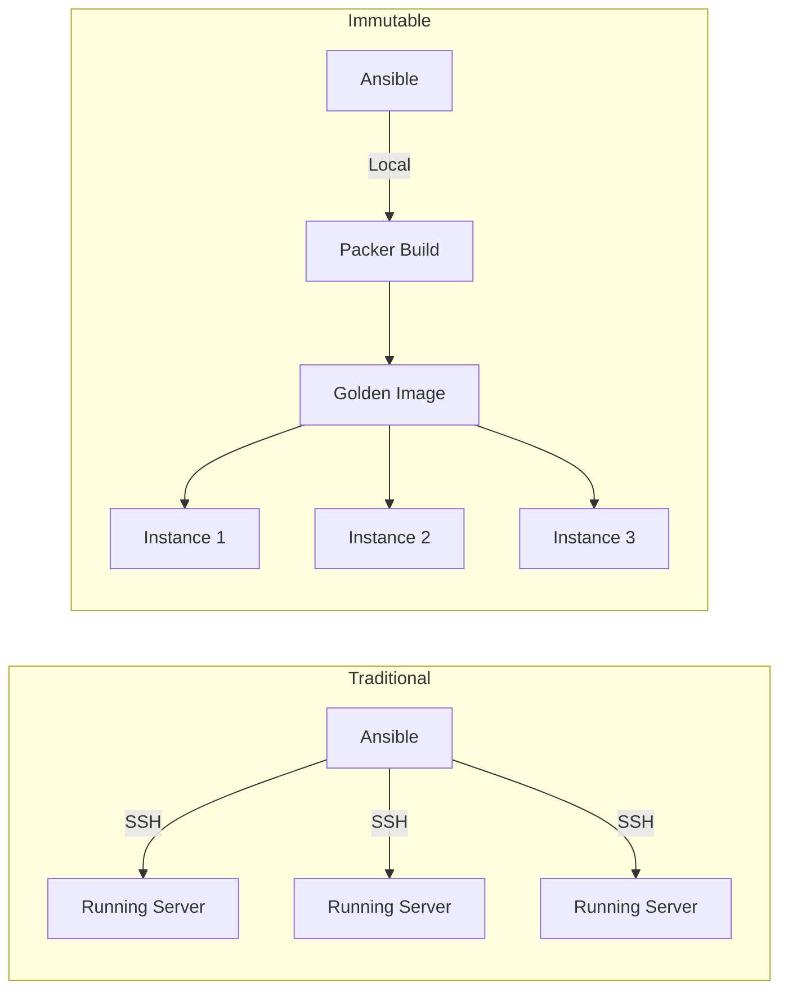
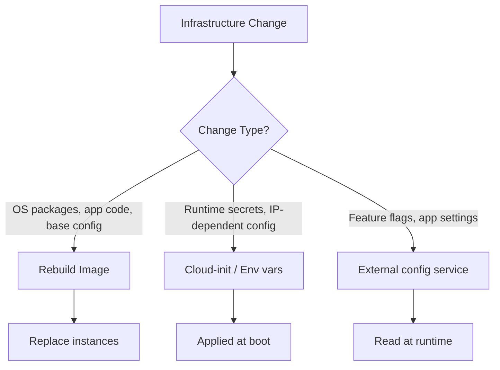

# How to Use Ansible for Immutable Infrastructure

Author: [nawazdhandala](https://www.github.com/nawazdhandala)

Tags: Ansible, Immutable Infrastructure, Packer, DevOps

Description: Learn how to use Ansible with immutable infrastructure patterns to build pre-configured machine images and deploy by replacing instances.

---

Immutable infrastructure flips the traditional server management model. Instead of updating servers in place, you build a new image with all changes baked in and replace the old instances. No SSH, no configuration drift, no "works on my server" problems. Ansible fits surprisingly well into this model, not as a runtime configuration tool but as an image builder.

## The Immutable Model

In the traditional model, Ansible connects to running servers and applies changes. In the immutable model, Ansible runs during the image build phase only. Once an image is built and deployed, nobody touches it.



## Building Images with Packer and Ansible

Packer is the standard tool for building machine images. It uses Ansible as a provisioner:

```hcl
# packer/web-server.pkr.hcl
# Build an AMI with Ansible provisioning

packer {
  required_plugins {
    amazon = {
      version = ">= 1.2.0"
      source  = "github.com/hashicorp/amazon"
    }
    ansible = {
      version = ">= 1.1.0"
      source  = "github.com/hashicorp/ansible"
    }
  }
}

source "amazon-ebs" "web_server" {
  ami_name      = "web-server-{{timestamp}}"
  instance_type = "t3.medium"
  region        = "us-east-1"

  source_ami_filter {
    filters = {
      name                = "ubuntu/images/hvm-ssd/ubuntu-jammy-22.04-amd64-server-*"
      root-device-type    = "ebs"
      virtualization-type = "hvm"
    }
    most_recent = true
    owners      = ["099720109477"]  # Canonical
  }

  ssh_username = "ubuntu"

  tags = {
    Name        = "web-server"
    BuildTime   = "{{timestamp}}"
    Environment = "production"
    ManagedBy   = "packer-ansible"
  }
}

build {
  sources = ["source.amazon-ebs.web_server"]

  provisioner "ansible" {
    playbook_file = "../playbooks/build-web-image.yml"
    extra_arguments = [
      "--extra-vars", "image_build=true",
      "--extra-vars", "app_version=${var.app_version}"
    ]
    ansible_env_vars = [
      "ANSIBLE_HOST_KEY_CHECKING=False"
    ]
  }
}

variable "app_version" {
  type    = string
  default = "latest"
}
```

## The Image Build Playbook

This playbook runs during image build, not on live servers:

```yaml
# playbooks/build-web-image.yml
# Provisions a web server image for immutable deployment
- name: Build web server image
  hosts: all
  become: yes
  vars:
    image_build: true

  roles:
    - role: common
      tags: [common]
    - role: security_baseline
      tags: [security]
    - role: nginx
      tags: [nginx]
    - role: monitoring_agent
      tags: [monitoring]
    - role: app_runtime
      tags: [app]

  post_tasks:
    # Clean up build artifacts to reduce image size
    - name: Clean apt cache
      ansible.builtin.apt:
        autoclean: yes
        autoremove: yes

    - name: Remove temporary files
      ansible.builtin.file:
        path: "{{ item }}"
        state: absent
      loop:
        - /tmp/*
        - /var/tmp/*
        - /var/cache/apt/archives/*.deb

    - name: Clear shell history
      ansible.builtin.file:
        path: "{{ item }}"
        state: absent
      loop:
        - /root/.bash_history
        - /home/ubuntu/.bash_history

    - name: Zero free space for smaller image
      ansible.builtin.command: dd if=/dev/zero of=/zero bs=1M || true
      changed_when: false

    - name: Remove zero file
      ansible.builtin.file:
        path: /zero
        state: absent
```

## Roles Designed for Immutable Builds

Roles need to work differently for image builds vs live servers:

```yaml
# roles/app_runtime/tasks/main.yml
# Install runtime dependencies and application code

- name: Install application runtime
  ansible.builtin.apt:
    name:
      - python3
      - python3-pip
      - python3-venv
    state: present

- name: Create application directory
  ansible.builtin.file:
    path: /opt/myapp
    state: directory
    owner: myapp
    group: myapp
    mode: '0755'

- name: Deploy application code
  ansible.builtin.git:
    repo: "{{ app_repo }}"
    dest: /opt/myapp
    version: "{{ app_version }}"
  become_user: myapp

- name: Install application dependencies
  ansible.builtin.pip:
    requirements: /opt/myapp/requirements.txt
    virtualenv: /opt/myapp/venv
  become_user: myapp

- name: Deploy systemd service file
  ansible.builtin.template:
    src: myapp.service.j2
    dest: /etc/systemd/system/myapp.service
    mode: '0644'

- name: Enable application service
  ansible.builtin.systemd:
    name: myapp
    enabled: yes
    daemon_reload: yes
  # Do NOT start the service during image build
  # It starts automatically when the instance boots
```

## Instance Configuration at Boot

Some configuration cannot be baked into the image because it depends on the runtime environment (IP addresses, instance IDs, etc.). Handle this with cloud-init:

```yaml
# roles/app_runtime/templates/cloud-init.yml.j2
# Runtime configuration applied at instance boot
#cloud-config

write_files:
  - path: /etc/myapp/runtime.conf
    content: |
      # This file is populated at boot time
      INSTANCE_ID=${instance_id}
      PRIVATE_IP=${private_ip}
      ENVIRONMENT=${environment}
    owner: myapp:myapp
    permissions: '0640'

runcmd:
  - systemctl start myapp
```

## Deployment with Terraform

Deploy immutable images using Terraform:

```hcl
# terraform/web-server.tf
# Deploy web server instances from the latest AMI

data "aws_ami" "web_server" {
  most_recent = true
  owners      = ["self"]

  filter {
    name   = "name"
    values = ["web-server-*"]
  }

  filter {
    name   = "tag:Environment"
    values = ["production"]
  }
}

resource "aws_launch_template" "web_server" {
  name_prefix   = "web-server-"
  image_id      = data.aws_ami.web_server.id
  instance_type = "t3.medium"

  user_data = base64encode(templatefile("cloud-init.yml", {
    environment = "production"
  }))

  tag_specifications {
    resource_type = "instance"
    tags = {
      Name = "web-server"
      AMI  = data.aws_ami.web_server.id
    }
  }
}

resource "aws_autoscaling_group" "web_server" {
  name                = "web-server-asg"
  desired_capacity    = 3
  max_size            = 6
  min_size            = 2
  vpc_zone_identifier = var.private_subnet_ids

  launch_template {
    id      = aws_launch_template.web_server.id
    version = "$Latest"
  }

  instance_refresh {
    strategy = "Rolling"
    preferences {
      min_healthy_percentage = 75
    }
  }
}
```

## Build Pipeline

```yaml
# .github/workflows/build-image.yml
name: Build Immutable Image

on:
  push:
    branches: [main]
    paths:
      - 'roles/**'
      - 'playbooks/build-*.yml'
      - 'packer/**'

jobs:
  build:
    runs-on: ubuntu-latest
    steps:
      - uses: actions/checkout@v4

      - name: Set up Packer
        uses: hashicorp/setup-packer@main

      - name: Install Ansible
        run: pip install ansible-core

      - name: Build image
        working-directory: packer
        run: |
          packer init .
          packer build \
            -var "app_version=${{ github.sha }}" \
            web-server.pkr.hcl
        env:
          AWS_ACCESS_KEY_ID: ${{ secrets.AWS_ACCESS_KEY_ID }}
          AWS_SECRET_ACCESS_KEY: ${{ secrets.AWS_SECRET_ACCESS_KEY }}

      - name: Trigger deployment
        run: |
          # Trigger Terraform to deploy the new image
          gh workflow run deploy.yml
        env:
          GH_TOKEN: ${{ secrets.GITHUB_TOKEN }}
```

## Immutable vs Mutable Decision



## Summary

Ansible works well for immutable infrastructure when you use it as an image builder rather than a runtime configuration tool. Combine Ansible with Packer to create golden images. Bake everything possible into the image: packages, application code, system configuration. Use cloud-init for runtime-specific configuration that depends on the deployment environment. Deploy by replacing instances from the Auto Scaling Group with the new image. This approach eliminates configuration drift entirely because every server is born from a known-good image and never modified after deployment.
