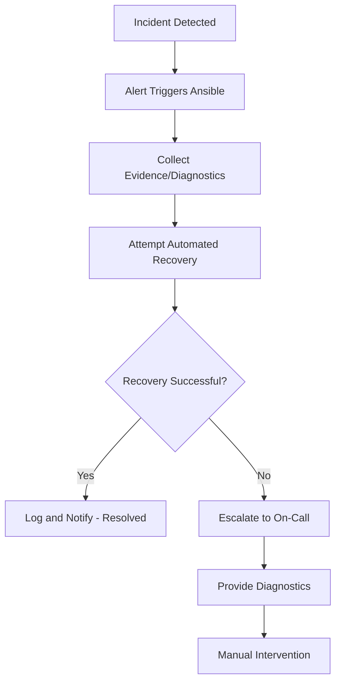

# How to Use Ansible for Incident Response Automation

Author: [nawazdhandala](https://www.github.com/nawazdhandala)

Tags: Ansible, Incident Response, Security, Automation

Description: Automate your incident response procedures with Ansible playbooks for rapid containment, evidence collection, and service restoration during outages.

---

When a production incident hits, every minute counts. Engineers scrambling to remember procedures, typing commands on the wrong server, or missing critical steps makes things worse. Ansible turns your incident response runbooks into executable code. Press a button, and the containment procedure runs perfectly every time.

## Incident Response Playbook Library

Organize playbooks by incident type:

```
incident-response/
├── playbooks/
│   ├── security-breach.yml
│   ├── service-outage.yml
│   ├── database-failure.yml
│   ├── network-partition.yml
│   ├── disk-full.yml
│   ├── high-cpu.yml
│   ├── memory-exhaustion.yml
│   └── ddos-mitigation.yml
├── tasks/
│   ├── collect-evidence.yml
│   ├── isolate-host.yml
│   ├── restore-service.yml
│   └── notify-team.yml
└── vars/
    └── escalation.yml
```

## Security Breach Response

```yaml
# playbooks/security-breach.yml
# Immediate response to a security breach
- name: Security incident response
  hosts: "{{ compromised_hosts | mandatory }}"
  become: yes
  gather_facts: yes

  vars:
    incident_id: "SEC-{{ ansible_date_time.epoch }}"
    evidence_dir: "/tmp/evidence-{{ incident_id }}"

  tasks:
    - name: Phase 1 - Collect evidence before containment
      block:
        - name: Create evidence directory
          ansible.builtin.file:
            path: "{{ evidence_dir }}"
            state: directory
            mode: '0700'
          delegate_to: localhost

        - name: Capture running processes
          ansible.builtin.command: ps auxwww
          register: processes
          changed_when: false

        - name: Capture network connections
          ansible.builtin.command: ss -tulnp
          register: connections
          changed_when: false

        - name: Capture logged in users
          ansible.builtin.command: w
          register: logged_users
          changed_when: false

        - name: Capture recent authentication logs
          ansible.builtin.command: journalctl -u sshd --since "24 hours ago" --no-pager
          register: auth_logs
          changed_when: false

        - name: Save evidence bundle
          ansible.builtin.copy:
            content: |
              Incident: {{ incident_id }}
              Host: {{ inventory_hostname }}
              Time: {{ ansible_date_time.iso8601 }}

              === RUNNING PROCESSES ===
              {{ processes.stdout }}

              === NETWORK CONNECTIONS ===
              {{ connections.stdout }}

              === LOGGED IN USERS ===
              {{ logged_users.stdout }}

              === RECENT AUTH LOGS ===
              {{ auth_logs.stdout }}
            dest: "{{ evidence_dir }}/{{ inventory_hostname }}.txt"
          delegate_to: localhost

    - name: Phase 2 - Containment
      block:
        - name: Kill suspicious processes
          ansible.builtin.command: "kill -9 {{ item }}"
          loop: "{{ suspicious_pids | default([]) }}"
          when: suspicious_pids is defined
          failed_when: false

        - name: Block all external SSH access except from jump host
          community.general.ufw:
            rule: deny
            port: '22'
            proto: tcp
            from_ip: "0.0.0.0/0"

        - name: Allow SSH only from management network
          community.general.ufw:
            rule: allow
            port: '22'
            proto: tcp
            from_ip: "{{ management_network }}"

        - name: Disable compromised user accounts
          ansible.builtin.user:
            name: "{{ item }}"
            password_lock: yes
          loop: "{{ compromised_users | default([]) }}"
          when: compromised_users is defined

        - name: Force all SSH session disconnects
          ansible.builtin.command: >
            pkill -u {{ item }} sshd
          loop: "{{ compromised_users | default([]) }}"
          when: compromised_users is defined
          failed_when: false

    - name: Phase 3 - Notification
      ansible.builtin.include_tasks: ../tasks/notify-team.yml
      vars:
        notification_type: security_breach
        notification_severity: critical
```

## Service Outage Response

```yaml
# playbooks/service-outage.yml
# Automated response for service outages
- name: Service outage response
  hosts: "{{ affected_hosts | mandatory }}"
  become: yes
  serial: 1

  tasks:
    - name: Collect diagnostics
      block:
        - name: Check service status
          ansible.builtin.command: systemctl status {{ affected_service }}
          register: service_status
          changed_when: false
          failed_when: false

        - name: Check recent service logs
          ansible.builtin.command: journalctl -u {{ affected_service }} --since "30 minutes ago" --no-pager -n 100
          register: service_logs
          changed_when: false

        - name: Check disk space
          ansible.builtin.command: df -h
          register: disk_space
          changed_when: false

        - name: Check memory
          ansible.builtin.command: free -m
          register: memory_info
          changed_when: false

    - name: Attempt automated recovery
      block:
        - name: Restart the affected service
          ansible.builtin.service:
            name: "{{ affected_service }}"
            state: restarted

        - name: Wait for service to become healthy
          ansible.builtin.uri:
            url: "http://localhost:{{ service_port | default(8080) }}/health"
            status_code: 200
          retries: 15
          delay: 5
          register: health_after_restart

        - name: Log successful recovery
          ansible.builtin.debug:
            msg: "Service {{ affected_service }} recovered on {{ inventory_hostname }}"

      rescue:
        - name: Simple restart failed - attempting full recovery
          block:
            - name: Stop the service
              ansible.builtin.service:
                name: "{{ affected_service }}"
                state: stopped

            - name: Clear application caches
              ansible.builtin.file:
                path: "{{ app_cache_dir }}"
                state: absent
              when: app_cache_dir is defined

            - name: Recreate cache directory
              ansible.builtin.file:
                path: "{{ app_cache_dir }}"
                state: directory
                owner: "{{ app_user }}"
                mode: '0755'
              when: app_cache_dir is defined

            - name: Start the service
              ansible.builtin.service:
                name: "{{ affected_service }}"
                state: started

            - name: Verify recovery
              ansible.builtin.uri:
                url: "http://localhost:{{ service_port | default(8080) }}/health"
                status_code: 200
              retries: 15
              delay: 5

          rescue:
            - name: Automated recovery failed - escalate
              ansible.builtin.include_tasks: ../tasks/notify-team.yml
              vars:
                notification_type: escalation
                notification_severity: critical
                notification_message: >
                  Automated recovery failed for {{ affected_service }} on {{ inventory_hostname }}.
                  Manual intervention required.
                  Service logs: {{ service_logs.stdout_lines[-20:] | join('\n') }}
```

## Disk Space Emergency Response

```yaml
# playbooks/disk-full.yml
# Emergency cleanup when disk space is critically low
- name: Disk space emergency response
  hosts: "{{ affected_hosts | mandatory }}"
  become: yes

  tasks:
    - name: Check current disk usage
      ansible.builtin.command: df -h /
      register: disk_before
      changed_when: false

    - name: Clean package manager cache
      ansible.builtin.apt:
        autoclean: yes
      when: ansible_os_family == 'Debian'

    - name: Remove old kernels
      ansible.builtin.command: apt autoremove -y --purge
      when: ansible_os_family == 'Debian'
      changed_when: true

    - name: Rotate and compress logs
      ansible.builtin.command: logrotate -f /etc/logrotate.conf
      changed_when: true

    - name: Remove old log files
      ansible.builtin.find:
        paths: /var/log
        age: 7d
        recurse: yes
        patterns: "*.gz,*.old,*.1,*.2"
      register: old_logs

    - name: Delete old log files
      ansible.builtin.file:
        path: "{{ item.path }}"
        state: absent
      loop: "{{ old_logs.files }}"
      loop_control:
        label: "{{ item.path }}"

    - name: Clean temp directories
      ansible.builtin.find:
        paths:
          - /tmp
          - /var/tmp
        age: 1d
        recurse: yes
      register: temp_files

    - name: Delete temp files
      ansible.builtin.file:
        path: "{{ item.path }}"
        state: absent
      loop: "{{ temp_files.files }}"
      loop_control:
        label: "{{ item.path }}"

    - name: Check disk usage after cleanup
      ansible.builtin.command: df -h /
      register: disk_after
      changed_when: false

    - name: Report results
      ansible.builtin.debug:
        msg: |
          Disk cleanup on {{ inventory_hostname }}:
          Before: {{ disk_before.stdout_lines[-1] }}
          After: {{ disk_after.stdout_lines[-1] }}
```

## Incident Response Flow



## Notification Tasks

```yaml
# tasks/notify-team.yml
# Send notifications through multiple channels

- name: Send Slack notification
  ansible.builtin.uri:
    url: "{{ slack_incident_webhook }}"
    method: POST
    body_format: json
    body:
      text: |
        *{{ notification_severity | upper }} - {{ notification_type }}*
        Host: {{ inventory_hostname }}
        Time: {{ ansible_date_time.iso8601 }}
        {{ notification_message | default('') }}
  delegate_to: localhost
  failed_when: false

- name: Create PagerDuty incident
  ansible.builtin.uri:
    url: "https://events.pagerduty.com/v2/enqueue"
    method: POST
    body_format: json
    body:
      routing_key: "{{ pagerduty_routing_key }}"
      event_action: trigger
      payload:
        summary: "{{ notification_type }}: {{ inventory_hostname }}"
        severity: "{{ notification_severity }}"
        source: "ansible-incident-response"
  delegate_to: localhost
  when: notification_severity == 'critical'
  failed_when: false
```

## Summary

Incident response automation with Ansible transforms runbooks into executable code. Build playbooks for each incident type: security breaches, service outages, disk space emergencies, and more. Follow the evidence-containment-recovery-notification pattern. Automate the first response to buy time for engineers. When automated recovery fails, escalate with collected diagnostics so the on-call engineer has context. Test your incident playbooks regularly because the worst time to discover a bug in your response automation is during an actual incident.
