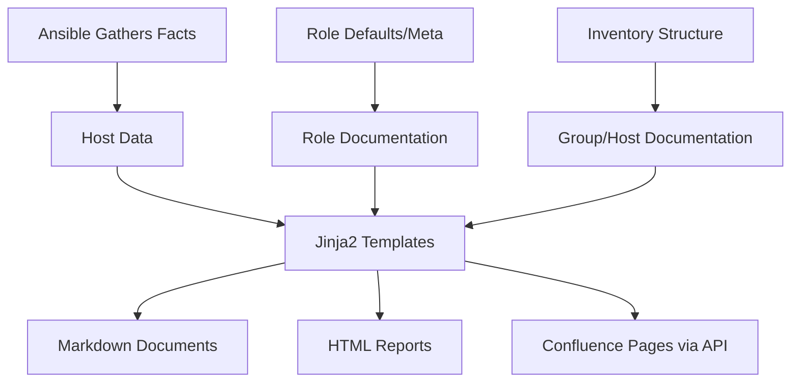

# How to Use Ansible for Infrastructure Documentation Generation

Author: [nawazdhandala](https://www.github.com/nawazdhandala)

Tags: Ansible, Documentation, Infrastructure, Automation

Description: Automatically generate infrastructure documentation using Ansible facts, inventory data, and templates to keep your documentation always up to date.

---

Infrastructure documentation goes stale the moment someone makes a change and forgets to update the wiki. The solution is to generate documentation directly from your infrastructure. Ansible already knows your hosts, their configurations, installed software, and network details. Use that data to produce documentation that is always accurate.

## Fact-Based Documentation

Ansible gathers detailed facts about every host. Use these to generate server documentation:

```yaml
# playbooks/generate-docs.yml
# Generate infrastructure documentation from live data
- name: Collect infrastructure data
  hosts: all
  become: yes
  gather_facts: yes

  tasks:
    - name: Collect installed packages
      ansible.builtin.command: dpkg-query -W -f='${Package}\t${Version}\n'
      register: installed_packages
      changed_when: false
      when: ansible_os_family == 'Debian'

    - name: Collect running services
      ansible.builtin.command: systemctl list-units --type=service --state=running --no-pager --no-legend
      register: running_services
      changed_when: false

    - name: Collect listening ports
      ansible.builtin.command: ss -tlnp
      register: listening_ports
      changed_when: false

    - name: Collect cron jobs
      ansible.builtin.command: crontab -l
      register: cron_jobs
      changed_when: false
      failed_when: false

    - name: Collect firewall rules
      ansible.builtin.command: ufw status verbose
      register: firewall_rules
      changed_when: false
      failed_when: false

    - name: Build host data structure
      ansible.builtin.set_fact:
        host_doc:
          hostname: "{{ inventory_hostname }}"
          ip_addresses: "{{ ansible_all_ipv4_addresses }}"
          os: "{{ ansible_distribution }} {{ ansible_distribution_version }}"
          kernel: "{{ ansible_kernel }}"
          architecture: "{{ ansible_architecture }}"
          cpu_cores: "{{ ansible_processor_vcpus }}"
          memory_mb: "{{ ansible_memtotal_mb }}"
          disk_total_gb: "{{ (ansible_mounts | selectattr('mount', 'equalto', '/') | first).size_total / 1073741824 | round(2) }}"
          groups: "{{ group_names }}"
          services: "{{ running_services.stdout_lines | default([]) }}"
          ports: "{{ listening_ports.stdout_lines[1:] | default([]) }}"
          uptime_days: "{{ (ansible_uptime_seconds / 86400) | round(1) }}"

    - name: Save host documentation
      ansible.builtin.copy:
        content: "{{ host_doc | to_nice_json }}"
        dest: "/tmp/doc-{{ inventory_hostname }}.json"
      delegate_to: localhost

- name: Generate documentation
  hosts: localhost
  gather_facts: yes

  tasks:
    - name: Find all host documentation files
      ansible.builtin.find:
        paths: /tmp
        patterns: "doc-*.json"
      register: doc_files

    - name: Load all host data
      ansible.builtin.slurp:
        src: "{{ item.path }}"
      register: raw_docs
      loop: "{{ doc_files.files }}"
      loop_control:
        label: "{{ item.path | basename }}"

    - name: Parse all host data
      ansible.builtin.set_fact:
        all_hosts: "{{ raw_docs.results | map(attribute='content') | map('b64decode') | map('from_json') | list }}"

    - name: Generate markdown documentation
      ansible.builtin.template:
        src: infrastructure-doc.md.j2
        dest: docs/infrastructure-inventory.md
```

## Documentation Template

```jinja2
{# templates/infrastructure-doc.md.j2 #}
# Infrastructure Inventory

Generated: {{ ansible_date_time.iso8601 }}
Total Servers: {{ all_hosts | length }}

## Server Summary

| Hostname | IP | OS | CPU | Memory | Disk | Groups |
|----------|----|----|-----|--------|------|--------|

| {{ host.hostname }} | {{ host.ip_addresses | first }} | {{ host.os }} | {{ host.cpu_cores }} cores | {{ host.memory_mb }}MB | {{ host.disk_total_gb }}GB | {{ host.groups | join(', ') }} |


## Servers by Group


### {{ group }}


#### {{ host.hostname }}

- **IP Addresses:** {{ host.ip_addresses | join(', ') }}
- **OS:** {{ host.os }} ({{ host.kernel }})
- **Resources:** {{ host.cpu_cores }} CPU cores, {{ host.memory_mb }}MB RAM, {{ host.disk_total_gb }}GB disk
- **Uptime:** {{ host.uptime_days }} days

**Running Services:**

- {{ svc }}


**Listening Ports:**
```

{{ port }}

```




## Fleet Statistics

- Total CPU Cores: {{ all_hosts | map(attribute='cpu_cores') | map('int') | sum }}
- Total Memory: {{ (all_hosts | map(attribute='memory_mb') | map('int') | sum / 1024) | round(1) }}GB
- Total Disk: {{ all_hosts | map(attribute='disk_total_gb') | map('float') | sum | round(1) }}GB
```

## Role Documentation Generator

Auto-generate documentation from role defaults:

```python
#!/usr/bin/env python3
# scripts/generate-role-docs.py
# Generate README for each role based on its structure

import os
import yaml
import sys

def generate_role_doc(role_path):
    """Generate documentation for a single role."""
    role_name = os.path.basename(role_path)
    doc = f"# {role_name}\n\n"

    # Read meta information
    meta_file = os.path.join(role_path, 'meta', 'main.yml')
    if os.path.exists(meta_file):
        with open(meta_file) as f:
            meta = yaml.safe_load(f)
        if meta and 'galaxy_info' in meta:
            info = meta['galaxy_info']
            doc += f"{info.get('description', 'No description')}\n\n"

    # Read defaults
    defaults_file = os.path.join(role_path, 'defaults', 'main.yml')
    if os.path.exists(defaults_file):
        with open(defaults_file) as f:
            content = f.read()
            defaults = yaml.safe_load(content)

        doc += "## Variables\n\n"
        doc += "| Variable | Default | Type |\n"
        doc += "|----------|---------|------|\n"
        if defaults:
            for key, value in defaults.items():
                vtype = type(value).__name__
                default_str = str(value)
                if len(default_str) > 40:
                    default_str = default_str[:40] + '...'
                doc += f"| `{key}` | `{default_str}` | {vtype} |\n"
        doc += "\n"

    # List task files
    tasks_dir = os.path.join(role_path, 'tasks')
    if os.path.exists(tasks_dir):
        doc += "## Task Files\n\n"
        for f in sorted(os.listdir(tasks_dir)):
            if f.endswith('.yml'):
                doc += f"- `{f}`\n"
        doc += "\n"

    # List templates
    templates_dir = os.path.join(role_path, 'templates')
    if os.path.exists(templates_dir):
        doc += "## Templates\n\n"
        for f in sorted(os.listdir(templates_dir)):
            doc += f"- `{f}`\n"
        doc += "\n"

    return doc

if __name__ == '__main__':
    roles_dir = sys.argv[1] if len(sys.argv) > 1 else 'roles'
    for role in sorted(os.listdir(roles_dir)):
        role_path = os.path.join(roles_dir, role)
        if os.path.isdir(role_path):
            doc = generate_role_doc(role_path)
            output = os.path.join(role_path, 'README.md')
            with open(output, 'w') as f:
                f.write(doc)
            print(f"Generated {output}")
```

## Network Topology Documentation

```yaml
# playbooks/generate-network-doc.yml
# Generate network topology from gathered facts
- name: Collect network topology
  hosts: all
  become: yes
  gather_facts: yes

  tasks:
    - name: Build network data
      ansible.builtin.set_fact:
        network_info:
          hostname: "{{ inventory_hostname }}"
          interfaces: "{{ ansible_interfaces | reject('equalto', 'lo') | list }}"
          ipv4: "{{ ansible_all_ipv4_addresses }}"
          gateway: "{{ ansible_default_ipv4.gateway | default('N/A') }}"
          dns: "{{ ansible_dns.nameservers | default([]) }}"

    - name: Save network data
      ansible.builtin.copy:
        content: "{{ network_info | to_nice_json }}"
        dest: "/tmp/network-{{ inventory_hostname }}.json"
      delegate_to: localhost
```

## Documentation Architecture



## Scheduled Documentation Updates

```yaml
# .github/workflows/generate-docs.yml
name: Generate Infrastructure Docs

on:
  schedule:
    - cron: '0 6 * * 1'  # Every Monday at 6 AM
  workflow_dispatch:

jobs:
  generate:
    runs-on: ubuntu-latest
    steps:
      - uses: actions/checkout@v4
      - name: Generate documentation
        run: |
          pip install ansible-core
          ansible-playbook playbooks/generate-docs.yml \
            -i inventories/production/hosts.yml
      - name: Commit updated docs
        run: |
          git add docs/
          git diff --staged --quiet || git commit -m "Update infrastructure documentation"
          git push
```

## Summary

Auto-generated documentation is the only documentation that stays accurate. Use Ansible facts to produce server inventories, network topology maps, and resource summaries. Generate role documentation from defaults files and meta information. Template everything into markdown, HTML, or push it to your wiki via API. Schedule documentation generation weekly so it reflects your current infrastructure. The time you invest in building the generation pipeline saves hours of manual documentation that would go stale anyway.
