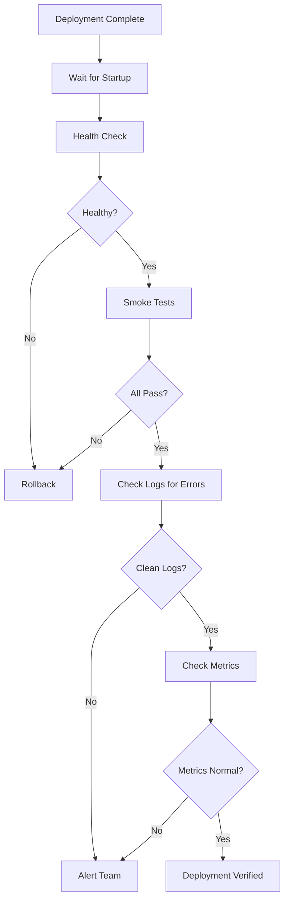

# How to Use Ansible for Post-Deployment Verification

Author: [nawazdhandala](https://www.github.com/nawazdhandala)

Tags: Ansible, Post-Deployment, Verification, Testing

Description: Implement automated post-deployment verification with Ansible to confirm deployments are successful through health checks, smoke tests, and metrics validation.

---

Deploying code is only half the job. The other half is verifying that the deployment actually worked. A successful `ansible-playbook` exit code does not mean your application is serving traffic correctly. Post-deployment verification catches the issues that deployment tasks miss: broken endpoints, failed database connections, and performance degradation.

## Basic Health Check Verification

Start with simple HTTP health checks:

```yaml
# playbooks/verify-deployment.yml
- name: Post-deployment verification
  hosts: "{{ target_hosts | default('all') }}"
  become: yes
  gather_facts: yes

  tasks:
    - name: Wait for application to accept connections
      ansible.builtin.wait_for:
        port: "{{ app_port | default(8080) }}"
        delay: 5
        timeout: 120

    - name: Check application health endpoint
      ansible.builtin.uri:
        url: "http://localhost:{{ app_port }}/health"
        status_code: 200
        return_content: yes
        timeout: 10
      register: health_check
      retries: 20
      delay: 5
      until: health_check.status == 200

    - name: Verify health check response content
      ansible.builtin.assert:
        that:
          - health_check.json.status == 'healthy'
          - health_check.json.version == app_version
        fail_msg: >
          Health check returned unexpected data:
          Status: {{ health_check.json.status | default('missing') }}
          Version: {{ health_check.json.version | default('missing') }}
          Expected version: {{ app_version }}
      when: app_version is defined
```

## Comprehensive Verification Suite

```yaml
# playbooks/full-verification.yml
- name: Full post-deployment verification
  hosts: "{{ target_hosts | default('app_servers') }}"
  become: yes

  tasks:
    - name: Verify application service is running
      ansible.builtin.service_facts:

    - name: Assert application service is active
      ansible.builtin.assert:
        that:
          - "'{{ app_service_name }}.service' in services"
          - "services['{{ app_service_name }}.service'].state == 'running'"
        fail_msg: "{{ app_service_name }} is not running after deployment"

    - name: Check application health
      ansible.builtin.uri:
        url: "http://localhost:{{ app_port }}/health"
        status_code: 200
        return_content: yes
      register: health
      retries: 15
      delay: 5
      until: health.status == 200

    - name: Run API smoke tests
      ansible.builtin.uri:
        url: "http://localhost:{{ app_port }}{{ item.path }}"
        method: "{{ item.method | default('GET') }}"
        status_code: "{{ item.expected_status }}"
        body: "{{ item.body | default(omit) }}"
        body_format: "{{ item.body_format | default(omit) }}"
        timeout: 10
      loop: "{{ smoke_test_endpoints }}"
      loop_control:
        label: "{{ item.method | default('GET') }} {{ item.path }}"
      register: smoke_results

    - name: Check database connectivity from application
      ansible.builtin.uri:
        url: "http://localhost:{{ app_port }}/health/database"
        status_code: 200
      register: db_health
      retries: 5
      delay: 3

    - name: Check cache connectivity
      ansible.builtin.uri:
        url: "http://localhost:{{ app_port }}/health/cache"
        status_code: 200
      register: cache_health
      retries: 5
      delay: 3
      when: cache_enabled | default(true)

    - name: Verify application logs are not showing errors
      ansible.builtin.command: journalctl -u {{ app_service_name }} --since "5 minutes ago" --no-pager
      register: recent_logs
      changed_when: false

    - name: Check for critical errors in logs
      ansible.builtin.assert:
        that:
          - "'CRITICAL' not in recent_logs.stdout"
          - "'FATAL' not in recent_logs.stdout"
          - "'panic' not in recent_logs.stdout"
        fail_msg: "Critical errors found in application logs after deployment"

    - name: Verify correct version is deployed
      ansible.builtin.uri:
        url: "http://localhost:{{ app_port }}/version"
        return_content: yes
      register: version_check
      when: app_version is defined

    - name: Assert correct version
      ansible.builtin.assert:
        that:
          - "app_version in version_check.content"
        fail_msg: "Wrong version deployed. Expected {{ app_version }}, got {{ version_check.content }}"
      when: app_version is defined
```

## Smoke Test Configuration

Define smoke test endpoints in variables:

```yaml
# group_vars/app_servers.yml
smoke_test_endpoints:
  - path: /api/v1/status
    method: GET
    expected_status: 200

  - path: /api/v1/users
    method: GET
    expected_status: 200

  - path: /api/v1/auth/test
    method: POST
    expected_status: 200
    body: '{"test": true}'
    body_format: json

  - path: /static/css/main.css
    method: GET
    expected_status: 200

  - path: /nonexistent-page
    method: GET
    expected_status: 404
```

## Verification with Metrics Validation

Check application metrics after deployment:

```yaml
# tasks/verify-metrics.yml
# Verify application metrics are within normal ranges

- name: Wait for metrics to stabilize
  ansible.builtin.pause:
    seconds: 60

- name: Query application metrics
  ansible.builtin.uri:
    url: "http://localhost:{{ metrics_port | default(9090) }}/metrics"
    return_content: yes
  register: metrics_raw

- name: Query Prometheus for error rate
  ansible.builtin.uri:
    url: "{{ prometheus_url }}/api/v1/query"
    body_format: form-urlencoded
    body:
      query: "rate(http_requests_total{status=~'5..', instance='{{ inventory_hostname }}:{{ app_port }}'}[5m])"
    return_content: yes
  register: error_rate
  delegate_to: localhost

- name: Assert error rate is acceptable
  ansible.builtin.assert:
    that:
      - error_rate.json.data.result | length == 0 or
        error_rate.json.data.result[0].value[1] | float < 0.01
    fail_msg: "Error rate too high after deployment: {{ error_rate.json.data.result }}"
  when: prometheus_url is defined

- name: Query response time p99
  ansible.builtin.uri:
    url: "{{ prometheus_url }}/api/v1/query"
    body_format: form-urlencoded
    body:
      query: "histogram_quantile(0.99, rate(http_request_duration_seconds_bucket{instance='{{ inventory_hostname }}:{{ app_port }}'}[5m]))"
    return_content: yes
  register: p99_latency
  delegate_to: localhost
  when: prometheus_url is defined

- name: Assert latency is acceptable
  ansible.builtin.assert:
    that:
      - p99_latency.json.data.result[0].value[1] | float < max_p99_seconds | default(2.0)
    fail_msg: "P99 latency too high: {{ p99_latency.json.data.result[0].value[1] }}s"
  when:
    - prometheus_url is defined
    - p99_latency.json.data.result | length > 0
```

## Verification Flow



## Automated Rollback on Verification Failure

```yaml
# playbooks/deploy-with-verify.yml
- name: Deploy and verify
  hosts: app_servers
  become: yes
  serial: "25%"

  tasks:
    - name: Deploy and verify with rollback
      block:
        - name: Deploy new version
          ansible.builtin.include_role:
            name: app_deploy

        - name: Run verification
          ansible.builtin.include_tasks: tasks/verify-deployment.yml

      rescue:
        - name: Verification failed - rolling back
          ansible.builtin.include_role:
            name: app_deploy
          vars:
            app_version: "{{ app_previous_version }}"

        - name: Verify rollback
          ansible.builtin.include_tasks: tasks/verify-deployment.yml
          vars:
            app_version: "{{ app_previous_version }}"

        - name: Notify team of rollback
          ansible.builtin.include_tasks: tasks/notify-rollback.yml
```

## Summary

Post-deployment verification is the final safeguard in your deployment pipeline. Check service health, run smoke tests against critical endpoints, verify database and cache connectivity, scan logs for errors, and validate metrics. Automate rollback when verification fails. Define your smoke test endpoints as variables so different environments can have different test suites. Run verification after every deployment, not just production deployments, so you catch issues as early as possible.
